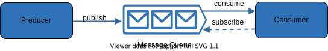
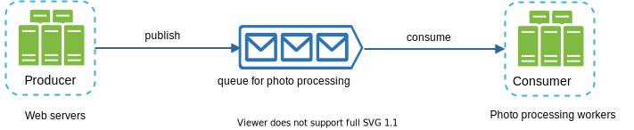
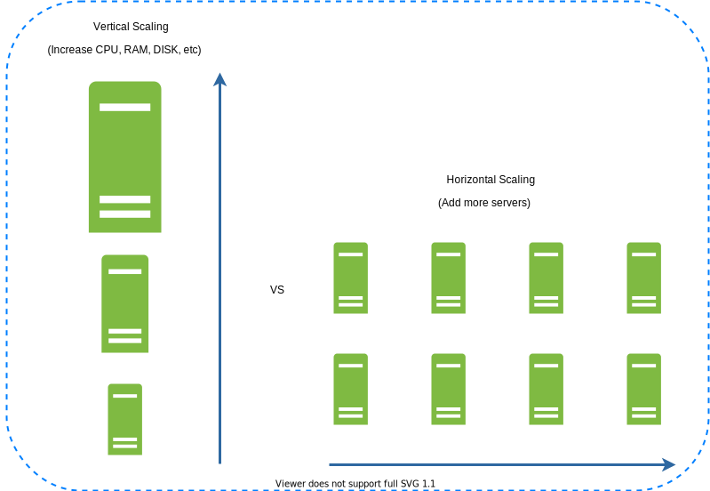

设计一个支持数百万用户的系统具有挑战性，这是一个需要不断完善和不断改进的旅程。在本章中，我们构建一个支持单个用户的系统，并逐步扩展以服务数百万用户。读完本章后，你将掌握一些技巧，帮助你解决系统设计面试问题。

## 单一服务器设置

千里之行始于足下，构建复杂的系统也不例外。从简单的事情开始，一切都在单个服务器上运行。图 1 显示了单服务器设置的图示，其中所有内容都在一台服务器上运行：Web 应用程序、数据库、缓存等。


要了解此设置，调查请求流和流量源会很有帮助。让我们首先看一下请求流程（图 2）。


图2

1. 用户通过域名访问网站，如api.mysite.com。通常，域名系统 (DNS) 是由第三方提供的付费服务，而不是由我们的服务器托管。

2. 互联网协议 (IP) 地址返回至浏览器或移动应用程序。在示例中，返回 IP 地址 15.125.23.214。

3. 获取 IP 地址后，超文本传输协议 (HTTP) [1] 请求将直接发送到你的 Web 服务器。

4. Web 服务器返回 HTML 页面或 JSON 响应进行渲染。

接下来我们来看看流量来源。Web 服务器的流量来自两个来源：Web 应用程序和移动应用程序。

- Web应用程序：它使用服务器端语言（Java、Python等）组合来处理业务逻辑、存储等，并使用客户端语言（HTML和JavaScript）进行呈现。
- 移动应用程序：HTTP 协议是移动应用程序与 Web 服务器之间的通信协议。JavaScript 对象表示法 (JSON) 由于其简单性而成为常用的 API 响应格式来传输数据。JSON 格式的 API 响应示例如下所示：

*GET /users/12 – 检索 id = 12 的用户对象*

```json
{
   "id":12,
   "firstName":"John",
   "lastName":"Smith",
   "address":{
      "streetAddress":"21 2nd Street",
      "city":"New York",
      "state":"NY",
      "postalCode":10021
   },
   "phoneNumbers":[
      "212 555-1234",
      "646 555-4567"
   ]
}
```

## 数据库

随着用户群的增长，一台服务器已经不够了，我们需要多台服务器：一台用于 Web/移动流量，另一台用于数据库（图 3）。将 Web/移动流量（Web 层）和数据库（数据层）服务器分开，使它们能够独立扩展。


图3

### 使用哪些数据库？

你可以在传统关系数据库和非关系数据库之间进行选择。让我们来看看它们的差异。

关系数据库也称为关系数据库管理系统 (RDBMS) 或 SQL 数据库。最流行的是 MySQL、Oracle 数据库、PostgreSQL 等。关系数据库以表和行的形式表示和存储数据。你可以使用 SQL 跨不同的数据库表执行联接操作。

非关系型数据库也称为NoSQL 数据库。流行的有 CouchDB、Neo4j、Cassandra、HBase、Amazon DynamoDB 等[2]。这些数据库分为四类：键值存储、图形存储、列存储和文档存储。非关系型数据库一般不支持连接操作。

对于大多数开发人员来说，关系数据库是最好的选择，因为它们已经存在了 40 多年，而且从历史上看，它们运行良好。但是，如果关系数据库不适合你的特定用例，那么探索关系数据库之外的领域就至关重要。在以下情况下，非关系数据库可能是正确的选择：

- 你的应用程序需要超低延迟。
- 你的数据是非结构化的，或者你没有任何关系数据。
- 你只需要序列化和反序列化数据（JSON、XML、YAML 等）。
- 你需要存储大量数据。

## 垂直缩放与水平缩放

垂直扩展，也称为“纵向扩展”，是指为服务器添加更多功能（CPU、RAM 等）的过程。水平扩展（称为“横向扩展”）允许你通过向资源池中添加更多服务器来进行扩展。

当流量较低时，垂直扩展是一个不错的选择，垂直扩展的简单性是其主要优点。不幸的是，它有严重的局限性。

- 垂直缩放有一个硬性限制。不可能向单个服务器添加无限的 CPU 和内存。
- 垂直扩展没有故障转移和冗余。如果一台服务器出现故障，网站/应用程序也会随之完全崩溃。

由于垂直缩放的限制，水平缩放更适合大规模应用。

在以前的设计中，用户直接连接到Web服务器。如果网络服务器离线，用户将无法访问网站。在另一种情况下，如果许多用户同时访问Web服务器并且达到Web服务器的负载限制，用户通常会遇到响应较慢或无法连接到服务器的情况。负载均衡器是解决这些问题的最佳技术。

## 负载均衡器

负载均衡器在负载均衡集中定义的 Web 服务器之间均匀分配传入流量。图 4 显示了负载均衡器的工作原理。


图4

如图4所示，用户直接连接到负载均衡器的公网IP。通过此设置，客户端将无法直接访问 Web 服务器。为了更好的安全性，服务器之间的通信使用私有IP。私有IP是只能在同一网络中的服务器之间可达的IP地址；但是，无法通过互联网访问它。负载均衡器通过私有IP与Web服务器通信。

在图 4 中，添加负载均衡器和第二个 Web 服务器后，我们成功解决了无故障转移问题并提高了 Web 层的可用性。详细说明如下：

- 如果服务器1离线，所有流量都会路由到服务器2。这样可以防止网站离线。我们还将向服务器池添加一个新的健康的 Web 服务器来平衡负载。
- 如果网站流量增长很快，两台服务器不足以处理流量，负载均衡器可以优雅地处理这个问题。你只需向 Web 服务器池添加更多服务器，负载均衡器就会自动开始向它们发送请求。

现在 Web 层看起来不错，那么数据层呢？当前的设计只有一个数据库，因此不支持故障转移和冗余。数据库复制是解决这些问题的常用技术。让我们来看看吧。

## 数据库复制

引自维基百科：“数据库复制可以在许多数据库管理系统中使用，通常在原始（主）和副本（从）之间具有主/从关系”[3]。

主数据库一般只支持写操作。从数据库从主数据库获取数据的副本，并且仅支持读操作。所有数据修改命令（例如插入、删除或更新）都必须发送到主数据库。大多数应用程序需要更高的读取与写入比率；因此，系统中从数据库的数量通常大于主数据库的数量。图5显示了一个主数据库和多个从数据库。


图5

数据库复制的优点：

- 更好的性能：在主从模型中，所有写入和更新都发生在主节点上；而读操作分布在从节点上。该模型提高了性能，因为它允许并行处理更多查询。
- 可靠性：如果你的一台数据库服务器因自然灾害（例如台风或地震）而损坏，数据仍然可以保存。你无需担心数据丢失，因为数据是跨多个位置复制的。
- 高可用性：通过在不同位置复制数据，即使数据库离线，你的网站也可以保持运行，因为你可以访问存储在另一数据库服务器中的数据。

在上一节中，我们讨论了负载均衡器如何帮助提高系统可用性。我们在这里问同样的问题：如果其中一个数据库离线怎么办？图 5 中讨论的架构设计可以处理这种情况：

- 如果只有一个从库可用，且从库离线，读操作将暂时定向到主库。一旦发现问题，新的从库就会取代旧的。当有多个从库可用时，读操作会重定向到其他健康的从库。新的数据库服务器将取代旧的数据库服务器。
- 如果主数据库离线，从数据库将被提升为新的主数据库。所有数据库操作都将暂时在新的主数据库上执行。新的从库将立即替换旧的从库，进行数据复制。在生产系统中，升级新的主数据库更加复杂，因为从数据库中的数据可能不是最新的。需要通过运行数据恢复脚本来更新丢失的数据。尽管其他一些复制方法（例如多主复制和循环复制）可能有所帮助，但这些设置更加复杂；他们的讨论超出了本课程的范围。有兴趣的读者可以参考列出的参考资料[4][5]。

图 6 显示了添加负载均衡器和数据库复制后的系统设计。


图6

让我们看一下设计：

- 用户从 DNS 获取负载均衡器的 IP 地址。
- 用户使用此 IP 地址连接负载均衡器。
- HTTP 请求被路由到服务器 1 或服务器 2。
- Web 服务器从从属数据库读取用户数据。
- Web 服务器将任何数据修改操作路由到主数据库。这包括写入、更新和删除操作。

现在，你对 Web 和数据层有了深入的了解，是时候改进加载/响应时间了。这可以通过添加缓存层并将静态内容（JavaScript/CSS/图像/视频文件）转移到内容交付网络（CDN）来完成。

## 缓存

缓存是一个临时存储区域，它将昂贵的响应结果或频繁访问的数据存储在内存中，以便更快地处理后续请求。如图 6 所示，每次加载新网页时，都会执行一个或多个数据库调用来获取数据。重复调用数据库对应用程序性能影响很大。缓存可以缓解这个问题。

### 缓存层

缓存层是一个临时数据存储层，比数据库快得多。拥有单独的缓存层的好处包括更好的系统性能、减少数据库工作负载的能力以及独立扩展缓存层的能力。图 7 显示了缓存服务器的可能设置：


图7

收到请求后，Web 服务器首先检查缓存中是否有可用的响应。如果有，它将数据发送回客户端。如果没有，它会查询数据库，将响应存储在缓存中，然后将其发送回客户端。这种缓存策略称为直读缓存。根据数据类型、大小和访问模式，还可以使用其他缓存策略。之前的一项研究解释了不同的缓存策略如何工作 [6]。

与缓存服务器交互很简单，因为大多数缓存服务器都提供通用编程语言的 API。以下代码片段显示了典型的 Memcached API：

```
SECONDS = 1
cache.set('myKey, 'hi there', 3600 * SECONDS)
cache.get('myKey')
```

### 使用缓存的注意事项

以下是使用缓存系统的一些注意事项：

- 决定何时使用缓存。当数据频繁读取但不频繁修改时，请考虑使用缓存。由于缓存数据存储在易失性内存中，因此缓存服务器并不适合持久保存数据。例如，如果缓存服务器重新启动，内存中的所有数据都会丢失。因此，重要数据应该保存在持久数据存储中。
- 过期政策。实施过期政策是一个很好的做法。一旦缓存数据过期，就会从缓存中删除。当没有过期策略时，缓存数据将永久保存在内存中。建议不要将过期日期设置得太短，因为这会导致系统过于频繁地从数据库重新加载数据。同时，建议不要将过期日期设置得太长，否则数据可能会过时。
- 一致性：这涉及保持数据存储和缓存同步。由于数据存储和缓存上的数据修改操作不在单个事务中，因此可能会发生不一致。当跨多个区域扩展时，保持数据存储和缓存之间的一致性具有挑战性。有关更多详细信息，请参阅 Facebook 发表的题为“Scaling Memcache at Facebook”的论文[7]。
- 缓解故障：单个缓存服务器代表潜在的单点故障 (SPOF)，维基百科中的定义如下：“单点故障 (SPOF) 是系统的一部分，如果发生故障，将导致整个系统停止运行工作”[8]。因此，建议跨不同数据中心使用多个缓存服务器以避免 SPOF。另一种推荐的方法是按一定百分比过度配置所需的内存。随着内存使用量的增加，这提供了一个缓冲区。


图8

- 驱逐策略：一旦缓存已满，任何向缓存添加项目的请求都可能导致现有项目被删除。这称为缓存驱逐。最近最少使用 (LRU) 是最流行的缓存逐出策略。可以采用其他驱逐策略，例如最不常用（LFU）或先进先出（FIFO）来满足不同的用例。

## 内容分发网络 (CDN)

CDN 是一个由地理上分散的服务器组成的网络，用于传送静态内容。CDN 服务器缓存静态内容，如图像、视频、CSS、JavaScript 文件等。

动态内容缓存是一个相对较新的概念，超出了本课程的范围。它允许缓存基于请求路径、查询字符串、cookie 和请求标头的 HTML 页面。有关更多信息，请参阅参考资料 [9] 中提到的文章。本课程重点介绍如何使用CDN来缓存静态内容。

CDN 的高层工作原理如下：当用户访问网站时，距离用户最近的 CDN 服务器将传送静态内容。直观上，来自 CDN 服务器的用户越远，网站加载速度越慢。例如，如果 CDN 服务器位于旧金山，则洛杉矶的用户将比欧洲的用户更快地获取内容。图 9 是一个很好的示例，展示了 CDN 如何缩短加载时间。


图9

图 10 演示了 CDN 工作流程。


图10

1. 用户A尝试使用图片URL获取image.png。URL 的域由 CDN 提供商提供。以下两个图像 URL 是用于演示图像 URL 在 Amazon 和 Akamai CDN 上的外观的示例：
   1. `https://mysite.cloudfront.net/logo.jpg``
   2. ``https://mysite.akamai.com/image-manager/img/logo.jpg`

2. 如果 CDN 服务器的缓存中没有 image.png，则 CDN 服务器会向源请求该文件，该源可以是 Web 服务器或 Amazon S3 等在线存储。

3. 源端将 image.png 返回到 CDN 服务器，其中包含可选的 HTTP 标头生存时间 (TTL)，用于描述图像缓存的时间。

4. CDN 缓存该图片并将其返回给用户 A。该图片将一直缓存在 CDN 中，直至 TTL 过期。

5. 用户B发送请求获取相同的图像。

6. 只要TTL未过期，图像就会从缓存中返回。

### 使用 CDN 的注意事项

- 成本：CDN 由第三方提供商运营，你需要为进出 CDN 的数据传输付费。缓存不常用的资产不会带来任何显着的好处，因此你应该考虑将它们移出 CDN。
- 设置适当的缓存过期时间：对于时间敏感的内容，设置缓存过期时间很重要。缓存过期时间不能太长也不能太短。如果太长，内容可能不再新鲜。如果太短，可能会导致内容从源服务器重复重新加载到 CDN。
- CDN 后备：你应该考虑你的网站/应用程序如何应对 CDN 故障。如果出现临时 CDN 中断，客户端应该能够检测到问题并向源请求资源。
- 使文件失效：你可以通过执行以下操作之一在文件过期之前将其从 CDN 中删除：
- 使用CDN供应商提供的API使CDN对象失效。
- 使用对象版本控制来提供不同版本的对象。要对对象进行版本控制，你可以向 URL 添加参数，例如版本号。例如，版本号 2 添加到查询字符串：image.png?v=2。

图11显示了添加CDN和缓存后的设计。


图11

1. 静态资源（JS、CSS、图像等）不再由 Web 服务器提供服务。它们是从 CDN 获取的，以获得更好的性能。
2. 通过缓存数据减轻数据库负载。

## 无状态 Web 层

现在是时候考虑水平扩展 Web 层了。为此，我们需要将状态（例如用户会话数据）移出 Web 层。一个好的实践是将会话数据存储在持久存储中，例如关系数据库或 NoSQL。集群中的每个 Web 服务器都可以访问数据库中的状态数据。这称为无状态 Web 层。

### 有状态架构

有状态服务器和无状态服务器有一些关键区别。有状态服务器会记住从一个请求到下一个请求的客户端数据（状态）。无状态服务器不保留状态信息。

图 12 显示了有状态架构的示例。


图12

在图 12 中，用户 A 的会话数据和个人资料图像存储在服务器 1 中。要对用户 A 进行身份验证，必须将 HTTP 请求路由到服务器 1。如果将请求发送到服务器 2 等其他服务器，身份验证将失败，因为服务器 2 不进行身份验证。不包含用户 A 的会话数据。同样，来自用户 B 的所有 HTTP 请求都必须路由到服务器 2；来自用户 C 的所有请求都必须发送到服务器 3。

问题是来自同一客户端的每个请求都必须路由到同一服务器。这可以通过大多数负载均衡器中的粘性会话来完成[10]；然而，这增加了开销。使用这种方法添加或删除服务器要困难得多。处理服务器故障也具有挑战性。

### 无状态架构

图 13 显示了无状态架构。


图13

在这种无状态架构中，来自用户的 HTTP 请求可以发送到任何 Web 服务器，这些服务器从共享数据存储中获取状态数据。状态数据存储在共享数据存储中，并且远离 Web 服务器。无状态系统更简单、更健壮且可扩展。

图 14 显示了具有无状态 Web 层的更新设计。


图14

在图 14 中，我们将会话数据移出 Web 层并将它们存储在持久数据存储中。共享数据存储可以是关系数据库、Memcached/Redis、NoSQL等。选择NoSQL数据存储是因为它易于扩展。自动缩放是指根据流量负载自动添加或删除 Web 服务器。从 Web 服务器中删除状态数据后，可以通过根据流量负载添加或删除服务器来轻松实现 Web 层的自动扩展。

你的网站发展迅速并吸引了大量国际用户。为了提高可用性并在更广泛的地理区域提供更好的用户体验，支持多个数据中心至关重要。

## 数据中心

图 15 显示了具有两个数据中心的示例设置。在正常操作中，用户通过 geoDNS 路由（也称为地理路由）到最近的数据中心，美国东部的流量分配为*x%* ，美国西部的流量分配*为 (100 – x)% 。*geoDNS 是一项 DNS 服务，允许根据用户位置将域名解析为 IP 地址。


图15

如果数据中心发生重大中断，我们会将所有流量引导至运行状况良好的数据中心。在图 16 中，数据中心 2（美国西部）离线，100% 的流量路由到数据中心 1（美国东部）。


图16

要实现多数据中心设置，必须解决几个技术挑战：

- 流量重定向：需要有效的工具将流量引导到正确的数据中心。GeoDNS 可用于根据用户所在位置将流量引导至最近的数据中心。
- 数据同步：不同地区的用户可以使用不同的本地数据库或缓存。在故障转移情况下，流量可能会路由到数据不可用的数据中心。常见的策略是跨多个数据中心复制数据。之前的一项研究展示了Netflix如何实现异步多数据中心复制[11]。
- 测试和部署：通过多数据中心设置，在不同位置测试你的网站/应用程序非常重要。自动化部署工具对于保持所有数据中心的服务一致至关重要[11]。

为了进一步扩展我们的系统，我们需要解耦系统的不同组件，以便它们可以独立扩展。消息队列是许多现实世界的分布式系统用来解决这个问题的关键策略。

## 消息队列

消息队列是一个持久组件，存储在内存中，支持异步通信。它充当缓冲区并分发异步请求。消息队列的基本架构很简单。输入服务（称为生产者/发布者）创建消息并将其发布到消息队列。其他服务或服务器（称为消费者/订阅者）连接到队列，并执行消息定义的操作。该模型如图 17 所示。



图17

解耦使消息队列成为构建可扩展且可靠的应用程序的首选架构。使用消息队列，当消费者无法处理消息时，生产者可以将消息发布到队列中。即使生产者不可用，消费者也可以从队列中读取消息。

考虑以下用例：你的应用程序支持照片自定义，包括裁剪、锐化、模糊等。这些自定义任务需要时间才能完成。在图 18 中，Web 服务器将照片处理作业发布到消息队列。照片处理工作人员从消息队列中获取作业并异步执行照片定制任务。生产者和消费者可以独立扩展。当队列的大小变大时，会添加更多的工作人员以减少处理时间。但是，如果队列大部分时间都是空的，则可以减少worker的数量。



图18

## 日志记录、指标、自动化

当使用在几台服务器上运行的小型网站时，日志记录、指标和自动化支持是很好的做法，但不是必需的。然而，既然你的网站已经发展到可以为大型企业提供服务，那么投资这些工具就至关重要。

日志记录：监视错误日志很重要，因为它有助于识别系统中的错误和问题。你可以监控每个服务器级别的错误日志，或使用工具将它们聚合到集中式服务中，以便于搜索和查看。

指标：收集不同类型的指标有助于我们获得业务洞察并了解系统的健康状况。以下一些指标很有用：

- 主机级指标：CPU、内存、磁盘 I/O 等。
- 聚合级别指标：例如整个数据库层、缓存层的性能等。
- 关键业务指标：每日活跃用户、留存率、收入等。

自动化：当系统变得庞大而复杂时，我们需要构建或利用自动化工具来提高生产力。持续集成是一种很好的实践，其中每个代码签入都通过自动化进行验证，使团队能够及早发现问题。此外，自动化构建、测试、部署过程等可以显着提高开发人员的工作效率。

添加消息队列和不同的工具

图 19 显示了更新后的设计。由于篇幅限制，图中仅展示了一个数据中心。

1.设计包含消息队列，这有助于使系统更加松散耦合和故障恢复能力。

\2. 包括日志记录、监控、指标和自动化工具。


图19

随着数据每天都在增长，你的数据库会变得更加超载。是时候扩展数据层了。

## 数据库扩展

数据库扩展有两种主要方法：垂直扩展和水平扩展。

### 垂直缩放

垂直扩展，也称为纵向扩展，是通过向现有机器添加更多功率（CPU、RAM、磁盘等）来进行扩展。有一些功能强大的数据库服务器。根据 Amazon Relational Database Service (RDS) [12]，你可以获得具有 24 TB RAM 的数据库服务器。这种强大的数据库服务器可以存储和处理大量的数据。例如，2013 年 stackoverflow.com 每月独立访问者超过 1000 万，但它只有 1 个主数据库 [13]。然而，垂直缩放有一些严重的缺点：

- 你可以向数据库服务器添加更多 CPU、RAM 等，但存在硬件限制。如果你拥有大量用户群，那么单个服务器是不够的。
- 单点故障的风险更大。
- 垂直扩展的总体成本很高。强大的服务器要贵得多。

### 水平缩放

水平扩展，也称为分片，是添加更多服务器的做法。图 20 比较了垂直缩放和水平缩放。



图20

分片将大型数据库分成更小、更容易管理的部分，称为分片。每个分片共享相同的架构，但每个分片上的实际数据对于该分片来说是唯一的。

图 21 显示了分片数据库的示例。用户数据根据用户ID分配到数据库服务器。每当你访问数据时，都会使用哈希函数来查找相应的分片。在我们的示例中，使用*user_id % 4作为哈希函数。*如果结果等于0，则使用分片0来存储和获取数据。如果结果等于 1，则使用分片 1。同样的逻辑也适用于其他分片。


图21

图 22 显示了分片数据库中的用户表。


图22

实施分片策略时要考虑的最重要因素是分片键的选择。分片键（称为分区键）由一列或多列组成，用于确定数据的分布方式。如图22所示，*“user_id”*是分片键。分片键允许你通过将数据库查询路由到正确的数据库来有效地检索和修改数据。在选择分片键时，最重要的标准之一是选择能够均匀分布数据的键。

分片是一种扩展数据库的好技术，但它远非完美的解决方案。它给系统带来了复杂性和新的挑战：

**重新分片数据**：当 1）单个分片由于快速增长而无法再容纳更多数据时，需要重新分片数据。2) 由于数据分布不均匀，某些分片可能比其他分片更快地耗尽分片。当分片耗尽时，需要更新分片功能并移动数据。一致性哈希是解决这个问题的常用技术。

**名人问题**：这也称为热点关键问题。对特定分片的过多访问可能会导致服务器过载。想象一下，凯蒂·佩里 (Katy Perry)、贾斯汀·比伯 (Justin Bieber) 和 Lady Gaga 的数据最终都位于同一个分片上。对于社交应用程序，该分片将因读取操作而不堪重负。为了解决这个问题，我们可能需要为每个名人分配一个分片。每个分片甚至可能需要进一步分区。

**连接和反规范化**：一旦数据库被分片到多个服务器上，就很难跨数据库分片执行连接操作。常见的解决方法是对数据库进行非规范化，以便可以在单个表中执行查询。

在图 23 中，我们对数据库进行分片以支持快速增长的数据流量。同时，一些非关系型功能被转移到NoSQL数据存储中，以减少数据库负载。这是一篇涵盖 NoSQL 的许多用例的文章 [14]。


图23

## 数百万及以上用户

扩展系统是一个迭代过程。迭代我们在本章中学到的知识可以让我们走得更远。需要更多的微调和新的策略来扩展到数百万用户以上。例如，你可能需要优化系统并将系统与更小的服务解耦。本章学到的所有技术应该为应对新挑战提供良好的基础。作为本章的总结，我们总结了如何扩展系统以支持数百万用户：

- 保持 Web 层无状态
- 在每一层建立冗余
- 尽可能多地缓存数据
- 支持多个数据中心
- 在 CDN 中托管静态资产
- 通过分片扩展数据层
- 将层级拆分为单独的服务
- 监控你的系统并使用自动化工具

恭喜你已经走到这一步了！现在拍拍自己的背吧。好工作！

## 参考资料

[1] 超文本传输协议：[https ://en.wikipedia.org/wiki/Hypertext_Transfer_Protocol](https://en.wikipedia.org/wiki/Hypertext_Transfer_Protocol)

[2] 你应该超越关系数据库吗？：
https://blog.teamtreehouse.com/should-you-go-beyond-relational-databases

[3] 复制：https://en.wikipedia.org/wiki/Replication_(computing)

[4] 多主复制：
https://en.wikipedia.org/wiki/Multi-master_replication

[5] NDB集群复制：多主和循环复制：
https://dev.mysql.com/doc/refman/5.7/en/mysql-cluster-replication-multi-master.html

[6] 缓存策略以及如何选择正确的策略：
https://codeahoy.com/2017/08/11/caching-strategies-and-how-to-choose-the-right-one/

[7] R. Nishtala，“Facebook，扩展 Memcache”，第 10 届 USENIX 网络系统设计和实现研讨会 (NSDI '13)。

[8] 单点故障：https://en.wikipedia.org/wiki/Single_point_of_failure

[9] Amazon CloudFront 动态内容交付：
https://aws.amazon.com/cloudfront/dynamic-content/

[10] 为经典负载均衡器配置粘性会话：
https://docs.aws.amazon.com/elasticloadbalancing/latest/classic/elb-sticky-sessions.html

[11] 多区域弹性的主动-主动：
https://netflixtechblog.com/active-active-for-multi-regional-resiliency-c47719f6685b

[12] Amazon EC2 高内存实例：
https://aws.amazon.com/ec2/instance-types/high-memory/

[13] 运行 Stack Overflow 需要什么：
http://nickcraver.com/blog/2013/11/22/what-it-takes-to-run-stack-overflow

[14] 你到底在使用 NoSQL 做什么：
http://highscalability.com/blog/2010/12/6/what-the-heck-are-you-actually-using-nosql-for.html