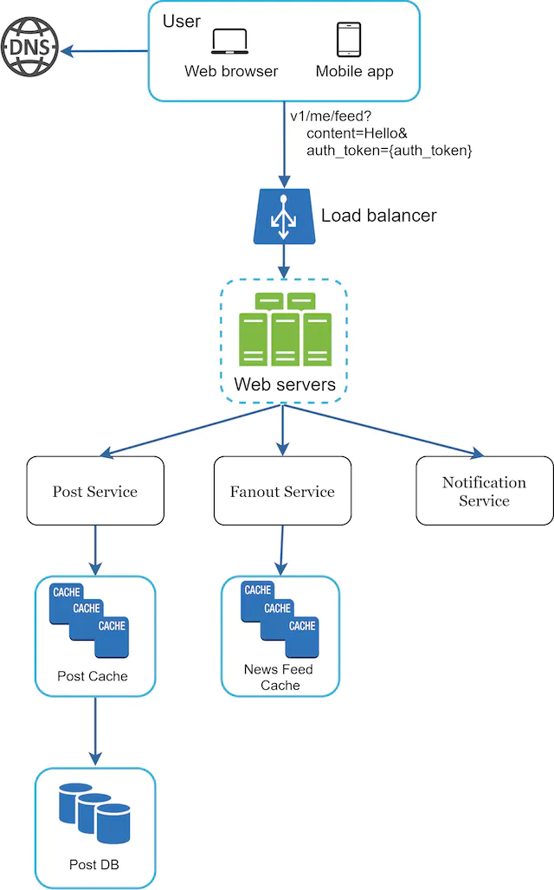
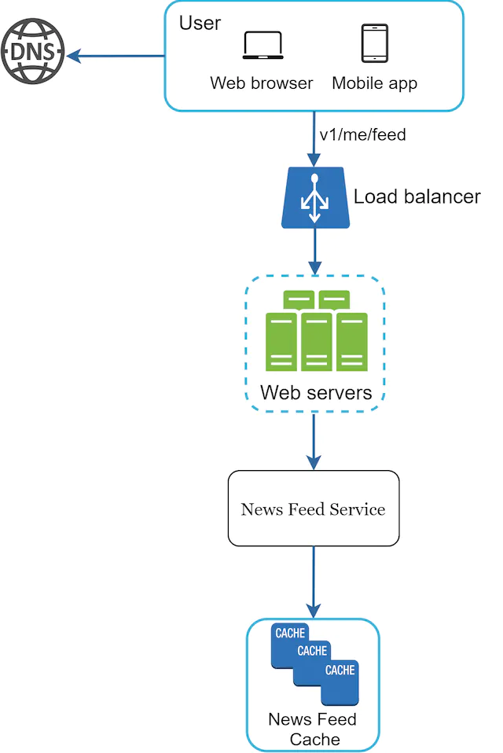
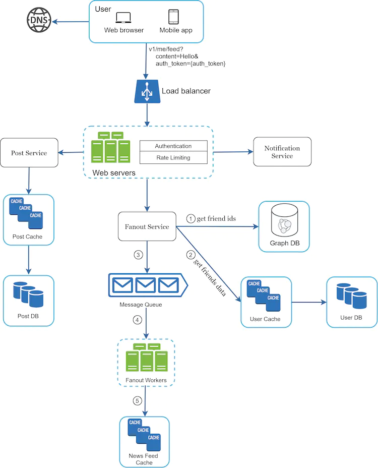
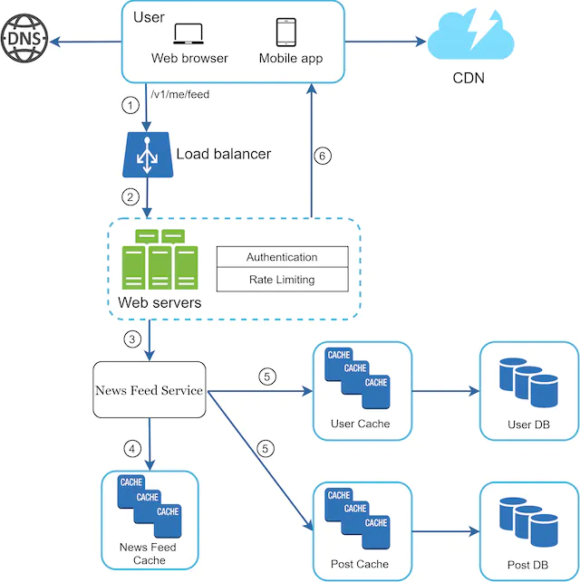

你刚刚在你梦想的公司获得了令人垂涎的现场面试机会。招聘协调员会向你发送当天的日程安排。顺着列表往下看，你会感觉很不错，直到你的目光落在这个面试环节——系统设计面试上。

系统设计面试常常令人生畏。它可能像“设计一个知名产品 X？”一样模糊。这些问题含糊不清，而且似乎过于宽泛。你的疲倦是可以理解的。毕竟，谁能在一小时内设计出一款需要数百名甚至数千名工程师打造的流行产品呢？

好消息是没有人期望你这么做。现实世界的系统设计极其复杂。例如，Google 搜索看似简单；然而，支撑这种简单性的技术数量确实令人惊讶。如果没有人期望你在一小时内设计出一个现实世界的系统，那么系统设计面试有什么好处呢？

系统设计面试模拟现实生活中的问题解决，两名同事合作解决一个模糊的问题，并提出一个满足他们目标的解决方案。这个问题是开放式的，没有完美的答案。与你在设计过程中投入的工作相比，最终的设计并不那么重要。这使你能够展示你的设计技能，捍卫你的设计选择，并以建设性的方式回应反馈。

让我们翻转桌子，想一想当面试官走进会议室来见你时，她脑子里在想什么。面试官的主要目标是准确评估你的能力。她最不想做的就是给出一个不确定的评估，因为会议进行得很糟糕并且没有足够的信号。面试官在系统设计面试中寻找什么？

许多人认为系统设计面试主要考察的是一个人的技术设计能力。远不止于此。一次有效的系统设计面试可以强烈表明一个人的协作能力、在压力下工作以及建设性地解决歧义的能力。提出好问题的能力也是一项必备技能，许多面试官都特别看重这项技能。

一个好的面试官也会寻找危险信号。过度设计是许多工程师的真正疾病，因为他们喜欢设计的纯粹性而忽视权衡。他们往往没有意识到过度设计的系统会带来复合成本，许多公司为此付出了高昂的代价。你当然不想在系统设计面试中表现出这种趋势。其他危险信号包括心胸狭隘、固执等。

在本章中，我们将介绍一些有用的技巧，并介绍一个简单有效的框架来解决系统设计面试问题。

## 有效系统设计面试的 4 步流程

每个系统设计面试都是不同的。一次出色的系统设计面试是开放式的，并且不存在放之四海而皆准的解决方案。然而，每次系统设计访谈都需要涵盖一些步骤和共同点。

### 第 1 步 - 了解问题并确定设计范围

“老虎为什么吼叫？”

一只手在教室后面举了起来。

“是的，吉米？”老师回答道。

“因为他饿了”。

“非常好，吉米。”

在他的整个童年时期，吉米总是在课堂上第一个回答问题。每当老师问问题时，教室里总有一个孩子喜欢尝试这个问题，不管他是否知道答案。那是吉米。

吉米是一名优等生。他为快速知道所有答案而感到自豪。考试时，他通常是第一个做完题的人。他是任何学术竞赛中老师的首选。

不要像吉米那样。

在系统设计面试中，不假思索地快速给出答案不会给你加分。在没有彻底了解要求的情况下回答是一个巨大的危险信号，因为面试不是一场问答比赛。没有正确的答案。

因此，不要直接跳出来给出解决方案。减速。深入思考并提出问题以澄清要求和假设。这一点非常重要。

作为一名工程师，我们喜欢解决难题并直接进入最终设计；然而，这种方法可能会导致你设计出错误的系统。作为工程师，最重要的技能之一是提出正确的问题，做出正确的假设，并收集构建系统所需的所有信息。所以，不要害怕提问。

当你提出问题时，面试官要么直接回答你的问题，要么要求你做出假设。如果发生后者，请在白板或纸上写下你的假设。你稍后可能需要它们。

要问什么样的问题？提出问题以了解确切的要求。以下是帮助你入门的问题列表：

- 我们要构建哪些具体功能？
- 该产品有多少用户？
- 公司预计以多快的速度扩大规模？3个月、6个月、一年后的预期规模是多少？
- 公司的技术栈是什么？你可以利用哪些现有服务来简化设计？

#### 例子

如果你被要求设计一个新闻源系统，你需要提出一些问题来帮助你阐明需求。你和面试官之间的对话可能是这样的：

**候选人**：这是一个移动应用程序吗？或者网络应用程序？或两者？

**面试官**：两者都有。

**应聘者**：该产品最重要的功能是什么？

**面试官**：能够发帖并查看朋友的动态。

**候选人**：新闻提要是按时间倒序排列还是按特定顺序排列？特定的顺序意味着每个帖子都被赋予不同的权重。例如，来自亲密朋友的帖子比来自群组的帖子更重要。

**面试官**：为了简单起见，我们假设 feed 是按时间倒序排列的。

**候选人**：一个用户可以有多少个朋友？

**面试官**：5000

**应聘者**：请求量是多少？

**面试官**：1000万日活跃用户（DAU）

**候选人**：提要可以包含图像、视频还是仅包含文本？

**面试官**：它可以包含媒体文件，包括图像和视频。

以上是你可以向面试官询问的一些示例问题。理解要求并澄清歧义很重要

### 第 2 步 - 提出高级设计并获得认可

在这一步中，我们的目标是开发一个高层设计并与面试官就设计达成一致。在此过程中与面试官合作是一个好主意。

- 提出初步的设计蓝图。寻求反馈。将面试官视为队友并一起工作。许多优秀的面试官喜欢交谈并参与其中。
- 在白板或纸上绘制带有关键组件的框图。这可能包括客户端（移动/网络）、API、网络服务器、数据存储、缓存、CDN、消息队列等。
- 进行粗略计算以评估你的蓝图是否符合规模限制。大声思考。如果在深入探讨之前需要了解具体情况，请与面试官沟通。

如果可能的话，请浏览一些具体的用例。这将帮助你构建高层设计。这些用例也可能帮助你发现尚未考虑的边缘情况。

我们应该在此处包含 API 端点和数据库架构吗？这取决于问题。对于像“设计谷歌搜索引擎”这样的大型设计问题，这有点太低级了。对于像多人扑克游戏的后端设计这样的问题，这是一个公平的游戏。与你的面试官沟通。

#### 例子

让我们以“设计新闻推送系统”来演示如何进行高层设计。在这里，你不需要了解系统的实际工作原理。所有细节将在“设计新闻源系统”章节中进行解释。

在高层，设计分为两个流程：提要发布和新闻提要构建。

- Feed发布：当用户发布帖子时，相应的数据会被写入缓存/数据库，并且该帖子将被填充到好友的动态消息中。
- 新闻源构建：新闻源是通过按时间倒序聚合朋友的帖子来构建的。

图 1 和图 2 分别展示了 feed 发布和新闻 feed 构建流程的高级设计。

图1

图2

### 第 3 步 - 设计深入研究

在此步骤中，你和你的面试官应该已经实现了以下目标：

- 就总体目标和功能范围达成一致
- 勾勒出总体设计的高层蓝图
- 从面试官那里获得了关于高层设计的反馈
- 根据她的反馈，对深入研究的重点领域有一些初步想法

你应与面试官一起识别架构中的组件并确定其优先级。值得强调的是，每次面试都是不同的。有时，面试官可能会暗示她喜欢专注于高层设计。有时，对于高级候选人面试，讨论可能是关于系统性能特征，可能集中在瓶颈和资源估计上。在大多数情况下，面试官可能希望你深入了解一些系统组件的细节。对于 URL 缩短器，深入研究将长 URL 转换为短 URL 的哈希函数设计是很有趣的。对于聊天系统来说，如何减少延迟以及如何支持在线/离线状态是两个有趣的话题。

时间管理至关重要，因为你很容易被无法证明你能力的微小细节冲昏头脑。你必须携带信号向面试官展示。尽量不要涉及不必要的细节。例如，在系统设计面试中详细讨论 Facebook feed 排名的 EdgeRank 算法并不理想，因为这会花费大量宝贵的时间，并且不能证明你设计可扩展系统的能力。

#### 例子

至此，我们已经讨论了新闻源系统的高层设计，面试官对你的建议很满意。接下来，我们将研究两个最重要的用例：

1. Feed 发布

2. 新闻提要检索

图 3 和图 4 显示了两个用例的详细设计，这将在“设计新闻源系统”一章中详细解释。

图3

图4

### 第 4 步 - 总结

在最后一步中，面试官可能会问你一些后续问题，或者让你自由讨论其他附加问题。以下是一些需要遵循的方向：

- 面试官可能希望你找出系统瓶颈并讨论潜在的改进。永远不要说你的设计是完美的，没有什么可以改进的。总有一些地方需要改进。这是展示你的批判性思维并留下良好的最终印象的绝佳机会。
- 让面试官回顾一下你的设计可能会很有用。如果你提出了一些解决方案，这一点尤其重要。经过长时间的面试后，刷新面试官的记忆可能会有所帮助。
- 错误案例（服务器故障、网络丢失等）很有趣。
- 操作问题值得一提。你如何监控指标和错误日志？系统如何推广？
- 如何处理接下来的尺度曲线也是一个有趣的话题。例如，如果你当前的设计支持 100 万用户，那么你需要进行哪些更改才能支持 1000 万用户？
- 如果你有更多时间，请提出你需要的其他改进。

最后，我们总结了一份注意事项清单。

**该做的事**

- 总是要求澄清。不要假设你的假设是正确的。
- 了解问题的要求。
- 既没有正确答案，也没有最佳答案。旨在解决年轻初创公司问题的解决方案与拥有数百万用户的老牌公司的解决方案不同。确保你了解要求。
- 让面试官知道你在想什么。与你的面试进行沟通。
- 如果可能的话，建议多种方法。
- 一旦你与面试官就蓝图达成一致，就可以详细了解每个组成部分。首先设计最关键的组件。
- 向面试官反馈想法。一个好的面试官会像队友一样与你一起工作。
- 永不放弃。

**不该做的事**

- 对于典型的面试问题，不要毫无准备。
- 在没有明确要求和假设的情况下，不要急于寻求解决方案。
- 不要一开始就对单个组件进行过多的详细介绍。首先给出高层设计，然后再深入。
- 如果你遇到困难，请不要犹豫寻求提示。
- 再次强调，沟通。不要默默地思考。
- 不要以为给出设计后面试就结束了。在面试官说你已经完成之前，你还没有完成。尽早并经常寻求反馈。

### 每个步骤的时间分配

系统设计面试问题通常非常广泛，45分钟或一个小时不足以涵盖整个设计。时间管理至关重要。每一步应该花多少时间？以下是关于在 45 分钟面试环节中分配时间的非常粗略的指南。请记住，这只是一个粗略的估计，实际的时间分配取决于问题的范围和面试官的要求。

步骤 1 了解问题并确定设计范围：3 - 10 分钟

第 2 步提出高级设计并获得认可：10 - 15 分钟

第 3 步设计深入研究：10 - 25 分钟

步骤 4 包裹：3 - 5 分钟
