在网络系统中，速率限制器用于控制客户端或服务发送的流量的速率。在 HTTP 世界中，速率限制器限制在指定时间段内允许发送的客户端请求的数量。如果 API 请求计数超过速率限制器定义的阈值，则所有超出的调用都会被阻止。这里有一些例子：

- 用户每秒只能撰写不超过 2 个帖子。
- 你每天最多可以从同一 IP 地址创建 10 个帐户。
- 你每周从同一设备领取奖励的次数不得超过 5 次。

在本章中，你需要设计一个速率限制器。在开始设计之前，我们首先看看使用API速率限制器的好处：

- 防止拒绝服务 (DoS) 攻击导致资源匮乏 [1]。大型科技公司发布的几乎所有 API 都强制实施某种形式的速率限制。例如，Twitter 将推文数量限制为每 3 小时 300 条 [2]。Google 文档 API 具有以下默认限制：每个用户每 60 秒 300 个读取请求 [3]。速率限制器通过阻止多余的呼叫来防止有意或无意的 DoS 攻击。
- 降低成本。限制过多的请求意味着更少的服务器并向高优先级 API 分配更多资源。对于使用付费第三方 API 的公司来说，速率限制极其重要。例如，以下外部 API 按每次调用收费：检查信用、付款、检索健康记录等。限制调用次数对于降低成本至关重要。
- 防止服务器超载。为了减少服务器负载，速率限制器用于过滤掉由机器人或用户不当行为引起的过多请求。

## 第 1 步 - 了解问题并确定设计范围

速率限制可以使用不同的算法来实现，每种算法都有其优点和缺点。面试官和候选人之间的互动有助于澄清我们试图建立的速率限制器的类型。

**候选人**：我们要设计什么样的速率限制器？是客户端速率限制器还是服务器端 API 速率限制器？
**面试官**：问得好。我们重点关注服务器端 API 速率限制器。

**候选人**：速率限制器是否根据 IP、用户 ID 或其他属性来限制 API 请求？
**面试官**：速率限制器应该足够灵活，以支持不同的节流规则集。

**候选人**：系统的规模有多大？它是为初创公司还是为拥有大量用户群的大公司而构建的？
**面试官**：系统必须能够处理大量的请求。

**候选人**：系统能在分布式环境下工作吗？
**面试官**：是的。

**候选人**：速率限制器是一个单独的服务还是应该在应用程序代码中实现？
**面试官**：这是你的设计决定。

**候选人**：我们需要通知被限制的用户吗？
**面试官**：是的。

**要求**

以下是系统要求的摘要：

- 准确限制过多的请求。
- 低延迟。速率限制器不应减慢 HTTP 响应时间。
- 使用尽可能少的内存。
- 分布式速率限制。速率限制器可以在多个服务器或进程之间共享。
- 异常处理。当用户的请求受到限制时，向用户显示明确的异常情况。
- 高容错性。如果速率限制器出现任何问题（例如缓存服务器离线），不会影响整个系统。

## 第 2 步 - 提出高级设计并获得认可

让我们保持简单并使用基本的客户端和服务器模型进行通信。

### 速率限制器应该放在哪里？

直观地说，你可以在客户端或服务器端实现速率限制器。

- 客户端实现。一般来说，客户端是一个不可靠的实施速率限制的地方，因为客户端请求很容易被恶意行为者伪造。此外，我们可能无法控制客户端的实现。
- 服务器端实现。图 1 显示了放置在服务器端的速率限制器。

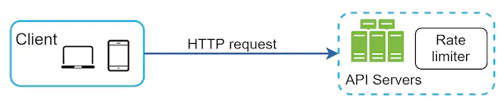

图1

除了客户端和服务器端实现之外，还有一种替代方法。我们没有在 API 服务器上放置速率限制器，而是创建一个速率限制器中间件，它可以限制对 API 的请求，如图 2 所示。

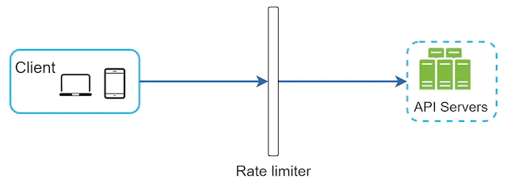

图2

让我们使用图 3 中的示例来说明速率限制在此设计中的工作原理。假设我们的 API 每秒允许 2 个请求，客户端在一秒钟内向服务器发送 3 个请求。前两个请求将路由到 API 服务器。但是，速率限制器中间件会限制第三个请求并返回 HTTP 状态代码 429。HTTP 429 响应状态代码表示用户发送了太多请求。

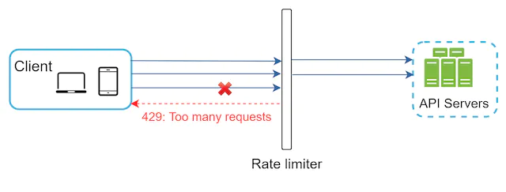

图3

云微服务 [4] 已经广泛流行，并且速率限制通常在称为 API 网关的组件内实现。API网关是一个完全托管的服务，支持速率限制、SSL终止、身份验证、IP白名单、静态内容服务等。现在，我们只需要知道API网关是一个支持速率限制的中间件。

在设计速率限制器时，要问自己的一个重要问题是：速率限制器应该在哪里实现，在服务器端还是在网关中？没有绝对的答案。这取决于你公司当前的技术堆栈、工程资源、优先级、目标等。以下是一些一般准则：

- 评估你当前的技术堆栈，例如编程语言、缓存服务等。确保你当前的编程语言能够有效地在服务器端实现速率限制。
- 确定适合你的业务需求的速率限制算法。当你在服务器端实现所有内容时，你就可以完全控制算法。但是，如果你使用第三方网关，你的选择可能会受到限制。
- 如果你已经使用了微服务架构，并且在设计中包含了API网关来执行身份验证、IP白名单等操作，那么你可以在API网关中添加速率限制器。
- 构建你自己的速率限制服务需要时间。如果你没有足够的工程资源来实施速率限制器，商业 API 网关是更好的选择。

### 速率限制算法

速率限制可以使用不同的算法来实现，每种算法都有不同的优点和缺点。尽管本章不重点讨论算法，但从高层理解它们有助于选择正确的算法或算法组合来适合我们的用例。以下是流行算法的列表：

- 令牌桶算法
- 漏桶算法
- 固定窗口计数器算法
- 滑动窗口计数器算法
- 推拉窗柜台

#### 令牌桶算法

令牌桶算法广泛用于限速。它简单、易于理解并且被互联网公司广泛使用。Amazon [5] 和 Stripe [6] 都使用此算法来限制其 API 请求。

令牌桶算法的工作原理如下：

- 令牌桶是具有预定义容量的容器。令牌会定期以预设的速率放入桶中。一旦桶满了，就不再添加令牌。如图4所示，令牌桶容量为4个。加注器每秒向令牌桶中放入2个令牌。一旦桶满了，多余的令牌就会溢出。

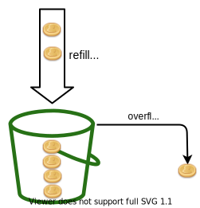

图4

- 每个请求消耗一个令牌。当请求到达时，我们检查存储桶中是否有足够的令牌。图 5 解释了它的工作原理。
- 如果有足够的令牌，我们会为每个请求取出一个令牌，然后请求就会通过。
- 如果没有足够的令牌，则请求将被丢弃。


图5

图 6 说明了令牌消耗、补充和速率限制逻辑的工作原理。在本例中，令牌桶大小为4，重新填充率为每1分钟4个。


图6

令牌桶算法有两个参数：

- 桶大小：桶中允许的最大令牌数
- 重新填充率：每秒放入桶中的令牌数量

我们需要多少个桶？这会有所不同，并且取决于速率限制规则。这里有一些例子。

- 通常需要为不同的 API 端点设置不同的存储桶。例如，如果允许用户每秒发1个帖子，每天添加150个好友，每秒发5个帖子，则每个用户需要3个桶。
- 如果我们需要根据 IP 地址限制请求，则每个 IP 地址都需要一个存储桶。
- 如果系统每秒最多允许 10,000 个请求，那么让所有请求共享一个全局存储桶是有意义的。

优点：

- 该算法易于实现。
- 内存高效。
- 令牌桶允许短时间的流量突发。只要还有令牌，请求就可以通过。

缺点：

- 算法中的两个参数是桶大小和令牌填充率。然而，正确调整它们可能具有挑战性。

#### 漏桶算法

漏桶算法与令牌桶类似，只是以固定速率处理请求。它通常用先进先出（FIFO）队列来实现。该算法的工作原理如下：

- 当请求到达时，系统检查队列是否已满。如果未满，则将请求添加到队列中。
- 否则，请求将被丢弃。
- 请求从队列中提取并定期处理。

图 7 解释了该算法的工作原理。

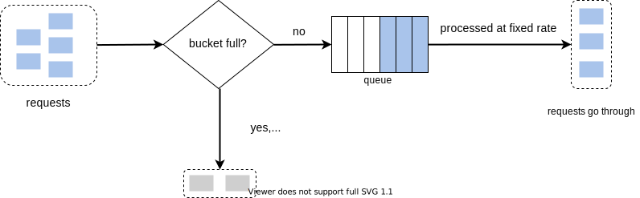

图7

漏桶算法采用以下两个参数：

- 桶大小：等于队列大小。队列以固定速率保存要处理的请求。
- 流出率：它定义了在固定速率下可以处理多少个请求，通常以秒为单位。

电子商务公司 Shopify 使用漏桶进行速率限制 [7]。

优点：

- 考虑到队列大小有限，内存效率较高。
- 请求以固定速率处理，因此适合需要稳定流出速率的用例。

缺点：

- 突发的流量将旧请求填满队列，如果不及时处理，最近的请求将被限速。
- 算法中有两个参数。正确调整它们可能并不容易。

#### 固定窗口计数器算法

固定窗口计数器算法的工作原理如下：

- 该算法将时间线划分为固定大小的时间窗口，并为每个窗口分配一个计数器。
- 每个请求都会使计数器加一。
- 一旦计数器达到预定义的阈值，新的请求就会被丢弃，直到新的时间窗口开始。

让我们用一个具体的例子来看看它是如何工作的。图8中，时间单位为1秒，系统每秒最多允许3个请求。在每个第二个窗口中，如果收到超过 3 个请求，则会丢弃额外的请求，如图 8 所示。

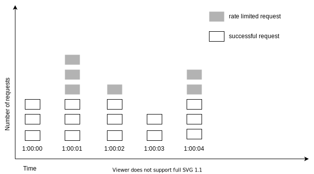

图8

该算法的一个主要问题是，时间窗口边缘的流量突发可能会导致超过允许配额通过的请求。考虑以下情况：


图9

在图 9 中，系统每分钟最多允许 5 个请求，并且可用配额会在人性化的回合分钟重置。如图所示，2:00:00 到 2:01:00 之间有 5 个请求，2:01:00 到 2:02:00 之间还有 5 个请求。对于 2:00:30 到 2:01:30 之间的一分钟窗口，会处理 10 个请求。这是允许请求的两倍。

优点：

- 内存高效。
- 容易明白。
- 在单位时间窗口结束时重置可用配额适合某些用例。

缺点：

- 窗口边缘的流量峰值可能会导致请求数量超过允许的配额。

#### 滑动窗口计数器算法

如前所述，固定窗口计数器算法有一个主要问题：它允许更多请求在窗口边缘通过。滑动窗口计数器算法解决了这个问题。其工作原理如下：

- 该算法跟踪请求时间戳。时间戳数据通常保存在缓存中，例如 Redis 的排序集 [8]。
- 当新请求到来时，删除所有过时的时间戳。过时的时间戳定义为早于当前时间窗口开始的时间戳。
- 将新请求的时间戳添加到日志中。
- 如果日志大小等于或小于允许的计数，则接受请求。否则，将被拒绝。

我们通过图 10 所示的示例来解释该算法。

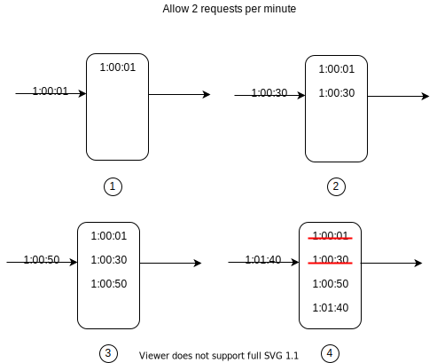

图10

在此示例中，速率限制器每分钟允许 2 个请求。通常，Linux 时间戳存储在日志中。然而，为了更好的可读性，我们的示例中使用了人类可读的时间表示。

- 当新请求在 1:00:01 到达时，日志为空。因此，该请求被允许。
- 新请求在 1:00:30 到达，时间戳 1:00:30 被插入到日志中。插入后，日志大小为2，不大于允许的计数。因此，该请求被允许。
- 1:00:50 有新请求到达，时间戳被插入到日志中。插入后，日志大小为3，大于允许的大小2。因此，即使日志中保留了时间戳，该请求也会被拒绝。
- 新请求于 1:01:40 到达。[1:00:40,1:01:40) 范围内的请求属于最新时间范围内的请求，但 1:00:40 之前发送的请求已过时。两个过时的时间戳 1:00:01 和 1:00:30 已从日志中删除。进行remove操作后，日志大小变为2；因此，请求被接受。

优点：

- 该算法实现的速率限制非常准确。在任何滚动窗口中，请求都不会超过速率限制。

缺点：

- 该算法会消耗大量内存，因为即使请求被拒绝，其时间戳仍可能存储在内存中。

#### 滑动窗口计数器算法

滑动窗口计数器算法是一种结合了固定窗口计数器和滑动窗口日志的混合方法。该算法可以通过两种不同的方法来实现。我们将在本节中解释一种实现，并在本节末尾为另一种实现提供参考。图 11 说明了该算法的工作原理。

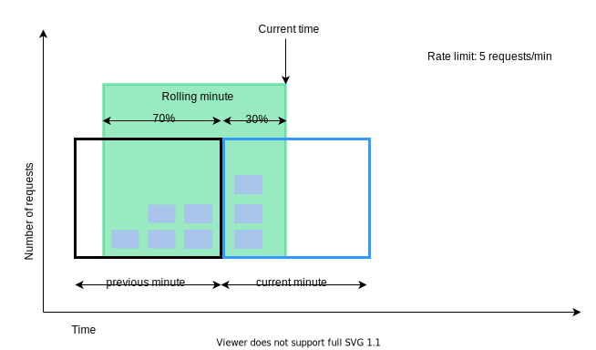

图11

假设速率限制器每分钟最多允许 7 个请求，前一分钟有 5 个请求，当前分钟有 3 个请求。对于当前分钟内达到30%位置的新请求，滚动窗口内的请求数使用以下公式计算：

- 当前窗口请求数**+**上一个窗口请求数*****滚动窗口与上一个窗口的重叠百分比
- 使用此公式，我们得到 3 + 5 * 0.7% = 6.5 个请求。根据用例，该数字可以向上或向下舍入。在我们的示例中，它向下舍入为 6。

由于速率限制器每分钟最多允许 7 个请求，因此当前请求可以通过。但是，再收到一次请求后就会达到限制。

由于篇幅限制，我们这里不讨论其他实现。有兴趣的读者可以参考参考资料[9]。这个算法并不完美。它有优点也有缺点。

优点

- 它可以消除流量峰值，因为该速率基于前一个窗口的平均速率。
- 内存高效。

缺点

- 它仅适用于不太严格的回溯窗口。它是实际速率的近似值，因为它假设前一个窗口中的请求是均匀分布的。然而，这个问题可能并不像看起来那么糟糕。根据 Cloudflare [10] 所做的实验，在 4 亿个请求中，只有 0.003% 的请求被错误允许或速率限制。

### 高层架构

速率限制算法的基本思想很简单。在高层，我们需要一个计数器来跟踪从同一用户、IP 地址等发送的请求数量。如果计数器大于限制，则该请求将被禁止。

我们应该在哪里存放柜台？由于磁盘访问速度缓慢，使用数据库并不是一个好主意。选择内存缓存是因为它速度快并且支持基于时间的过期策略。例如，Redis [11] 是实现速率限制的流行选项。它是一个内存存储，提供两个命令：INCR 和 EXPIRE。

- INCR：将存储的计数器加1。
- EXPIRE：它设置计数器的超时时间。如果超时，计数器将自动删除。

图 12 显示了速率限制的高级架构，其工作原理如下：

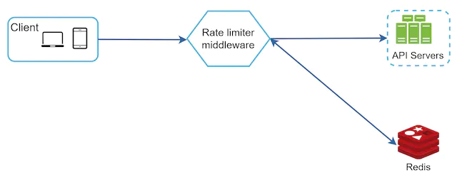

图12

- 客户端向速率限制中间件发送请求。
- 速率限制中间件从 Redis 中相应的存储桶中获取计数器，并检查是否达到限制。
- 如果达到限制，则请求将被拒绝。
- 如果未达到限制，请求将发送到 API 服务器。同时，系统增加计数器并将其保存回Redis。

## 第 3 步 - 设计深入研究

图 12 中的高级设计没有回答以下问题：

- 速率限制规则是如何创建的？规则存储在哪里？
- 如何处理速率受限的请求？

在本节中，我们将首先回答有关速率限制规则的问题，然后介绍处理速率限制请求的策略。最后，我们将讨论分布式环境中的速率限制、详细设计、性能优化和监控。

### 限速规则

Lyft 开源了他们的速率限制组件 [12]。我们将查看组件内部并查看一些速率限制规则的示例：

```
domain: messaging
descriptors:
  - key: message_type
    value: marketing
    rate_limit:
      unit: day
      requests_per_unit: 5
```

在上面的示例中，系统配置为每天最多允许 5 条营销消息。这是另一个例子：

```
domain: auth
descriptors:
  - key: auth_type
    value: login
    rate_limit:
      unit: minute
      requests_per_unit: 5
```

该规则表明客户端在 1 分钟内登录次数不得超过 5 次。规则通常写入配置文件并保存在磁盘上。

### 超过速率限制

如果请求受到速率限制，API 会向客户端返回 HTTP 响应代码 429（请求过多）。根据用例，我们可能会将速率受限的请求排队以便稍后处理。例如，如果某些订单由于系统过载而受到速率限制，我们可能会保留这些订单以供稍后处理。

#### 速率限制器标头

客户端如何知道自己是否受到限制？客户端如何知道在被限制之前允许的剩余请求数？答案在于 HTTP 响应标头。速率限制器向客户端返回以下 HTTP 标头：

```
X-Ratelimit-Remaining: The remaining number of allowed requests within the window.

X-Ratelimit-Limit: It indicates how many calls the client can make per time window.

X-Ratelimit-Retry-After: The number of seconds to wait until you can make a request again without being throttled.
```

当用户发送过多请求时，429 请求过多错误和*X-Ratelimit-Retry-After*标头将返回给客户端。

### 详细设计

图 13 展示了系统的详细设计。

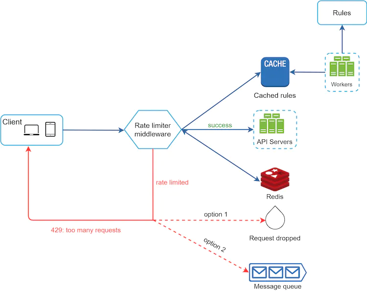

图13

- 规则存储在磁盘上。工作人员经常从磁盘中提取规则并将其存储在缓存中。
- 当客户端向服务器发送请求时，该请求首先被发送到限速器中间件。
- 速率限制器中间件从缓存加载规则。它从 Redis 缓存中获取计数器和上次请求时间戳。根据响应，速率限制器决定：
- 如果请求不受速率限制，则将其转发到 API 服务器。
- 如果请求受到速率限制，则速率限制器会向客户端返回 429 请求过多错误。与此同时，请求要么被丢弃，要么被转发到队列。

### 分布式环境中的速率限制器

构建在单服务器环境中工作的速率限制器并不困难。然而，扩展系统以支持多个服务器和并发线程则是另一回事。有两个挑战：

- 比赛条件
- 同步问题

#### 比赛条件

如前所述，速率限制器在高层的工作原理如下：

- 从 Redis读取*计数器值。*
- 检查 ( *counter + 1* ) 是否超过阈值。
- 如果不是，则将 Redis 中的计数器值加 1。

竞争条件可能发生在高度并发的环境中，如图 14 所示。

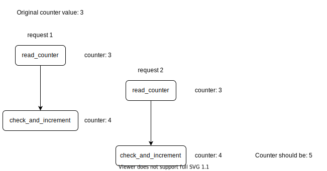

图14

假设Redis 中的*计数器*值为 3。如果两个请求在其中任何一个请求将值写回之前同时读取*计数器值，则每个请求都会将**计数器*加一并将其写回，而不检查另一个线程。两个请求（线程）都认为它们具有正确的*计数器*值 4。但是，正确的*计数器*值应该是 5。

锁是解决竞争条件最明显的解决方案。然而，锁会显着减慢系统速度。通常使用两种策略来解决该问题：Lua脚本[13]和Redis中的排序集数据结构[8]。对这些策略感兴趣的读者可以参考相应的参考资料[8][13]。

#### 同步问题

同步是分布式环境中需要考虑的另一个重要因素。为了支持数百万用户，一台速率限制器服务器可能不足以处理流量。当使用多个限速服务器时，需要同步。例如，在图 15 的左侧，客户端 1 向速率限制器 1 发送请求，客户端 2 向速率限制器 2 发送请求。由于 Web 层是无状态的，因此客户端可以向不同的速率限制器发送请求，如上图所示。如图15右侧所示。如果没有发生同步，则速率限制器1不包含有关客户端2的任何数据。因此，速率限制器无法正常工作。

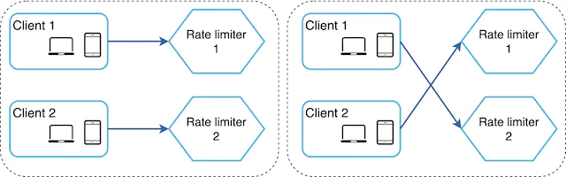

图15

一种可能的解决方案是使用粘性会话，允许客户端将流量发送到相同的速率限制器。这种解决方案并不可取，因为它既不可扩展也不灵活。更好的方法是使用 Redis 等集中式数据存储。该设计如图 16 所示。

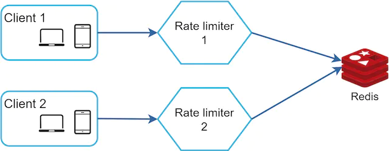

图16

### 性能优化

性能优化是系统设计面试中的常见话题。我们将在两个方面进行改进。

首先，多数据中心设置对于速率限制器至关重要，因为远离数据中心的用户的延迟很高。大多数云服务提供商在世界各地建立了许多边缘服务器位置。例如，截至 2020 年 5 月 20 日，Cloudflare 拥有 194 个地理分布的边缘服务器 [14]。流量会自动路由到最近的边缘服务器以减少延迟。

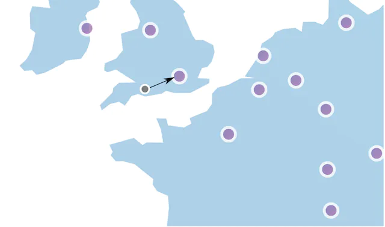

图 17（来源：[10]）

其次，使用最终一致性模型同步数据。如果你对最终一致性模型不清楚，请参阅“设计键值存储”一章中的“一致性”部分。

### 监控

设置速率限制器后，收集分析数据以检查速率限制器是否有效非常重要。首先，我们要确保：

- 限速算法有效。
- 速率限制规则有效。

例如，如果速率限制规则太严格，则许多有效请求会被丢弃。在这种情况下，我们想稍微放宽规则。在另一个例子中，我们注意到当流量突然增加（例如限时抢购）时，我们的速率限制器会变得无效。在这种场景下，我们可能会更换算法来支持突发流量。令牌桶在这里很合适。

## 第 4 步 - 总结

在本章中，我们讨论了不同的速率限制算法及其优缺点。讨论的算法包括：

- 令牌桶
- 漏水桶
- 固定窗
- 滑动窗口日志
- 推拉窗柜台

然后，我们讨论了系统架构、分布式环境中的速率限制器、性能优化和监控。与任何系统设计面试问题类似，如果时间允许，你还可以提及其他谈话要点：

- 硬速率限制与软速率限制。
- Hard：请求数不能超过阈值。
- Soft：请求可能会在短时间内超过阈值。
- 不同级别的速率限制。在本章中，我们只讨论了应用程序级别（HTTP：第 7 层）的速率限制。可以在其他层应用速率限制。例如，你可以使用 Iptables [15]（IP：第 3 层）通过 IP 地址应用速率限制。注：开放系统互连模型（OSI 模型）有 7 层 [16]：第 1 层：物理层，第 2 层：数据链路层，第 3 层：网络层，第 4 层：传输层，第 5 层：会话层，层6：表示层，7层：应用层。
- 避免受到速率限制。使用最佳实践设计你的客户端：
- 使用客户端缓存以避免频繁的 API 调用。
- 了解限制，不要在短时间内发送太多请求。
- 包含捕获异常或错误的代码，以便你的客户端可以从异常中正常恢复。
- 添加足够的回退时间以重试逻辑。

恭喜你已经走到这一步了！现在拍拍自己的背吧。好工作！

## 参考资料

[1] 速率限制策略和技术：https://cloud.google.com/solutions/rate-limiting-strategies-techniques

[2] Twitter 速率限制：https://developer.twitter.com/en/docs/basics/rate-limits

[3] Google 文档使用限制：https://developers.google.com/docs/api/limits

[4] IBM 微服务：https://www.ibm.com/cloud/learn/microservices

[5] 限制 API 请求以获得更好的吞吐量：[https://docs.aws.amazon.com/apigateway/latest/developerguide/api-gateway-request-throtdling.html](https://docs.aws.amazon.com/apigateway/latest/developerguide/api-gateway-request-throttling.html)

[6] Stripe速率限制器：https://stripe.com/blog/rate-limiters

[7] Shopify REST Admin API 速率限制：https://help.shopify.com/en/api/reference/rest-admin-api-rate-limits

[8] 使用 Redis 排序集实现更好的速率限制：https://engineering.classdojo.com/blog/2015/02/06/rolling-rate-limiter/

[9] 系统设计 — 速率限制器和数据建模：https://medium.com/@saisandeepmopuri/system-design-rate-limiter-and-data-modelling-9304b0d18250

[10] 我们如何构建能够扩展到数百万个域的速率限制：[https://blog.cloudflare.com/counting-things-a-lot-of- Different-things/](https://blog.cloudflare.com/counting-things-a-lot-of-different-things/)

[11]Redis网站： [https://redis.io/](https://redis.io/)

[12] Lyft 速率限制：https://github.com/lyft/ratelimit

[13] 使用速率限制器扩展 API：https://gist.github.com/ptarjan/e38f45f2dfe601419ca3af937fff574d#request-rate-limiter

[14] 什么是边缘计算：https://www.cloudflare.com/learning/serverless/glossary/what-is-edge-computing/

[15] Iptables 的速率限制请求：https://blog.programster.org/rate-limit-requests-with-iptables

[16] OSI模型：https://en.wikipedia.org/wiki/OSI_model#Layer_architecture