为了实现水平扩展，在服务器之间有效且均匀地分配请求/数据非常重要。一致性哈希是实现这一目标的常用技术。但首先，让我们深入研究一下这个问题。

## 重散列问题

如果有*n个*缓存服务器，平衡负载的常用方法是使用以下哈希方法：

$server Index = hash(key) % N$，其中*N*是服务器池的大小。

让我们用一个例子来说明它是如何工作的。如表 1 所示，我们有 4 台服务器和 8 个字符串键及其哈希值。

| **钥匙** | **散列** | **哈希%4** |
| :------: | :------: | :--------: |
|   key0   | 18358617 |     1      |
|   key1   | 26143584 |     0      |
|   key2   | 18131146 |     2      |
|   key3   | 35863496 |     0      |
|   key4   | 34085809 |     1      |
|   key5   | 27581703 |     3      |
|   key6   | 38164978 |     2      |
|   key7   | 22530351 |     3      |

表格1

为了获取存储密钥的服务器，我们执行模运算$f(key) % 4$。例如，$hash(key0) % 4 = 1$表示客户端必须联系服务器 1 才能获取缓存数据。图1显示了基于表1的密钥分布。

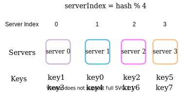

图1

当服务器池的大小固定并且数据分布均匀时，这种方法效果很好。然而，当添加新服务器或删除现有服务器时，就会出现问题。例如，如果服务器 1 离线，则服务器池的大小变为 3。使用相同的哈希函数，我们可以得到相同的密钥哈希值。但是应用模块化操作会给我们带来不同的服务器索引，因为服务器数量减少了 1。我们通过应用哈希 % 3得到如表 2 所示的结果：

| key  | **散列** | **哈希%3** |
| :--: | :------: | :--------: |
| key0 | 18358617 |     0      |
| key1 | 26143584 |     0      |
| key2 | 18131146 |     1      |
| key3 | 35863496 |     2      |
| key4 | 34085809 |     1      |
| key5 | 27581703 |     0      |
| key6 | 38164978 |     1      |
| key7 | 22530351 |     0      |

表2

图 2 显示了基于表 2 的新密钥分配。

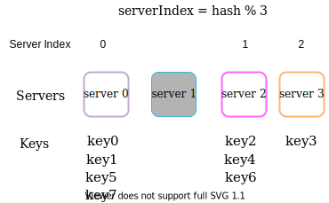

图2

如图 2 所示，大多数密钥都被重新分配，而不仅仅是最初存储在离线服务器（服务器 1）中的密钥。这意味着当服务器1离线时，大多数缓存客户端将连接到错误的服务器来获取数据。这会导致大量缓存未命中。一致性哈希是缓解此问题的有效技术。

## 一致的散列

引用自维基百科：“一致性哈希是一种特殊的哈希，当调整哈希表大小并使用一致性哈希时，平均只需要重新映射 k/n 个键，其中 k 是键的数量，并且n 是槽的数量。相比之下，在大多数传统哈希表中，数组槽数量的变化会导致几乎所有键都被重新映射[1]”。

### 哈希空间和哈希环

现在我们了解了一致性哈希的定义，让我们看看它是如何工作的。假设使用SHA-1作为哈希函数f，则哈希函数的输出范围为：$x_0, x_1, x_2, x_3, …, x_n$。在密码学中，SHA-1 的哈希空间从 0 到 $2^{160} - 1$。这意味着$x_0$对应于 0，$x_n$对应于 $2^{160} – 1$，中间的所有其他哈希值都在 0 到 $2^{160} - 1$ 之间. 图3显示了哈希空间。

图3

通过收集两端，我们得到一个哈希环，如图4所示：

图4

### 哈希服务器

使用相同的哈希函数 f，我们根据服务器 IP 或名称将服务器映射到环上。图5显示了哈希环上映射了4台服务器。

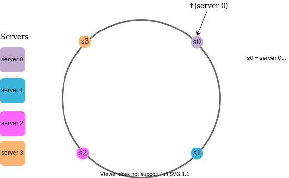

图5

### 哈希键

值得一提的是，这里使用的哈希函数与“重新哈希问题”中的哈希函数不同，并且没有模运算。如图6所示，4个缓存键（key0、key1、key2和key3）被哈希到哈希环上

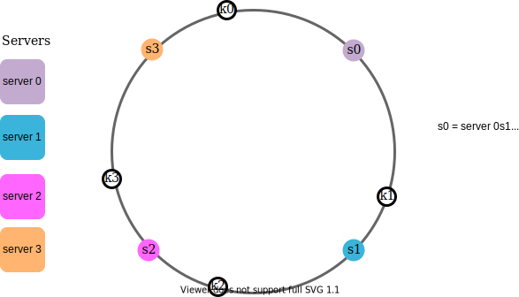

图6

### 服务器查找

为了确定密钥存储在哪个服务器上，我们从环上的密钥位置顺时针旋转，直到找到服务器。图 7 解释了这个过程。按顺时针方向，*key0*存储在*服务器 0*上；*key1*存储在*服务器 1*上；*key2*存储在*服务器 2*上，*key3*存储在*服务器 3*上。

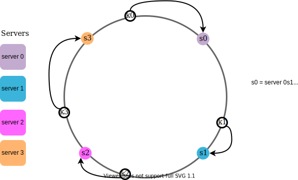

图7

### 添加服务器

使用上述逻辑，添加新服务器只需要重新分配一部分密钥。

图8中，添加新的服务器4后，只需重新分配*key0*即可。*k1、k2*和*k3*保留在同一服务器上。让我们仔细看看其中的逻辑。在添加*服务器 4*之前， *key0*存储在服务器 0*上。现在，*key0将存储在服务器 4上，因为服务器 4是从*key0*在环上的位置顺时针方向遇到的第一个服务器。其他密钥不会基于一致性哈希算法重新分配。

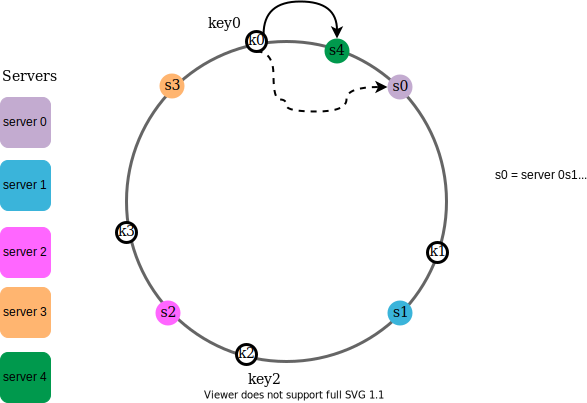

图8

### 删除服务器

当服务器被删除时，只有一小部分密钥需要使用一致的散列重新分配。在图 9 中，当服务器 1被删除时，只有*key1*必须重新映射到服务器 2。其余按键不受影响。

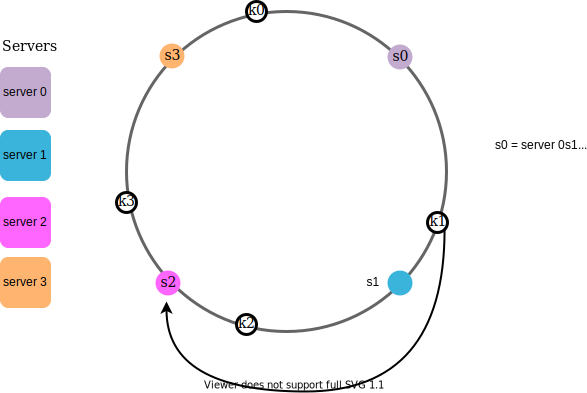

图9

### 基本方法中的两个问题

Karger等人提出了一致性哈希算法。在麻省理工学院[1]。基本步骤是：

- 使用均匀分布的哈希函数将服务器和密钥映射到环上。
- 要找出密钥映射到哪个服务器，请从密钥位置顺时针旋转，直到找到环上的第一台服务器。

这种方法存在两个问题。首先，考虑到可以添加或删除服务器，不可能在环上为所有服务器保持相同大小的分区。分区是相邻服务器之间的哈希空间。环上分配给每个服务器的分区大小可能非常小或相当大。在图 10 中，如果删除s1 ，则s2 的分区（用双向箭头突出显示）将是*s0*和*s3*分区的两倍。

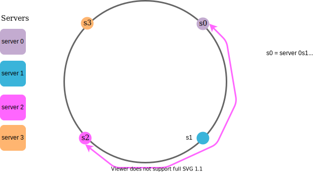

图10

其次，环上可能存在不均匀的密钥分布。例如，如果服务器映射到图 11 中列出的位置，则大多数密钥存储在*服务器 2*上。然而，*服务器1*和*服务器3*没有数据。

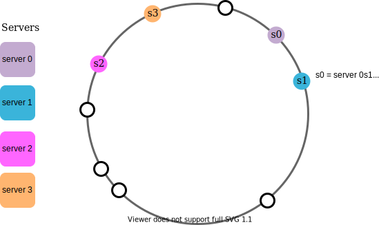

图11

称为虚拟节点或副本的技术用于解决这些问题。

### 虚拟节点

虚拟节点指真实节点，每个服务器由环上的多个虚拟节点表示。在图12中，*服务器0*和*服务器1*都有3个虚拟节点。3是任意选择的；而在现实系统中，虚拟节点的数量要大得多。我们没有使用*s0*，而是使用*s0_0 、 s0_1*和 s0 *2 来表示*环上的 _server 0 。同样，*s1_0、s1_1*、*s1_2*代表环上的服务器1。使用虚拟节点，每个服务器负责多个分区。*带有标签s0*的分区（边缘）由服务器 0 管理。另一方面，带有标签*s1 的*分区由服务器 0 管理。*服务器 1* .

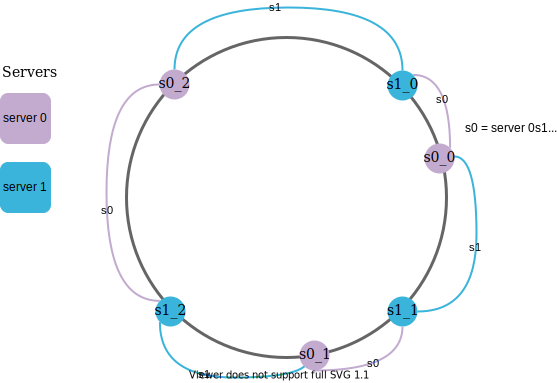

图12

为了找到密钥存储在哪个服务器上，我们从密钥的位置顺时针方向查找环上遇到的第一个虚拟节点。在图 13 中，为了找出*k0*存储在哪个服务器上，我们从*k0*的位置顺时针查找虚拟节点*s1_1*，它指的是*服务器 1*。

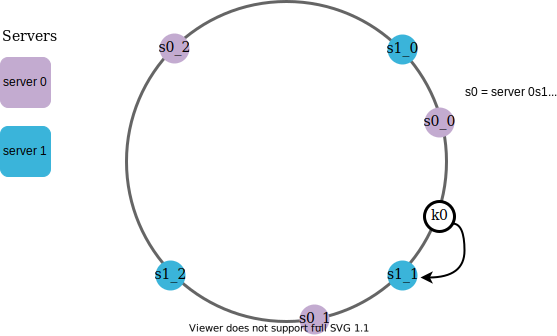

图13

随着虚拟节点数量的增加，密钥的分布变得更加均衡。这是因为虚拟节点越多，标准差就越小，从而导致数据分布均衡。标准差衡量数据的分布方式。在线研究 [2] 进行的实验结果表明，对于一两百个虚拟节点，标准差在平均值的 5%（200 个虚拟节点）到 10%（100 个虚拟节点）之间。当我们增加虚拟节点的数量时，标准差会更小。然而，需要更多的空间来存储有关虚拟节点的数据。这是一种权衡，我们可以调整虚拟节点的数量以满足我们的系统要求。

### 查找受影响的密钥

添加或删除服务器时，需要重新分配一部分数据。如何找到受影响的范围来重新分配密钥？

在图 14 中，*服务器 4*添加到环中。受影响的范围从*s4*（新添加的节点）开始，绕环逆时针移动，直到找到服务器（*s3*）。因此，位于*s3*和*s4*之间的密钥需要重新分配给*s4*。

图14

当服务器（*s1*）被删除时，如图15所示，受影响的范围从*s1*（被删除的节点）开始，绕环逆时针移动，直到找到服务器（*s0*）。因此，位于*s0*和*s1*之间的密钥必须重新分配给*s2*。

图15

## 包起来

在本章中，我们深入讨论了一致性哈希，包括为什么需要它以及它是如何工作的。一致性哈希的好处包括：

- 添加或删除服务器时，会重新分配最小化密钥。
- 由于数据分布更均匀，因此很容易水平扩展。
- 缓解热点关键问题。对特定分片的过多访问可能会导致服务器过载。想象一下，凯蒂·佩里 (Katy Perry)、贾斯汀·比伯 (Justin Bieber) 和 Lady Gaga 的数据最终都位于同一个分片上。一致的哈希有助于通过更均匀地分布数据来缓解问题。

一致性哈希广泛应用于现实世界的系统中，包括一些值得注意的系统：

- Amazon Dynamo 数据库的分区组件 [3]
- Apache Cassandra 中跨集群的数据分区 [4]
- Discord 聊天应用程序 [5]
- Akamai 内容交付网络 [6]
- 磁悬浮网络负载均衡器[7]

恭喜你已经走到这一步了！现在拍拍自己的背吧。好工作！

## 参考资料

[1] 一致性哈希：
[https://en.wikipedia.org/wiki/Constant_hashing](https://en.wikipedia.org/wiki/Consistent_hashing)

[2] 一致性哈希：
[https://tom-e-white.com/2007/11/consistency-hashing.html](https://tom-e-white.com/2007/11/consistent-hashing.html)

[3] Dynamo：亚马逊的高可用键值存储：
https://www.allthingsdistributed.com/files/amazon-dynamo-sosp2007.pdf

[4] Cassandra - 去中心化结构化存储系统：
http://www.cs.cornell.edu/Projects/ladis2009/papers/Lakshman-ladis2009.PDF

[5] Discord 如何将 Elixir 扩展到 5,000,000 个并发用户：
https://blog.discord.com/scaling-elixir-f9b8e1e7c29b

[6] CS168：现代算法工具箱讲座#1：简介和一致性哈希：
http://theory.stanford.edu/~tim/s16/l/l1.pdf

[7] Maglev：快速可靠的软件网络负载均衡器：
https://static.googleusercontent.com/media/research.google.com/en//pubs/archive/44824.pdf