键值存储也称为键值数据库，是一种非关系数据库。每个唯一标识符都存储为键及其关联值。这种数据配对称为“键值”对。

在键值对中，键必须是唯一的，并且可以通过键访问与键关联的值。键可以是纯文本或散列值。出于性能原因，短键效果更好。钥匙是什么样子的？这里有一些例子：

- 纯文本键：“last_logged_in_at”
- 散列密钥：253DDEC4

键值对中的值可以是字符串、列表、对象等。该值通常在键值存储中被视为不透明对象，例如 Amazon dynamo [1]、Memcached [2]、Redis [3] ， ETC。

以下是键值存储中的数据片段：

| key  | value |
| :--: | :---: |
| 145  | john  |
| 147  |  bob  |
| 160  | julia |

表格1

在本章中，你需要设计一个支持以下操作的键值存储：

- put(key, value) // 插入与“key”关联的“value”

- get(key) // 获取与“key”关联的“value”

## 了解问题并确定设计范围

没有完美的设计。每种设计都在读、写和内存使用的权衡方面实现了特定的平衡。必须在一致性和可用性之间进行另一个权衡。在本章中，我们设计了一个包含以下特征的键值存储：

- 键值对的大小很小：不到 10 KB。
- 存储大数据的能力。
- 高可用性：即使出现故障，系统也能快速响应。
- 高可扩展性：系统可以扩展以支持大数据集。
- 自动缩放：服务器的添加/删除应根据流量自动进行。
- 可调一致性。
- 低延迟。

## 单服务器键值存储

开发驻留在单个服务器中的键值存储很容易。一种直观的方法是将键值对存储在哈希表中，从而将所有内容保存在内存中。尽管内存访问速度很快，但由于空间限制，将所有内容都放入内存中可能是不可能的。可以进行两项优化以在单个服务器中容纳更多数据：

- 数据压缩
- 仅将常用数据存储在内存中，其余数据存储在磁盘上

即使进行了这些优化，单个服务器也可以很快达到其容量。需要分布式键值存储来支持大数据。

## 分布式键值存储

分布式键值存储也称为分布式哈希表，它将键值对分布在许多服务器上。在设计分布式系统时，理解CAP（**一致性**、**可用性**、**分区**容错性）定理非常重要。

### CAP定理

CAP 定理指出，分布式系统不可能同时提供一致性、可用性和分区容错这三个保证中的两个以上。让我们建立一些定义。

**一致性**：一致性是指所有客户端无论连接到哪个节点，都同时看到相同的数据。

**可用性：**可用性意味着即使某些节点发生故障，任何请求数据的客户端都会得到响应。

**分区容错性：**分区表示两个节点之间的通信中断。分区容错意味着尽管存在网络分区，系统仍能继续运行。

CAP 定理指出，必须牺牲这三个属性之一才能支持 3 个属性中的 2 个，如图 1 所示。

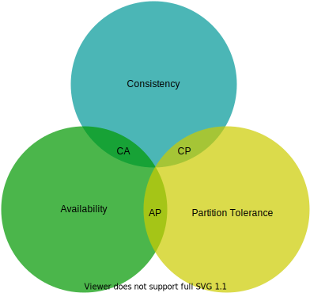

图1

如今，键值存储根据它们支持的两个 CAP 特征进行分类：

**CP（一致性和分区容错）系统**：CP 键值存储支持一致性和分区容错，同时牺牲可用性。

**AP（可用性和分区容错）系统**：AP 键值存储支持可用性和分区容错，同时牺牲一致性。

**CA（一致性和可用性）系统**：CA 键值存储支持一致性和可用性，同时牺牲分区容错性。由于网络故障不可避免，分布式系统必须容忍网络分区。因此，CA系统不可能存在于现实世界的应用中。

你在上面读到的内容主要是定义部分。为了更容易理解，我们来看一些具体的例子。在分布式系统中，数据通常会被复制多次。假设数据被复制到三个副本节点*n1*、*n2*和*n3*上，如图 2 所示。

**理想情况**

在理想的世界中，网络分区永远不会发生。写入*n1* 的数据会自动复制到*n2*和*n3*。一致性和可用性都达到了。

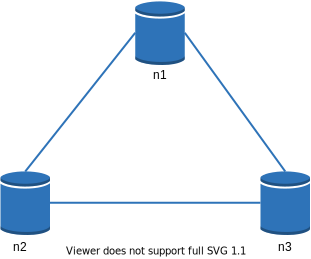

图2

**现实世界的分布式系统**

在分布式系统中，分区是无法避免的，而当分区发生时，我们必须在一致性和可用性之间做出选择。在图 3 中，*n3*出现故障，无法与*n1*和*n2*通信。如果客户端将数据写入*n1*或*n2*，则数据无法传播到*n3*。如果数据写入*n3*但尚未传播到*n1*和*n2*，则*n1*和*n2*将具有陈旧数据。

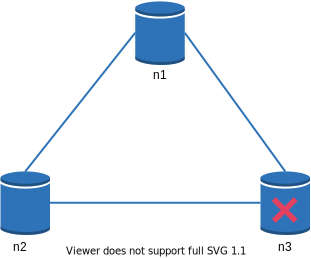

图3

如果我们选择一致性而非可用性（CP系统），我们必须阻止对*n1*和*n2*的所有写操作，以避免这三个服务器之间数据不一致，从而导致系统不可用。银行系统通常具有极高的一致性要求。例如，银行系统显示最新的余额信息至关重要。如果由于网络分区而出现不一致，银行系统会在不一致解决之前返回错误。

但是，如果我们选择可用性而不是一致性（AP 系统），系统将继续接受读取，即使它可能返回陈旧的数据。对于写入，*n1*和*n2*将继续接受写入，并且当网络分区解决时数据将同步到*n3 。*

选择适合你的用例的正确 CAP 保证是构建分布式键值存储的重要一步。你可以与面试官讨论这个问题并相应地设计系统。

### 系统组成

在本节中，我们将讨论用于构建键值存储的以下核心组件和技术：

- 数据分区
- 数据复制
- 一致性
- 不一致解决方案
- 处理故障
- 系统架构图
- 写入路径
- 读取路径

以下内容主要基于三种流行的键值存储系统：Dynamo [4]、Cassandra [5] 和 BigTable [6]。

### 数据分区

对于大型应用程序，将完整的数据集容纳在单个服务器中是不可行的。实现这一点的最简单方法是将数据分割成更小的分区并将它们存储在多个服务器中。对数据进行分区时存在两个挑战：

- 将数据均匀分布在多个服务器上。
- 添加或删除节点时最大限度地减少数据移动。

上一章讨论的一致性哈希是解决这些问题的一项很好的技术。让我们重新审视一下一致性哈希在高层次上是如何工作的。

- 首先，服务器被放置在哈希环上。在图 4 中，哈希环上放置了八台服务器，分别表示为*s0、s1、...、s7 。*
- 接下来，密钥被散列到同一个环上，并存储在顺时针方向移动时遇到的第一个服务器上。例如，使用此逻辑将*key0*存储在*s1*中。

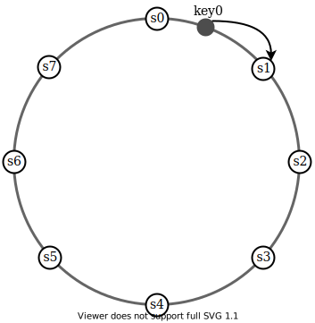

图4

使用一致性哈希对数据进行分区有以下优点：

**自动伸缩：**可以根据负载自动添加和删除服务器。

**异构性：**服务器的虚拟节点数量与服务器容量成正比。例如，容量较高的服务器分配有更多的虚拟节点。

### 数据复制

为了实现高可用性和可靠性，必须在*N*个服务器上异步复制数据，其中*N*是可配置参数。这*N台*服务器的选择逻辑如下：将一个key映射到哈希环上的某个位置后，从该位置开始顺时针行走，选择环上的前N台服务器来存储数据副本。在图 5 ( *N = 3* ) 中，*key0*在*s1、s2*和*s3*处复制。

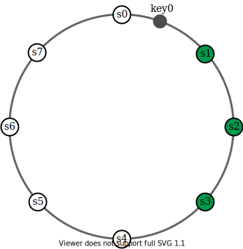

图5

对于虚拟节点，环上的前N个节点可能由少于*N 个*物理服务器拥有。为了避免这个问题，我们在执行顺时针行走逻辑时仅选择唯一的服务器。

同一数据中心内的节点经常会因为断电、网络问题、自然灾害等原因同时发生故障。为了获得更好的可靠性，副本被放置在不同的数据中心，数据中心通过高速网络连接。

### 一致性

由于数据在多个节点上复制，因此必须跨副本同步。仲裁共识可以保证读写操作的一致性。让我们首先建立一些定义。

**N** = 副本数

**W** = 大小为W的写入仲裁。为了使写入操作被视为成功，写入操作必须得到*W 个*副本的确认。

**R** = 大小为R的读取法定人数。为了使读取操作被视为成功，读取操作必须等待至少*R*个副本的响应。

考虑图 6 中所示的以下示例，其中*N = 3*。

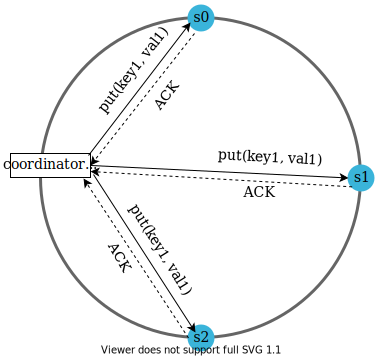

图 6（ACK = 确认）

*W = 1*并不意味着数据写入一台服务器上。例如，在图 6 中的配置中，数据在*s0*、*s1*和*s2*处复制。*W = 1*表示协调器必须至少收到一个确认才能认为写入操作成功。例如，如果我们收到*s1*的确认，则不再需要等待*s0*和*s2*的确认。协调器充当客户端和节点之间的代理。

*W、R*和*N*的配置是延迟和一致性之间的典型权衡。如果*W = 1*或*R = 1*，则操作会快速返回，因为协调器只需要等待任何副本的响应。如果*W*或*R>1*，系统具有更好的一致性；但是，查询会变慢，因为协调器必须等待最慢副本的响应。

如果*W + R > N*，则可以保证强一致性，因为必须至少有一个重叠节点拥有最新数据才能保证一致性。

如何配置*N、W*和*R*来适应我们的用例？以下是一些可能的设置：

如果*R = 1*且*W = N*，则系统针对快速读取进行优化。

如果*W = 1 且 R = N*，则系统针对快速写入进行优化。

如果*W + R > N*，则保证强一致性（通常*N = 3，W = R = 2*）。

如果*W + R <= N*，则无法保证强一致性。

*根据要求，我们可以调整W、R、N*的值以达到所需的一致性水平。

#### 一致性模型

一致性模型是设计键值存储时要考虑的另一个重要因素。一致性模型定义了数据一致性的程度，并且存在多种可能的一致性模型：

- 强一致性：任何读操作都返回与最新更新的写入数据项的结果相对应的值。客户永远不会看到过时的数据。
- 弱一致性：后续的读操作可能看不到最新的值。
- 最终一致性：这是弱一致性的一种具体形式。如果有足够的时间，所有更新都会传播，并且所有副本都是一致的。

强一致性通常是通过强制副本不接受新的读/写，直到每个副本都同意当前写入来实现的。这种方法对于高可用系统来说并不理想，因为它可能会阻止新的操作。Dynamo 和 Cassandra 采用最终一致性，这是我们为键值存储推荐的一致性模型。从并发写入中，最终一致性允许不一致的值进入系统并强制客户端读取值以进行协调。下一节将解释协调如何与版本控制一起工作。

### 解决不一致问题：版本控制

复制提供高可用性，但会导致副本之间不一致。版本控制和向量锁用于解决不一致问题。版本控制意味着将每个数据修改视为数据的新的不可变版本。在讨论版本控制之前，我们先用一个例子来解释一下不一致是如何发生的：

如图 7 所示，副本节点*n1*和*n2*具有相同的值。我们将此值称为原始*值。服务器 1*和*服务器 2通过*get(“name”)*操作获得相同的值。

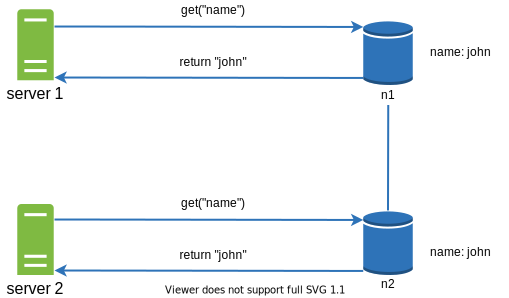

图7

接下来，服务器 1将名称更改为“johnSanFrancisco”，服务器 2将名称更改为“johnNewYork”，如图 8 所示。这两个更改是同时执行的。现在，我们有冲突的值，称为版本*v1*和*v2*。

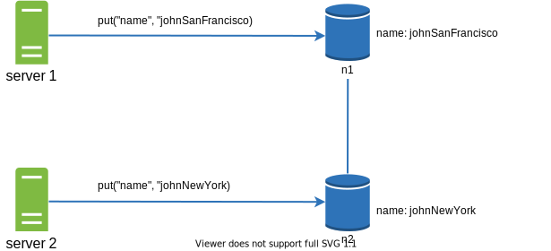

图8

在此示例中，可以忽略原始值，因为修改是基于它的。然而，没有明确的方法来解决最后两个版本的冲突。为了解决这个问题，我们需要一个能够检测冲突并协调冲突的版本控制系统。矢量时钟是解决这个问题的常用技术。让我们看看矢量时钟是如何工作的。

矢量时钟是与数据项关联的*[服务器，版本]对。*它可用于检查一个版本是否先于、成功或与其他版本冲突。

假设矢量时钟由$D([S1, v1], [S2, v2], …, [Sn, vn])$表示，其中*D*是数据项，*v1*是版本计数器，*s1*是服务器编号，如果数据项*D*被写入服务器*Si*，系统必须执行以下任务之一。

- 如果*[Si, vi]*存在，则增加*vi*。
- 否则，创建一个新条目*[Si, 1]*。

通过一个具体的例子来解释上述抽象逻辑，如图9所示。

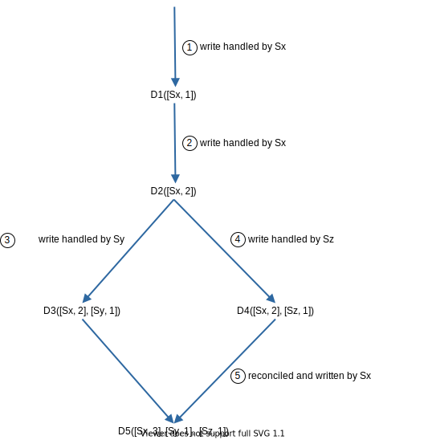

图9

1. 客户端将数据项*D1*写入系统，写入由服务器*Sx*处理，服务器 Sx 现在具有矢量时钟*D1[(Sx, 1)]*。

2. 另一个客户端读取最新的*D1*，将其更新为*D2*，然后写回。*D2*从*D1*下降，因此它会覆盖*D1*。假设写入由同一服务器*Sx*处理，该服务器现在具有矢量时钟*D2([Sx, 2])*。

3. 另一个客户端读取最新的*D2*，将其更新为*D3*，然后写回。假设写入由服务器*Sy*处理，该服务器现在具有矢量时钟*D3([Sx, 2], [Sy, 1]))*。

4. 另一个客户端读取最新的*D2*，将其更新为*D4*，然后写回。假设写入由服务器*Sz*处理，该服务器现在有*D4([Sx, 2], [Sz, 1]))*。

5. 当另一个客户端读取*D3*和*D4*时，发现冲突，这是由于*Sy*和*Sz*都修改了数据项*D2*造成的。客户端解决冲突并将更新的数据发送到服务器。假设写入由*Sx*处理，它现在有*D5([Sx, 3], [Sy, 1], [Sz, 1])*。我们将很快解释如何检测冲突。

*使用矢量时钟，如果Y*的矢量时钟中每个参与者的版本计数器大于或等于版本 X 中的*版本*计数器，则很容易判断版本*X是版本*Y*的祖先（即没有冲突）。例如，矢量时钟*D([s0, 1], [s1, 1])]是*D([s0, 1], [s1, 2])*的祖先。因此，没有记录任何冲突。

类似地，如果*Y的矢量时钟中的*任何*参与者的计数器小于 X 中对应的计数器，则*可以*判断版本*X*是 Y 的同级版本（即存在冲突）。例如，以下两个矢量时钟表示存在冲突：*D([s0, 1], [s1, 2])*和*D([s0, 2], [s1, 1])。*

尽管矢量时钟可以解决冲突，但也有两个显着的缺点。首先，矢量时钟增加了客户端的复杂性，因为它需要实现冲突解决逻辑。

其次，矢量时钟中的*[服务器：版本]对可能会快速增长。*为了解决这个问题，我们设置了长度阈值，如果超过限制，则删除最旧的对。这可能会导致协调效率低下，因为无法准确确定后代关系。然而，根据Dynamo论文[4]，亚马逊在生产中尚未遇到这个问题；因此，对于大多数公司来说，这可能是一个可以接受的解决方案。

### 处理故障

与任何大规模的大型系统一样，故障不仅是不可避免的，而且是常见的。处理故障场景非常重要。在本节中，我们首先介绍检测故障的技术。然后，我们回顾常见的故障解决策略。

#### 故障检测

在分布式系统中，仅仅因为另一台服务器这样说就相信一台服务器已关闭是不够的。通常，需要至少两个独立的信息源来标记服务器。

如图 10 所示，全对全多播是一种简单的解决方案。然而，当系统中有很多服务器时，这种方法效率很低。

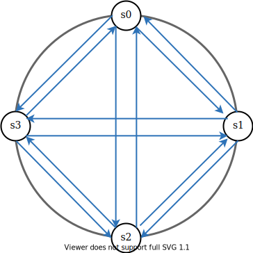

图10

更好的解决方案是使用去中心化的故障检测方法，例如 Gossip 协议。Gossip 协议的工作原理如下：

- 每个节点维护一个节点成员列表，其中包含成员ID和心跳计数器。
- 每个节点定期增加其心跳计数器。
- 每个节点定期向一组随机节点发送心跳，这些节点又传播到另一组节点。
- 一旦节点收到心跳，成员列表就会更新为最新信息。

•如果心跳在超过预定义的时间内没有增加，则该成员被视为离线。

图11

如图11所示：

- 节点*s0*维护一个如左侧所示的节点成员资格列表。
- 节点*s0*注意到节点 s2（成员 ID = 2）的心跳计数器很长时间没有增加。
- 节点*s0*向一组随机节点发送包含*s2信息的心跳。*一旦其他节点确认*s2*的心跳计数器长时间没有更新，节点*s2*就会被标记为 down，并将此信息传播到其他节点。

#### 处理临时故障

通过八卦协议检测到故障后，系统需要部署某些机制来确保可用性。在严格的仲裁方法中，读取和写入操作可能会被阻止，如仲裁共识部分所示。

一种称为“草率仲裁”[4] 的技术用于提高可用性。系统不会强制执行法定人数要求，而是选择哈希环上的前*W*个健康服务器进行写入，并选择前*R* 个健康服务器进行读取。离线服务器将被忽略。

如果一台服务器由于网络或服务器故障而不可用，则另一台服务器将临时处理请求。当宕机的服务器上线时，更改将被推回以实现数据一致性。这个过程称为提示切换。由于图 12 中*s2*不可用，因此读取和写入将暂时由*s3*处理。当*s2*重新上线时，*s3*会将数据交还给*s2*。

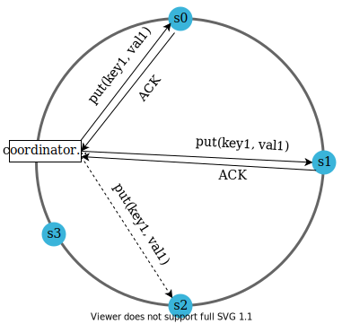

图12

#### 处理永久性故障

提示切换用于处理临时故障。如果副本永久不可用怎么办？为了处理这种情况，我们实现了反熵协议来保持副本同步。反熵涉及比较副本上的每条数据并将每个副本更新到最新版本。Merkle 树用于不一致检测并最大限度地减少传输的数据量。

引用自维基百科 [7]：“哈希树或 Merkle 树是一棵树，其中每个非叶节点都用其子节点的标签或值（如果是叶）的哈希值进行标记。哈希树允许高效、安全地验证大型数据结构的内容”。

假设键空间为1到12，以下步骤展示了如何构建Merkle树。突出显示的框表示不一致。

步骤 1：将密钥空间划分为桶（在我们的示例中为 4 个），如图 13 所示。桶用作根级节点，以维持树的有限深度。

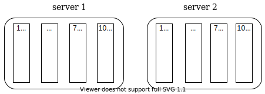

图13

步骤 2：创建存储桶后，使用统一哈希方法对存储桶中的每个键进行哈希处理（图 14）。

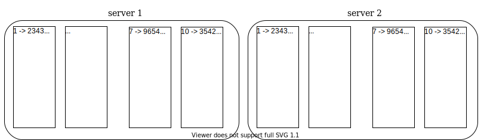

图14

步骤 3：为每个存储桶创建一个哈希节点（图 15）。

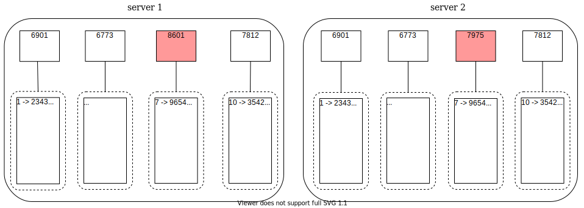

图15

步骤 4：通过计算子节点的哈希值向上构建树直至根（图 16）。

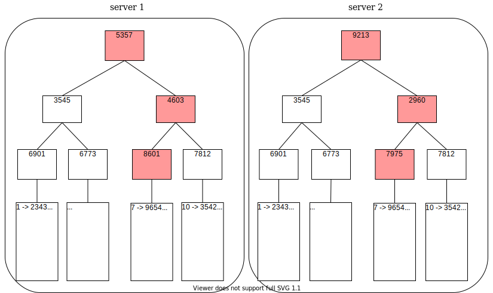

图16

要比较两棵 Merkle 树，首先要比较根哈希值。如果根哈希匹配，则两个服务器具有相同的数据。如果根哈希值不一致，则比较左子哈希值，然后比较右子哈希值。你可以遍历树来查找哪些存储桶未同步，并仅同步这些存储桶。

使用 Merkle 树，需要同步的数据量与两个副本之间的差异成正比，而不是它们包含的数据量。在现实系统中，桶的大小相当大。例如，可能的配置是每 10 亿个键有 100 万个桶，因此每个桶仅包含 1000 个键。

#### 处理数据中心中断

数据中心可能因停电、网络中断、自然灾害等原因而发生中断。为了构建能够处理数据中心中断的系统，跨多个数据中心复制数据非常重要。即使某个数据中心完全离线，用户仍然可以通过其他数据中心访问数据。

### 系统架构图

现在我们已经讨论了设计键值存储时的不同技术考虑因素，我们可以将注意力转移到架构图上，如图 17 所示。

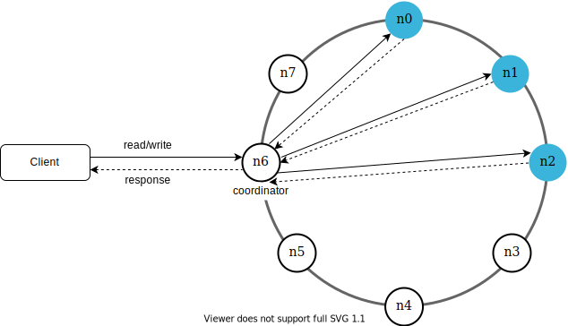

图17

该架构的主要特点如下：

- 客户端通过简单的 API 与键值存储进行通信：`get(key)` 和 `put(key, value)`。
- 协调器是充当客户端和键值存储之间的代理的节点。
- 使用一致性哈希将节点分布在环上。
- 该系统是完全去中心化的，因此可以自动添加和移动节点。
- 数据在多个节点上复制。
- 不存在单点故障，因为每个节点都有相同的职责。

由于设计是分散式的，每个节点执行许多任务，如图 18 所示。

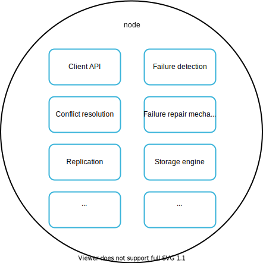

图18

### 写入路径

图 19 解释了将写入请求定向到特定节点后会发生什么。请注意，建议的写/读路径设计主要基于 Cassandra [8] 的架构。

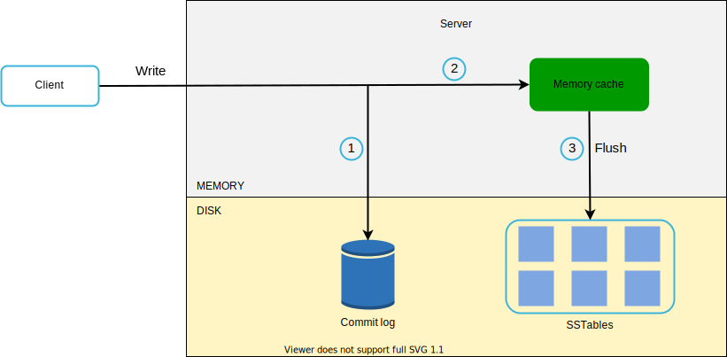

图19

1. 写请求保存在提交日志文件中。

2. 数据保存在内存缓存中。

3. 当内存缓存已满或达到预定义阈值时，数据将刷新到磁盘上的 SSTable [9]。注意：排序字符串表 (SSTable) 是 <key, value> 对的排序列表。有兴趣了解更多有关 SStable 的读者，请参阅参考资料 [9]。

### 读取路径

当读请求被定向到特定节点后，它首先检查数据是否在内存缓存中。如果是，数据将返回给客户端，如图 20 所示。

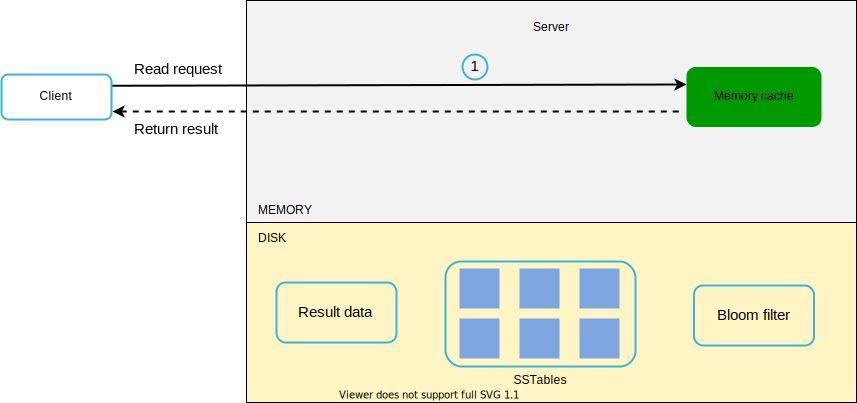

图20

如果数据不在内存中，则会从磁盘中检索。我们需要一种有效的方法来找出哪个 SSTable 包含密钥。布隆过滤器[10]通常用于解决这个问题。

当数据不在内存中时，读取路径如图 21 所示。

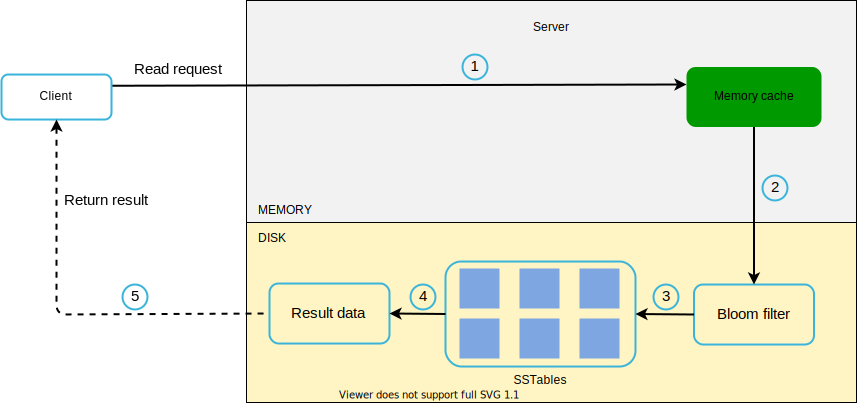

图21

1. 系统首先检查内存中是否有数据。如果没有，请转至步骤 2。

2. 如果数据不在内存中，系统会检查布隆过滤器。

3. 布隆过滤器用于找出哪些 SSTable 可能包含该密钥。

4. SSTables 返回数据集的结果。

5. 数据集的结果返回给客户端。

## 概括

本章涵盖了许多概念和技术。为了加深你的记忆，下表总结了用于分布式键值存储的功能和相应技术。

|    目标/问题     |                技术                |
| :--------------: | :--------------------------------: |
| 存储大数据的能力 | 使用一致的散列在服务器之间分散负载 |
|   高可用性读取   |       数据复制多数据中心设置       |
|    高可用写入    | 使用矢量时钟进行版本控制和冲突解决 |
|    数据集分区    |             一致性哈希             |
|   增量可扩展性   |             一致性哈希             |
|      异质性      |             一致性哈希             |
|    一致性可调    |            法定人数共识            |
|   处理临时故障   |     草率的法定人数和暗示的交接     |
|  处理永久性故障  |              默克尔树              |
| 处理数据中心中断 |           跨数据中心复制           |

表2

## 参考资料

[1]亚马逊DynamoDB: [https://aws.amazon.com/dynamodb/](https://aws.amazon.com/dynamodb/)

[2]memcached:  [https://memcached.org/](https://memcached.org/)

[3]Redis:  [https://redis.io/](https://redis.io/)

[4] Dynamo: 亚马逊的高可用键值存储：
https://www.allthingsdistributed.com/files/amazon-dynamo-sosp2007.pdf

[5]cassandra: [https://cassandra.apache.org/](https://cassandra.apache.org/)

[6] Bigtable：结构化数据的分布式存储系统：
https://static.googleusercontent.com/media/research.google.com/en//archive/bigtable-osdi06.pdf

[7]默克尔树：https://en.wikipedia.org/wiki/Merkle_tree

[8] Cassandra架构：https://cassandra.apache.org/doc/latest/architecture/

[9] SStable：[https://www.igvita.com/2012/02/06/sstable-and-log-structed-storage-leveldb/](https://www.igvita.com/2012/02/06/sstable-and-log-structured-storage-leveldb/)

[10] 布隆过滤器: https://en.wikipedia.org/wiki/Bloom_filter