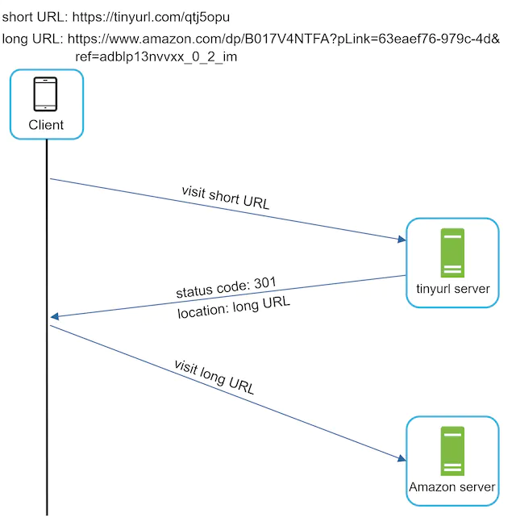
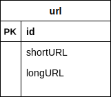
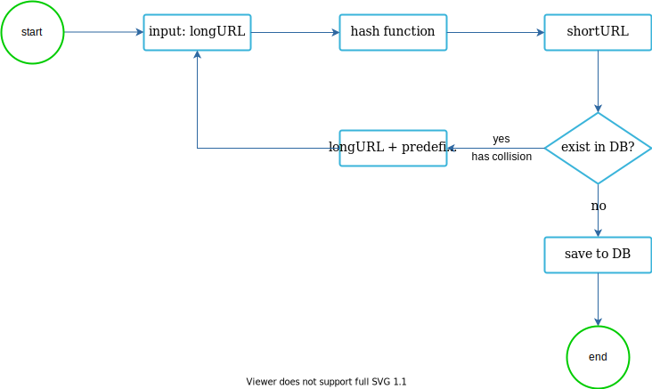
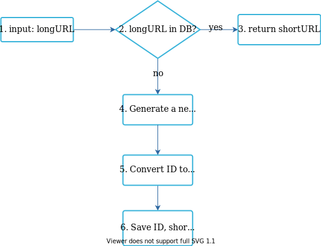
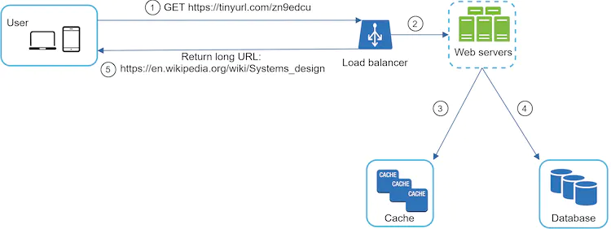

在本章中，我们将解决一个有趣且经典的系统设计面试问题：设计一个像tinyurl这样的URL缩短服务。

## 第 1 步 - 了解问题并确定设计范围

系统设计面试问题有意保留开放式。要设计一个精心设计的系统，提出澄清问题至关重要。

**候选人**：你能举例说明 URL 缩短器的工作原理吗？
**面试官**：假设URL `https://www.systeminterview.com/q=chatsystem&c=loggedin&v=v3&l=long`是原始URL。你的服务创建一个长度较短的别名：`https://tinyurl.com/y7keocwj`。如果单击别名，它会将你重定向到原始 URL。

**应聘者**：交通量是多少？
**面试官**：每天生成1亿个URL。

**应聘者**：缩短的网址有多长？
**面试官**：越短越好。

**候选人**：缩短的 URL 中允许使用哪些字符？
**面试官**：缩短的URL可以是数字（0-9）和字符（az、AZ）的组合。

**考生**：缩短的网址可以删除或更新吗？
**面试官**：为了简单起见，我们假设缩短的 URL 无法删除或更新。

以下是基本用例：

1.URL缩短：给定一个长URL =>返回一个更短的URL

2.URL重定向：给定一个较短的URL => 重定向到原始URL

3.高可用性、可扩展性、容错性考虑

### 信封背面的估计

- 写入操作：每天生成1亿个URL。
- 每秒写操作：1亿次/24次/3600次=1160次
- 读操作：假设读操作与写操作的比例为10:1，每秒读操作数：1160 * 10 = 11,600
- 假设URL缩短服务将运行10年，这意味着我们必须支持1亿*365*10=3650亿条记录。
- 假设平均 URL 长度为 100。
- 10年以上存储需求：3650亿*100字节=36.5TB

对你来说，与面试官一起完成假设和计算非常重要，这样你们就能达成共识。

## 第 2 步 - 提出高级设计并获得认可

在本节中，我们将讨论 API 端点、URL 重定向和 URL 缩短流程。

### API端点

API端点促进客户端和服务器之间的通信。我们将设计 REST 风格的 API。如果你对restful API不熟悉，可以查阅外部资料，比如参考资料[1]中的资料。URL 缩短器主要需要两个 API 端点。

1.URL缩短。要创建新的短 URL，客户端会发送一个 POST 请求，其中包含一个参数：原始长 URL。API 如下所示：

*POST api/v1/data/shorten*

- 请求参数：{longUrl: longURLString}

- 返回短网址

  2.URL重定向。要将短 URL 重定向到相应的长 URL，客户端会发送 GET 请求。API 如下所示：

*获取 api/v1/shortUrl*

- 返回 HTTP 重定向的 longURL

### URL重定向

图 1 显示了当你在浏览器中输入 `tinyurl` 时会发生什么。一旦服务器收到 `tinyurl` 请求，它就会通过301重定向将短URL更改为长URL。

图1

客户端和服务器之间的详细通信如图2所示。

图2

这里值得讨论的一件事是 301 重定向与 302 重定向。

**301重定向**。301重定向表明请求的URL被“永久”移动到长URL。由于它是永久重定向的，因此浏览器会缓存响应，并且对同一 URL 的后续请求将不会发送到 URL 缩短服务。相反，请求会直接重定向到长 URL 服务器。

**302 重定向**。302重定向意味着URL“暂时”移动到长URL，这意味着对同一URL的后续请求将首先发送到URL缩短服务。然后，它们被重定向到长 URL 服务器。

每种重定向方法都有其优点和缺点。如果优先考虑的是减少服务器负载，则使用 301 重定向是有意义的，因为只有同一 URL 的第一个请求才会发送到 URL 缩短服务器。但是，如果分析很重要，302 重定向是更好的选择，因为它可以更轻松地跟踪点击率和点击来源。

实现URL重定向最直观的方法就是使用哈希表。假设哈希表存储*<shortURL, longURL>*对，URL重定向可以通过以下方式实现：

- 获取长URL：longURL = hashTable.get(shortURL)
- 获得 longURL 后，执行 URL 重定向。

### 网址缩短

让我们假设短 URL 如下所示：`www.tinyurl.com/{hashValue}`。为了支持 URL 缩短用例，我们必须找到一个哈希函数*fx*，将长 URL 映射到 `hashValue`，如图 3 所示。

图3

哈希函数必须满足以下要求：

- 每个*longURL*必须散列为一个*hashValue*。
- 每个*hashValue*都可以映射回*longURL*。

哈希函数的详细设计将在深入讨论中讨论。

## 第 3 步 - 设计深入研究

到目前为止，我们已经讨论了 URL 缩短和 URL 重定向的高层设计。在本节中，我们将深入探讨以下内容：数据模型、哈希函数、URL 缩短和 URL 重定向。

### 数据模型

在高层设计中，所有内容都存储在哈希表中。这是一个很好的起点；然而，这种方法对于现实系统来说并不可行，因为内存资源有限且昂贵。更好的选择是将*<shortURL, longURL>*映射存储在关系数据库中。图 4 显示了一个简单的数据库表设计。该表的简化版本包含 3 列：*id*、*ShortURL 、 longURL*。

图4

### 哈希函数

哈希函数用于将长 URL 哈希为短 URL，也称为*hashValue*。

#### 哈希值长度

hashValue由 [0-9, az, AZ] 中的字符组成，包含 10 + 26 + 26 = 62 个可能的字符。要计算hashValue的长度，请找到最小的*n*，使得$62^n ≥ 3650 亿$。根据粗略估计，系统必须支持多达 3650 亿个 URL。表1显示了hashValue的长度和它可以支持的相应的最大URL数量。

|   n   |             最大 URL 数量              |
| :---: | :------------------------------------: |
|   1   |              $62^1$ = 62               |
|   2   |             $62^2$ = 3,844             |
|   3   |            $62^3$ = 238,328            |
|   4   |          $62^4$ = 14,776,336           |
|   5   |          $62^5$ = 916,132,832          |
|   6   |        $62^6$ = 56,800,235,584         |
| **7** | $62^7 = 3,521,614,606,208 = ~3.5 万亿$ |
|   8   |      $62^8 = 218,340,105,584,896$      |

表格1

当n=7时，$62^n=~3.5万亿$，3.5万亿足以容纳3650亿个URL，因此*hashValue*的长度为7。

我们将探索两种类型的 URL 缩短器哈希函数。第一个是“哈希+冲突解决”，第二个是“base 62转换”。让我们一一看看。

#### 哈希+冲突解决

为了缩短长 URL，我们应该实现一个哈希函数，将长 URL 哈希为 7 个字符的字符串。一个简单的解决方案是使用众所周知的哈希函数，例如 CRC32、MD5 或 SHA-1。下表比较了对该 URL 应用不同哈希函数后的哈希结果：
`https://en.wikipedia.org/wiki/Systems_design`

| **哈希函数** | **哈希值（十六进制）**                   |
| ------------ | ---------------------------------------- |
| CRC32        | 5cb54054                                 |
| MD5          | 5a62509a84df9ee03fe1230b9df8b84e         |
| SHA-1        | 0eeae7916c06853901d9ccbefbfcaf4de57ed85b |

表2

如表 2 所示，即使是最短的哈希值（来自 CRC32）也太长（超过 7 个字符）。我们怎样才能让它变得更短呢？

第一种方法是收集哈希值的前 7 个字符；然而，这种方法可能会导致哈希冲突。为了解决哈希冲突，我们可以递归地附加一个新的预定义字符串，直到不再发现冲突。图 5 解释了此过程。

图5

该方法可以消除碰撞；然而，查询数据库来检查每个请求是否存在短 URL 的成本很高。一种称为布隆过滤器 [2] 的技术可以提高性能。布隆过滤器是一种节省空间的概率技术，用于测试元素是否是集合的成员。更多详情请参阅参考资料[2]。

#### Base 62 转换

基本转换是 URL 缩短器常用的另一种方法。基数转换有助于在不同的数字表示系统之间转换相同的数字。*使用 Base 62 转换，因为hashValue*有 62 个可能的字符。让我们用一个例子来解释一下转换是如何进行的：将 11157 10转换为以 62 为基数的表示形式（11157 10表示以 10 为基数的系统中的 11157）。

- 从它的名字来看，base 62 是一种使用 62 个字符进行编码的方式。映射为：*0-0、...、9-9、10-a、11-b、...、35-z、36-A、...、61-Z，其中“* a”代表10，“Z”代表61等。
- $11157_{10} = 2 * 62^2 + 55 * 62^1 + 59 * 62^0 = [2, 55, 59] -> [2, T, X]$ 以 62 为基数表示。对话流程如图6所示。

图6

- 因此，短URL为`https://tinyurl.com/2TX`

#### 两种方法的比较

表 3 显示了两种方法的差异。

| **哈希+冲突解决**                                 | **Base 62 转换**                                             |
| :------------------------------------------------ | :----------------------------------------------------------- |
| 修复了短 URL 长度。                               | 短网址长度不固定。它随 ID 一起上升。                         |
| 不需要唯一的 ID 生成器。                          | 此选项取决于唯一 ID 生成器。                                 |
| 碰撞是可能的，需要解决。                          | 碰撞是不可能的，因为 ID 是唯一的。                           |
| 不可能找出下一个可用的短 URL，因为它不依赖于 ID。 | 如果新条目的 ID 加 1，则很容易找出下一个可用的短 URL。这可能是一个安全问题。 |

表3

### 深入探讨 URL 缩短

作为系统的核心部分之一，我们希望 URL 缩短流程在逻辑上简单且实用。我们的设计中使用了 Base 62 转换。我们构建下图（图 7）来演示流程。

图7

1. longURL 是输入。

2. 系统检查longURL是否在数据库中。

3. 如果是，则说明之前已将长URL 转换为短URL。在这种情况下，从数据库中获取短URL并将其返回给客户端。

4. 如果不是，则 longURL 是新的。新的唯一ID（主键）由唯一ID生成器生成。

5. 通过 Base 62 转换将 ID 转换为短 URL。

6. 使用 ID、shortURL 和 longURL 创建一个新的数据库行。

为了使流程更容易理解，让我们看一个具体的例子。

- 假设输入的longURL为：`https://en.wikipedia.org/wiki/Systems_design`
- 唯一 ID 生成器返回 ID：2009215674938。
- 使用 Base 62 转换将 ID 转换为短 URL。ID (2009215674938) 转换为“zn9edcu”。
- 将 ID、shortURL 和 longURL 保存到数据库中，如表 4 所示。

| ID            | 短网址  | 长网址                                         |
| :------------ | :------ | :--------------------------------------------- |
| 2009215674938 | zn9edcu | `https://en.wikipedia.org/wiki/Systems_design` |

表4

分布式唯一ID生成器值得一提。它的主要功能是生成全局唯一的 ID，用于创建短 URL。在高度分布式的环境中，实现唯一的 ID 生成器具有挑战性。幸运的是，我们已经在“在分布式系统中设计唯一 ID 生成器”一章中讨论了一些解决方案。你可以回顾一下以刷新你的记忆。

### URL 重定向深入研究

图8显示了URL重定向的详细设计。由于读取多于写入，*<shortURL, longURL>*映射存储在缓存中以提高性能。

图8

URL重定向的流程总结如下：

1. 用户点击短URL链接：`https://tinyurl.com/zn9edcu`

2. 负载均衡器将请求转发到Web 服务器。

3. 如果缓存中已存在短URL，则直接返回长URL。

4. 如果短URL 不在缓存中，则从数据库中获取长URL。如果数据库中没有，则用户可能输入了无效的短 URL。

5. 将长URL返回给用户。

## 第 4 步 - 总结

在本章中，我们讨论了 API 设计、数据模型、哈希函数、URL 缩短和 URL 重定向。

如果采访结束时还有额外的时间，这里有一些额外的谈话要点。

- 速率限制器：我们可能面临的一个潜在安全问题是恶意用户发送大量 URL 缩短请求。速率限制器有助于根据 IP 地址或其他过滤规则过滤请求。如果你想刷新有关速率限制的记忆，请参阅“设计速率限制器”一章。
- Web 服务器扩展：由于 Web 层是无状态的，因此可以通过添加或删除 Web 服务器轻松扩展 Web 层。
- 数据库扩展：数据库复制和分片是常见技术。
- 分析：数据对于业务成功越来越重要。将分析解决方案集成到 URL 缩短器可以帮助回答重要问题，例如有多少人点击链接？他们什么时候点击链接？ETC。
- 可用性、一致性和可靠性。这些概念是任何大型系统成功的核心。我们在“从零到数百万用户的规模”一章中详细讨论了它们，请刷新你对这些主题的记忆。

恭喜你已经走到这一步了！现在拍拍自己的背吧。好工作！

## 参考资料

[1] RESTful 教程：https://www.restapitutorial.com/index.html

[2]布隆过滤器：https://en.wikipedia.org/wiki/Bloom_filter