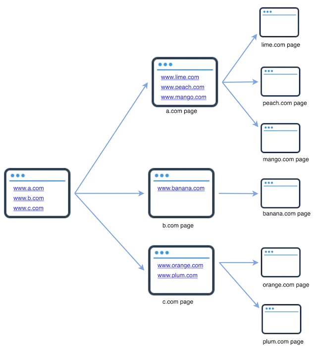
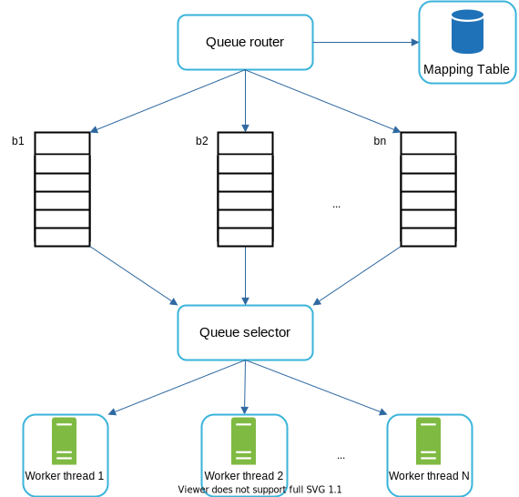
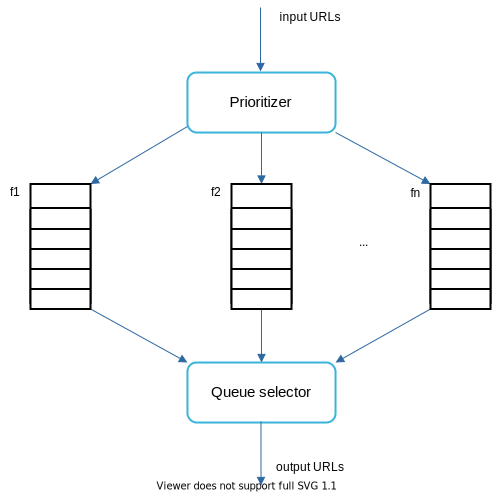
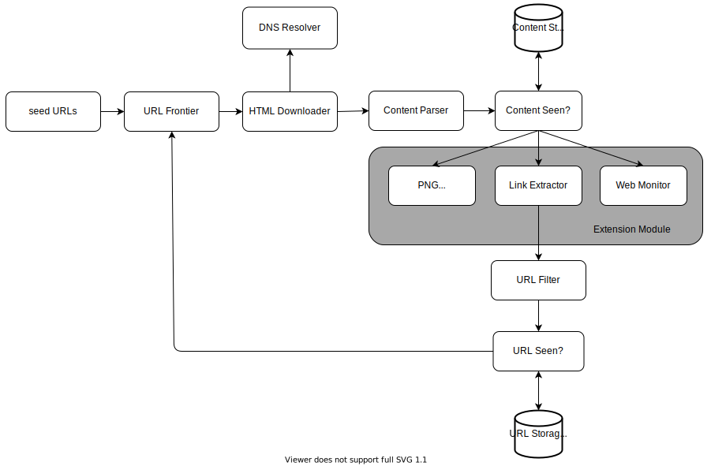

本章我们重点讨论网络爬虫设计：一个有趣且经典的系统设计面试问题。

网络爬虫被称为机器人或蜘蛛。搜索引擎广泛使用它来发现网络上的新内容或更新内容。内容可以是网页、图像、视频、PDF 文件等。网络爬虫首先收集一些网页，然后跟踪这些页面上的链接来收集新内容。图 1 显示了爬网过程的直观示例。



图1

爬虫有多种用途：

- 搜索引擎索引：这是最常见的用例。爬虫收集网页以为搜索引擎创建本地索引。例如，Googlebot 是 Google 搜索引擎背后的网络爬虫。
- 网络归档：这是从网络收集信息以保存数据以供将来使用的过程。例如，许多国家图书馆都运行爬虫来归档网站。著名的例子是美国国会图书馆 [1] 和欧盟网络档案馆 [2]。
- Web 挖掘：Web 的爆炸式增长为数据挖掘提供了前所未有的机会。网络挖掘有助于从互联网上发现有用的知识。例如，顶级金融公司使用爬虫下载股东会议和年度报告，以了解公司的关键举措。
- 网络监控。爬虫有助于监控互联网上的版权和商标侵权行为。例如，Digimarc [3] 利用爬虫来发现盗版作品和报告。

开发网络爬虫的复杂性取决于我们打算支持的规模。它可以是一个只需几个小时即可完成的小型学校项目，也可以是一个需要专门的工程团队不断改进的大型项目。因此，我们将在下面探讨支持的规模和功能。

## 第 1 步 - 了解问题并确定设计范围

网络爬虫的基本算法很简单：

1. 给定一组 URL，下载该 URL 所寻址的所有网页。

2. 从这些网页中提取URL

3. 将新的 URL 添加到要下载的 URL 列表中。重复这 3 个步骤。

网络爬虫的工作原理真的像这个基本算法一样简单吗？不完全是。设计一个高度可扩展的网络爬虫是一项极其复杂的任务。任何人都不可能在面试期间设计出一个大型的网络爬虫。在开始设计之前，我们必须提出问题以了解需求并确定设计范围：

**候选人**：爬虫的主要目的是什么？它用于搜索引擎索引、数据挖掘还是其他用途？
**面试官**：搜索引擎索引。

**候选人**：网络爬虫每月收集多少个网页？
**面试官**：10亿页。

**候选人**：包括哪些内容类型？仅 HTML 还是其他内容类型（例如 PDF 和图像）？
**面试官**：只有 HTML。

**候选人**：我们可以考虑新添加或编辑的网页吗？
**面试官**：是的，我们应该考虑新增或编辑的网页。

**候选人**：我们需要存储从网络爬取的 HTML 页面吗？
**面试官**：是的，最长5年

**候选人**：我们如何处理重复内容的网页？
**面试官**：内容重复的页面应该被忽略。

以上是你可以向面试官提出的一些示例问题。了解要求并澄清歧义非常重要。即使你被要求设计一个简单的产品，比如网络爬虫，你和你的面试官可能不会有相同的假设。

除了向面试官澄清的功能之外，记下优秀网络爬虫的以下特征也很重要：

- 可扩展性：网络非常大。那里有数十亿个网页。使用并行化，网络爬行应该非常高效。
- 稳健性：网络中充满了陷阱。错误的 HTML、服务器无响应、崩溃、恶意链接等都很常见。爬虫必须处理所有这些边缘情况。
- 礼貌：爬虫不应该在短时间内向网站发出太多请求。
- 可扩展性：系统非常灵活，因此只需进行最少的更改即可支持新的内容类型。例如，如果我们将来想要爬取图像文件，我们应该不需要重新设计整个系统。

### 背后的估计

以下估计基于许多假设，与面试官沟通以达成共识非常重要。

- 假设每月下载 10 亿个网页。
- QPS：1,000,000,000 / 30 天 / 24 小时 / 3600 秒 = 每秒约 400 页。
- 峰值 QPS = 2 * QPS = 800
- 假设平均网页大小为 500k。
- 10 亿页 x 500k = 每月 500 TB 存储。如果你对数字存储单元不清楚，请再次阅读“粗略估计”一章中的“2 的幂”部分。
- 假设数据存储五年，则 500 TB * 12 个月 * 5 年 = 30 PB。存储五年的内容需要 30 PB 存储空间。

## 第 2 步 - 提出高级设计并获得认可

一旦需求明确，我们就开始进行高层设计。受到之前网络爬行研究的启发 [4] [5]，我们提出了如图 2 所示的高层设计。


图2

首先，我们探索每个设计组件以了解它们的功能。然后，我们逐步检查爬虫工作流程。

**种子网址**

网络爬虫使用种子 URL 作为爬网过程的起点。例如，要抓取大学网站的所有网页，选择种子URL的直观方法是使用大学的域名。

要抓取整个网络，我们需要创造性地选择种子 URL。一个好的种子 URL 可以作为一个良好的起点，爬虫可以利用它来遍历尽可能多的链接。一般策略是将整个 URL 空间划分为更小的空间。第一种提出的方法是基于地点的，因为不同的国家可能有不同的流行网站。另一种方法是根据主题选择种子 URL；例如，我们可以将 URL 空间划分为购物、体育、医疗保健等。种子 URL 的选择是一个开放式问题。你不需要给出完美的答案。大声思考。

**网址前沿**

大多数现代网络爬虫将爬行状态分为两种：待下载和已下载。存储要下载的 URL 的组件称为 URL Frontier。你可以将其称为先进先出 (FIFO) 队列。有关 URL Frontier 的详细信息，请参阅深入探讨。

**HTML下载器**

HTML 下载器从 Internet 下载网页。这些 URL 由 URL Frontier 提供。

**DNS解析器**

要下载网页，必须将 URL 转换为 IP 地址。HTML 下载器调用 DNS 解析器来获取 URL 对应的 IP 地址。例如，`www.wikipedia.org`截至 2019 年 3 月 5 日，URL 已转换为 IP 地址 198.35.26.96。

**内容解析器**

下载网页后，必须对其进行解析和验证，因为格式错误的网页可能会引发问题并浪费存储空间。在爬网服务器中实现内容解析器会减慢爬网过程。因此，内容解析器是一个单独的组件。

**内容已看过？**

在线研究[6]显示，29%的网页是重复的内容，这可能会导致相同的内容被多次存储。我们介绍“看到的内容？” 数据结构消除数据冗余并缩短处理时间。它有助于检测以前存储在系统中的新内容。要比较两个 HTML 文档，我们可以逐个字符地比较它们。然而，这种方法速度慢且耗时，尤其是当涉及数十亿个网页时。完成此任务的一个有效方法是比较两个网页的哈希值[7]。

**内容存储**

它是一个用于存储HTML内容的存储系统。存储系统的选择取决于数据类型、数据大小、访问频率、寿命等因素。磁盘和内存都会使用。

- 大多数内容都存储在磁盘上，因为数据集太大，无法容纳在内存中。
- 热门内容保留在内存中以减少延迟。

**网址提取器**

URL Extractor 从 HTML 页面中解析并提取链接。图 3 显示了链接提取过程的示例。通过添加前缀，相对路径将转换为绝对 URL `“https://en.wikipedia.org”`。


图3

**网址过滤器**

URL 过滤器排除某些内容类型、文件扩展名、错误链接和“黑名单”站点中的 URL。

**网址 看到了吗？**

“网址看到了吗？” 是一种数据结构，用于跟踪 Frontier 之前或已经访问过的 URL。“网址看到了吗？” 有助于避免多次添加相同的 URL，因为这会增加服务器负载并导致潜在的无限循环。

布隆过滤器和哈希表是实现“URL Seen?”的常用技术。成分。这里我们不会介绍布隆过滤器和哈希表的详细实现。更多信息请参阅参考资料[4][8]。

**网址存储**

URL 存储存储已访问过的 URL。

到目前为止，我们已经讨论了每个系统组件。接下来，我们将它们放在一起来解释工作流程。

**网络爬虫工作流程**

为了更好地逐步解释工作流程，在设计图中添加了序列号，如图 4 所示。


图4

第 1 步：将种子 URL 添加到 URL Frontier

步骤 2：HTML 下载器从 URL Frontier 获取 URL 列表。

步骤 3：HTML 下载器从 DNS 解析器获取 URL 的 IP 地址并开始下载。

步骤 4：内容解析器解析 HTML 页面并检查页面是否格式错误。

第 5 步：解析并验证内容后，将其传递到“内容已看到？” 成分。

第 6 步：“Content Seen”组件检查 HTML 页面是否已在存储中。

- 如果在存储中，则意味着不同 URL 中的相同内容已被处理。在这种情况下，HTML 页面将被丢弃。
- 如果不在存储中，则系统之前没有处理过相同的内容。内容被传递到链接提取器。

第 7 步：链接提取器从 HTML 页面中提取链接。

步骤8：提取的链接被传递到URL过滤器。

步骤9：链接过滤后，将被传递到“URL Seen?” 成分。

步骤10：“URL Seen”组件检查URL是否已在存储中，如果是，则之前已处理过，无需执行任何操作。

步骤 11：如果 URL 之前未被处理过，则将其添加到 URL Frontier。

## 第 3 步 - 设计深入研究

到目前为止，我们已经讨论了高层设计。接下来，我们将深入讨论最重要的建筑构件和技术：

- 深度优先搜索（DFS）与广度优先搜索（BFS）
- URL边界
- HTML下载器
- 鲁棒性
- 可扩展性
- 检测并避免有问题的内容

### DFS 与 BFS

你可以将网络视为有向图，其中网页充当节点，超链接 (URL) 充当边。抓取过程可以看作是从一个网页到其他网页遍历有向图。两种常见的图遍历算法是DFS和BFS。然而，DFS 通常不是一个好的选择，因为 DFS 的深度可能非常深。

BFS 常用于网络爬虫，通过先进先出 (FIFO) 队列实现。在 FIFO 队列中，URL 按其入队顺序出队。然而，这种实现有两个问题：

- 来自同一网页的大多数链接都链接回同一主机。在图5中，wikipedia.com中的所有链接都是内部链接，使得爬虫忙于处理来自同一主机（wikipedia.com）的URL。当爬虫尝试并行下载网页时，维基百科服务器将被请求淹没。这被认为是“不礼貌的”。


图5

- 标准 BFS 不考虑 URL 的优先级。网络很大，并非每个页面都具有相同水平的质量和重要性。因此，我们可能希望根据 URL 的页面排名、网络流量、更新频率等对 URL 进行优先级排序。

### URL边界

URL 边界有助于解决这些问题。URL边界是一种存储要下载的URL的数据结构。URL 边界是确保礼貌、URL 优先级和新鲜度的重要组成部分。参考资料 [5] [9] 中提到了一些关于 URL 前沿的值得注意的论文。这些论文的研究结果如下：

#### 礼貌

一般来说，网络爬虫应避免在短时间内向同一托管服务器发送过多的请求。发送太多请求会被视为“不礼貌”，甚至被视为拒绝服务 (DOS) 攻击。例如，在没有任何限制的情况下，爬虫每秒可以向同一个网站发送数千个请求。这可能会使网络服务器不堪重负。

强制礼貌的总体思路是从同一主机一次下载一页。可以在两个下载任务之间添加延迟。礼貌约束是通过维护从网站主机名到下载（工作）线程的映射来实现的。每个下载器线程都有一个单独的 FIFO 队列，并且仅下载从该队列获取的 URL。图 6 显示了管理礼貌的设计。



图6

- 队列路由器：它确保每个队列（b1、b2、…bn）仅包含来自同一主机的 URL。
- 映射表：它将每个主机映射到一个队列。

|      Host       | 队列 |
| :-------------: | :--: |
| `wikipedia.com` |  b1  |
|   `apple.com`   |  b2  |
|       ...       | ...  |
|   `nike.com`    |  BN  |

表格1

- FIFO 队列 b1、b2 至 bn：每个队列包含来自同一主机的 URL。
- 队列选择器：每个工作线程都映射到一个 FIFO 队列，并且仅从该队列下载 URL。队列选择逻辑由队列选择器完成。
- 工作线程1到N。工作线程从同一主机上逐个下载网页。可以在两个下载任务之间添加延迟。

#### 优先事项

来自讨论论坛的有关苹果产品的随机帖子与苹果主页上的帖子的权重截然不同。尽管它们都有“Apple”关键字，但爬虫首先爬行 Apple 主页是明智的。

我们根据有用性对 URL 进行优先级排序，有用性可以通过 PageRank [10]、网站流量、更新频率等来衡量。“Prioritizer”是处理 URL 优先级的组件。有关此概念的深入信息，请参阅参考资料 [5] [10]。

图 7 显示了管理 URL 优先级的设计。



图7

- Prioritizer：它将 URL 作为输入并计算优先级。
- 队列 f1 到 fn：每个队列都有指定的优先级。具有高优先级的队列被选择的概率较高。
- 队列选择器：随机选择一个队列，偏向于优先级较高的队列。

图8展示了URL前沿设计，它包含两个模块：

- 前端队列：管理优先级
- 后排：管理礼貌


图8

#### 新鲜

网页不断地被添加、删除和编辑。网络爬虫必须定期重新爬行下载的页面，以保持我们的数据集最新。重新抓取所有 URL 非常耗时且占用资源。下面列出了一些优化新鲜度的策略：

- 根据网页的更新历史重新抓取。
- 优先考虑 URL 并首先更频繁地重新抓取重要页面。

#### URL Frontier 的存储

在现实世界的搜索引擎抓取中，前沿的 URL 数量可能达到数亿 [4]。将所有内容放入内存既不持久也不可扩展。将所有内容保留在磁盘中也是不可取的，因为磁盘速度很慢；而且很容易成为爬行的瓶颈。

我们采用了混合方法。大多数URL都存储在磁盘上，因此存储空间不是问题。为了减少从磁盘读取和写入磁盘的成本，我们在内存中维护缓冲区以进行入队/出队操作。缓冲区中的数据会定期写入磁盘。

### HTML下载器

HTML 下载器使用 HTTP 协议从 Internet 下载网页。在讨论 HTML 下载器之前，我们首先看一下机器人排除协议。

机器人.txt

Robots.txt，全称为机器人排除协议，是网站与爬虫通信所使用的标准。它指定允许爬虫下载哪些页面。在尝试抓取网站之前，爬虫应首先检查其相应的robots.txt并遵循其规则。

为了避免重复下载 robots.txt 文件，我们缓存该文件的结果。该文件会定期下载并保存到缓存中。这是一段取自 的 robots.txt 文件`https://www.amazon.com/robots.txt`。Google bot 不允许使用某些目录（例如 Creatorhub）。

```
User-agent: Googlebot
Disallow: /creatorhub/\*
Disallow: /rss/people/\*/reviews
Disallow: /gp/pdp/rss/\*/reviews
Disallow: /gp/cdp/member-reviews/
Disallow: /gp/aw/cr/
```

除了 robots.txt 之外，性能优化是我们将为 HTML 下载器介绍的另一个重要概念。

#### 性能优化

以下是 HTML 下载器的性能优化列表。

1. 分布式抓取

为了获得高性能，爬网作业被分发到多个服务器上，每个服务器上运行多个线程。URL空间被分割成更小的部分；因此，每个下载器负责 URL 的子集。图 9 显示了分布式爬网的示例。


图9

2. 缓存DNS解析器

DNS 解析器是爬网程序的瓶颈，因为由于许多 DNS 接口的同步特性，DNS 请求可能需要时间。DNS 响应时间范围为 10 毫秒至 200 毫秒。一旦爬虫线程执行了对 DNS 的请求，其他线程就会被阻塞，直到第一个请求完成。维护我们的 DNS 缓存以避免频繁调用 DNS 是一种有效的速度优化技术。我们的 DNS 缓存保存域名到 IP 地址的映射，并通过 cron 作业定期更新。

3. 地点

按地理位置分布爬网服务器。当爬网服务器距离网站主机更近时，爬网程序的下载时间会更快。设计局部性适用于大多数系统组件：爬行服务器、缓存、队列、存储等。

4. 超时时间短

一些网络服务器响应缓慢或者可能根本不响应。为了避免长时间等待，指定了最长等待时间。如果主机在预定时间内没有响应，爬虫将停止作业并爬取其他页面。

### 鲁棒性

除了性能优化之外，鲁棒性也是一个重要的考虑因素。我们提出了一些提高系统鲁棒性的方法：

- 一致的哈希：这有助于在下载者之间分配负载。可以使用一致哈希来添加或删除新的下载服务器。有关更多详细信息，请参阅“设计一致性哈希”一章。
- 保存爬网状态和数据：为了防止出现故障，爬网状态和数据将写入存储系统。通过加载保存的状态和数据可以轻松重新启动中断的爬网。
- 异常处理：在大型系统中，错误是不可避免且常见的。爬虫必须优雅地处理异常而不导致系统崩溃。
- 数据验证：这是防止系统错误的重要措施。

### 可扩展性

随着几乎每个系统的发展，设计目标之一是使系统足够灵活以支持新的内容类型。爬虫可以通过插入新模块来扩展。图 10 显示了如何添加新模块。



图10

- 插入 PNG Downloader 模块来下载 PNG 文件。
- 添加Web监控模块来监控网络并防止版权和商标侵权。

### 检测并避免有问题的内容

本节讨论冗余、无意义或有害内容的检测和预防。

1. 冗余内容

如前所述，近 30% 的网页是重复的。哈希值或校验和有助于检测重复[11]。

2. 蜘蛛陷阱

蜘蛛陷阱是导致爬虫陷入无限循环的网页。例如，无限深的目录结构如下：`http://www.spidertrapexample.com/foo/bar/foo/bar/foo/bar/...`

通过设置 URL 的最大长度可以避免此类蜘蛛陷阱。然而，不存在一种通用的解决方案来检测蜘蛛陷阱。包含蜘蛛陷阱的网站很容易识别，因为在此类网站上发现的网页数量异常多。开发自动算法来避免蜘蛛陷阱很困难；但是，用户可以手动验证和识别蜘蛛陷阱，并从爬虫程序中排除这些网站或应用一些自定义的 URL 过滤器。

3. 数据噪声

有些内容几乎没有价值，例如广告、代码片段、垃圾邮件 URL 等。这些内容对爬虫没有用处，应尽可能排除。

## 第 4 步 - 总结

在本章中，我们首先讨论了一个好的爬虫的特征：可伸缩性、礼貌性、可扩展性和健壮性。然后，我们提出了设计并讨论了关键组件。构建可扩展的网络爬虫并不是一项简单的任务，因为网络非常大并且充满陷阱。尽管我们已经涵盖了许多主题，但我们仍然遗漏了许多相关的谈话要点：

- 服务器端渲染：许多网站使用 JavaScript、AJAX 等脚本来动态生成链接。如果我们直接下载并解析网页，我们将无法检索动态生成的链接。为了解决这个问题，我们在解析页面之前首先执行服务器端渲染（也称为动态渲染）[12]。
- 过滤掉不需要的页面：由于存储容量和爬网资源有限，反垃圾邮件组件有利于过滤掉低质量和垃圾页面[13][14]。
- 数据库复制和分片：复制和分片等技术用于提高数据层可用性、可扩展性和可靠性。
- 水平扩展：对于大规模爬行，需要数百甚至数千台服务器来执行下载任务。关键是保持服务器无状态。
- 可用性、一致性和可靠性：这些概念是任何大型系统成功的核心。
- 分析：收集和分析数据是任何系统的重要组成部分，因为数据是微调的关键要素。

恭喜你已经走到这一步了！现在拍拍自己的背吧。好工作！

## 参考资料

[1] 美国国会图书馆：https://www.loc.gov/websites/

[2] 欧盟网络档案：http://data.europa.eu/webarchive

[3] Digimarc：https://www.digimarc.com/products/digimarc-services/piracy-intelligence

[4] Heydon A.、Najork M. Mercator：可扩展、可扩展的网络爬虫万维网，2 (4) (1999)，第 219-229 页

[5] 作者：Christopher Olston、Marc Najork：网络爬行。
http://infolab.stanford.edu/~olston/publications/crawling_survey.pdf

[6] 29% 的网站面临重复内容问题： [https://tinyurl.com/y6tmh55y](https://tinyurl.com/y6tmh55y)

[7] 拉宾·莫等人。随机多项式指纹识别大学计算技术研究中心艾肯计算实验室 (1981)

[8] BH Bloom，“哈希编码中允许错误的空间/时间权衡”，ACM 通信，卷。13、没有。7，第 422–426 页，1970 年。

[9] 唐纳德·J·帕特森 (Donald J. Patterson)，《网络爬行》：

https://www.ics.uci.edu/~lopes/teaching/cs221W12/slides/Lecture05.pdf

[10] L. Page、S. Brin、R. Motwani 和 T. Winograd，“PageRank 引文排名：为网络带来秩序”，技术报告，斯坦福大学，1998 年。

[11] 伯顿·布鲁姆。哈希编码中的空间/时间权衡与允许的错误。ACM 通讯，13(7)，第 422--426 页，1970 年 7 月。

[12]谷歌动态渲染：https://developers.google.com/search/docs/guides/dynamic-rendering

[13] T. Urvoy、T. Lavergne 和 P. Filoche，“通过隐藏风格相似性跟踪网络垃圾邮件”，载于第二届网络对抗性信息检索国际研讨会论文集，2006 年。

[14] H.-T。Lee、D. Leonard、X. Wang 和 D. Loguinov，“IRLbot：扩展到 60 亿页及以上”，第 17 届国际万维网会议记录，2008 年。