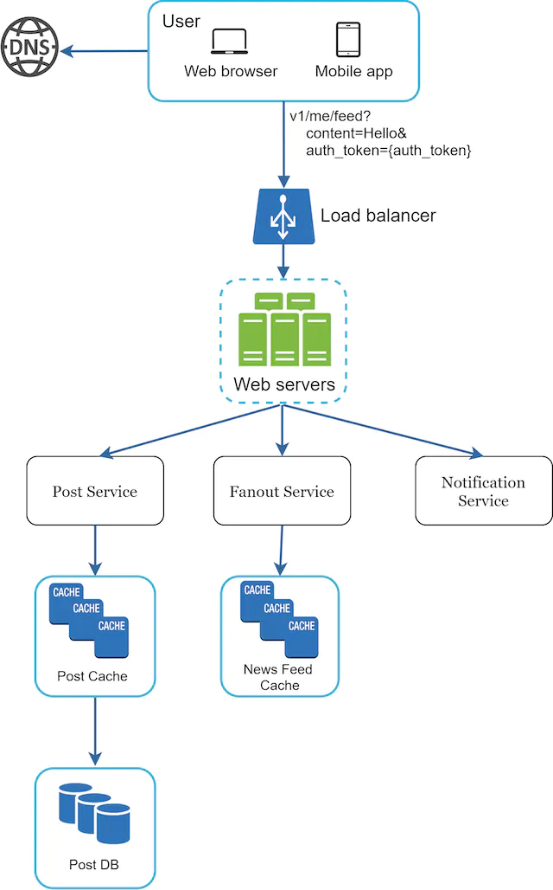
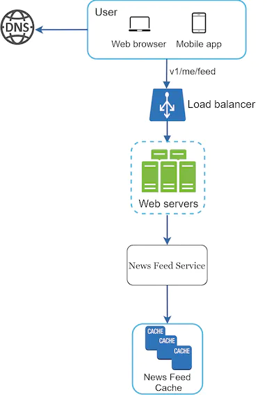
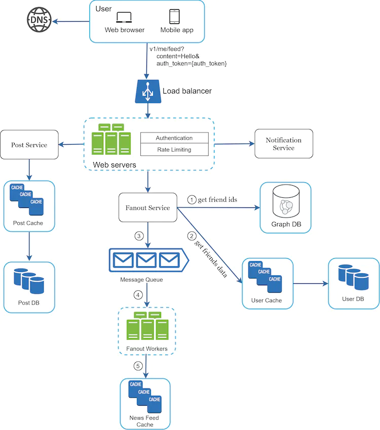
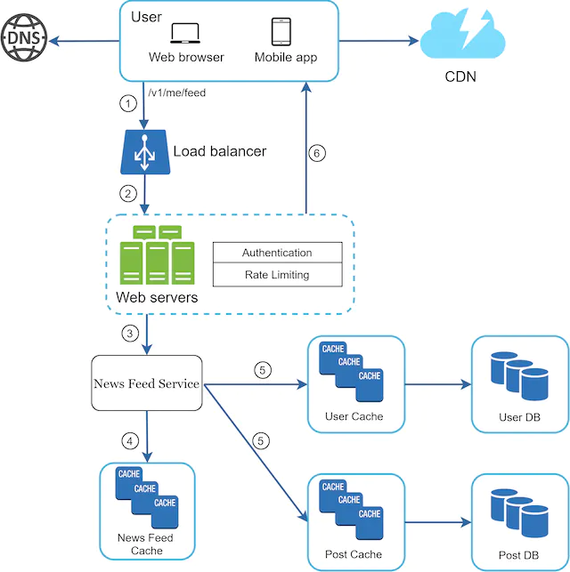
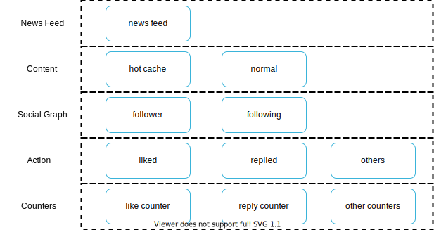

在本章中，你需要设计一个新闻源系统。什么是新闻提要？根据 Facebook 帮助页面，“新闻源是主页中间不断更新的故事列表。动态消息包括状态更新、照片、视频、链接、应用程序活动以及你在 Facebook 上关注的人员、页面和群组的点赞”[1]。这是一个流行的面试问题。常见的类似问题有：设计 Facebook 新闻源、Instagram 源、Twitter 时间线等。

图1

## 第 1 步 - 了解问题并确定设计范围

第一组澄清问题是为了了解面试官要求你设计新闻源系统时的想法。至少，你应该弄清楚要支持哪些功能。以下是候选人与面试官互动的示例：

**候选人**：这是一个移动应用程序吗？或者网络应用程序？或两者？
**面试官**：两者都有

**候选人**：有哪些重要特征？
**面试官：**用户可以在新闻提要页面上发布帖子并查看朋友的帖子。

**候选人**：新闻提要是按时间倒序排序还是按照主题分数等特定顺序排序？例如，来自你亲密朋友的帖子得分更高。
**面试官**：为了简单起见，我们假设 feed 是按时间倒序排列的。

**候选人**：一个用户可以有多少个朋友？
**面试官**：5000

**候选人**：交通量是多少？
**面试官**：1000万日活跃用户

**候选人**：提要可以包含图像、视频还是仅包含文本？
**面试官**：它可以包含媒体文件，包括图像和视频。

现在你已经收集了需求，我们专注于设计系统。

## 第 2 步 - 提出高级设计并获得认可

设计分为两个流程：Feed 发布和 News Feed 构建。

- Feed发布：当用户发布帖子时，相应的数据会写入缓存和数据库中。她朋友的新闻源中已填充了一条帖子。
- 新闻源构建：为了简单起见，我们假设新闻源是通过按时间倒序聚合朋友的帖子来构建的。

### 新闻源 API

新闻源 API 是客户端与服务器通信的主要方式。这些 API 是基于 HTTP 的，允许客户端执行操作，包括发布状态、检索新闻提要、添加朋友等。我们讨论两个最重要的 API：提要发布 API 和新闻提要检索 API。

**提要发布API**

要发布帖子，将向服务器发送 HTTP POST 请求。API如下图所示：

发布 `/v1/me/feed`

参数：

- 内容：内容是帖子的正文。
- auth_token：用于验证API请求。

**新闻源检索 API**

检索新闻提要的 API 如下所示：

获取 `/v1/me/feed`

参数：

- auth_token：用于验证API请求。

### 提要发布

图 2 显示了 feed 发布流程的高级设计。

图2

- 用户：用户可以在浏览器或移动应用程序上查看新闻源。用户通过 API 发布内容为“Hello”的帖子：

  `/v1/me/feed?content=Hello&auth_token={auth_token}`

- 负载均衡器：将流量分配到 Web 服务器。

- Web 服务器：Web 服务器将流量重定向到不同的内部服务。

- Post 服务：将 post 持久保存在数据库和缓存中。

- 扇出服务：将新内容推送到朋友的新闻源。新闻源数据存储在缓存中以便快速检索。

- 通知服务：通知好友有新内容并发送推送通知。

### 新闻源构建

在本节中，我们将讨论新闻源是如何在幕后构建的。图 3 显示了高级设计：

图3

- 用户：用户发送检索其新闻提要的请求。该请求如下所示：`/v1/me/feed`。
- 负载均衡器：负载均衡器将流量重定向到 Web 服务器。
- Web 服务器：Web 服务器将请求路由到新闻源服务。
- 新闻源服务：新闻源服务从缓存中获取新闻源。
- 新闻源缓存：存储呈现新闻源所需的新闻源 ID。

## 第 3 步 - 设计深入研究

高层设计简要涵盖了两个流程：提要发布和新闻提要构建。在这里，我们更深入地讨论这些主题。

### Feed 发布深入探讨

图 4 概述了 feed 发布的详细设计。我们已经讨论了高层设计中的大部分组件，我们将重点关注两个组件：Web 服务器和扇出服务。

图4

#### 网络服务器

除了与客户端通信之外，Web 服务器还强制执行身份验证和速率限制。*只有使用有效auth_token*登录的用户才可以发帖。该系统限制用户在一定时间内可以发布的帖子数量，这对于防止垃圾邮件和滥用内容至关重要。

#### 扇出服务

扇出是将帖子发送给所有朋友的过程。两种类型的扇出模型是：写入扇出（也称为推模型）和读取扇出（也称为拉模型）。两种模型都有优点和缺点。我们解释他们的工作流程并探索支持我们系统的最佳方法。

**写入时扇出。**通过这种方法，新闻源是在写入时预先计算的。新帖子发布后会立即发送到好友的缓存中。

优点：

- 动态消息是实时生成的，可以立即推送给好友。
- 获取新闻源速度很快，因为新闻源是在写入时预先计算的。

缺点：

- 如果用户有很多朋友，则获取朋友列表并为所有朋友生成新闻源会很慢且耗时。这就是所谓的热键问题。
- 对于不活跃或很少登录的用户来说，预先计算新闻源会浪费计算资源。

**读取时扇出**。新闻源是在阅读期间生成的。这是一个按需模型。当用户加载其主页时，最近的帖子将被拉出。

优点：

- 对于不活跃的用户或很少登录的用户，读时扇出效果更好，因为它不会在他们身上浪费计算资源。
- 数据不会推送给好友，所以不存在热键问题。

缺点：

- 由于新闻源不是预先计算的，因此获取新闻源的速度很慢。

我们采用混合方法来获得这两种方法的优点并避免其中的陷阱。由于快速获取新闻源至关重要，因此我们对大多数用户使用推送模型。对于名人或拥有许多朋友/关注者的用户，我们让关注者按需拉取新闻内容，以避免系统过载。一致散列是缓解热键问题的有用技术，因为它有助于更均匀地分发请求/数据。

让我们仔细看看扇出服务，如图 5 所示。

图5

扇出服务的工作原理如下：

1. 从图数据库中获取好友ID。图数据库适合管理好友关系和好友推荐。希望了解更多有关此概念的感兴趣的读者应参阅参考资料 [2]。

2. 从用户缓存中获取好友信息。然后系统根据用户设置过滤掉好友。例如，如果你将某人静音，即使你们仍然是朋友，她的帖子也不会显示在你的新闻源中。帖子可能不显示的另一个原因是用户可以有选择地与特定朋友共享信息或向其他人隐藏信息。

3. 将好友列表和新帖子ID发送到消息队列。

4. Fanout Worker 从消息队列中获取数据并将新闻源数据存储在新闻源缓存中。你可以将新闻提要缓存视为一个*<post_id, user_id>*映射表。每当发布新帖子时，它都会被附加到新闻源表中，如图 6 所示。如果我们将整个用户和帖子对象存储在缓存中，内存消耗可能会变得非常大。因此，仅存储 ID。为了保持较小的内存大小，我们设置了一个可配置的限制。用户滚动浏览新闻源中数千个帖子的机会很小。大多数用户只对最新内容感兴趣，因此缓存未命中率较低。

5. 将*<post_id, user_id >*存储在新闻源缓存中。图 6 显示了新闻源在缓存中的示例。

| 帖子编号 | 用户身份 |
| :------: | :------: |
| 帖子编号 | 用户身份 |
| 帖子编号 | 用户身份 |
| 帖子编号 | 用户身份 |
| 帖子编号 | 用户身份 |
| 帖子编号 | 用户身份 |
| 帖子编号 | 用户身份 |
| 帖子编号 | 用户身份 |

图6

### 新闻源检索深入研究

图 7 说明了新闻提要检索的详细设计。

图7

如图7所示，媒体内容（图像、视频等）存储在CDN中以便快速检索。让我们看看客户端如何检索新闻源。

1. 用户发送检索其新闻源的请求。该请求如下所示：`/v1/me/feed`

2. 负载均衡器将请求重新分配到Web 服务器。

3. Web 服务器调用新闻源服务来获取新闻源。

4. 新闻提要服务从新闻提要缓存中获取列表帖子 ID。

5. 用户的新闻提要不仅仅是提要 ID 列表。它包含用户名、个人资料图片、帖子内容、帖子图像等。因此，新闻源服务从缓存（用户缓存和帖子缓存）中获取完整的用户和帖子对象，以构建完全水合的新闻源。

6. 完全水合的新闻源以 JSON 格式返回给客户端进行渲染。

### 缓存架构

缓存对于新闻源系统极其重要。我们将缓存层分为 5 层，如图 8 所示。

图8

- News Feed：它存储News Feed的ID。
- 内容：存储每条帖子的数据。热门内容存储在热缓存中。
- 社交图谱：存储用户关系数据。
- 操作：它存储有关用户是否喜欢帖子、回复帖子或对帖子执行其他操作的信息。
- 计数器：它存储点赞、回复、关注者、关注等计数器。

## 第 4 步 - 总结

在本章中，我们设计了一个新闻推送系统。我们的设计包含两个流程：提要发布和新闻提要检索。

与任何系统设计面试问题一样，没有完美的系统设计方法。每家公司都有其独特的限制，你必须设计一个系统来适应这些限制。了解设计和技术选择的权衡非常重要。如果还剩几分钟，你可以讨论可扩展性问题。为了避免重复讨论，下面仅列出了高层谈话要点。

扩展数据库：

- 垂直缩放与水平缩放
- SQL 与 NoSQL
- 主从复制
- 读取副本
- 一致性模型
- 数据库分片

其他谈话要点：

- 保持 Web 层无状态
- 尽可能多地缓存数据
- 支持多个数据中心
- 丢失带有消息队列的组件
- 监控关键指标。例如，高峰时段的 QPS 和用户刷新新闻源时的延迟都是值得监控的。

恭喜你已经走到这一步了！现在拍拍自己的背吧。好工作！

## 参考资料

[1] News Feed 的工作原理：
https://www.facebook.com/help/327131014036297/

[2] 朋友的朋友推荐 Neo4j 和 SQL Sever：
http://geekswithblogs.net/brendonpage/archive/2015/10/26/friend-of-friend-recommendations-with-neo4j.aspx