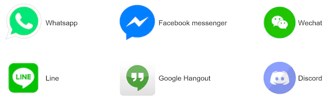

在本章中，我们将探讨聊天系统的设计。几乎每个人都使用聊天应用程序。图 1 显示了市场上一些最受欢迎的应用程序。

图1

聊天应用程序为不同的人执行不同的功能。确定确切的要求非常重要。例如，当面试官考虑的是一对一聊天时，你不想设计一个专注于群聊的系统。探索功能需求很重要。

## 第 1 步 - 了解问题并确定设计范围

就聊天应用程序的设计类型达成一致至关重要。市场上有 Facebook Messenger、微信、WhatsApp 等一对一的聊天应用，也有 Slack 等专注于群聊的办公室聊天应用，还有 Discord 等专注于大群互动和低语音的游戏聊天应用聊天延迟。

第一组澄清问题应该明确面试官要求你设计聊天系统时的具体想法。至少，弄清楚你是否应该专注于一对一聊天或群聊应用程序。你可能会问的一些问题如下：

**候选人**：我们要设计什么样的聊天应用程序？1对1还是以小组为基础？
**面试官**：应该同时支持1对1和群聊。

**候选人**：这是一个移动应用程序吗？或者网络应用程序？或两者？
**面试官**：两者都有。

**候选人**：这个应用程序的规模有多大？初创应用程序还是大规模应用程序？
**面试官**：应该支持5000万日活跃用户（DAU）。

**候选人**：群聊的话，群成员限制是多少？
**面试官**：最多100人

**候选人**：对于聊天应用程序来说，哪些功能很重要？可以支持附件吗？
**面试官**：1对1聊天、群聊、在线指标。系统仅支持短信。

**候选人**：邮件大小有限制吗？
**面试官**：是的，文字长度应该小于10万字符。

**候选人**：需要端到端加密吗？
**面试官**：暂时不需要，但如果时间允许我们会讨论。

**候选人**：聊天记录要保存多久？
**面试官**：永远。

在本章中，我们专注于设计像 Facebook Messenger 这样的聊天应用程序，重点关注以下功能：

- 一对一聊天，传输延迟低
- 小组聊天（最多 100 人）
- 在线状态
- 多设备支持。同一账号可以同时登录多个账号。
- 推送通知

就设计规模达成一致也很重要。我们将设计一个支持5000万DAU的系统。

## 第 2 步 - 提出高级设计并获得认可

为了开发高质量的设计，我们应该对客户端和服务器如何通信有基本的了解。在聊天系统中，客户端可以是移动应用程序，也可以是 Web 应用程序。客户端之间不直接通信。相反，每个客户端都连接到一个聊天服务，该服务支持上述所有功能。让我们专注于基本操作。聊天服务必须支持以下功能：

- 接收来自其他客户端的消息。
- 为每条消息找到正确的收件人并将消息转发给收件人。
- 如果收件人不在线，请在服务器上保留该收件人的邮件，直到她在线。

图 2 显示了客户端（发送者和接收者）与聊天服务之间的关系。

图2

当客户端打算开始聊天时，它会使用一种或多种网络协议连接聊天服务。对于聊天服务来说，网络协议的选择很重要。让我们和面试官讨论一下这个问题。

对于大多数客户端/服务器应用程序来说，请求都是由客户端发起的。对于聊天应用程序的发送方来说也是如此。在图 2 中，当发送者通过聊天服务向接收者发送消息时，它使用经过时间考验的 HTTP 协议，这是最常见的 Web 协议。在此场景中，客户端打开与聊天服务的 HTTP 连接并发送消息，通知服务将消息发送给接收者。保持活动对此非常有效，因为保持活动标头允许客户端保持与聊天服务的持久连接。它还减少了 TCP 握手的次数。对于发送方来说，HTTP 是一个不错的选择，许多流行的聊天应用程序（例如 Facebook [1]）最初都使用 HTTP 来发送消息。

然而，接收端有点复杂。由于 HTTP 是客户端发起的，因此从服务器发送消息并非易事。多年来，使用了许多技术来模拟服务器发起的连接：轮询、长轮询和 WebSocket。这些是系统设计面试中广泛使用的重要技术，因此让我们逐一研究一下。

### 轮询

如图3所示，轮询是一种客户端定期询问服务器是否有可用消息的技术。根据轮询频率，轮询的成本可能很高。它可能会消耗宝贵的服务器资源来回答大多数时候提供“否”答案的问题。

图3

### 长轮询

由于轮询可能效率低下，因此下一步是长轮询（图 4）。

图4

在长轮询中，客户端保持连接打开，直到实际有新消息可用或达到超时阈值。一旦客户端收到新消息，它立即向服务器发送另一个请求，重新启动该过程。长轮询有一些缺点：

- 发送者和接收者不能连接到同一聊天服务器。基于 HTTP 的服务器通常是无状态的。如果使用循环进行负载平衡，接收消息的服务器可能不会与接收消息的客户端建立长轮询连接。
- 服务器没有好的方法来判断客户端是否已断开连接。
- 这是低效的。如果用户聊天不多，长轮询在超时后仍会定期建立连接。

### WebSocket

WebSocket 是从服务器向客户端发送异步更新的最常见解决方案。图 5 显示了它的工作原理。

图5

WebSocket连接由客户端发起。它是双向的且持久的。它以 HTTP 连接开始，可以通过一些定义明确的握手“升级”为 WebSocket 连接。通过这种持久连接，服务器可以向客户端发送更新。即使存在防火墙，WebSocket 连接通常也能正常工作。这是因为它们使用端口 80 或 443，HTTP/HTTPS 连接也使用这些端口。

前面我们说过，在发送方，HTTP 是一个很好使用的协议，但由于 WebSocket 是双向的，因此没有强有力的技术理由不使用它来发送。图 6 显示了 WebSockets (ws) 如何用于发送方和接收方。

图6

通过使用 WebSocket 进行发送和接收，它简化了设计，并使客户端和服务器上的实现更加简单。由于 WebSocket 连接是持久的，因此高效的连接管理在服务器端至关重要。

### 高层设计

刚才我们提到，选择 WebSocket 作为客户端和服务器之间双向通信的主要通信协议，值得注意的是，其他一切不一定都是 WebSocket。事实上，聊天应用程序的大多数功能（注册、登录、用户配置文件等）都可以使用基于 HTTP 的传统请求/响应方法。让我们深入研究一下系统的高级组件。

如图7所示，聊天系统分为三大类：无状态服务、有状态服务和第三方集成。

图7

#### 无状态服务

无状态服务是传统的面向公众的请求/响应服务，用于管理登录、注册、用户配置文件等。这些是许多网站和应用程序的常见功能。

无状态服务位于负载均衡器后面，其工作是根据请求路径将请求路由到正确的服务。这些服务可以是整体的或单独的微服务。我们不需要自己构建许多无状态服务，因为市场上有可以轻松集成的服务。我们将深入讨论的一项服务是服务发现。它的主要工作是向客户端提供客户端可以连接的聊天服务器的 DNS 主机名列表。

#### 有状态服务

唯一有状态的服务是聊天服务。该服务是有状态的，因为每个客户端都维护与聊天服务器的持久网络连接。在此服务中，只要服务器仍然可用，客户端通常不会切换到另一个聊天服务器。服务发现与聊天服务密切配合，以避免服务器过载。我们将深入探讨细节。

#### 第三方集成

对于聊天应用程序来说，推送通知是最重要的第三方集成。这是一种在新消息到达时通知用户的方法，即使应用程序未运行也是如此。推送通知的正确集成至关重要。有关详细信息，请参阅“设计通知系统”一章。

#### 可扩展性

在小范围内，上面列出的所有服务都可以容纳在一台服务器中。即使按照我们设计的规模，理论上也可以在一台现代云服务器中容纳所有用户连接。服务器可以处理的并发连接数很可能是限制因素。在我们的场景中，在 1M 并发用户的情况下，假设每个用户连接需要服务器上 10K 的内存（这是一个非常粗略的数字，并且非常依赖于语言的选择），则只需要大约 10GB 的内存来容纳一台服务器上的所有连接。盒子。

如果我们提出一种将所有内容都放在一台服务器中的设计，这可能会在面试官的脑海中引发一个大危险信号。没有技术人员会在单个服务器中设计如此规模的产品。由于多种因素，单一服务器设计会破坏交易。其中单点故障是最大的。

然而，从单一服务器设计开始是完全可以的。只要确保面试官知道这是一个起点即可。将我们提到的所有内容放在一起，图 8 显示了调整后的高层设计。

图8

在图 8 中，客户端维护与聊天服务器的持久 WebSocket 连接以进行实时消息传递。

- 聊天服务器促进消息发送/接收。
- 状态服务器管理在线/离线状态。
- API 服务器处理一切事务，包括用户登录、注册、更改个人资料等。
- 通知服务器发送推送通知。
- 最后，键值存储用于存储聊天记录。当离线用户上线时，她将看到她之前的所有聊天记录。

#### 贮存

至此，我们已经准备好服务器、运行服务并完成第三方集成。技术堆栈的深处是数据层。数据层通常需要一些努力才能使其正确。我们必须做出的一个重要决定是决定使用正确的数据库类型：关系数据库还是 NoSQL 数据库？为了做出明智的决定，我们将检查数据类型和读/写模式。

典型的聊天系统中存在两种类型的数据。第一个是通用数据，例如用户个人资料、设置、用户好友列表。这些数据存储在强大且可靠的关系数据库中。复制和分片是满足可用性和可扩展性要求的常用技术。

第二个是聊天系统特有的：聊天历史数据。了解读/写模式很重要。

- 对于聊天系统来说，数据量是巨大的。之前的一项研究 [2] 显示 Facebook Messenger 和 Whatsapp 每天处理 600 亿条消息。
- 仅经常访问最近的聊天记录。用户通常不会查找旧聊天记录。
- 尽管在大多数情况下都会查看最近的聊天历史记录，但用户可能会使用需要随机访问数据的功能，例如搜索、查看你的提及、跳转到特定消息等。这些情况应该得到数据访问层的支持。
- 1对1聊天应用程序的读写比例约为1:1。

选择支持我们所有用例的正确存储系统至关重要。我们推荐键值存储的原因如下：

- 键值存储允许轻松水平扩展。
- 键值存储提供非常低的数据访问延迟。
- 关系数据库不能很好地处理长尾数据[3]。当索引变大时，随机访问的成本很高。
- 键值存储已被其他经过验证的可靠聊天应用程序采用。例如，Facebook Messenger 和 Discord 都使用键值存储。Facebook Messenger 使用 HBase [4]，Discord 使用 Cassandra [5]。

### 数据模型

刚才，我们讨论了使用键值存储作为我们的存储层。最重要的数据是消息数据。让我们仔细看看。

#### 1对1聊天的消息表

图 9 显示了一对一聊天的消息表。主键是*message_id*，它有助于决定消息顺序。我们不能依靠*created_at*来决定消息顺序，因为可以同时创建两条消息。

图9

#### 群聊消息表

图10显示了群聊的消息表。复合主键是*（channel_id，message_id）。*通道和组在这里代表相同的含义。*Channel_id*是分区键，因为群聊中的所有查询都在通道中操作。

图10

#### 消息ID

如何生成*message_id*是一个值得探讨的有趣话题。*Message_id*负责保证消息的顺序。为了确定消息的顺序，*message_id*必须满足以下两个要求：

- ID 必须是唯一的。
- ID 应可按时间排序，这意味着新行的 ID 高于旧行。

如何才能实现这两个保证呢？我想到的第一个想法是MySql中的“ *auto_increment ”关键字。*然而，NoSQL 数据库通常不提供这样的功能。

第二种方法是使用全局 64 位序列号生成器，如 Snowflake [6]。“在分布式系统中设计唯一的 ID 生成器”一章对此进行了讨论。

最后的方法是使用本地序列号生成器。本地意味着 ID 仅在组内是唯一的。本地ID起作用的原因是维持一对一通道或组通道内的消息顺序就足够了。与全局 ID 实现相比，这种方法更容易实现。

## 第 3 步 - 设计深入研究

在系统设计面试中，通常希望你深入研究高层设计中的某些组件。对于聊天系统来说，服务发现、消息流、上下线指标等都值得深入探索。

### 服务发现

服务发现的主要作用是根据地理位置、服务器容量等标准为客户端推荐最佳的聊天服务器。Apache Zookeeper [7] 是一种流行的服务发现开源解决方案。它注册所有可用的聊天服务器，并根据预定义的标准为客户端选择最佳的聊天服务器。

图 11 显示了服务发现 (Zookeeper) 的工作原理。

图11

1. 用户A尝试登录应用程序。

2. 负载均衡器向API服务器发送登录请求。

3. 后端对用户进行身份验证后，服务发现为用户 A 找到最佳的聊天服务器。本例中选择服务器 2，并将服务器信息返回给用户 A。

4. 用户A通过WebSocket连接到聊天服务器2。

### 消息流

了解聊天系统的端到端流程很有趣。在本节中，我们将探讨 1 对 1 聊天流程、跨多个设备的消息同步以及群聊流程。

#### 1对1聊天流程

图 12 解释了当用户 A 向用户 B 发送消息时会发生什么情况。

图12

1. 用户A向聊天服务器1发送聊天消息。

2. 聊天服务器1从ID生成器获取消息ID。

3. 聊天服务器1将消息发送到消息同步队列。

4. 消息存储在键值存储中。

5. 如果用户 B 在线，则消息将转发到用户 B 连接的聊天服务器 2。

5. 如果用户 B 离线，则从推送通知 (PN) 服务器发送推送通知。

6. 聊天服务器 2 将消息转发给用户 B。用户 B 和聊天服务器 2 之间存在持久的 WebSocket 连接。

#### 多设备消息同步

许多用户拥有多个设备。我们将解释如何跨多个设备同步消息。图13显示了消息同步的示例。

图13

在图 13 中，用户 A 有两台设备：电话和笔记本电脑。当用户 A 使用手机登录聊天应用程序时，它会与聊天服务器 1 建立 WebSocket 连接。同样，笔记本电脑和聊天服务器 1 之间也存在连接。

每个设备都维护一个名为cur_max_message_id的变量，它跟踪设备上的最新消息 ID。满足以下两个条件的消息被视为新闻消息：

- 接收者ID等于当前登录的用户ID。
- 键值存储中的消息 ID 大于*cur_max_message_id*。

每个设备上都有不同的*cur_max_message_id*，消息同步很容易，因为每个设备都可以从 KV 存储中获取新消息。

#### 小群聊天流程

与一对一聊天相比，群聊的逻辑更加复杂。图 12-14 和 12-15 解释了该流程。

图14

图 14 解释了当用户 A 在群聊中发送消息时会发生什么情况。假设该组中有 3 个成员（用户 A、用户 B 和用户 C）。首先，来自用户 A 的消息被复制到每个组成员的消息同步队列：一个用于用户 B，第二个用于用户 C。你可以将消息同步队列视为收件人的收件箱。这种设计选择非常适合小组聊天，因为：

- 它简化了消息同步流程，因为每个客户端只需检查自己的收件箱即可获取新消息。
- 当组数较小时，在每个收件人的收件箱中存储一份副本并不太昂贵。

微信也采用了类似的方法，它将一个群组的成员限制为 500 人 [8]。但是，对于拥有大量用户的组来说，为每个成员存储消息副本是不可接受的。

在接收方，一个接收方可以接收来自多个用户的消息。每个收件人都有一个收件箱（消息同步队列），其中包含来自不同发件人的消息。图 15 展示了该设计。

图15

### 在线状态

在线状态指示器是许多聊天应用程序的基本功能。通常，你可以在用户的个人资料图片或用户名旁边看到一个绿点。本节解释幕后发生的事情。

在高层设计中，呈现服务器负责管理在线状态并通过WebSocket与客户端进行通信。有一些流程会触发在线状态更改。让我们逐一考察一下。

#### 用户登录

用户登录流程在“服务发现”部分中进行了解释。客户端与实时服务建立WebSocket连接后，用户A的在线状态和*last_active_at*时间戳会保存在KV存储中。状态指示器显示用户登录后处于在线状态。

图16

#### 用户注销

当用户注销时，会经历如图17所示的用户注销流程。KV存储中在线状态变为离线状态。状态指示器显示用户离线。

图17

#### 用户断线

我们都希望我们的互联网连接是一致且可靠的。然而，情况并非总是如此。因此，我们必须在设计中解决这个问题。当用户与互联网断开连接时，客户端和服务器之间的持久连接就会丢失。处理用户断开连接的一种简单方法是将用户标记为离线，并在连接重新建立时将状态更改为在线。然而，这种方法有一个重大缺陷。用户在短时间内频繁断开和重新连接互联网是很常见的。例如，当用户穿过隧道时，网络连接可以打开和关闭。每次断开/重新连接时更新在线状态会使状态指示符更改过于频繁，从而导致用户体验不佳。

我们引入心跳机制来解决这个问题。在线客户端定期向状态服务器发送心跳事件。如果在线状态服务器在一定时间内（例如 x 秒）从客户端接收到心跳事件，则认为用户在线。否则就是离线状态。

在图 18 中，客户端每 5 秒向服务器发送一次心跳事件。发送 3 个心跳事件后，客户端断开连接，并且在 x = 30 秒内没有重新连接（该数字是任意选择的以演示逻辑）。在线状态更改为离线。

图18

#### 在线状态扇出

用户A的好友如何知道状态变化？图 19 解释了它的工作原理。状态服务器使用发布-订阅模型，其中每个朋友对维护一个频道。当用户A在线状态发生变化时，将事件发布到三个通道：通道AB、AC、AD。这三个频道分别由用户 B、C 和 D 订阅。这样，朋友就可以轻松获得在线状态更新。客户端和服务器之间的通信是通过实时WebSocket进行的。

图19

上述设计对于小用户群来说是有效的。例如，微信就采用了类似的方法，因为它的用户群体上限为 500 人。对于较大的群体，向所有成员通报在线状态既昂贵又耗时。假设一个群组有 100,000 名成员。每次状态更改都会生成 100,000 个事件。为了解决性能瓶颈，一种可能的解决方案是仅在用户进入群组或手动刷新好友列表时才获取在线状态。

## 第 4 步 - 总结

在本章中，我们提出了一个同时支持一对一聊天和小组聊天的聊天系统架构。WebSocket用于客户端和服务器之间的实时通信。聊天系统包含以下组件：用于实时消息传递的聊天服务器、用于管理在线状态的状态服务器、用于发送推送通知的推送通知服务器、用于保存聊天历史记录的键值存储以及用于其他功能的 API 服务器。

如果你在采访结束时还有额外的时间，请参阅以下额外谈话要点：

- 扩展聊天应用程序以支持照片和视频等媒体文件。媒体文件的大小明显大于文本。压缩、云存储和缩略图都是有趣的话题。
- 端到端加密。Whatsapp 支持消息的端到端加密。只有发件人和收件人才能阅读消息。有兴趣的读者可以参考参考资料中的文章[9]。
- 在客户端缓存消息可以有效减少客户端和服务器之间的数据传输。
- 改善加载时间。Slack 构建了一个地理分布式网络来缓存用户的数据、频道等，以获得更好的加载时间 [10]。
- 错误处理。
- 聊天服务器错误。与聊天服务器的持久连接可能有数十万甚至更多。如果聊天服务器离线，服务发现（Zookeeper）将提供一个新的聊天服务器供客户端建立新的连接。
- 消息重发机制。重试和排队是重新发送消息的常用技术。

恭喜你已经走到这一步了！现在拍拍自己的背吧。好工作！

## 参考资料

[1] Facebook 上的 Erlang：
https://www.erlang-factory.com/upload/presentations/31/EugeneLetuchy-ErlangatFacebook.pdf

[2] Messenger 和 WhatsApp 每天处理 600 亿条消息：
https://www.theverge.com/2016/4/12/11415198/facebook-messenger-whatsapp-number-messages-vs-sms-f8-2016

[3] 长尾： [https://en.wikipedia.org/wiki/Long_tail](https://en.wikipedia.org/wiki/Long_tail)

[4] 消息底层技术：
https://www.facebook.com/notes/facebook-engineering/the-underlying-technology-of-messages/454991608919/

[5] Discord 如何存储数十亿条消息：
https://blog.discordapp.com/how-discord-stores-billions-of-messages-7fa6ec7ee4c7

[6] 宣布雪花：https://blog.twitter.com/engineering/en_us/a/2010/announcing-snowflake.html

[7] Apache ZooKeeper：https://zookeeper.apache.org/

[8] 从无到有：微信后台系统的演变（中文文章）：
https://www.infoq.cn/article/the-road-of-the-growth-weixin-background

[9] 端到端加密：[https ://faq.whatsapp.com/en/android/28030015/](https://faq.whatsapp.com/en/android/28030015/)

[10] Flannel：实现 Slack 规模的应用程序级边缘缓存：
https://slack.engineering/flannel-an-application-level-edge-cache-to-make-slack-scale-b8a6400e2f6b