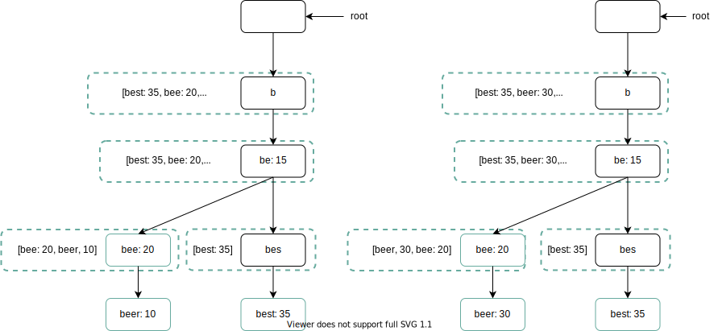

在 Google 上搜索或在 Amazon 上购物时，当你在搜索框中输入内容时，系统会向你显示一个或多个与搜索词匹配的内容。此功能称为自动完成、预先输入、键入时搜索或增量搜索。图 1 展示了一个 Google 搜索示例，其中显示了在搜索框中输入“dinner”时自动完成的结果列表。搜索自动完成是许多产品的重要功能。这引出了我们的面试问题：设计一个搜索自动完成系统，也称为“设计前k个”或“设计前k个最常搜索的查询”。

图1

## 第 1 步 - 了解问题并确定设计范围

解决任何系统设计面试问题的第一步是提出足够的问题来澄清需求。以下是候选人与面试官互动的示例：

**候选人**：匹配仅支持在搜索查询的开头还是中间也支持？
**面试官**：仅在搜索查询的开头。

**候选人**：系统应该返回多少条自动完成建议？
**面试官**：5

**候选人**：系统如何知道返回哪 5 条建议？
**面试官**：这个是由流行度决定的，由历史查询频率决定的。

**候选人**：系统支持拼写检查吗？
**面试官**：不，不支持拼写检查或自动更正。

**候选人**：搜索查询是英文的吗？
**面试官**：是的。如果最后时间允许，我们可以讨论多语言支持。

**候选人**：我们允许大写和特殊字符吗？
**面试官**：不，我们假设所有搜索查询都有小写字母字符。

**候选人**：有多少用户使用该产品？
**面试官**：1000万DAU。

**要求**

以下是要求摘要：

- 快速响应时间：当用户键入搜索查询时，自动完成建议必须足够快地显示。一篇关于 Facebook 自动完成系统的文章 [1] 揭示了该系统需要在 100 毫秒内返回结果。否则会造成口吃。
- 相关：自动完成建议应与搜索词相关。
- 排序：系统返回的结果必须按照流行度或其他排名模型进行排序。
- 可扩展：系统可以处理高流量。
- 高可用性：当系统的一部分脱机、速度变慢或遇到意外的网络错误时，系统应保持可用和可访问。

### 信封背面的估计

- 假设每日活跃用户 (DAU) 为 1000 万。

- 一般人每天执行 10 次搜索。

- 每个查询字符串 20 个字节的数据：

- 假设我们使用 ASCII 字符编码。1 个字符 = 1 个字节

- 假设一个查询包含4个单词，每个单词平均包含5个字符。

- 即每个查询 4 x 5 = 20 字节。

- 对于在搜索框中输入的每个字符，客户端都会向后端发送请求以获取自动完成建议。平均而言，每个搜索查询会发送 20 个请求。例如，当你输入完“dinner”时，以下 6 个请求将发送到后端。

  搜索？q=d

  搜索？q=di

  搜索？q=din

  搜索？q=dinn

  搜索？q=晚餐

  搜索？q=晚餐

- 每秒约 24,000 次查询 (QPS) = 10,000,000 个用户 * 10 次查询/天 * 20 个字符/24 小时/3600 秒。

- 峰值 QPS = QPS * 2 = ~48,000

- 假设 20% 的每日查询是新的。1000 万 * 10 个查询/天 * 每个查询 20 字节 * 20% = 0.4 GB。这意味着每天都会有 0.4GB 的新数据添加到存储中。

## 第 2 步 - 提出高级设计并获得认可

在高层，该系统分为两部分：

- 数据收集服务：它收集用户输入的查询并实时聚合它们。实时处理对于大数据集来说并不实用；然而，这是一个很好的起点。我们将深入探索更现实的解决方案。
- 查询服务：给定搜索查询或前缀，返回 5 个最常搜索的术语。

### 数据采集服务

让我们用一个简化的例子来看看数据收集服务是如何工作的。假设我们有一个频率表，用于存储查询字符串及其频率，如图 2 所示。一开始，频率表是空的。随后，用户依次输入查询“twitch”、“twitter”、“twitter”和“twillo”。图 2 显示了频率表是如何更新的。

图2

### 查询服务

假设我们有一个频率表，如表 1 所示。它有两个字段。

- 查询：存储查询字符串。
- 频率：表示某个查询被搜索的次数。

| **询问** | **频率** |
| :------- | :------- |
| 推特     | 35       |
| 抽搐     | 29       |
| 暮       | 25       |
| 双峰     | 21       |
| 抽搐素数 | 18       |
| 推特搜索 | 14       |
| 斜纹布   | 10       |
| 双峰SF   | 8        |

表格1

当用户在搜索框中输入“tw”时，将显示以下前 5 个搜索查询（图 3）（假设频率表基于表 1）。

图3

要获取前 5 个最常搜索的查询，请执行以下 SQL 查询：

图4

当数据集较小时，这是一个可接受的解决方案。当它很大时，访问数据库就会成为瓶颈。我们将深入探讨优化。

## 第 3 步 - 设计深入研究

在高层设计中，我们讨论了数据收集服务和查询服务。高层设计并不是最优的，但它是一个很好的起点。在本节中，我们将深入研究几个组件并探索优化，如下所示：

- 特里树数据结构
- 数据采集服务
- 查询服务
- 扩展存储
- 特里树操作

### 特里树数据结构

高层设计中采用关系数据库进行存储。然而，从关系数据库中获取前 5 个搜索查询的效率很低。数据结构trie（前缀树）就是用来克服这个问题的。由于 trie 数据结构对于系统至关重要，因此我们将花费大量时间来设计定制的 trie。请注意，一些想法来自文章 [2] 和 [3]。

了解基本的 trie 数据结构对于这个面试问题至关重要。然而，这更多的是一个数据结构问题，而不是系统设计问题。此外，很多网上资料都解释了这个概念。在本章中，我们仅讨论 trie 数据结构的概述，并重点讨论如何优化基本 trie 以提高响应时间。

Trie（发音为“try”）是一种可以紧凑地存储字符串的树状数据结构。该名称来自单词 re **trie** val，这表明它是为字符串检索操作而设计的。trie的主要思想包括以下内容：

- trie 是一种树状数据结构。
- 根代表一个空字符串。
- 每个节点存储一个字符并具有 26 个子节点，每个节点对应一个可能的字符。为了节省空间，我们不绘制空链接。
- 每个树节点代表一个单词或一个前缀字符串。

图 5 显示了一个包含搜索查询“tree”、“try”、“true”、“toy”、“wish”、“win”的 trie。搜索查询以较粗的边框突出显示。

图5

基本的 trie 数据结构在节点中存储字符。为了支持按频率排序，频率信息需要包含在节点中。假设我们有以下频率表。

| **询问** | **频率** |
| :------- | :------- |
| 树       | 10       |
| 尝试     | 29       |
| 真的     | 35       |
| 玩具     | 14       |
| 希望     | 25       |
| 赢       | 50       |

表2

将频率信息添加到节点后，更新后的 trie 数据结构如图 6 所示。

图6

自动完成功能如何与 trie 一起使用？在深入研究该算法之前，让我们定义一些术语。

- *p* : 前缀长度
- *n*：trie 中的节点总数
- c：给定节点的子节点数

下面列出了获取前*k 个*搜索最多的查询的步骤：

1. 查找前缀。时间复杂度：*O(p)*。

2. 从前缀节点开始遍历子树，得到所有有效的子节点。如果子级可以形成有效的查询字符串，则该子级是有效的。时间复杂度：*O(c)*

3. 对孩子们进行排序并获得前*k 名*。时间复杂度：*O(clogc)*

让我们用图7所示的例子来解释该算法。假设*k*等于 2，并且用户在搜索框中键入“tr”。该算法的工作原理如下：

- 步骤1：找到前缀节点“tr”。
- 步骤2：遍历子树以获取所有有效的子节点。在这种情况下，节点 [tree: 10]、[true: 35]、[try: 29] 是有效的。
- 步骤 3：对子项进行排序并获取前 2 个。[true: 35] 和 [try: 29] 是前缀为“tr”的前 2 个查询。

图7

该算法的时间复杂度是上述每个步骤所花费时间的总和：$O(p) + O(c) + O(clogc)$

上面的算法很简单。然而，它太慢了，因为在最坏的情况下我们需要遍历整个 trie 才能获得前*k 个结果。*下面是两个优化：

1. 限制前缀最大长度

2. 在每个节点缓存热门搜索查询

让我们一一看看这些优化。

#### 限制前缀的最大长度

用户很少在搜索框中输入很长的搜索查询。因此，可以肯定地说*p*是一个小整数，比如 50。如果我们限制前缀的长度，“查找前缀”的时间复杂度可以从*O(p)*降低到*O(小常数)，*又名*O(1)*。

#### 在每个节点缓存最热门的搜索查询

为了避免遍历整个 trie，我们在每个节点存储前*k*个最常用的查询。由于 5 到 10 个自动完成建议对于用户来说就足够了，因此*k*是一个相对较小的数字。在我们的具体案例中，仅缓存前 5 个搜索查询。

通过在每个节点缓存最热门的搜索查询，我们显着降低了检索前 5 个查询的时间复杂度。然而，这种设计需要大量空间来存储每个节点的热门查询。以空间换时间是非常值得的，因为快速响应时间非常重要。

图 8 显示了更新后的 trie 数据结构。前 5 个查询存储在每个节点上。例如，前缀为“be”的节点存储以下内容：[best: 35, bet: 29, bee: 20, be: 15, beer: 10]。

图8

让我们在应用这两种优化后重新审视算法的时间复杂度：

1.找到前缀节点。时间复杂度：*O(1)*

2.返回前*k*个。由于前*k 个*查询已被缓存，因此此步骤的时间复杂度为*O(1)*。

由于每个步骤的时间复杂度降低到*O(1)*，我们的算法只需要*O(1)*即可获取前*k 个*查询。

### 数据采集服务

在我们之前的设计中，每当用户输入搜索查询时，数据都会实时更新。由于以下两个原因，这种方法并不实用：

- 用户每天可能会输入数十亿次查询。在每个查询上更新 trie 会显着减慢查询服务的速度。
- 一旦特里树构建完成，最重要的建议可能不会发生太大变化。因此，没有必要经常更新trie。

为了设计可扩展的数据收集服务，我们研究数据的来源以及数据的使用方式。像 Twitter 这样的实时应用程序需要最新的自动完成建议。然而，许多 Google 关键字的自动完成建议可能每天都不会发生太大变化。

尽管用例存在差异，但数据收集服务的底层基础保持不变，因为用于构建 trie 的数据通常来自分析或日志记录服务。

图 9 显示了重新设计的数据收集服务。每个组件都被一一检查。

图9

**分析日志。**它存储有关搜索查询的原始数据。日志仅可追加且未建立索引。表 3 显示了日志文件的示例。

| **询问** | **时间**            |
| :------- | :------------------ |
| 树       | 2019-10-01 22:01:01 |
| 尝试     | 2019-10-01 22:01:05 |
| 树       | 2019-10-01 22:01:30 |
| 玩具     | 2019-10-01 22:02:22 |
| 树       | 2019-10-02 22:02:42 |
| 尝试     | 2019-10-03 22:03:03 |

表3

**聚合器。**分析日志的大小通常非常大，并且数据的格式不正确。我们需要聚合数据，以便我们的系统可以轻松处理这些数据。

根据用例，我们可能会以不同的方式聚合数据。对于 Twitter 等实时应用程序，我们会在较短的时间间隔内聚合数据，因为实时结果很重要。另一方面，对于许多用例来说，聚合数据的频率较低（例如每周一次）可能就足够了。在面试过程中，验证实时结果是否重要。我们假设 trie 每周重建一次。

#### 汇总数据。

表 4 显示了每周汇总数据的示例。“时间”字段代表一周的开始时间。“频率”字段是该周相应查询出现次数的总和。

| **询问** | **时间**   | **频率** |
| :------- | :--------- | :------- |
| 树       | 2019-10-01 | 12000    |
| 树       | 2019-10-08 | 15000    |
| 树       | 2019-10-15 | 9000     |
| 玩具     | 2019-10-01 | 8500     |
| 玩具     | 2019-10-08 | 6256     |
| 玩具     | 2019-10-15 | 8866     |

表4

**Worker** Worker 是一组定期执行异步作业的服务器。他们构建 trie 数据结构并将其存储在 Trie DB 中。

**特里缓存。**Trie Cache 是一个分布式缓存系统，它将 trie 保存在内存中以便快速读取。它每周拍摄数据库快照。

**特里数据库。**Trie DB 是持久性存储。有两个选项可用于存储数据：

1. 文档存储：由于每周都会构建一个新的 trie，因此我们可以定期对其进行快照，并将其序列化，并将序列化的数据存储在数据库中。像 MongoDB [4] 这样的文档存储非常适合序列化数据。

2. 键值存储：特里树可以通过应用以下逻辑以哈希表形式[4]表示：

- trie 中的每个前缀都映射到哈希表中的一个键。
- 每个 trie 节点上的数据都映射到哈希表中的一个值。

图 10 显示了 trie 和哈希表之间的映射。

图10

在图 10 中，左侧的每个 trie 节点都映射到右侧的*<key, value>对。*如果你不清楚键值存储的工作原理，请参阅“设计键值存储”一章。

### 查询服务

在高层设计中，查询服务直接调用数据库来获取前 5 个结果。图 11 显示了改进后的设计，因为之前的设计效率较低。

图11

1. 搜索查询发送到负载均衡器。

2. 负载均衡器将请求路由到 API 服务器。

3. API 服务器从 Trie Cache 获取 trie 数据，并为客户端构建自动完成建议。

4. 如果数据不在 Trie Cache 中，我们将数据补充回缓存。这样，所有后续对相同前缀的请求都会从缓存中返回。当缓存服务器内存不足或脱机时，可能会发生缓存未命中。

查询服务需要闪电般的速度。我们提出以下优化建议：

- AJAX 请求。对于 Web 应用程序，浏览器通常发送 AJAX 请求来获取自动完成结果。AJAX 的主要好处是发送/接收请求/响应不会刷新整个网页。
- 浏览器缓存。对于许多应用程序来说，自动完成搜索建议在短时间内可能不会发生太大变化。因此，自动完成建议可以保存在浏览器缓存中，以便后续请求可以直接从缓存中获取结果。Google搜索引擎也使用同样的缓存机制。图 12 显示了你在 Google 搜索引擎上键入“系统设计面试”时的响应标头。如你所见，Google 将结果在浏览器中缓存了 1 小时。请注意：缓存控制中的“私有”意味着结果仅供单个用户使用，不得由共享缓存进行缓存。“max-age=3600”表示缓存的有效期为 3600 秒，即一小时。

图12

- 数据采样：对于大型系统，记录每个搜索查询需要大量的处理能力和存储空间。数据采样很重要。例如，系统仅记录每*N个请求中的 1 个。*

### 特里树操作

Trie 是自动完成系统的核心组件。让我们看看 trie 操作（创建、更新和删除）是如何工作的。

#### 创造

Trie 是由工作人员使用聚合数据创建的。数据来源来自分析日志/DB。

#### 更新

有两种更新 trie 的方法。

选项 1：每周更新 trie。一旦创建了新的 trie，新的 trie 就会替换旧的 trie。

选项 2：直接更新单个 trie 节点。我们尽量避免这个操作，因为它很慢。然而，如果 trie 的大小很小，那么这是一个可以接受的解决方案。当我们更新一个 trie 节点时，它的祖先一直到根都必须更新，因为祖先存储了子节点的顶级查询。图 13 显示了更新操作如何工作的示例。在左侧，搜索查询“beer”的原始值是 10。在右侧，它已更新为 30。如你所见，节点及其祖先的“beer”值已更新为 30。

图13

#### 删除

我们必须删除仇恨、暴力、色情或危险的自动完成建议。我们在 Trie Cache 前面添加一个过滤层（图 14）来过滤掉不需要的建议。过滤层使我们可以灵活地根据不同的过滤规则删除结果。不需要的建议会从数据库中异步物理删除，以便在下一个更新周期中使用正确的数据集来构建 trie。

图14

### 扩展存储

现在我们已经开发了一个为用户提供自动完成查询的系统，现在是时候解决当 trie 变得太大而无法容纳一台服务器时的可扩展性问题了。

由于英语是唯一受支持的语言，因此一种简单的分片方法是基于第一个字符。这里有些例子。

- 如果我们需要两台服务器进行存储，我们可以在第一台服务器上存储以“ *a* ”到“ *m* ”开头的查询，在第二个服务器上存储以“ *n* ”到“ *z ”开头的查询。*
- 如果我们需要三个服务器，我们可以将查询拆分为“ *a* ”到“ *i* ”、“ *j* ”到“ *r* ”和“ *s* ”到“ *z* ”。

按照这个逻辑，我们可以将查询拆分为最多 26 个服务器，因为英语有 26 个字母字符。让我们将基于第一个字符的分片定义为第一级分片。为了存储超过26台服务器的数据，我们可以在第二级甚至第三级进行分片。例如，以“ *a* ”开头的数据查询可以分为4个服务器：“ *aa-ag* ”、“ *ah-an* ”、“ *ao-au* ”和“ *av-az”*。

*乍一看，这种方法似乎很合理，直到你意识到以字母“ c* ”开头的单词比“ *x* ”多得多。这造成分布不均匀。

为了缓解数据不平衡问题，我们分析历史数据分布模式并应用更智能的分片逻辑，如图 15 所示。分片映射管理器维护一个查找数据库，用于识别应存储行的位置。*例如，如果“ s* ”和“ *u* ”、“ *v* ”、“ *w* ”、“ *x* ”、“ *y* ”和“ *z* ”组合的历史查询数量相似，我们可以维护两个分片：一个一个用于“s”，一个用于“u”到“z”。

图15

## 第 4 步 - 总结

完成深入探讨后，面试官可能会问你一些后续问题。

采访者：你如何扩展你的设计以支持多种语言？

为了支持其他非英语查询，我们将 Unicode 字符存储在 trie 节点中。如果你不熟悉 Unicode，这里是定义：“编码标准涵盖了世界上所有现代和古代书写系统的所有字符”[5]。

采访者：如果一个国家/地区的热门搜索查询与其他国家/地区不同怎么办？

在这种情况下，我们可能会为不同的国家建立不同的尝试。为了缩短响应时间，我们可以将尝试存储在 CDN 中。

采访者：我们如何支持趋势（实时）搜索查询？

假设新闻事件爆发，搜索查询突然变得流行。我们最初的设计将行不通，因为：

- 离线工作人员尚未计划更新特里树，因为这计划每周运行一次。
- 即使安排好了，构建 trie 的时间也太长了。

构建实时搜索自动完成功能很复杂，超出了本课程的范围，因此我们只会提供一些想法：

- 通过分片减少工作数据集。
- 更改排名模型并为最近的搜索查询分配更多权重。
- 数据可能以流的形式出现，因此我们无法立即访问所有数据。流数据意味着数据是连续生成的。流处理需要一组不同的系统：Apache Hadoop MapReduce [6]、Apache Spark Streaming [7]、Apache Storm [8]、Apache Kafka [9] 等。因为所有这些主题都需要特定的领域知识，所以我们不会详细介绍在这里。

恭喜你已经走到这一步了！现在拍拍自己的背吧。好工作！

## 参考资料

[1] Typeahead 查询的生命周期：
[https://www.facebook.com/notes/facebook-engineering/the-life-of-a-typeahead-query/389105248919/](https://www.facebook.com/notes/facebook-engineering/the-life-of-a-typeahead-query/389105248919/)

[2] 我们如何构建 Prefixy：用于支持自动完成的可扩展前缀搜索服务：
[https://medium.com/@prefixyteam/how-we-built-prefixy-a-scalable-prefix-search-service-for-powering-自动完成-c20f98e2eff1](https://medium.com/@prefixyteam/how-we-built-prefixy-a-scalable-prefix-search-service-for-powering-autocomplete-c20f98e2eff1)

[3] 前缀哈希树分布式哈希表上的索引数据结构：
[https://people.eecs.berkeley.edu/~sylvia/papers/pht.pdf](https://people.eecs.berkeley.edu/~sylvia/papers/pht.pdf)

[4] MongoDB 维基百科：[https://en.wikipedia.org/wiki/MongoDB](https://en.wikipedia.org/wiki/MongoDB)

[5] Unicode常见问题：[https://www.unicode.org/faq/basic_q.html](https://www.unicode.org/faq/basic_q.html)

[6]阿帕奇hadoop：[https://hadoop.apache.org/](https://hadoop.apache.org/)

[7] Spark 流： [https://spark.apache.org/streaming/](https://spark.apache.org/streaming/)

[8]阿帕奇风暴： [https://storm.apache.org/](https://storm.apache.org/)

[9]阿帕奇卡夫卡：[https://kafka.apache.org/documentation/](https://kafka.apache.org/documentation/)