在本章中，我们设计了一个邻近服务。邻近服务用于发现附近的地点，例如餐馆、酒店、剧院、博物馆等，是支持在 Yelp 上查找附近最好的餐馆或在 Google 地图上查找 k 最近的加油站等功能的核心组件。图 1 显示了用户界面，你可以通过该界面在 Yelp 上搜索附近的餐馆 [1]。请注意，本章中使用的地图图块来自 Stamen Design [2]，数据来自 OpenStreetMap [3]。

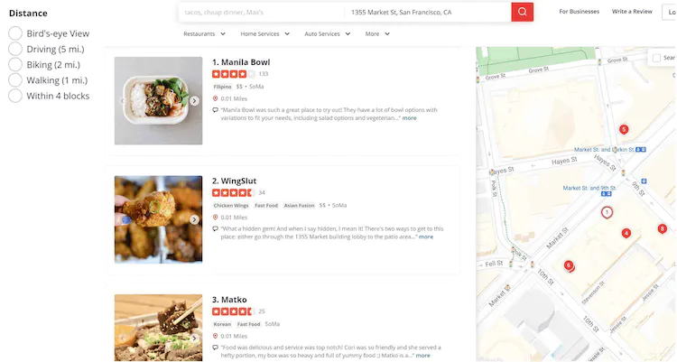

## 第 1 步 - 了解问题并确定设计范围

Yelp 支持许多功能，在面试过程中设计所有功能是不可行的，因此通过提问来缩小范围很重要。面试官和候选人之间的互动可能如下所示：

**候选人**：用户可以指定搜索半径吗？如果搜索半径内没有足够的商户，系统是否扩大搜索范围？
**面试官**：这是一个很好的问题。假设我们只关心指定半径内的业务。如果时间允许的话，我们可以讨论如果半径内没有足够的商家，如何扩大搜索范围。

**候选人**：允许的最大半径是多少？我可以假设它是 20 公里（12.5 英里）吗？
**面试官**：这是一个合理的假设。

**候选人**：用户可以更改 UI 上的搜索半径吗？
**面试官**：是的，我们有以下选择：0.5公里（0.31英里）、1公里（0.62英里）、2公里（1.24英里）、5公里（3.1英里）和20公里（12.42英里）。

**候选人**：如何添加、删除或更新业务信息？我们需要实时反映这些操作吗？
**面试官**：企业主可以添加、删除或更新企业。假设我们预先有一份业务协议，新添加/更新的业务将在第二天生效。

**候选人**：用户在使用应用程序/网站时可能会移动，因此一段时间后搜索结果可能会略有不同。我们是否需要刷新页面才能使结果保持最新？
**面试官**：假设用户的移动速度很慢，我们不需要不断刷新页面。

### 功能要求

基于这次对话，我们重点关注 3 个关键特征：

- 根据用户位置（纬度和经度对）和半径返回所有商家。
- 企业主可以添加、删除或更新企业，但这些信息不需要实时反映。
- 客户可以查看有关企业的详细信息。

### 非功能性需求

从业务需求中，我们可以推断出一系列非功能性需求。你还应该与面试官核实这些内容。

- 低延迟。用户应该能够快速看到附近的商家。
- 数据隐私。位置信息是敏感数据。当我们设计基于位置的服务（LBS）时，我们应该始终考虑到用户的隐私。我们需要遵守通用数据保护条例 (GDPR) [4] 和加州消费者隐私法案 (CCPA) [5] 等数据隐私法。
- 高可用性和可扩展性要求。我们应该确保我们的系统能够应对人口稠密地区高峰时段的流量高峰。

### 粗略估计

让我们看一下一些粗略的计算，以确定我们的解决方案需要解决的潜在规模和挑战。假设我们有 1 亿日活跃用户和 2 亿企业。

> **计算QPS**
>
> - 一天秒数 = 24 * 60 * 60 = 86,400。为了方便计算，我们可以将其四舍五入到 $10^5$。 **本书通篇使用 $10^5$**来表示一天中的秒数。
> - 假设用户每天进行 5 次搜索查询。
> - 搜索 QPS = 1 亿 * 5 / 10^5 = 5,000

## 第 2 步 - 提出高级设计并获得认可

在本节中，我们讨论以下内容：

- API设计
- 高层设计
- 寻找附近企业的算法
- 数据模型

### API设计

我们使用 RESTful API 约定来设计 API 的简化版本。

**GET /v1/search/nearby **

该端点根据某些搜索条件返回企业。在实际应用中，搜索结果通常是分页的。分页[6]不是本章的重点，但在采访中值得一提。

请求参数：

| **场地** | **描述**                              | **类型** |
| :------- | :------------------------------------ | :------- |
| 纬度     | 给定位置的纬度                        | 小数     |
| 经度     | 给定位置的经度                        | 小数     |
| 半径     | 选修的。默认值为 5000 米（约 3 英里） | 整数     |

响应体

```json
{
  "total": 10,
  "businesses":[{business object}]
}
```

业务对象包含呈现搜索结果页面所需的所有内容，但我们可能仍然需要其他属性（例如图片、评论、星级评定等）来呈现业务详细信息页面。因此，当用户点击业务详细信息页面时，通常需要一个新的端点调用来获取业务的详细信息。

**商业 API**

与业务对象相关的API如下表所示。

| API                         | Detail                 |
| :-------------------------- | :--------------------- |
| GET /v1/businesses/{:id}    | 返回有关企业的详细信息 |
| POST /v1/businesses         | 添加商家               |
| PUT /v1/businesses/{:id}    | 更新商家详细信息       |
| DELETE /v1/businesses/{:id} | 删除商家               |

如果你对用于地点/企业搜索的现实 API 感兴趣，两个示例是 Google Places API [7] 和 Yelp 业务端点 [8]。

### 数据模型

在本节中，我们讨论读/写比率和模式设计。深入探讨了数据库的可扩展性。

#### 读/写比率

阅读量高是因为以下两个功能非常常用：

- 搜索附近的企业。
- 查看企业的详细信息。

另一方面，由于添加、删除和编辑业务信息是不频繁的操作，因此写入量较低。

对于读取量大的系统，MySQL 等关系数据库可能是一个不错的选择。让我们仔细看看架构设计。

#### 数据模式

关键的数据库表是业务表和地理空间（geo）索引表。

**商务桌**

业务表包含有关业务的详细信息。如表3所示，主键为*business_id。*

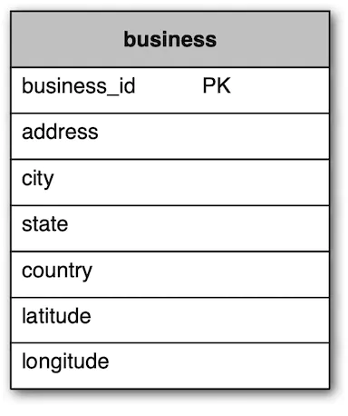

**地理索引表**

地理索引表用于高效处理空间操作。由于该表需要一些有关 geohash 的知识，因此我们将在深入探讨的“扩展数据库”部分中对其进行讨论。

### 高层设计

高层设计图如图2所示。该系统包括两部分：基于位置的服务（LBS）和业务相关的服务。让我们看一下系统的每个组件。

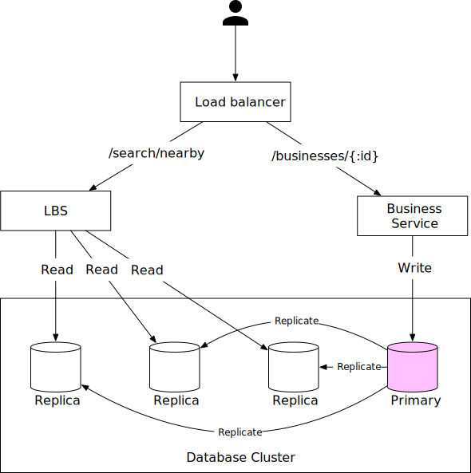

**负载均衡器**

负载均衡器自动在多个服务之间分配传入流量。通常，公司提供单个 DNS 入口点，并根据 URL 路径在内部将 API 调用路由到适当的服务。

**基于位置的服务（LBS）**

LBS服务是系统的核心部分，它可以在给定的半径和位置找到附近的商家。LBS具有以下特点：

- 这是一个重读服务，没有写请求。
- QPS较高，尤其是在密集区域的高峰时段。
- 该服务是无状态的，因此很容易水平扩展。

**商业服务**

业务服务主要处理两类请求：

- 企业主创建、更新或删除企业。这些请求主要是写操作，QPS不高。
- 客户查看有关企业的详细信息。高峰时段QPS较高。

**数据库集群**

数据库集群可以采用主从设置。在此设置中，主数据库处理所有写入操作，多个副本用于读取操作。数据首先保存到主数据库，然后复制到副本数据库。由于复制延迟，LBS读取的数据与写入主库的数据可能存在一定差异。这种不一致通常不是问题，因为业务信息不需要实时更新。

**业务服务和LBS的可扩展性**

业务服务和LBS都是无状态服务，因此很容易自动添加更多服务器以适应高峰流量（例如用餐时间）并在非高峰时段（例如睡眠时间）删除服务器。如果系统运行在云端，我们可以设置不同的区域和可用区，进一步提高可用性[9]。我们将在深入讨论中对此进行更多讨论。

### 获取附近商家的算法

在现实生活中，公司可能会使用现有的地理空间数据库，例如 Redis 中的 Geohash [10] 或带有 PostGIS 扩展的 Postgres [11]。在面试过程中，你不需要了解这些地理空间数据库的内部结构。最好通过解释地理空间索引的工作原理来展示你解决问题的能力和技术知识，而不是简单地抛出数据库名称。

下一步是探索获取附近企业的不同选项。我们将列出一些选项，回顾思考过程，并讨论权衡。

#### 选项一：二维搜索

获取附近商家最直观但最幼稚的方法是用预定义的半径画一个圆，然后找到圆内的所有商家，如图 3 所示。

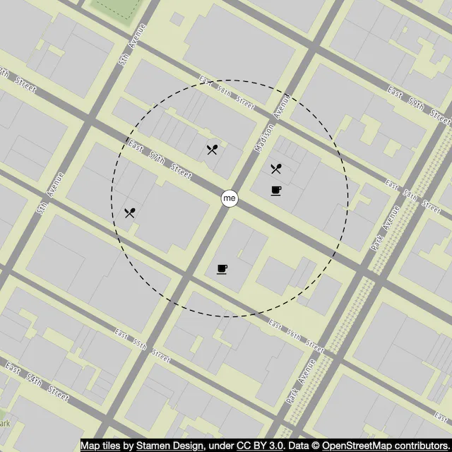

这个过程可以翻译成如下的伪SQL查询：

```sql
SELECT business_id, latitude, longitude,
FROM business
WHERE (latitude BETWEEN {:my_lat} - radius AND {:my_lat} + radius) AND
      (longitude BETWEEN {:my_long} - radius AND {:my_long} + radius)
```

这个查询效率不高，因为我们需要扫描整个表。如果我们在经度和纬度列上建立索引会怎么样？这样会提高效率吗？答案是相差不大。问题是我们有二维数据，并且从每个维度返回的数据集仍然可能很大。例如，如图 4 所示，借助经度和纬度列上的索引，我们可以快速检索数据集 1 和数据集 2。但为了获取半径内的企业，我们需要对这两个数据集执行相交操作。这效率不高，因为每个数据集都包含大量数据。

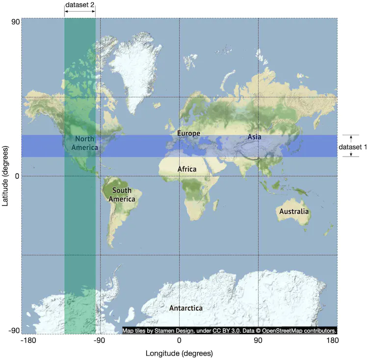

以前的方法的问题是数据库索引只能提高一个维度的搜索速度。那么很自然地，后续的问题是，我们能否将二维数据映射到一维？答案是肯定的。

在深入探讨答案之前，让我们先看一下不同类型的索引方法。从广义上讲，地理空间索引方法有两种类型，如图 5 所示。突出显示的是我们详细讨论的算法，因为它们在行业中常用。

- 哈希：均匀网格、geohash、笛卡尔层[12]等。
- 树：四叉树、Google S2、RTree [13] 等。

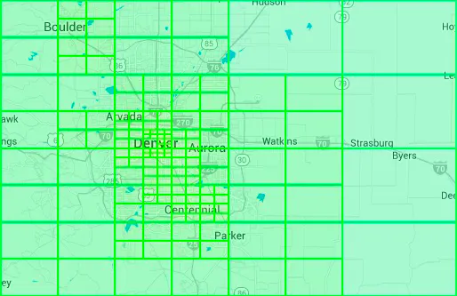

尽管这些方法的底层实现不同，但高层思想是相同的，即将地图划分为更小的区域并建立索引以进行快速搜索。其中，geohash、四叉树和 Google S2 在实际应用中应用最为广泛。让我们一一看看。

> 提示
>
> 在真实的面试中，你通常不需要解释索引选项的实现细节。然而，对地理空间索引的需求、它在高层次上如何工作以及它的局限性有一些基本的了解是很重要的。

#### 选项2：均匀划分网格

一种简单的方法是将世界均匀地划分为小网格（图 6）。这样，一个网格可以有多个商家，地图上的每个商家都属于一个网格。

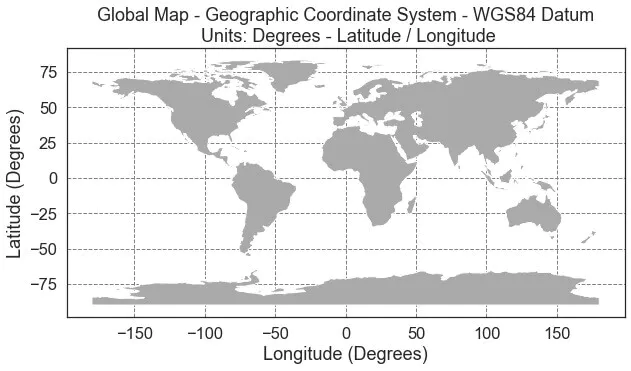

这种做法有一定效果，但有一个重大问题：业务分布不均匀。纽约市中心可能有很多业务，而沙漠或海洋中的其他电网根本没有业务。通过将世界划分为均匀的网格，我们产生了非常不均匀的数据分布。理想情况下，我们希望在密集区域使用更细粒度的网格，在稀疏区域使用大网格。另一个潜在的挑战是找到固定网格的相邻网格。

#### 选项 3：Geohash

Geohash 比均匀划分的网格选项更好。它的工作原理是将二维经度和纬度数据简化为一维字母和数字字符串。Geohash 算法的工作原理是递归地将世界划分为越来越小的网格，每个网格都附加一个位。让我们回顾一下 geohash 在高层次上是如何工作的。

首先，将地球沿着本初子午线和赤道分为四个象限。

- 纬度范围[-90, 0]用0表示
- 纬度范围[0, 90]用1表示
- 经度范围[-180, 0]用0表示
- 经度范围[0, 180]用1表示

其次，将每个网格划分为四个较小的网格。每个网格可以通过经度位和纬度位之间的交替来表示。

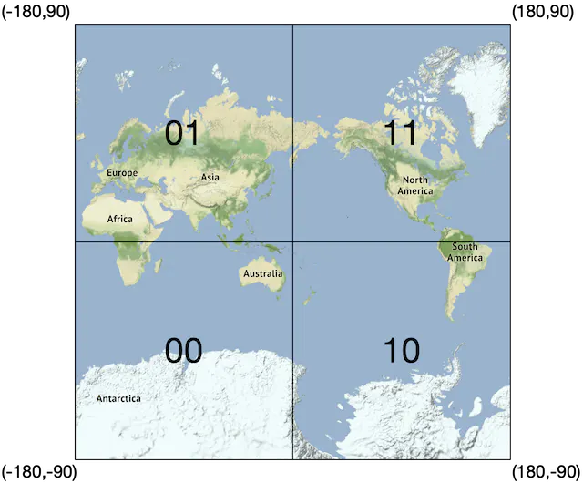

重复此细分，直到网格大小达到所需的精度。Geohash通常使用base32表示[15]。让我们看两个例子。

- Google总部的Geohash（长度=6）：
  - ```1001 10110 01001 10000 11011 11010 (base32 in binary) → 9q9hvu (base32)```
- Facebook总部的Geohash（长度=6）：
  - ```1001 10110 01001 10001 10000 10111 (base32 in binary) → 9q9jhr (base32)```

Geohash 有 12 个精度（也称为级别），如表 4 所示。精度因子决定了网格的大小。我们只对长度在 4 到 6 之间的 geohash 感兴趣。这是因为当它长度超过 6 时，网格尺寸太小，而如果它小于 4，则网格尺寸太大（参见表 4）。

| 地理哈希长度 | 网格宽度 x 高度                           |
| :----------- | :---------------------------------------- |
| 1            | 5,009.4 公里 x 4,992.6 公里（地球的大小） |
| 2            | 1,252.3公里 x 624.1公里                   |
| 3            | 156.5公里×156公里                         |
| 4            | 39.1公里×19.5公里                         |
| 5            | 4.9公里×4.9公里                           |
| 6            | 1.2公里×609.4米                           |
| 7            | 152.9米×152.4米                           |
| 8            | 38.2米×19米                               |
| 9            | 4.8米×4.8米                               |
| 10           | 1.2米×59.5厘米                            |
| 11           | 14.9 厘米 x 14.9 厘米                     |
| 12           | 3.7厘米×1.9厘米                           |

我们如何选择合适的精度？我们想要找到覆盖由用户定义的半径绘制的整个圆的最小 geohash 长度。geohash的半径和长度的对应关系如下表所示。

| 半径（公里）          | 地理哈希长度 |
| :-------------------- | :----------- |
| 0.5 公里（0.31 英里） | 6            |
| 1 公里（0.62 英里）   | 5            |
| 2 公里（1.24 英里）   | 5            |
| 5 公里（3.1 英里）    | 4            |
| 20 公里（12.42 英里） | 4            |

这种方法在大多数情况下都很有效，但是有一些关于如何处理 geohash 边界的边缘情况，我们应该与面试官讨论。

**边界问题**

Geohashing 保证两个 geohashes 之间的共享前缀越长，它们就越接近。如图 9 所示，所有网格都有一个共享前缀：9q8zn。

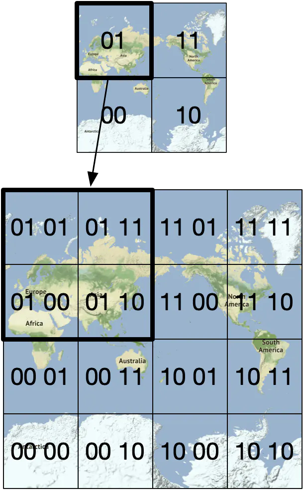

**边界问题1**

然而，反之则不然：两个位置可能非常接近，但根本没有共享前缀。这是因为赤道或本初子午线两侧的两个邻近位置属于世界的不同“一半”。例如，在法国，La Roche-Chalais（geohash：u000）距离波美侯（geohash：ezzz）仅 30 公里，但他们的 geohash 根本没有共享前缀 [17]。

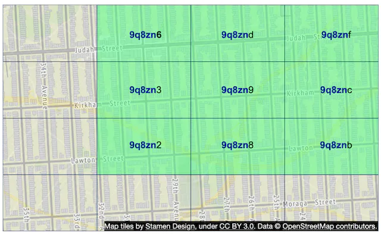

由于此边界问题，下面的简单前缀 SQL 查询将无法获取所有附近的企业。

```sql
SELECT * FROM geohash_index WHERE geohash LIKE `9q8zn%`
```

**边界问题2**

另一个边界问题是两个位置可以具有很长的共享前缀，但它们属于不同的 geohashes，如图 11 所示。

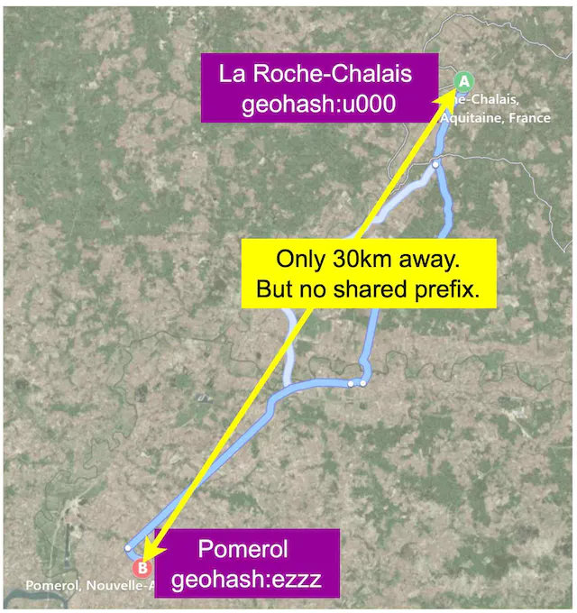

一个常见的解决方案是不仅获取当前网格内的所有企业，还获取其邻居的所有企业。邻居的 geohash 可以在常数时间内计算出来，更多细节可以在这里找到 [17]。

**企业不够多**

现在让我们解决奖金问题。如果当前网格和所有邻居加起来返回的企业数量不够怎么办？

方案一：仅返回半径内的商家。这个选项很容易实现，但缺点也很明显。它没有返回足够的结果来满足用户的需求。

选项2：增加搜索半径。我们可以删除 geohash 的最后一位数字并使用新的 geohash 来获取附近的企业。如果业务不够，我们会继续扩大范围，再去掉一个数字。这样，网格大小逐渐扩大，直到结果大于所需的结果数。图 12 显示了扩展搜索过程的概念图。

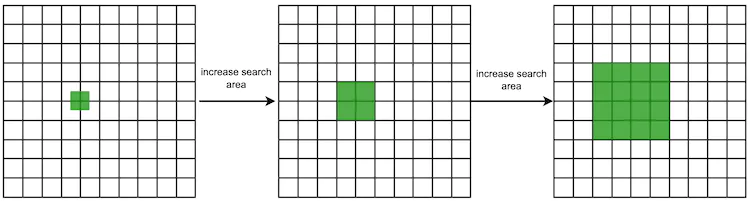

#### 选项 4：四叉树

另一种流行的解决方案是四叉树。四叉树[18]是一种数据结构，通常用于通过递归地将二维空间细分为四个象限（网格）直到网格的内容满足特定标准来划分二维空间。例如，标准可以是继续细分，直到网格中的业务数量不超过100个。这个数量是任意的，实际数量可以根据业务需求来确定。使用四叉树，我们构建内存中的树结构来回答查询。请注意，**四叉树是一种内存数据结构，而不是数据库解决方案**。它运行在每个LBS服务器上，数据结构是在服务器启动时构建的。

下图直观地展示了将世界细分为四叉树的概念过程。假设世界上有 2 亿（百万）家企业。

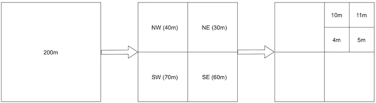

图 14 更详细地解释了四叉树构建过程。根节点代表整个世界地图。根节点递归地分解为4个象限，直到没有留下超过100个企业的节点。

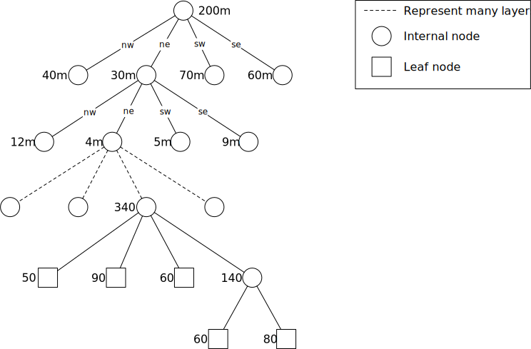

构建四叉树的伪代码如下所示：

```java
public void buildQuadtree(TreeNode node) {
    if (countNumberOfBusinessesInCurrentGrid(node) > 100) {
        node.subdivide();
        for (TreeNode child : node.getChildren()) {
            buildQuadtree(child);
        }
    }
}
```

要回答这个问题，我们需要知道存储的是什么类型的数据。

**叶节点上的数据**

| **姓名**                             | **尺寸**                                          |
| :----------------------------------- | :------------------------------------------------ |
| 用于识别网格的左上角坐标和右下角坐标 | 32字节（8字节*4）                                 |
| 网格中的企业 ID 列表                 | 每个ID 8字节* 100（一个网格中允许的最大企业数量） |
| 全部                                 | 832字节                                           |

**内部节点数据**

| **姓名**                             | **尺寸**          |
| :----------------------------------- | :---------------- |
| 用于识别网格的左上角坐标和右下角坐标 | 32字节（8字节*4） |
| 指向4个孩子的指针                    | 32字节（8字节*4） |
| 全部                                 | 64字节            |

尽管树的构建过程取决于网格内的企业数量，但该数量不需要存储在四叉树节点中，因为它可以从数据库中的记录推断出来。

现在我们知道了每个节点的数据结构，让我们看一下内存使用情况。

- 每个网格最多可存储100个商家
- 叶节点数量 = ~2 亿 / 100 = ~2 百万
- 内部节点数 = 200 万 * 1/3 = ~67 万。如果你不知道为什么内部节点的数量是叶子节点的三分之一，请阅读参考资料[19]。
- 总内存需求 = 200 万 * 832 字节 + 67 万 * 64 字节 = ~1.71 GB。即使我们增加一些开销来构建树，构建树的内存需求也相当小。

在真正的面试中，我们不应该需要如此详细的计算。这里的关键要点是四叉树索引不会占用太多内存，并且可以轻松适合一台服务器。这是否意味着我们应该只使用一台服务器来存储四叉树索引？答案是不。根据读取量，单个四叉树服务器可能没有足够的 CPU 或网络带宽来服务所有读取请求。如果是这种情况，则有必要在多个四叉树服务器之间分散读取负载。

**构建整个四叉树需要多长时间？**

每个叶子节点包含大约100个业务ID。构建树的时间复杂度为*(N/100) lg(N/100)*，其中*N*是企业总数。构建包含 2 亿个企业的整个四叉树可能需要几分钟的时间。

**如何使用四叉树获取附近的商家？**

1. 在内存中构建四叉树。
2. 四叉树构建完成后，从根开始搜索，遍历整棵树，直到找到搜索原点所在的叶子节点。如果该叶节点有 100 个业务，则返回该节点。否则，添加其邻居的企业，直到返回足够的企业。

**四叉树的操作注意事项**

上面提到，在服务器启动的时候，构建一个有2亿个业务的四叉树可能需要几分钟的时间。考虑如此长的服务器启动时间对操作的影响非常重要。在构建四叉树时，服务器无法提供流量。因此，我们应该一次向一小部分服务器增量推出新版本的服务器。这可以避免大量服务器集群脱机并导致服务中断。也可以使用蓝/绿部署[20]，但是整个新服务器集群从数据库服务中同时获取2亿个业务会给系统带来很大的压力。这是可以做到的，但它可能会使设计复杂化，你应该在面试中提到这一点。

另一个操作考虑因素是随着业务随着时间的推移添加和删除，如何更新四叉树。最简单的方法是在整个集群中增量重建四叉树，一次一小部分服务器。但这意味着某些服务器会在短时间内返回过时的数据。然而，根据要求，这通常是可接受的折衷方案。通过建立业务协议，新添加/更新的业务仅在第二天生效，可以进一步缓解这种情况。这意味着我们可以使用夜间作业更新缓存。这种方法的一个潜在问题是大量密钥将同时失效，从而导致缓存服务器负载过重。

随着业务的添加和删除，也可以动态更新四叉树。这无疑使设计变得复杂，特别是如果四叉树数据结构可以由多个线程访问的话。这将需要一些锁定机制，这可能会使四叉树的实现变得非常复杂。

**现实世界的四叉树示例**

Yext 提供了一张图像（图 15），显示了丹佛附近构造的四叉树 [21]。我们希望为密集区域提供更小、更细粒度的网格，为稀疏区域提供更大的网格。


#### 选项 5：谷歌 S2

Google S2 几何库 [22] 是该领域的另一个重要参与者。与四叉树类似，它是一种内存中解决方案。它将球体映射到基于希尔伯特曲线（空间填充曲线）的一维索引[23]。希尔伯特曲线有一个非常重要的属性：希尔伯特曲线上彼此靠近的两个点在一维空间中很接近（图 16）。一维空间上的搜索比二维空间上的搜索效率高得多。有兴趣的读者可以使用希尔伯特曲线的在线工具[24]。

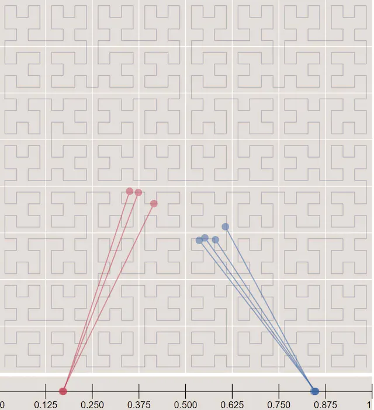

S2 是一个复杂的库，你不需要在面试中解释它的内部结构。但由于它在 Google、Tinder 等公司中广泛使用，因此我们将简要介绍其优点。

- S2 非常适合地理围栏，因为它可以覆盖不同级别的任意区域（图 17）。根据维基百科的说法，“地理围栏是现实世界地理区域的虚拟边界。地理围栏可以动态生成——如围绕点位置的半径，或者地理围栏可以是一组预定义的边界（例如学校区域或社区边界）”[25]。

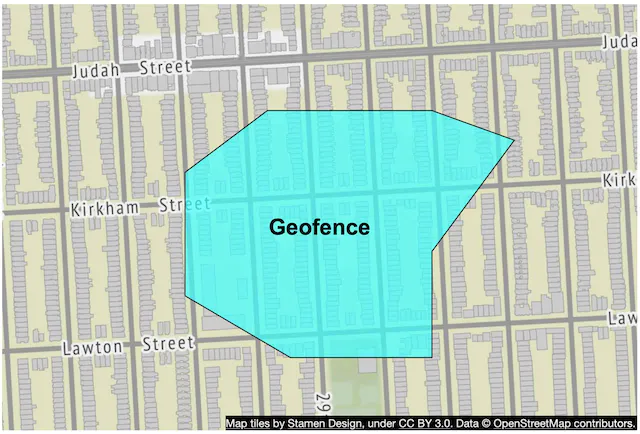

- 地理围栏使我们能够定义感兴趣区域的周界，并向不在该区域的用户发送通知。这比仅仅返回附近的企业可以提供更丰富的功能。
- S2 的另一个优点是它的区域覆盖算法 [26]。我们可以在 S2 中指定最小级别、最大级别和最大单元格，而不是像 geohash 那样具有固定级别（精度）。S2 返回的结果更加精细，因为像元大小是灵活的。如果你想了解更多信息，请查看 S2 工具 [26]。

#### 推荐

为了有效地查找附近的企业，我们讨论了几个选项：geohash、四叉树和 S2。从表8可以看出，不同的公司或技术采用不同的选择。

| **地理索引**     | **公司**                                            |
| :--------------- | :-------------------------------------------------- |
| 地理哈希         | Bing 地图 [27]、Redis [10]、MongoDB [28]、Lyft [29] |
| 四叉树           | 耶克斯特 [21]                                       |
| Geohash 和四叉树 | 弹性搜索 [30]                                       |
| S2               | 谷歌地图、Tinder [31]                               |

表 8 不同类型的地理索引

在面试时，我们建议选择**geohash或四叉树**，因为S2在面试中比较复杂，很难解释清楚。

#### Geohash 与四叉树

在结束本节之前，让我们快速比较一下 geohash 和四叉树。

**地理哈希**

- 易于使用和实施。无需建造一棵树。
- 支持指定半径内的回访商家。
- 当geohash的精度（级别）固定时，网格的大小也固定。它无法根据人口密度动态调整网格大小。需要更复杂的逻辑来支持这一点。
- 更新索引很容易。例如，要从索引中删除某个业务，我们只需要将其从具有相同*geohash*和*business_id*的相应行中删除即可。具体示例请参见图 18。

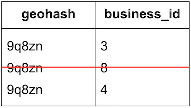

**四叉树**

- 实施起来稍微困难一些，因为它需要构建树。
- 支持获取k最近的商家。有时我们只想返回k-最近的商家，而不关心商家是否在指定半径内。例如，当你旅行时，你的汽车油量不足，你只想找到最近的 k 个加油站。这些加油站可能不在你附近，但应用程序需要返回最近的 k 个结果。对于这种类型的查询，四叉树是一个很好的选择，因为它的细分过程是基于数字k的，并且它可以自动调整查询范围，直到返回k个结果。
- 它可以根据人口密度动态调整网格大小（参见图 15 中的丹佛示例）。
- 更新索引比geohash更复杂。四叉树是一种树结构。如果删除某个业务，我们需要从根节点遍历到叶子节点，以删除该业务。例如，如果我们要删除 ID = 2 的业务，我们必须从根节点一直向下移动到叶子节点，如图 19 所示。更新索引需要 O(logn) ，但*实现*是如果数据结构由多线程程序访问，则情况会很复杂，因为需要锁定。此外，重新平衡树可能很复杂。例如，如果叶节点没有空间容纳新的添加，则需要重新平衡。一个可能的解决方法是过度分配范围。

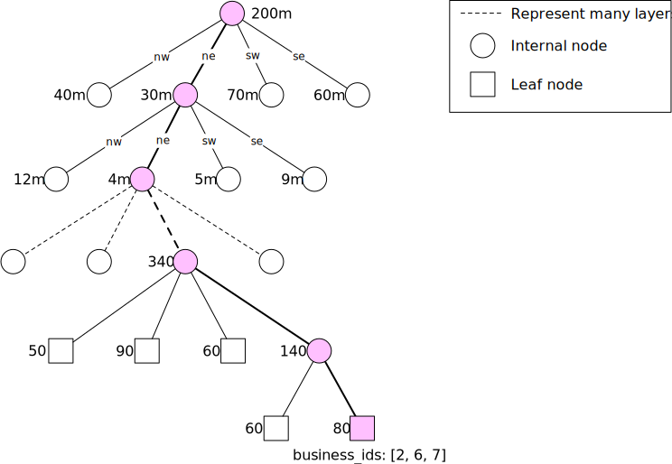

## 第 3 步 - 深入设计

现在你应该对整个系统有了一个很好的了解。现在让我们更深入地探讨几个领域。

- 扩展数据库
- 缓存
- 区域和可用区
- 按时间或业务类型过滤结果
- 最终架构图

### 扩展数据库

我们将讨论如何扩展两个最重要的表：业务表和地理空间索引表。

#### 商务桌

业务表的数据可能无法全部容纳在一台服务器中，因此它是分片的良好候选者。最简单的方法是按业务 ID 对所有内容进行分片。这种分片方案确保负载均匀分布在所有分片上，并且操作上易于维护。

#### 地理空间索引表

geohash 和四叉树都被广泛使用。由于geohash的简单性，我们以它为例。有两种方法可以构建该表。

选项 1：对于每个 geohash 键，单行中有一个包含业务 ID 的 JSON 数组。这意味着 geohash 中的所有业务 ID 都存储在一行中。

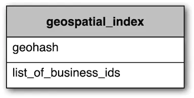

选项 2：如果同一个 geohash 中有多个企业，则会有多行，每个企业一行。这意味着 geohash 中的不同业务 ID 存储在不同的行中。

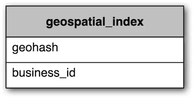

以下是选项 2 的一些示例行。

| geohash | business_id |
| :------ | :---------- |
| 32feac  | 343         |
| 32feac  | 347         |
| f3lcad  | 112         |
| f3lcad  | 113         |

**建议**：我们推荐选项 2，原因如下：

对于选项 1，要更新业务，我们需要获取business_ids数组并扫描整个数组以查找要更新的业务。当插入新业务时，我们必须扫描整个数组以确保没有重复项。我们还需要锁定该行以防止并发更新。有很多边缘情况需要处理。

对于选项2，如果我们有两列，复合键为（*geohash，business_id*），则添加和删除业务非常简单。不需要锁定任何东西。

**缩放地理空间索引**

缩放地理空间索引的一个常见错误是快速跳转到分片方案而不考虑表的实际数据大小。在我们的例子中，地理空间索引表的完整数据集并不大（四叉树索引仅占用 1.71G 内存，并且 geohash 索引的存储要求类似）。整个地理空间索引可以轻松适应现代数据库服务器的工作集。但是，根据读取量，单个数据库服务器可能没有足够的 CPU 或网络带宽来处理所有读取请求。如果是这种情况，就需要在多个数据库服务器之间分散读取负载。

有两种通用方法可以分散关系数据库服务器的负载。我们可以添加只读副本，或者对数据库进行分片。

很多工程师在面试时喜欢谈论分片。然而，它可能不太适合 geohash 表，因为分片很复杂。例如，分片逻辑必须添加到应用层。有时，分片是唯一的选择。但在这种情况下，所有内容都可以放入数据库服务器的工作集中，因此没有强有力的技术理由将数据分片到多个服务器之间。

在这种情况下，更好的方法是使用一系列只读副本来帮助读取负载。这种方法的开发和维护要简单得多。因此，建议通过副本扩展地理空间索引表。

### 缓存

在引入缓存层之前我们要问自己，我们真的需要缓存层吗？

缓存是一个坚实的胜利并不是立即显而易见的：

- 读取工作量较大，数据集相对较小。这些数据可以适合任何现代数据库服务器的工作集。因此，查询不受 I/O 限制，并且它们的运行速度几乎与内存缓存一样快。
- 如果读性能是瓶颈，我们可以添加数据库只读副本来提高读吞吐量。

与面试官讨论缓存时要小心，因为这需要仔细的基准测试和成本分析。如果你发现缓存确实符合业务需求，那么你可以继续讨论缓存策略。

#### 缓存键

最直接的缓存键选择是用户的位置坐标（纬度和经度）。然而，这种选择有几个问题：

- 从手机返回的位置坐标并不准确，因为它们只是最佳估计[32]。即使你不动，每次在手机上获取坐标时结果也可能略有不同。
- 用户可以从一个位置移动到另一个位置，从而导致位置坐标略有变化。对于大多数应用程序来说，这种改变没有意义。

因此，位置坐标并不是一个好的缓存键。理想情况下，位置的微小变化仍应映射到相同的缓存键。前面提到的 geohash/四叉树解决方案很好地处理了这个问题，因为网格内的所有业务都映射到同一个 geohash。

#### 要缓存的数据类型

如表12所示，有两类数据可以被缓存以提高系统的整体性能：

| **钥匙** | **价值**             |
| :------- | :------------------- |
| 地理哈希 | 网格中的企业 ID 列表 |
| 业务_id  | 业务对象             |

**网格中的企业 ID 列表**

由于业务数据相对稳定，我们预先计算给定 geohash 的业务 ID 列表，并将其存储在 Redis 等键值存储中。让我们看一个让附近企业启用缓存的具体示例。

1. 获取给定 geohash 的企业 ID 列表。

```sql
SELECT business_id FROM geohash_index WHERE geohash LIKE `{:geohash}%`
```

2. 如果缓存未命中，则将结果存储在 Redis 缓存中。

```java
public List<String> getNearbyBusinessIds(String geohash) {
    String cacheKey = hash(geohash);
    List<string> listOfBusinessIds = Redis.get(cacheKey);
    if (listOfBusinessIDs  == null) {
        listOfBusinessIds = Run the select SQL query above;
        Cache.set(cacheKey, listOfBusinessIds, "1d");
    }
    return listOfBusinessIds;
}
```

当添加、编辑或删除新业务时，数据库会更新，缓存会失效。由于这些操作的量相对较小，并且geohash方法不需要锁定机制，因此更新操作很容易处理。

根据需要，用户可以在客户端选择以下4个半径：500m、1km、2km、5km。这些半径分别映射到 geohash 长度 4、5、5 和 6。为了快速获取不同半径的附近企业，我们在 Redis 中以所有三种精度（geohash_4、geohash_5 和 geohash_6）缓存数据。

前面提到，我们有2亿个业务，每个业务在给定的精度下属于1个网格。因此所需的总内存为：

- Redis 值的存储：8 字节 * 2 亿 * 3 精度 = ~5 GB
- Redis 键的存储：可以忽略不计
- 所需总内存：~5 GB

从内存使用的角度来看，我们可以摆脱一台现代 Redis 服务器的束缚，但为了确保高可用性并减少跨大陆延迟，我们在全球范围内部署了 Redis 集群。给定估计的数据大小，我们可以在全球部署相同的缓存数据副本。在我们的最终架构图中，我们将此 Redis 缓存称为“Geohash”（图 21）。

**在客户端呈现页面所需的业务数据**

这种类型的数据很容易缓存。键是business_id，值是包含企业名称、地址、图像 URL 等的业务对象。在最终架构图中，我们将此 Redis 缓存称为“业务信息”（图 21）。

### 区域和可用区

我们将基于位置的服务部署到多个区域和可用区，如图 21 所示。这有一些优点：

- 使用户在物理上与系统“更接近”。来自美国西部的用户连接到该地区的数据中心，来自欧洲的用户连接到欧洲的数据中心。
- 使我们能够灵活地在人群中均匀分布流量。日本、韩国等一些地区人口密度较高。将它们放置在不同的区域，甚至在多个可用区域中部署基于位置的服务以分散负载可能是明智的。
- 隐私法。一些国家可能要求在本地使用和存储用户数据。在这种情况下，我们可以在该国家/地区设置一个区域，并使用 DNS 路由来限制来自该国家/地区的所有请求仅发送到该区域。

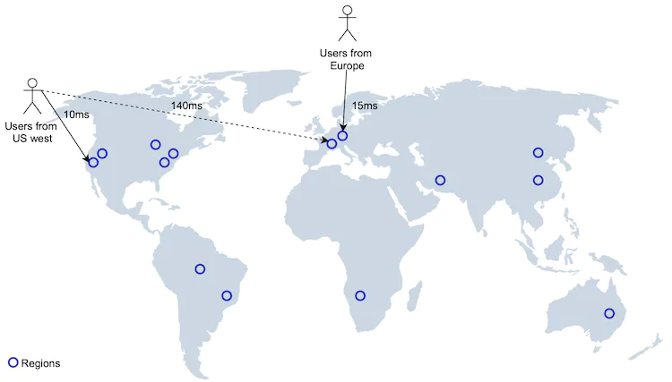

### 后续问题：按时间或业务类型过滤结果

面试官可能会问一个后续问题：如何返回正在营业的企业，或者仅返回餐馆企业？

**候选**：当用geohash或者四叉树将世界划分成小网格时，搜索结果返回的商家数量相对较少。因此，可以先返回业务ID，对业务对象进行水合，然后根据开业时间或业务类型进行过滤。该解决方案假设营业时间和业务类型存储在业务表中。

### 最终设计图

将所有内容放在一起，我们得出以下设计图。

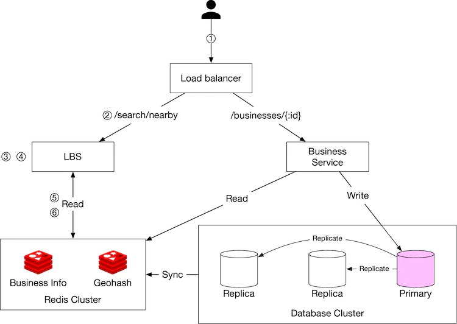

#### 获取附近商家

1. 你尝试在 Yelp 上查找 500 米范围内的餐馆。客户端将用户位置（纬度 = 37.776720，经度 = -122.416730）和半径（500m）发送到负载均衡器。
2. 负载均衡器将请求转发给LBS。
3. 根据用户位置和半径信息，LBS 找到与搜索匹配的 geohash 长度。通过检查表5，500m映射到geohash长度=6。
4. LBS 计算相邻的 geohashes 并将它们添加到列表中。结果如下所示：list_of_geohashes = [my_geohash，neighbor1_geohash，neighbor2_geohash，...，neighbor8_geohash]。
5. 对于 list_of_geohashes 中的每个geohash ，LBS调用“Geohash”Redis服务器来获取相应的业务ID。可以并行进行为每个 geohash 获取业务 ID 的调用，以减少延迟。
6. 根据返回的商家ID列表，LBS从“商家信息”Redis服务器中获取充分水合的商家信息，然后计算用户与商家之间的距离，并对其进行排名，并将结果返回给客户端。

#### 查看、更新、添加或删除商家

所有业务相关的API都与LBS分离。要查看业务的详细信息，业务服务首先检查数据是否存储在“业务信息”Redis 缓存中。如果是，缓存的数据将返回给客户端。如果没有，则从数据库集群中获取数据，然后存储到Redis缓存中，以便后续请求可以直接从缓存中获取结果。

由于我们有一个预先的业务协议，新添加/更新的业务将在第二天生效，因此缓存的业务数据由夜间作业更新。

## 第 4 步 - 总结

在本章中，我们介绍了邻近服务的设计。该系统是一个典型的利用地理空间索引的LBS。我们讨论了几个索引选项：

- 二维搜索
- 均匀划分的网格
- 地理哈希
- 四叉树
- 谷歌S2

Geohash、四叉树和 S2 被不同的科技公司广泛使用。我们选择 geohash 作为示例来展示地理空间索引的工作原理。

在深入研究中，我们讨论了为什么缓存可以有效减少延迟、应该缓存什么以及如何使用缓存快速检索附近的业务。我们还讨论了如何通过复制和分片来扩展数据库。

然后，我们考虑在不同的区域和可用区部署 LBS，以提高可用性，使用户在物理上更接近服务器，并更好地遵守当地的隐私法。

恭喜你已经走到这一步了！现在拍拍自己的背吧。非常好！

## 章节总结

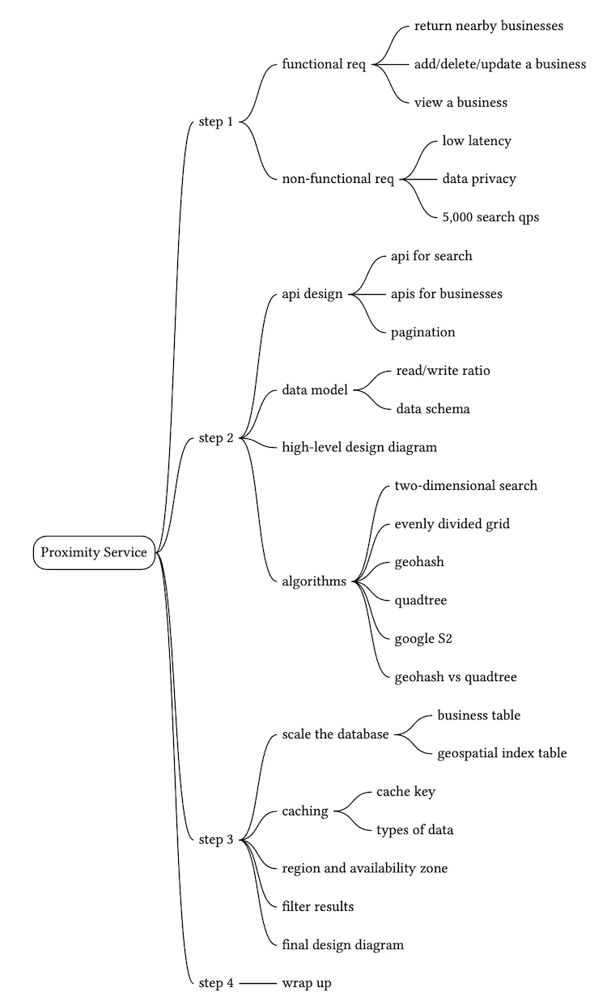

## 参考资料

[1] Yelp：[https://www.yelp.com/](https://www.yelp.com/)

[2] Stamen Design 的地图图块：
http://maps.stamen.com/

[3] OpenStreetMap：[https://www.openstreetmap.org](https://www.openstreetmap.org/)

[4] GDPR： https: [//en.wikipedia.org/wiki/General_Data_Protection_Regulation](https://en.wikipedia.org/wiki/General_Data_Protection_Regulation)

[5] CCPA： https: [//en.wikipedia.org/wiki/California_Consumer_Privacy_Act](https://en.wikipedia.org/wiki/California_Consumer_Privacy_Act)

[6] REST API 中的分页：
https://developer.atlassian.com/server/confluence/pagination-in-the-rest-api/

[7] 谷歌地点 API：[https ://developers.google.com/maps/documentation/places/web-service/search](https://developers.google.com/maps/documentation/places/web-service/search)

[8] Yelp 业务端点：
https://www.yelp.com/developers/documentation/v3/business_search

[9] 区域和可用区：
https://docs.aws.amazon.com/AWSEC2/latest/UserGuide/using-regions-availability-zones.html

[10]Redis GEOHASH：https://redis.io/commands/GEOHASH

[11]POSTGIS：https://postgis.net/

[12] 笛卡尔层：http://www.nsshutdown.com/projects/lucene/whitepaper/locallucene_v2.html

[13] R-树：https://en.wikipedia.org/wiki/R-tree

[14] 地理坐标参考系中的全球地图：
https://bit.ly/3DsjAwg

[15]Base32： [https://en.wikipedia.org/wiki/Base32](https://en.wikipedia.org/wiki/Base32)

[16] Geohash网格聚合：https://bit.ly/3kKl4e6

[17] Geohash：https://www.movable-type.co.uk/scripts/geohash.html

[18] 四叉树：https://en.wikipedia.org/wiki/Quadtree

[19] 四叉树有多少片叶子：
https://stackoverflow.com/questions/35976444/how-many-leaves-has-a-quadtree

[20]蓝绿部署：https://martinfowler.com/bliki/BlueGreenDeployment.html

[21] 使用四叉树改进位置缓存：
https://engblog.yext.com/post/geolocation-caching

[22]S2： [https://s2geometry.io/](https://s2geometry.io/)

[23] 希尔伯特曲线：https://en.wikipedia.org/wiki/Hilbert_curve

[24] 希尔伯特映射：http://bit-player.org/extras/hilbert/hilbert-mapping.html

[25] 地理围栏：https://en.wikipedia.org/wiki/Geo-fence

[26] 区域覆盖：https://s2.sidewalklabs.com/regioncoverer/

[27] Bing地图：https://bit.ly/30ytSfG

[28]MongoDB：https://docs.mongodb.com/manual/tutorial/build-a-2d-index/

[29] 地理空间索引：为 Lyft 提供支持的 1000 万 QPS Redis 架构：
[https://www.youtube.com/watch?v =cSFWlF96Sds&t=2155s](https://www.youtube.com/watch?v=cSFWlF96Sds&t=2155s)

[30] 地理形状类型：
https://www.elastic.co/guide/en/elasticsearch/reference/1.6/mapping-geo-shape-type.html

[31] Geosharded 建议第 1 部分：分片方法：
https://medium.com/tinder-engineering/geosharded-recommendations-part-1-sharding-approach-d5d54e0ec77a

[32] 获取最后已知位置：
https://developer.android.com/training/location/retrieve-current#Challenges