在本章中，我们为名为“附近的朋友”的新移动应用程序功能设计了一个可扩展的后端系统。对于授予访问其位置权限的选择加入用户，移动客户端会显示地理位置附近的朋友列表。如果你正在寻找现实世界的示例，请参阅这篇文章 [1]，了解 Facebook 应用程序中的类似功能。

如果你阅读了“邻近服务”章节，你可能会想知道为什么我们需要单独的一章来设计“附近的朋友”，因为它看起来与邻近服务类似。但如果你仔细思考，你会发现重大差异。在邻近服务中，企业地址是静态的，因为它们的位置不会改变，而在“附近的朋友”中，数据更加动态，因为用户位置经常改变。

## 第 1 步 - 了解问题并确定设计范围

Facebook 规模的任何后端系统都很复杂。在开始设计之前，我们需要提出澄清问题以缩小范围。

**候选人**：地理位置有多近才算“附近”？
**面试官**：5英里。这个数字应该是可配置的。

**候选人**：我可以假设该距离是按两个用户之间的直线距离计算的吗？例如，在现实生活中，用户之间可能有一条河流，导致行驶距离更长。
**面试官**：是的，这是一个合理的假设。

**候选人**：该应用程序有多少用户？我可以假设 10 亿用户中 10% 使用附近好友功能吗？
**面试官**：是的，这是一个合理的假设。

**候选人**：我们需要存储位置历史记录吗？
**面试官**：是的，位置历史记录对于机器学习等不同目的都很有价值。

**候选人**：我们是否可以假设，如果一个好友没有活动超过 10 分钟，该好友就会从附近的好友列表中消失？或者我们应该显示最后已知的位置？
**面试官**：我们可以假设不活跃的好友将不再显示。

**候选人**：我们需要担心 GDPR 或 CCPA 等隐私和数据法吗？
**面试官**：好问题。为简单起见，暂时不用担心。

### 功能要求

- 用户应该能够在他们的移动应用程序上看到附近的朋友。附近好友列表中的每个条目都有一个距离和一个指示该距离上次更新时间的时间戳。
- 附近的朋友列表应该每隔几秒钟更新一次。

### 非功能性需求

- 低延迟。及时接收来自朋友的位置更新非常重要。
- 可靠性。系统需要整体可靠，但偶尔的数据点丢失是可以接受的。
- 最终一致性。位置数据存储不需要强一致性。在不同副本中接收位置数据的几秒钟延迟是可以接受的。

### 粗略估计

让我们进行粗略估计，以确定我们的解决方案需要解决的潜在规模和挑战。下面列出了一些限制和假设：

- 附近的好友定义为位置在 5 英里半径范围内的好友。
- 位置刷新间隔为30秒。其原因是人类步行速度较慢（平均每小时3-4英里）。30秒内行驶的距离对“附近好友”功能没有太大影响。
- 平均每天有1亿用户使用“附近朋友”功能。
- 假设并发用户数为DAU的10%，那么并发用户数为1000万。
- 平均一个用户有 400 个好友。假设他们都使用“附近的朋友”功能。
- 该应用程序每页显示 20 个附近的朋友，并且可以根据请求加载更多附近的朋友。

> **计算QPS**
>
> - 1 亿日活跃用户
> - 并发用户数：10%*1亿=1000万
> - 用户每 30 秒报告一次他们的位置。
> - 位置更新 QPS = 1000 万 / 30 = ~334,000

## 第 2 步 - 提出高级设计并获得认可

在本节中，我们将讨论以下内容：

- 高层设计
- API设计
- 数据模型

在其他章节中，我们通常在高层设计之前讨论API设计和数据模型。然而，对于这个问题，客户端和服务器之间的通信协议可能不是简单的HTTP协议，因为我们需要将位置数据推送给所有朋友。如果不了解高层设计，就很难知道 API 是什么样的。因此，我们首先讨论高层设计。

### 高层设计

从较高的层面来看，这个问题需要一种具有高效消息传递的设计。从概念上讲，用户希望接收附近每个活跃朋友的位置更新。理论上，它可以纯粹点对点地完成，也就是说，用户可以与附近的所有其他活跃朋友保持持久连接（图 2）。

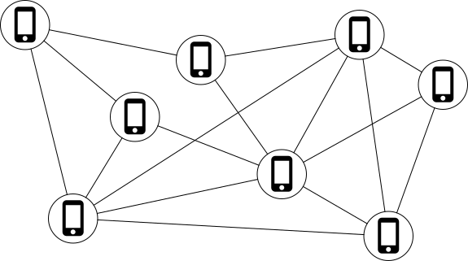

对于连接有时不稳定且功耗预算紧张的移动设备来说，该解决方案并不实用，但该想法为总体设计方向提供了一些启示。

更实用的设计应该有一个共享后端，如下所示：

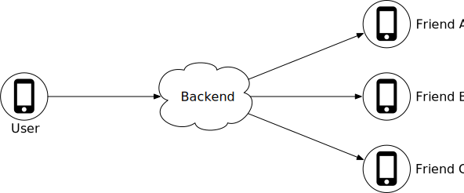

图3中后端的职责是什么？

- 接收来自所有活跃用户的位置更新。
- 对于每个位置更新，找到应接收该更新的所有活跃好友并将其转发到这些用户的设备。
- 如果两个用户之间的距离超过特定阈值，请勿将其转发到收件人的设备。

这听起来很简单。有什么问题吗？嗯，大规模地做到这一点并不容易。我们有 1000 万活跃用户。每个用户每 30 秒更新一次位置信息，每秒有 334K 次更新。如果平均每个用户有 400 个朋友，并且我们进一步假设其中大约 10% 的朋友在线并且在附近，则后端每秒转发 334K * 400 * 10% = 1400 万个位置更新。有很多更新需要转发。

#### 拟议设计

我们将首先为较低规模的后端提出一个高级设计。稍后在深入部分，我们将优化规模设计。

图4显示了应满足功能要求的基本设计。让我们回顾一下设计中的每个组件。

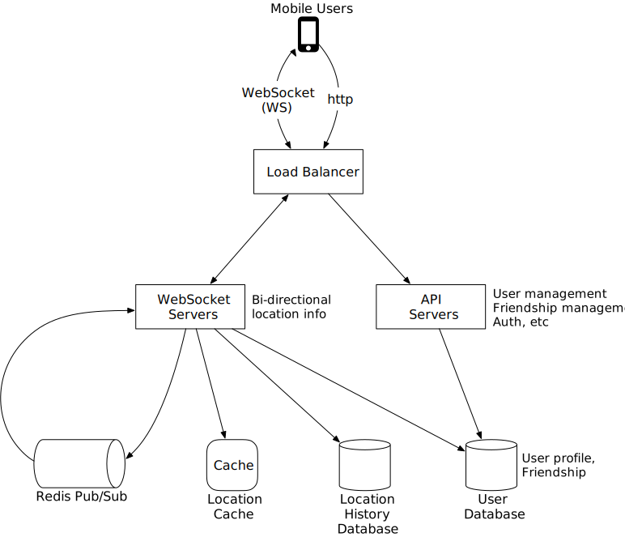

#### 负载均衡器

负载均衡器位于 RESTful API 服务器和有状态、双向 WebSocket 服务器的前面。它在这些服务器之间分配流量以均匀分布负载。

#### RESTful API 服务器

这是处理典型请求/响应流量的无状态 HTTP 服务器集群。API 请求流程如图 5 所示。该 API 层处理辅助任务，例如添加/删除好友、更新用户个人资料等。这些都很常见，我们不会详细介绍。

#### Websocket 服务器

这是一个有状态服务器集群，用于处理朋友位置的近乎实时更新。每个客户端都维护与这些服务器之一的持久 WebSocket 连接。当搜索半径内的朋友发出位置更新时，更新会通过此连接发送到客户端。

WebSocket 服务器的另一个主要职责是处理“附近的朋友”功能的客户端初始化。它会向移动客户端播种附近所有在线好友的位置。稍后我们将更详细地讨论如何完成此操作。

注意本章中的“WebSocket 连接”和“WebSocket 连接处理程序”可以互换。

#### Redis位置缓存

Redis 用于存储每个活跃用户的最新位置数据。缓存中的每个条目都设置了生存时间 (TTL)。当 TTL 过期时，用户不再处于活动状态，并且位置数据将从缓存中删除。每次更新都会刷新 TTL。也可以使用其他支持 TTL 的 KV 存储。

#### 用户数据库

用户数据库存储用户数据和用户好友关系数据。为此，可以使用关系数据库或 NoSQL 数据库。

#### 位置历史数据库

该数据库存储用户的历史位置数据。它与“附近朋友”功能没有直接关系。

#### Redis 发布/订阅服务器

Redis pub/sub [2] 是一个非常轻量级的消息总线。Redis pub/sub 中的通道创建起来非常便宜。具有 GB 内存的现代 Redis 服务器可以容纳数百万个通道（也称为主题）。图 6 显示了 Redis Pub/Sub 的工作原理。

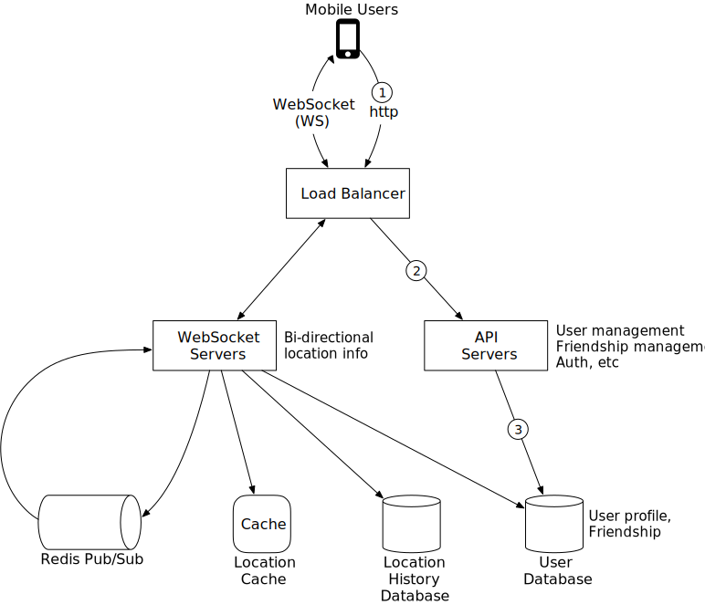

在此设计中，通过 WebSocket 服务器接收到的位置更新将发布到 Redis 发布/订阅服务器中用户自己的通道。每个活跃好友的专用 WebSocket 连接处理程序都会订阅该频道。当位置更新时，将调用 WebSocket 处理函数，并且对于每个活跃好友，该函数都会重新计算距离。如果新距离在搜索半径内，则新位置和时间戳将通过 WebSocket 连接发送到朋友的客户端。也可以使用其他具有轻量级通道的消息总线。

现在我们了解了每个组件的作用，让我们从系统的角度来检查当用户位置发生变化时会发生什么。

### 定期位置更新

移动客户端通过持久的 WebSocket 连接发送定期位置更新。流程如图7所示。

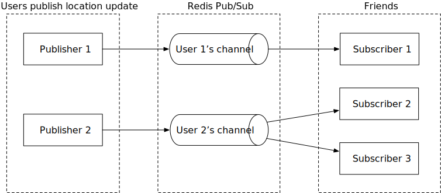

1. 移动客户端向负载均衡器发送位置更新。
2. 负载均衡器将位置更新转发到该客户端的 WebSocket 服务器上的持久连接。
3. WebSocket服务器将位置数据保存到位置历史数据库中。
4. WebSocket 服务器更新位置缓存中的新位置。更新会刷新 TTL。WebSocket 服务器还将新位置保存在用户 WebSocket 连接处理程序的变量中，以供后续距离计算。
5. WebSocket 服务器将新位置发布到 Redis 发布/订阅服务器中的用户通道。步骤3到5可以并行执行。
6. 当 Redis pub/sub 在通道上收到位置更新时，它会将更新广播给所有订阅者（WebSocket 连接处理程序）。在这种情况下，订阅者是发送更新的用户的所有在线好友。对于每个订阅者（即，对于用户的每个朋友），其 WebSocket 连接处理程序将接收用户位置更新。
7. 接收到消息后，连接处理程序所在的 WebSocket 服务器会计算发送新位置的用户（位置数据位于消息中）和订阅者（位置数据存储在 WebSocket 变量中）之间的距离。订阅者的连接处理程序）。
8. 这一步没有画在图上。如果距离不超过搜索半径，则新位置和最后更新的时间戳将发送到订阅者的客户端。否则，更新将被删除。

由于理解这个流程非常重要，所以让我们通过一个具体示例再次检查它，如图 8 所示。在开始之前，让我们做一些假设。

- 用户1的好友：用户2、用户3、用户4。
- 用户5的好友：用户4和用户6。

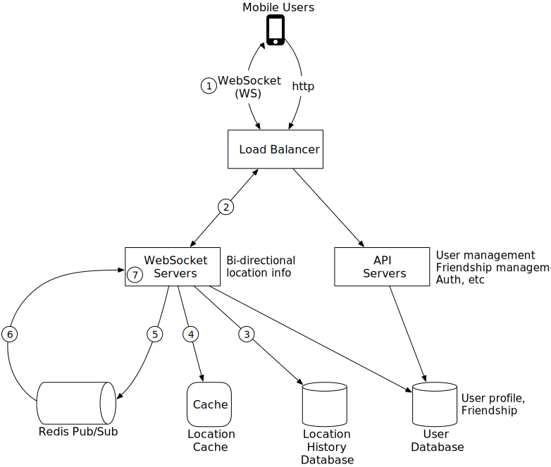

1. 当用户 1 的位置发生变化时，其位置更新将发送到保存用户 1 连接的 WebSocket 服务器。
2. 该位置已发布到 Redis 发布/订阅服务器中用户 1 的频道。
3. Redis 发布/订阅服务器向所有订阅者广播位置更新。在本例中，订阅者是 WebSocket 连接处理程序（用户 1 的朋友）。
4. 如果发送位置的用户（用户 1）和订阅者（用户 2）之间的距离不超过搜索半径，则新位置将发送到客户端（用户 2）。

对于频道的每个订阅者都会重复此计算。由于平均有 400 个朋友，并且我们假设其中 10% 在线并且在附近，因此每个用户的位置更新大约需要转发 40 个位置更新。

### API设计

现在我们已经创建了高级设计，让我们列出所需的 API。

**WebSocket**：用户通过 WebSocket 协议发送和接收位置更新。至少，我们需要以下 API。

**1. 定期位置更新**

请求：客户端发送纬度、经度和时间戳。

回应：没什么。

**2. 客户端接收位置更新**

发送的数据：好友位置数据和时间戳。

**3.WebSocket初始化**

请求：客户端发送纬度、经度和时间戳。

响应：客户端收到朋友的位置数据。

**4. 订阅新朋友**

请求：WebSocket 服务器发送好友 ID。

响应：好友的最新纬度、经度和时间戳。

**5.取消订阅好友**

请求：WebSocket 服务器发送好友 ID。

回复。没有什么。

**HTTP请求**：API服务器处理添加/删除好友、更新用户个人资料等任务。这些很常见，我们在这里不再详细介绍。

### 数据模型

要讨论的另一个重要元素是数据模型。我们已经在高层设计中讨论了用户数据库，所以让我们重点讨论位置缓存和位置历史数据库。

#### 位置缓存

位置缓存存储所有已开启附近好友功能的活跃用户的最新位置。我们使用 Redis 来进行缓存。缓存的key/value如表1所示。

| key      | value                |
| :------- | :------------------- |
| 用户身份 | {纬度、经度、时间戳} |

**为什么我们不使用数据库来存储位置数据呢？**

“附近的朋友”功能只关心用户**当前的位置。**因此，我们只需要为每个用户存储一个位置。Redis 是一个绝佳的选择，因为它提供超快的读写操作。它支持 TTL，我们用它来自动从缓存中清除不再活跃的用户。当前位置不需要持久存储。如果 Redis 实例出现故障，我们可以用一个空的新实例替换它，并在新的位置更新流入时填充缓存。在新缓存预热时，活跃用户可能会在一两个更新周期内错过好友的位置更新。这是一个可以接受的权衡。在深入探讨部分，我们将讨论在更换缓存时减少对用户影响的方法。

#### 位置历史数据库

位置历史数据库存储用户的历史位置数据，架构如下：

| 用户身份 | 纬度 | 经度 | 时间戳 |
| :------- | :--- | :--- | :----- |
|          |      |      |        |

我们需要一个能够很好地处理繁重写入工作负载并且可以水平扩展的数据库。卡桑德拉是一个很好的候选人。我们还可以使用关系数据库。然而，对于关系数据库，历史数据不适合单个实例，因此我们需要对数据进行分片。最基本的方法是按用户 ID 进行分片。这种分片方案保证了负载均匀分布在所有分片上，并且操作上易于维护。

## 第 3 步 - 深入设计

我们在上一节中创建的高级设计在大多数情况下都有效，但在我们的规模下它可能会崩溃。在本节中，我们将共同努力，在扩大规模时发现瓶颈，并在此过程中研究消除这些瓶颈的解决方案。

### 每个组件的扩展能力如何？

#### API服务器

扩展 RESTful API 层的方法是众所周知的。这些是无状态服务器，有多种方法可以根据 CPU 使用情况、负载或 I/O 自动扩展集群。我们这里不做详细介绍。

#### WebSocket 服务器

对于WebSocket集群来说，根据使用情况进行自动伸缩并不困难。但是，WebSocket 服务器是有状态的，因此在删除现有节点时必须小心。在删除节点之前，应允许耗尽所有现有连接。为了实现这一点，我们可以在负载均衡器上将节点标记为“正在耗尽”，这样就不会将新的 WebSocket 连接路由到正在耗尽的服务器。一旦所有现有连接都关闭（或经过相当长时间的等待），服务器就会被删除。

在 WebSocket 服务器上发布新版本的应用程序软件需要同样程度的关注。

值得注意的是，有状态服务器的有效自动扩展是良好负载均衡器的工作。大多数云负载均衡器都能很好地处理这项工作。

**客户端初始化**

移动客户端在启动时会与 WebSocket 服务器实例之一建立持久的 WebSocket 连接。每个连接都是长期运行的。大多数现代语言都能够以相当小的内存占用来维持许多长期运行的连接。

当WebSocket连接初始化时，客户端发送用户的初始位置，服务器在WebSocket连接处理程序中执行以下任务。

1. 它更新位置缓存中的用户位置。
2. 它将位置保存在连接处理程序的变量中以供后续计算。
3. 它从用户数据库加载该用户的所有好友。
4. 它向位置缓存发出批量请求以获取所有好友的位置。请注意，因为我们在位置缓存中的每个条目上设置了 TTL 以匹配我们的不活动超时期限，所以如果朋友不活动，那么他们的位置将不会出现在位置缓存中。
5. 对于缓存返回的每个位置，服务器计算该位置处用户和朋友之间的距离。如果距离在搜索半径内，则好友的个人资料、位置和上次更新时间戳将通过 WebSocket 连接返回给客户端。
6. 对于每个朋友，服务器都会在 Redis 发布/订阅服务器中订阅该朋友的频道。我们将很快解释 Redis pub/sub 的使用。由于创建新频道的成本很低，因此用户会订阅所有活跃和不活跃的朋友。不活跃的好友将占用 Redis 发布/订阅服务器上的少量内存，但在上线之前它们不会消耗任何 CPU 或 I/O（因为它们不发布更新）。
7. 它将用户的当前位置发送到 Redis 发布/订阅服务器中的用户通道。

#### 用户数据库

用户数据库保存两组不同的数据；用户个人资料（用户 ID、用户名、个人资料 URL 等）和好友关系。我们设计规模的这些数据集可能不适合单个关系数据库实例。好消息是，数据可以通过基于用户 ID 的分片来水平扩展。关系数据库分片是一种非常常见的技术。

顺便说一句，按照我们设计的规模，用户和友谊数据集可能会由专门的团队管理，并通过内部 API 提供。在这种情况下，WebSocket 服务器将使用内部 API，而不是直接查询数据库来获取用户和友谊相关的数据。无论是通过API访问还是直接数据库查询，在功能或性能方面都没有太大区别。

#### 位置缓存

我们选择 Redis 来缓存所有活跃用户的最新位置。如前所述，我们还在每个键上设置了 TTL。每次位置更新时，TTL 都会更新。这限制了最大使用内存量。高峰期有 1000 万活跃用户，每个位置占用的空间不超过 100 字节，具有许多 GB 内存的单个现代 Redis 服务器应该能够轻松保存所有用户的位置信息。

然而，由于 1000 万活跃用户大约每 30 秒更新一次，Redis 服务器每秒必须处理 334K 更新。即使对于现代高端服务器来说，这也可能有点太高了。幸运的是，这个缓存数据很容易分片。每个用户的位置数据是独立的，我们可以通过根据用户ID对位置数据进行分片，将负载均匀分布在多个Redis服务器上。

为了提高可用性，我们可以将每个分片上的位置数据复制到备用节点。如果主节点出现故障，可以快速提升备用节点以最大限度地减少停机时间。

#### Redis 发布/订阅服务器

发布/订阅服务器用作路由层，将消息（位置更新）从一个用户定向到所有在线好友。正如前面提到的，我们选择Redis pub/sub是因为它创建新通道非常轻量级。当有人订阅时，就会创建一个新频道。如果将消息发布到没有订阅者的通道，则该消息将被丢弃，从而对服务器造成很小的负载。创建频道时，Redis 使用少量内存来维护哈希表和链表 [3] 来跟踪订阅者。如果用户离线时通道没有更新，则通道创建后不会占用CPU周期。我们通过以下方式在设计中利用这一点：

1. 我们为每一位使用“附近好友”功能的用户分配一个独特的频道。用户将在应用程序初始化时订阅每个朋友的频道，无论该朋友是否在线。这简化了设计，因为后端不需要在朋友变得活跃时处理订阅朋友的频道，或者在朋友变得不活跃时处理取消订阅。
2. 代价是该设计将使用更多内存。正如我们稍后将看到的，内存使用不太可能成为瓶颈。在这种情况下，用更高的内存使用量换取更简单的架构是值得的。

**我们需要多少台 Redis 发布/订阅服务器？**

让我们计算一下内存和 CPU 使用情况。

**内存使用情况**

假设为每个使用附近好友功能的用户分配一个频道，我们需要1亿个频道（10亿*10%）。假设用户平均有 100 个活跃好友使用此功能（包括附近或不在附近的好友），并且内部哈希表和链表中需要大约 20 个字节的指针来跟踪每个订阅者，则需要大约200 GB（1 亿 * 20 字节 * 100 个好友 / 10^9 = 200 GB）用于容纳所有频道。对于具有 100 GB 内存的现代服务器，我们将需要大约 2 个 Redis 发布/订阅服务器来保存所有通道。

**CPU使用率**

根据之前的计算，发布/订阅服务器每秒向订阅者推送约 1400 万次更新。尽管在没有实际基准测试的情况下准确估计现代 Redis 服务器每秒可以推送多少条消息并不容易，但可以安全地假设单个 Redis 服务器将无法处理该负载。让我们选择一个保守的数字，并假设具有千兆位网络的现代服务器每秒可以处理大约 100,000 个订阅者推送。考虑到我们的位置更新消息非常小，这个数字可能是保守的。根据这一保守估计，我们需要将负载分配给 1400 万台/100,000 台 = 140 台 Redis 服务器。同样，这个数字可能过于保守，实际服务器数量可能要低得多。

从数学上，我们得出结论：

- Redis pub/sub 服务器的瓶颈是 CPU 使用率，而不是内存使用率。
- 为了支持我们的规模，我们需要一个分布式 Redis 发布/订阅集群。

##### 分布式 Redis 发布/订阅服务器集群

我们如何将通道分发到数百台 Redis 服务器上？好消息是这些渠道是相互独立的。这使得根据发布者的用户 ID 通过分片在多个发布/订阅服务器之间传播通道变得相对容易。但实际上，对于数百个发布/订阅服务器，我们应该更详细地了解如何完成此操作，以便在操作上它在某种程度上是可管理的，因为服务器不可避免地会不时出现故障。

在这里，我们在设计中引入了服务发现组件。有许多可用的服务发现包，其中最流行的是 etcd [4] 和 Zookeeper [5]。我们对服务发现组件的需求是非常基本的。我们需要这两个功能：

1. 能够在服务发现组件中保留服务器列表，并使用简单的 UI 或 API 来更新它。从根本上来说，服务发现是一个用于保存配置数据的小型键值存储。以图 9 为例，哈希环的键和值可能如下所示：
   键：/config/pub_sub_ring
   值：[“p_1”、“p_2”、“p_3”、“p_4”]
2. 客户端（在本例中为 WebSocket 服务器）订阅“值”（Redis 发布/订阅服务器）的任何更新的能力。

在第 1 点提到的“Key”下，我们在服务发现组件中存储了所有活动 Redis 发布/订阅服务器的哈希环（详细信息请参见《系统设计访谈》卷 1 中的一致性哈希章节或[6]）哈希环）。Redis 发布/订阅服务器的发布者和订阅者使用哈希环来确定每个通道要与之通信的发布/订阅服务器。例如，通道 2 位于图 9 中的 Redis 发布/订阅服务器 1 中。

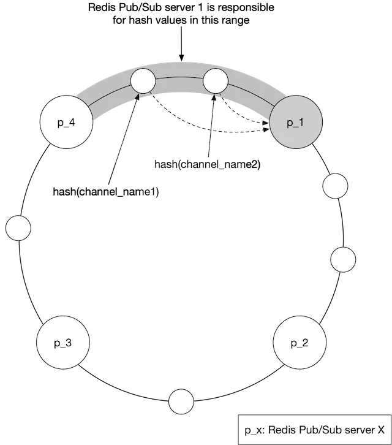

图 10 显示了当 WebSocket 服务器向用户频道发布位置更新时会发生什么。

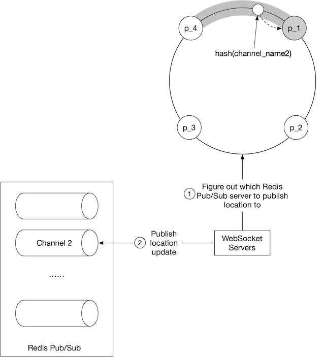

1. WebSocket 服务器查阅哈希环来确定要写入的 Redis 发布/订阅服务器。事实来源存储在服务发现中，但为了提高效率，可以在每个 WebSocket 服务器上缓存哈希环的副本。WebSocket 服务器订阅哈希环上的任何更新，以保持其本地内存中副本最新。
2. WebSocket 服务器将位置更新发布到该 Redis 发布/订阅服务器上的用户通道。

订阅位置更新频道使用相同的机制。

##### Redis 发布/订阅服务器的扩展注意事项

我们应该如何扩展 Redis 发布/订阅服务器集群？我们是否应该根据流量模式每天调整它？对于无状态服务器来说，这是一种非常常见的做法，因为它风险低并且节省成本。为了回答这些问题，让我们检查一下 Redis 发布/订阅服务器集群的一些属性。

1. 在发布/订阅通道上发送的消息不会保留在内存或磁盘上。它们会被发送给频道的所有订阅者，并在之后立即删除。如果没有订阅者，消息就会被丢弃。从这个意义上说，通过发布/订阅通道的数据是无状态的。
2. 然而，通道的发布/订阅服务器中确实存储了状态。具体来说，每个频道的订阅者列表是发布/订阅服务器跟踪的状态的关键部分。如果通道被移动，这可能在更换通道的发布/订阅服务器时发生，或者如果在哈希环上添加新服务器或删除旧服务器，则移动通道的每个订阅者都必须知道这一点，因此他们可以取消订阅旧服务器上的频道并重新订阅新服务器上的替换频道。从这个意义上说，发布/订阅服务器是有状态的，必须协调与服务器的所有订阅者的协调，以最大限度地减少服务中断。

出于这些原因，我们应该将 Redis 发布/订阅集群视为有状态集群，类似于我们处理存储集群的方式。对于有状态集群，扩大或缩小规模会产生一些运营开销和风险，因此应该仔细规划。集群通常会进行过度配置，以确保它能够处理每日高峰流量，并具有一些舒适的净空，以避免不必要的集群大小调整。

当我们不可避免地需要扩展时，请注意以下潜在问题：

- 当我们调整集群大小时，许多通道将被移动到哈希环上的不同服务器。当服务发现组件通知所有 WebSocket 服务器哈希环更新时，将会出现大量的重新订阅请求。
- 在这些大规模重新订阅事件期间，客户端可能会错过一些位置更新。尽管偶尔的失误对于我们的设计来说是可以接受的，但我们应该尽量减少这种情况的发生。
- 由于可能会出现中断，因此应在一天中使用量最低时调整大小。

调整大小实际上是如何完成的？这很简单。按着这些次序：

- 确定新的环大小，如果扩大规模，则配置足够的新服务器。
- 使用新内容更新哈希环的密钥。
- 监控你的仪表板。WebSocket 集群中的 CPU 使用率应该会出现一些峰值。

使用上面图 9 中的哈希环，如果我们要添加 2 个新节点，例如 p_5 和 p_6，哈希环将更新如下：

旧：[“p_1”，“p_2”，“p_3”，“p_4”]

新：[“p_1”，“p_2”，“p_3”，“p_4”，“p_5”，“p_6”]

##### Redis 发布/订阅服务器的操作注意事项

更换现有 Redis 发布/订阅服务器的运营风险要低得多。它不会导致大量通道被移动。仅需要处理被替换的服务器上的通道。这很好，因为服务器不可避免地会出现故障并需要定期更换。

当发布/订阅服务器出现故障时，监控软件应向值班操作员发出警报。监控软件如何准确监控 pub/sub 服务器的运行状况超出了本章的范围，因此不予介绍。值班操作员在服务发现中更新哈希环密钥，以用新的备用节点替换失效节点。WebSocket 服务器会收到有关更新的通知，然后每个服务器都会通知其连接处理程序重新订阅新的 pub/sub 服务器上的通道。每个 WebSocket 处理程序都会保留其已订阅的所有通道的列表，并且在收到服务器的通知后，它会根据哈希环检查每个通道，以确定是否需要在新服务器上重新订阅通道。

使用上面图 9 中的哈希环，如果 p_1 发生故障，我们用 p1_new 替换它，哈希环将像这样更新：

旧：[“p_1”，“p_2”，“p_3”，“p_4”]

新：[“p_1_new”，“p_2”，“p_3”，“p_4”]

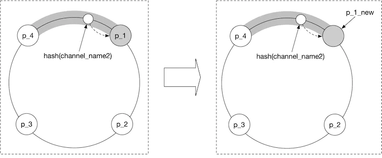

### 添加/删除好友

当用户添加或删除好友时，客户端应该怎么做？当添加新好友时，需要通知服务器上客户端的 WebSocket 连接处理程序，以便它可以订阅新好友的 pub/sub 频道。

由于“附近的朋友”功能属于大型应用程序的生态系统，因此我们可以假设每当添加新朋友时，“附近的朋友”功能就可以在移动客户端上注册回调。回调在调用时会向 WebSocket 服务器发送一条消息以订阅新朋友的 pub/sub 频道。WebSocket 服务器还会返回一条消息，其中包含新朋友的最新位置和时间戳（如果它们处于活动状态）。

同样，每当好友被删除时，客户端都可以在应用程序中注册回调。该回调将向 WebSocket 服务器发送一条消息，以取消订阅好友的 pub/sub 频道。

每当朋友选择加入或退出位置更新时，也可以使用此订阅/取消订阅回调。

### 有很多朋友的用户

值得讨论的是，有很多朋友的用户是否会导致我们设计中的性能热点。我们在这里假设朋友的数量有硬性上限。（例如，Facebook 的好友上限为 5,000）。友谊是双向的。我们谈论的不是名人可以拥有数百万粉丝的追随者模型。

在有数千个好友的场景中，pub/sub 订阅者将分散在集群中的许多 WebSocket 服务器中。更新负载将分散在它们之间，并且不太可能导致任何热点。

用户会在其频道所在的发布/订阅服务器上放置更多负载。由于有超过 100 台 pub/sub 服务器，这些“鲸鱼”用户将分散在 pub/sub 服务器之间，增量负载不应压垮任何一台服务器。

### 附近随机的人

你可以将此部分称为额外积分，因为它不在初始功能要求中。如果面试官想要更新设计以随机显示选择位置共享的人怎么办？

在利用我们的设计的同时做到这一点的一种方法是通过 geohash 添加一个发布/订阅通道池。（有关 geohash 的详细信息，请参阅邻近服务章节）。如图12所示，一个区域被划分为四个geohash网格，并为每个网格创建一个通道。

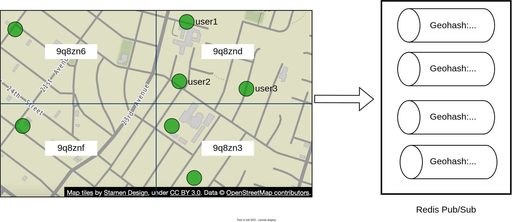

网格内的任何人都订阅同一频道。我们以网格 9q8znd 为例，如图 13 所示。

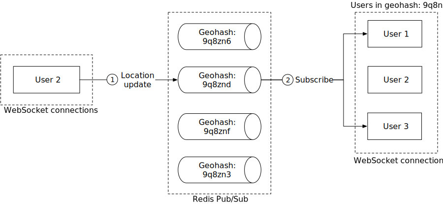

1. 此处，当用户 2 更新其位置时，WebSocket 连接处理程序会计算用户的 geohash ID 并将位置发送到该 geohash 的通道。
2. 附近订阅该频道的任何人（不包括发送者）都会收到位置更新消息。

为了处理靠近 geohash 网格边界的人，每个客户端都可以订阅用户所在的 geohash 以及周围的八个 geohash 网格。图 14 显示了突出显示所有九个 geohash 网格的示例。

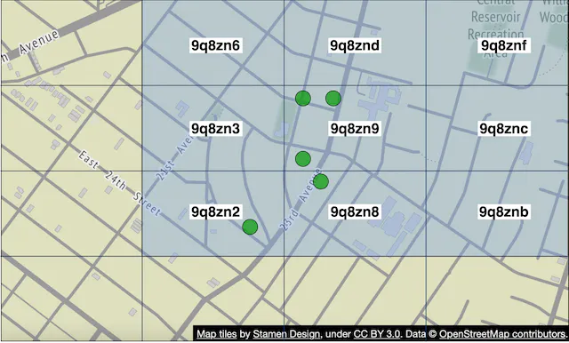

### Redis 发布/订阅的替代方案

除了使用 Redis pub/sub 作为路由层之外，还有什么好的替代方案吗？答案是肯定的。Erlang [8] 是解决这个特定问题的一个很好的解决方案。我们认为 Erlang 是比上面提出的 Redis pub/sub 更好的解决方案。然而，Erlang 相当小众，聘请优秀的 Erlang 程序员很困难。但如果你的团队拥有 Erlang 专业知识，那么这是一个不错的选择。

那么，为什么是 Erlang？Erlang 是一种通用编程语言和运行时环境，专为高度分布式和并发的应用程序而构建。当我们在这里说Erlang时，我们专门谈论Erlang生态系统本身。这包括语言组件（Erlang 或 Elixir [9]）以及运行时环境和库（称为 BEAM [10] 的 Erlang 虚拟机和称为 OTP [11] 的 Erlang 运行时库）。

Erlang 的强大之处在于它的轻量级进程。Erlang 进程是运行在 BEAM VM 上的实体。创建它比创建 Linux 进程便宜几个数量级。一个最小的 Erlang 进程大约需要 300 个字节，我们可以在一台现代服务器上拥有数百万个这样的进程。如果 Erlang 进程中没有任何工作要做，它就会坐在那里，根本不使用任何 CPU 周期。换句话说，将我们设计中的 1000 万活跃用户建模为单独的 Erlang 进程的成本非常低。

Erlang 也很容易在许多 Erlang 服务器之间分发。操作开销非常低，并且有很好的工具可以安全地支持调试实时生产问题。部署工具也非常强大。

我们如何在设计中使用 Erlang？我们将在 Erlang 中实现 WebSocket 服务，并用分布式 Erlang 应用程序替换整个 Redis pub/sub 集群。在此应用程序中，每个用户都被建模为一个 Erlang 进程。当客户端更新用户位置时，用户进程将从 WebSocket 服务器接收更新。用户进程还订阅来自用户好友的 Erlang 进程的更新。订阅是 Erlang/OTP 原生的，并且很容易构建。这形成了一个连接网，可以有效地将位置更新从一个用户路由到许多朋友。

## 第 4 步 - 总结

在本章中，我们提出了一种支持附近好友功能的设计。从概念上讲，我们希望设计一种系统，可以有效地将位置更新从一个用户传递给他们的朋友。

一些核心组件包括：

- WebSocket：客户端和服务器之间的实时通信。
- Redis：位置数据的快速读写。
- Redis pub/sub：路由层将位置更新从一个用户定向到所有在线好友。

我们首先提出了较小规模的高层设计，然后讨论了随着规模的增加而出现的挑战。我们探索了如何扩展以下内容：

- Restful API 服务器
- WebSocket 服务器
- 数据层
- Redis 发布/订阅服务器
- Redis 发布/订阅的替代方案

最后，我们讨论了当用户有很多朋友时潜在的瓶颈，并提出了“附近随机人”功能的设计。

恭喜你已经走到这一步了！现在拍拍自己的背吧。好工作！

## 章节总结

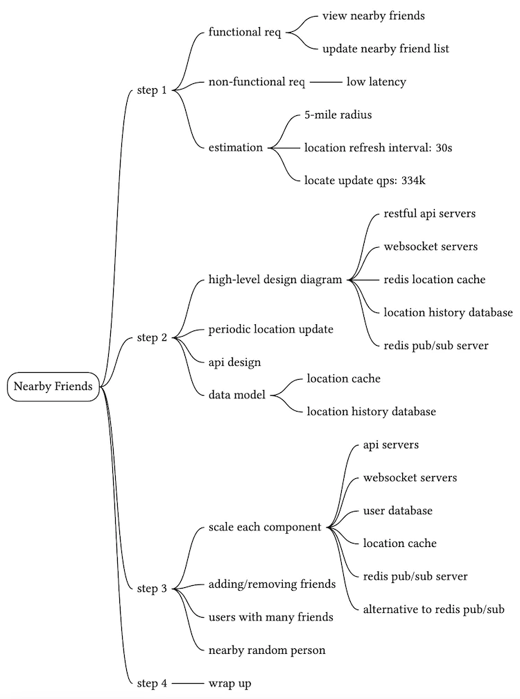

## 参考资料

[1] Facebook推出“附近的朋友”：https://techcrunch.com/2014/04/17/facebook-nearby-friends/

[2] Redis 发布/订阅： https: [//redis.io/topics/pubsub](https://redis.io/topics/pubsub)

[3] Redis Pub/Sub 底层：https://making.pusher.com/redis-pubsub-under-the-hood/

[4]etcd： [https://etcd.io/](https://etcd.io/)

[5] zookeeper：https://zookeeper.apache.org/

[6] 一致性哈希：[https://www.toptal.com/big-data/consistency-hashing](https://www.toptal.com/big-data/consistent-hashing)

[7] OpenStreetMap：[http://www.openstreetmap.org](http://www.openstreetmap.org/)

[8] Erlang： [https: //www.erlang.org/](https://www.erlang.org/)

[9] Elixir： [https: //elixir-lang.org/](https://elixir-lang.org/)

[10] BEAM简介： [https: //www.erlang.org/blog/a-brief-beam-primer/](https://www.erlang.org/blog/a-brief-beam-primer/)

[11] OTP：[https://www.erlang.org/doc/design_principles/des_princ.html](https://www.erlang.org/doc/design_principles/des_princ.html)