在本章中，我们设计了一个简单版本的 Google 地图。在进行系统设计之前，我们先来了解一下 Google 地图。Google 于 2005 年启动了 Google Maps 项目并开发了网络地图服务。它提供卫星图像、街道地图、实时交通状况和路线规划等许多服务[1]。

Google 地图可帮助用户查找方向并导航至目的地。截至 2021 年 3 月，Google 地图拥有 10 亿日活跃用户，覆盖全球 99%，每天更新 2500 万次准确、实时的位置信息 [2]。鉴于 Google 地图的巨大复杂性，确定我们的版本支持哪些功能非常重要。请注意，本章中使用的地图图块来自 Stamen Design [3]，数据来自 OpenStreetMap [4]。

## 第 1 步 - 了解问题并确定设计范围

面试官和候选人之间的互动可能如下所示：

**候选人**：我们预计有多少每日活跃用户？
**面试官**：10亿DAU。

**候选人**：我们应该关注哪些功能？方向、导航和预计到达时间 (ETA)？
**面试官**：我们重点说一下位置更新、导航、ETA、地图渲染。

**候选人**：道路数据有多大？我们可以假设我们可以访问它吗？
**面试官**：很好的问题。是的，假设我们从不同来源获得了道路数据。它是 TB 级的原始数据。

**候选人**：我们的系统应该考虑交通状况吗？
**面试官**：是的，交通状况对于准确估算时间非常重要。

**候选人**：开车、步行、公交车等不同的出行方式怎么样？
**面试官**：我们应该能够支持不同的出行方式。

**候选人**：是否支持多站导航？
**面试官**：允许用户定义多个停靠点很好，但我们不要关注它。

**候选人**：营业地点和照片怎么样？我们期待多少张照片？
**面试官**：我很高兴你提出并考虑了这些问题。我们不需要设计那些。

在本章的其余部分，我们将重点关注三个关键功能。我们需要支持的主要设备是手机。

- 用户位置更新。
- 导航服务，包括ETA服务。
- 地图渲染。

### 非功能性需求和约束

- 准确性：不应向用户提供错误的指示。
- 流畅的导航：在客户端，用户应该体验到非常流畅的地图渲染。
- 数据和电池使用：客户端应使用尽可能少的数据和电池。这对于移动设备来说非常重要。
- 一般可用性和可扩展性要求。

在开始设计之前，我们将简要介绍一些有助于设计 Google 地图的基本概念和术语。

### 地图101

#### 定位系统

世界是一个绕其轴旋转的球体。最上面是北极，最下面是南极。

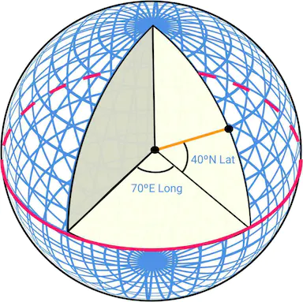

Lat（纬度）**：**表示我们向北或向南的距离

Long（经度）**：**表示我们向东或向西有多远

#### 从 3D 到 2D

将点从 3D 地球仪转换到 2D 平面的过程称为“地图投影”。

进行地图投影的方法有多种，每种方法都有其自身的优点和局限性。几乎所有这些都扭曲了实际的几何形状。下面我们可以看到一些例子。

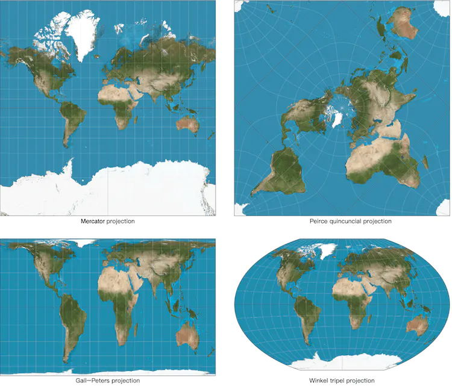

Google 地图选择了墨卡托投影的修改版本，称为 Web 墨卡托。有关定位系统和投影的更多详细信息，请参阅[5]。

#### 地理编码

地理编码是将地址转换为地理坐标的过程。例如，“1600 Amphitheatre Parkway, Mountain View, CA”被地理编码为纬度/经度对（纬度 37.423021，经度 -122.083739）。

另一方面，从纬度/经度对到实际人类可读地址的转换称为反向地理编码。

地理编码的一种方法是插值 [10]。该方法利用不同来源的数据，例如地理信息系统（GIS），其中街道网络被映射到地理坐标空间。

#### 地理哈希

Geohashing 是一种编码系统，它将地理区域编码为短的字母和数字字符串。其核心是将地球描绘成一个平坦的表面，并递归地将网格划分为子网格，子网格可以是正方形或矩形。我们用一串递归创建的 0 到 3 之间的数字来表示每个网格。

假设初始平坦表面的大小为 20,000 km * 10,000 km。第一次划分后，我们将有 4 个大小为 10,000 km * 5,000 km 的网格。我们将它们表示为 00、01、10 和 11，如图 3 所示。我们将每个网格进一步分为 4 个网格，并使用相同的命名策略。现在每个子网格的规模为5,000 km*2,500 km。我们递归地划分网格，直到每个网格达到一定的大小阈值。

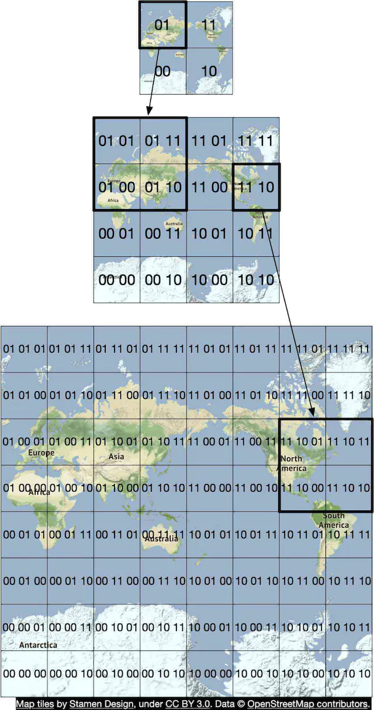

地理哈希有很多用途。在我们的设计中，我们使用地理哈希进行地图平铺。有关 geohashing 及其优点的更多详细信息，请参阅 [11]。

#### 地图渲染

我们不会在这里详细讨论地图渲染，但值得一提的是基础知识。地图渲染的一个基本概念是平铺。世界不是将整个地图渲染为一个大型自定义图像，而是被分解为更小的图块。客户端仅下载用户所在区域的相关图块，并将它们像马赛克一样拼接在一起进行显示。

不同缩放级别有不同的图块组。客户端选择适合客户端上地图视口的缩放级别的图块组。这可以提供适当级别的地图详细信息，而不会消耗过多的带宽。用一个极端的例子来说明，当客户端完全缩放以显示整个世界时，我们不想为了非常高的缩放级别而下载数十万个图块。所有的细节都会被浪费。相反，客户端将以最低缩放级别下载一个图块，该图块用单个 256x256 像素图像代表整个世界。

#### 用于导航算法的道路数据处理

大多数路由算法都是 Dijkstra 或 A* 寻路算法的变体。确切的算法选择是一个复杂的话题，我们在本章中不会详细讨论。值得注意的是，所有这些算法都在图数据结构上运行，其中交叉点是节点，道路是图的边缘。请参见图 4 的示例：

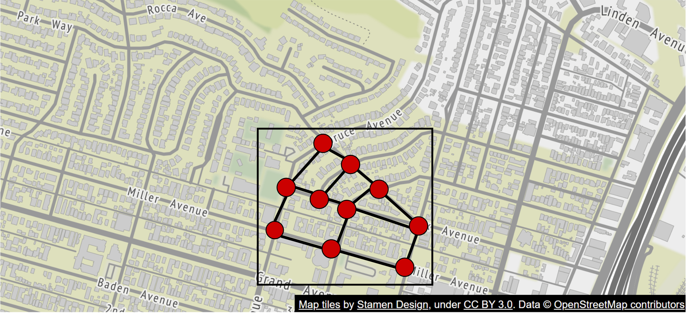

大多数这些算法的寻路性能对图的大小极其敏感。将整个道路网络世界表示为单个图会消耗太多内存，并且对于任何这些算法来说都可能太大而无法有效运行。该图需要分解为可管理的单元，以便这些算法能够在我们的设计规模上工作。

分解世界各地道路网络的一种方法与我们讨论的地图渲染的平铺概念非常相似。通过采用与地理哈希类似的细分技术，我们将世界划分为小网格。对于每个网格，我们将网格内的道路转换为一个小的图形数据结构，该结构由网格覆盖的地理区域内的节点（交叉点）和边（道路）组成。我们称这些网格为路由图块。每个布线图块都保存对其连接到的所有其他图块的引用。这就是路由算法在遍历这些互连的路由图块时将更大的道路图缝合在一起的方式。

通过将道路网络分解为可按需加载的路由图块，路由算法一次仅消耗路由图块的一小部分，并且仅根据需要加载额外的图块，从而显着减少内存消耗并提高寻路性能。

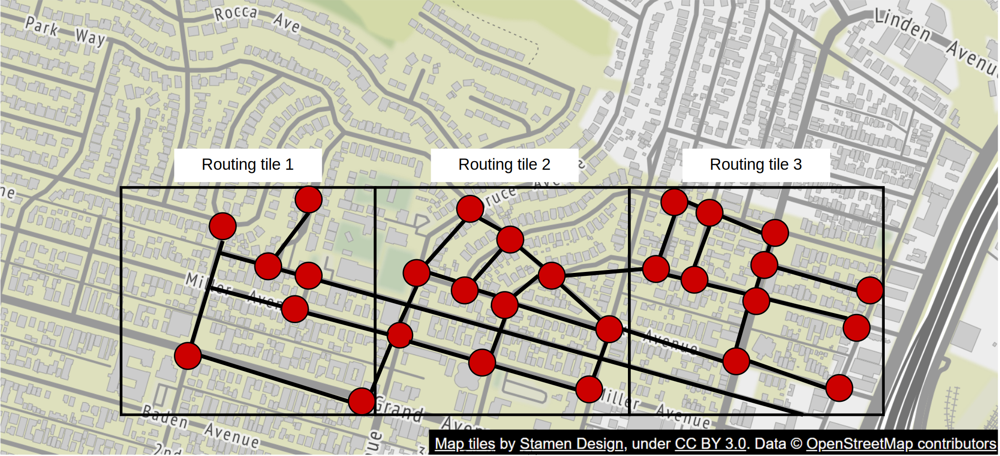

| 提醒                                                         |
| :----------------------------------------------------------- |
| 在图 5 中，我们将这些网格称为路由图块。路线图块与地图图块类似，两者都是覆盖某些地理区域的网格。地图图块是 PNG 图像，而路线图块是图块所覆盖区域的道路数据的二进制文件。 |

**分层路线图块**
高效的导航路线还需要拥有正确详细程度的道路数据。例如，对于跨国路由，针对一组高度详细的街道级路由图块运行路由算法会很慢。由这些详细的路由图块拼接在一起的图形可能太大并且消耗太多内存。

通常存在三组具有不同细节级别的布线块。在最详细的级别，路线图块很小并且仅包含当地道路。在下一层，瓷砖更大，并且只包含连接各地区的主干道。在最低的细节层次上，瓷砖覆盖了大片区域，并且只包含连接城市和州的主要高速公路。在每个级别，可能有边缘连接到不同缩放级别的图块。例如，对于从当地街道 A 到高速公路 F 的高速公路入口，将存在从小图块中的节点（街道 A）到大图块中的节点（高速公路 F）的引用。有关不同尺寸的布线图块的示例，请参见图 6。

### 粗略估计

现在我们了解了基础知识，让我们进行粗略估计。由于设计的重点是移动，因此数据使用和电池消耗是需要考虑的两个重要因素。

在我们深入估算之前，这里有一些英制/公制转换供参考。

- 1 英尺 = 0.3048 米
- 1 公里 (km) = 0.6214 英里
- 1 公里 = 1,000 米

#### 存储使用情况

我们需要存储三种类型的数据。

- 世界地图：详细计算如下。
- 元数据：鉴于每个地图图块的元数据的大小可以忽略不计，我们可以在计算中跳过元数据。
- 道路信息：采访者告诉我们，外部来源有 TB 级的道路数据。我们将此数据集转换为路由图块，其大小也可能是 TB。

**世界地图**

我们在地图 101 部分讨论了地图切片的概念。有许多组地图图块，每个缩放级别都有一组。为了了解整个地图切片图像集合的存储要求，首先估计最高缩放级别下最大切片集的大小会很有帮助。在缩放级别 21 时，大约有 4.3 万亿个图块（表 1）。假设每个图块都是一个 256 * 256 像素的压缩 PNG 图像，图像大小约为 100 KB。最高缩放级别的整个集合大约需要 4.4 万亿 * 100 KB = 440 PB。

在表 1 中，我们显示了每个缩放级别下图块计数的进展。

| **飞涨** | **瓷砖数量**      |
| :------- | :---------------- |
| 0        | 1                 |
| 1        | 4                 |
| 2        | 16                |
| 3        | 64                |
| 4        | 256               |
| 5        | 1 024             |
| 6        | 4 096             |
| 7        | 16 384            |
| 8        | 65536             |
| 9        | 262 144           |
| 10       | 1 048 576         |
| 11       | 4 194 304         |
| 12       | 16 777 216        |
| 13       | 67 108 864        |
| 14       | 268 435 456       |
| 15       | 1 073 741 824     |
| 16       | 4 294 967 296     |
| 17       | 17 179 869 184    |
| 18       | 68 719 476 736    |
| 19       | 274 877 906 944   |
| 20       | 1 099 511 627 776 |
| 21       | 4 398 046 511 104 |

然而，请记住，世界表面约 90% 是自然区域，大部分是无人居住的区域，如海洋、沙漠、湖泊和山脉。由于这些区域作为图像是高度可压缩的，因此我们可以保守地将存储估计减少 80-90%。这会将存储大小减少到 44 到 88 PB 的范围。让我们选择一个简单的整数 50 PB。

接下来，让我们估计每个后续较低的缩放级别将占用多少存储空间。在每个较低的缩放级别，南北和东西方向的图块数量都会减少一半。这导致图块数量总共减少了 4 倍，缩放级别的存储大小也减少了 4 倍。随着存储大小在每个较低的缩放级别减少 4 倍，总大小的数学计算是一个级数：50 + 50/4 + 50/16 + 50/64 + … = ~67 PB。这只是一个粗略的估计。知道我们大约需要 100 PB 左右的空间来存储不同细节级别的所有地图图块就足够了。

#### 服务器吞吐量

为了估计服务器吞吐量，让我们回顾一下需要支持的请求类型。请求主要有两种类型。第一个是导航请求。这些由客户端发送以启动导航会话。第二个是位置更新请求。这些是当用户在导航会话期间四处移动时由客户端发送的。下游服务以多种不同方式使用位置数据。例如，位置数据是实时交通数据的输入之一。我们将在设计深入探讨部分介绍位置数据的用例。

现在我们可以分析导航请求的服务器吞吐量。假设我们有 10 亿 DAU，每个用户每周使用导航的时间总共为 35 分钟。这意味着每周 350 亿分钟或每天 50 亿分钟。

一种简单的方法是每秒发送一次 GPS 坐标，这会导致每天 3000 亿（50 亿分钟 * 60）个请求，或 300 万个 QPS（3000 亿个请求 / 10^5 = 300 万）。然而，客户端可能不需要每秒发送 GPS 更新。我们可以在客户端对这些进行批处理，并以低得多的频率（例如每 15 秒或 30 秒）发送它们，以降低写入 QPS。实际频率可能取决于用户移动速度等因素。如果遇到交通堵塞，客户端可以减慢 GPS 更新速度。在我们的设计中，我们假设 GPS 更新是分批进行的，然后每 15 秒发送到服务器一次。通过这种批量方法，QPS 降低到 200,000（300 万/15）。

假设峰值 QPS 是平均值的五倍。位置更新峰值 QPS = 200,000 * 5 = 100 万。

## 第 2 步 - 提出高级设计并获得认可

现在我们对 Google 地图有了更多的了解，我们准备提出一个高级设计（图 7）。

### 高层设计

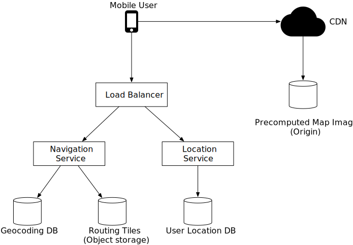

高级设计支持三个功能。让我们一一看看。

1. 定位服务
2. 导航服务
3. 地图渲染

#### 定位服务

位置服务负责记录用户的位置更新。该架构如图 8 所示。


基本设计要求客户端每 t 秒发送一次位置更新，其中 t 是可配置的间隔。定期更新有几个好处。首先，我们可以利用位置数据流来随着时间的推移改进我们的系统。例如，我们可以使用这些数据来监控实时交通、检测新的或封闭的道路以及分析用户行为以实现个性化。其次，我们可以利用近乎实时的位置数据为用户提供更准确的预计到达时间，并在必要时重新规划交通路线。

但是我们真的需要立即将每个位置更新发送到服务器吗？答案可能是否定的。位置历史记录可以在客户端缓冲，并以低得多的频率批量发送到服务器。例如，如图 9 所示，位置更新每秒记录一次，但仅每 15 秒作为批次的一部分发送到服务器。这显着减少了所有客户端发送的总更新流量。

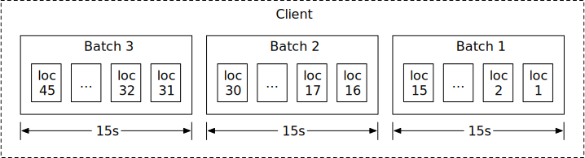

对于像Google Maps这样的系统，即使批量更新位置，写入量仍然非常高。我们需要一个针对高写入量进行优化且具有高度可扩展性的数据库，例如 Cassandra。我们可能还需要使用 Kafka 等流处理引擎来记录位置数据以进行进一步处理。我们将在深入探讨部分详细讨论这一点。

什么通信协议可能更适合这里？带有 keep-alive 选项的 HTTP [12] 是一个不错的选择，因为它非常高效。 HTTP 请求可能如下所示：

```
POST /v1/locations
Parameters
  locs: JSON encoded array of (latitude, longitude, timestamp) tuples.
```

#### 导航服务

该组件负责找到从 A 点到 B 点的相当快的路线。我们可以容忍一点延迟。计算出的路线不一定是最快的，但准确性至关重要。

如图8所示，用户通过负载均衡器向导航服务发送HTTP请求。该请求包括起点和目的地作为参数。 API 可能如下所示：

```
GET /v1/nav?origin=1355+market+street,SF&destination=Disneyland
```

以下是导航结果的示例：

```
{
  'distance': {'text':'0.2 mi', 'value': 259},
  'duration': {'text': '1 min', 'value': 83},
  'end_location': {'lat': 37.4038943, 'Ing': -121.9410454},
  'html_instructions': 'Head <b>northeast</b> on <b>Brandon St</b> toward <b>Lumin Way</b><div style="font-size:0.9em">Restricted usage road</div>',
  'polyline': {'points': '_fhcFjbhgVuAwDsCal'},
  'start_location': {'lat': 37.4027165, 'lng': -121.9435809},
  'geocoded_waypoints': [
    {
       "geocoder_status" : "OK",
       "partial_match" : true,
       "place_id" : "ChIJwZNMti1fawwRO2aVVVX2yKg",
       "types" : [ "locality", "political" ]
    },
    {
       "geocoder_status" : "OK",
       "partial_match" : true,
       "place_id" : "ChIJ3aPgQGtXawwRLYeiBMUi7bM",
       "types" : [ "locality", "political" ]
    }
  ],
  'travel_mode': 'DRIVING'
}
```

有关 Google 地图官方 API 的更多详细信息，请参阅[13]。

到目前为止，我们还没有考虑重新路线和交通变化。这些问题由深入部分的自适应 ETA 服务解决。

#### 地图渲染

正如我们在粗略估计中所讨论的，不同缩放级别的整个地图图块集合的大小约为 100 PB。将整个数据集保存在客户端上是不切实际的。必须根据客户端的位置和客户端视口的缩放级别按需从服务器获取地图图块。

客户端应何时从服务器获取新的地图图块？以下是一些场景：

- 用户正在客户端上缩放和平移地图视点以探索周围环境。
- 在导航期间，用户从当前地图图块移出到附近的图块。

我们正在处理大量数据。让我们看看如何从服务器有效地提供这些地图图块。

**选项1**

服务器根据客户端位置和客户端视口的缩放级别动态构建地图图块。考虑到存在无限数量的位置和缩放级别组合，动态生成地图图块有一些严重的缺点：

- 动态生成每个地图图块会给服务器集群带来巨大的负载。
- 由于地图图块是动态生成的，因此很难利用缓存。

**选项2**

另一种选择是在每个缩放级别提供一组预先生成的地图图块。地图图块是静态的，每个图块使用地理哈希等细分方案覆盖固定的矩形网格。因此，每个图块都由其 geohash 表示。换句话说，每个网格都有一个唯一的 geohash。当客户端需要地图图块时，它首先根据其缩放级别确定要使用的地图图块集合。然后，它通过将其位置转换为适当缩放级别的 geohash 来计算地图图块 URL。

这些静态的预生成图像由 CDN 提供服务，如图 10 所示。


在上图中，移动用户发出 HTTP 请求以从 CDN 获取图块。如果 CDN 之前尚未提供该特定图块，它将从源服务器获取副本，在本地缓存，然后将其返回给用户。在后续请求中，即使这些请求来自不同的用户，CDN 也会返回缓存的副本，而无需联系源服务器。

这种方法更具可扩展性和性能，因为地图图块是从最近的存在点 (POP) 提供给客户端的，如图 11 所示。地图图块的静态特性使其高度可缓存。

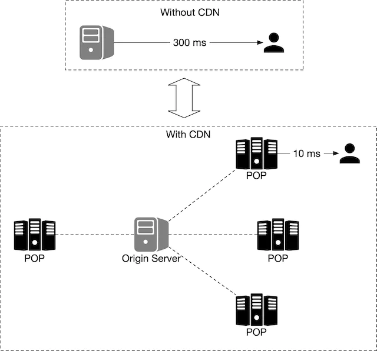

保持较低的移动数据使用量非常重要。让我们计算一下客户端在典型的导航会话期间需要加载的数据量。请注意，以下计算未考虑客户端缓存。由于用户每天采取的路线可能相似，因此客户端缓存的数据使用量可能会低很多。

| 数据使用                                                     |
| :----------------------------------------------------------- |
| 假设用户以 30 km/h 的速度移动，并且在缩放级别下，每个图像覆盖 200m * 200m 的块（一个块可以用 256 像素 x 256 像素的图像表示，平均图像大小为 100KB） 。对于 1km * 1km 的区域，我们需要 25 张图像或 2.5 MB (25 * 100KB) 的数据。因此，如果速度为30公里/小时，我们每小时需要75MB（30 * 2.5MB）的数据或每分钟1.25MB的数据。 |

接下来，我们估算 CDN 数据使用情况。在我们的规模下，成本是一个需要考虑的重要因素。

| 通过 CDN 的流量                                              |
| :----------------------------------------------------------- |
| 如前所述，我们每天提供 50 亿分钟的导航服务。这翻译成每天 50 亿 * 1.25 MB = 62.5 亿 MB。因此，我们每秒提供 62,500 MB（62.5 亿/一天 10^5 秒）的地图数据。通过 CDN，这些地图图像将从世界各地的 POP 提供服务。假设有 200 个 POP。每个 POP 每秒只需要提供几百 MB (62,500 / 200) 的服务。 |

我们只是简单地触及了地图渲染设计的最后一个细节。客户端如何知道使用哪些 URL 从 CDN 获取地图图块？请记住，我们使用的是上面讨论的选项 2。使用该选项，地图图块是静态的，并且基于固定的网格集预先生成，每个网格集代表一个离散的缩放级别。

由于我们在 geohash 中对网格进行编码，并且每个网格都有一个唯一的 geohash，因此对于地图图块而言，从客户端位置（纬度和经度）和缩放级别到 geohash 的计算效率非常高。这个计算可以在客户端完成，我们可以从 CDN 获取任何静态图像图块。例如，Google 总部的图像图块的 URL 可能如下所示：
`https://cdn.map-provider.com/tiles/9q9hvu.png`

有关 geohash 编码的更详细讨论，请参阅邻近服务章节。

在客户端计算 geohash 应该可以很好地工作。但是，请记住，该算法在所有不同平台上的所有客户端中都是硬编码的。将更改传送到移动应用程序是一个耗时且有一定风险的过程。我们必须确保地理哈希是我们计划长期使用的对地图图块集合进行编码的方法，并且它不太可能改变。如果我们因为某种原因需要切换到另一种编码方式，那将需要花费很大的精力，而且风险也不低。

这是另一个值得考虑的选择。我们可以引入一个服务作为中介，其工作是基于相同的输入构建图块 URL，而不是使用硬编码的客户端算法将纬度/经度 (lat/lng) 对和缩放级别转换为图块 URL。上文提到的。这是一项非常简单的服务。增加的操作灵活性可能是值得的。这是我们可以与面试官进行的非常有趣的权衡讨论。替代地图渲染流程如图 12 所示。

当用户移动到新位置或新的缩放级别时，地图图块服务会确定需要哪些图块，并将该信息转换为一组图块 URL 进行检索。

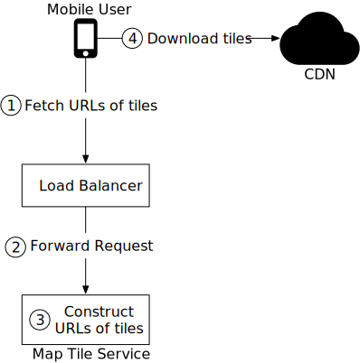

1. 移动用户调用地图切片服务来获取切片 URL。该请求被发送到负载均衡器。
2. 负载均衡器将请求转发到地图切片服务。
3. 地图图块服务将客户端的位置和缩放级别作为输入，并向客户端返回图块的 9 个 URL。这些图块包括要渲染的图块和周围的八个图块。
4. 移动客户端从 CDN 下载切片。

我们将在设计深入部分详细介绍预先计算的地图图块。

## 第 3 步 - 深入设计

在本节中，我们首先讨论数据模型。然后我们更详细地讨论位置服务、导航服务和地图渲染。

### 数据模型

我们正在处理四种类型的数据：路线图块、用户位置数据、地理编码数据和预先计算的世界地图图块。

#### 布线块

如前所述，初始道路数据集是从不同来源和当局获得的。它包含数 TB 的数据。随着时间的推移，应用程序在用户使用应用程序时不断从用户那里收集位置数据，从而改进数据集。

该数据集包含大量道路和相关元数据，例如名称、县、经度和纬度。该数据没有被组织为图形数据结构，并且不能被大多数路由算法使用。我们运行一个定期的离线处理管道，称为路由切片处理服务，将该数据集转换为我们引入的路由切片。该服务定期运行以捕获道路数据的新变化。

布线块处理服务的输出是布线块。存在三组不同分辨率的这些图块，如地图 101 部分中所述。每个图块包含图形节点和边的列表，表示图块覆盖区域内的交叉口和道路。它还包含对其道路连接的其他图块的引用。这些图块一起形成一个互连的道路网络，路由算法可以逐步使用该网络。

布线切片处理服务应在哪里存储这些切片？大多数图形数据在内存中表示为邻接表[14]。由于图块太多，无法将整组邻接列表保存在内存中。我们可以将节点和边作为行存储在数据库中，但我们只会使用数据库作为存储，这似乎是一种存储数据位的昂贵方法。我们也不需要任何用于路由图块的数据库功能。

存储这些切片的更有效方法是使用 S3 等对象存储，并将其积极缓存在使用这些切片的路由服务上。我们可以使用许多高性能软件包将邻接表序列化为二进制文件。我们可以通过对象存储中的地理哈希来组织这些图块。这提供了一种快速查找机制，可以通过纬度/经度对来定位图块。

我们很快就会讨论最短路径服务如何使用这些路由块。

#### 用户位置数据

用户位置数据很有价值。我们用它来更新道路数据和路线图块。我们还使用它来构建实时和历史流量数据的数据库。该位置数据还被多个数据流处理服务消耗以更新地图数据。

对于用户位置数据，我们需要一个能够很好地处理大量写入工作负载并且可以水平扩展的数据库。卡桑德拉可能是一个不错的候选人。

下面是单行的样子：

| **用户身份** | **时间戳** | **用户模式** | **驾驶模式** | **地点**     |
| ------------ | ---------- | ------------ | ------------ | ------------ |
| 101          | 1635740977 | 积极的       | 驾驶         | (20.0, 30.5) |

#### 地理编码数据库

该数据库存储地点及其相应的纬度/经度对。我们可以使用Redis之类的键值数据库来实现快速读取，因为我们有频繁的读取和不频繁的写入。我们使用它将出发地或目的地转换为纬度/经度对，然后将其传递给路线规划器服务。

#### 预先计算的世界地图图像

当设备请求特定区域的地图时，我们需要获取附近的道路并计算代表该区域的图像以及所有道路和相关细节。这些计算将是繁重且冗余的，因此计算一次然后缓存图像可能会有所帮助。我们预先计算不同缩放级别的图像并将其存储在由 Amazon S3 等云存储支持的 CDN 上。这是此类图像的示例：

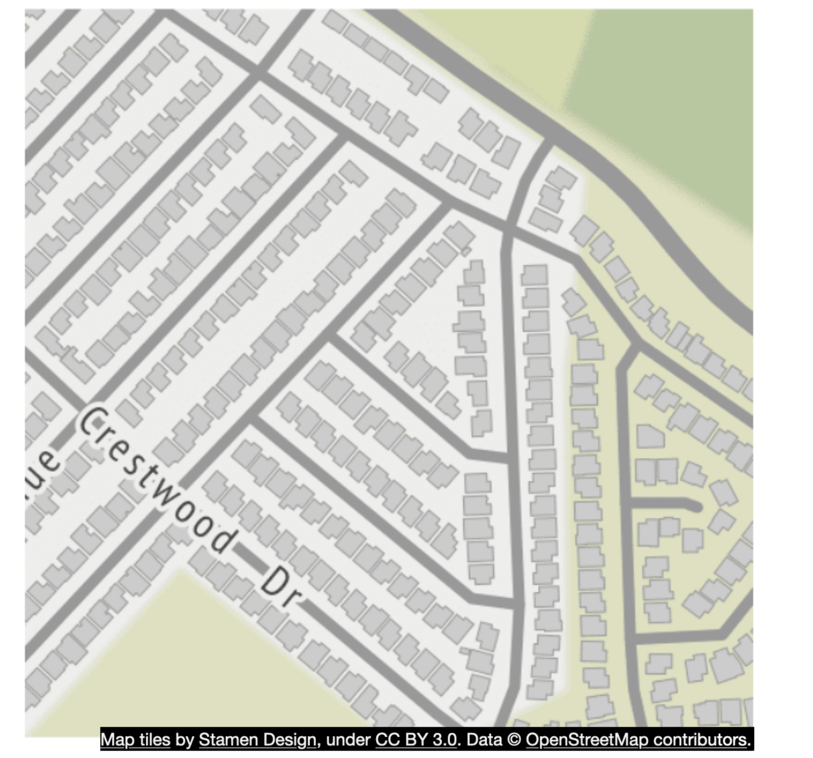

### 服务

现在我们已经讨论了数据模型，让我们仔细看看一些最重要的服务：位置服务、地图渲染服务和导航服务。

#### 定位服务

在高层设计中，我们讨论了位置服务的工作原理。在本节中，我们将重点介绍该服务的数据库设计以及如何详细使用用户位置。

在图 14 中，键值存储用于存储用户位置数据。让我们仔细看看。


鉴于我们每秒有 100 万次位置更新，我们需要一个支持快速写入的数据库。 No-SQL 键值数据库或面向列的数据库在这里将是一个不错的选择。此外，用户的位置不断变化，并且一旦有新的更新到达就会变得陈旧。因此，我们可以优先考虑可用性而不是一致性。 CAP定理[15]指出我们可以在一致性、可用性和分区容错性之间选择两个属性。考虑到我们的限制，我们将选择可用性和分区容错性。 Cassandra 是一个非常适合的数据库。它可以处理我们的规模并提供强大的可用性保证。

键是*(user_id，时间戳)*的组合，值是纬度/经度对。在此设置中，*user_id*是主键，时间戳是集群键。使用*user_id*作为分区键的好处是我们可以快速读取特定用户的最新位置。所有具有相同分区键的数据都存储在一起，并按时间戳排序。通过这种布置，对特定用户在某个时间范围内的位置数据的检索是非常有效的。

下面是该表的示例。

| **密钥（用户 ID）** | **时间戳** | **拉特** | **长的** | **用户模式** | **导航模式** |
| ------------------- | ---------- | -------- | -------- | ------------ | ------------ |
| 51                  | 132053000  | 21.9     | 89.8     | 积极的       | 驾驶         |

**我们如何使用用户位置数据？**

用户位置数据至关重要。它支持许多用例。我们使用这些数据来检测新的和最近关闭的道路。我们将其用作输入之一，以随着时间的推移提高地图的准确性。它也是实时交通数据的输入。

为了支持这些用例，除了在数据库中写入当前用户位置之外，我们还将这些信息记录到消息队列中，例如 Kafka。 Kafka 是一个统一的低延迟、高吞吐量数据流平台，专为实时数据馈送而设计。图 15 显示了改进设计中如何使用 Kafka。

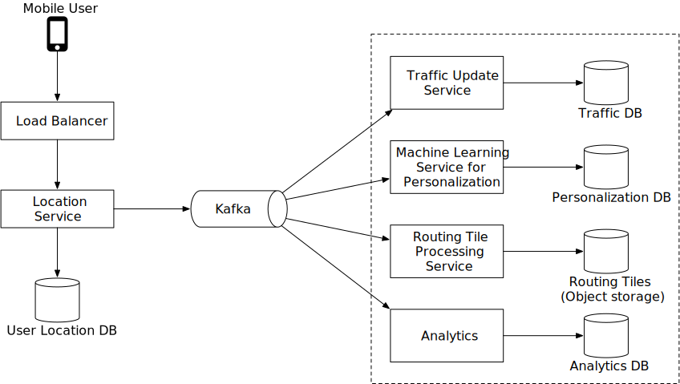

其他服务将来自 Kafka 的位置数据流用于各种用例。例如，实时交通服务消化输出流并更新实时交通数据库。路线图块处理服务通过检测新的或封闭的道路并更新对象存储中受影响的路线图块来改进世界地图。其他服务也可以出于不同目的利用该流。

#### 渲染图

在本节中，我们将深入研究预先计算的地图图块和地图渲染优化。它们主要受到 Google Design 作品的启发 [5]。

##### 预计算图块

如前所述，存在具有各种不同缩放级别的不同预计算地图图块组，以根据客户端的视口大小和缩放级别向用户提供适当级别的地图细节。 Google 地图使用 21 个缩放级别（表 1）。这也是我们所使用的。

级别 0 是最缩小的级别。整个地图由大小为 256 * 256 像素的单个图块表示。

随着缩放级别的每次增加，地图图块的数量在南北和东西方向上都会加倍，而每个图块仍保持在 256 * 256 像素。如图 16 所示，在缩放级别 1 下，有 2 x 2 个图块，总组合分辨率为 512 * 512 像素。在缩放级别 2 下，有 4 x 4 个图块，总组合分辨率为 1024 * 1024 像素。随着每次增量，整组图块的像素数量是前一级别的 4 倍。增加的像素数为用户提供了更高水平的细节。这允许客户端根据客户端的缩放级别以最佳粒度渲染地图，而无需消耗过多的带宽来下载过多细节的图块。

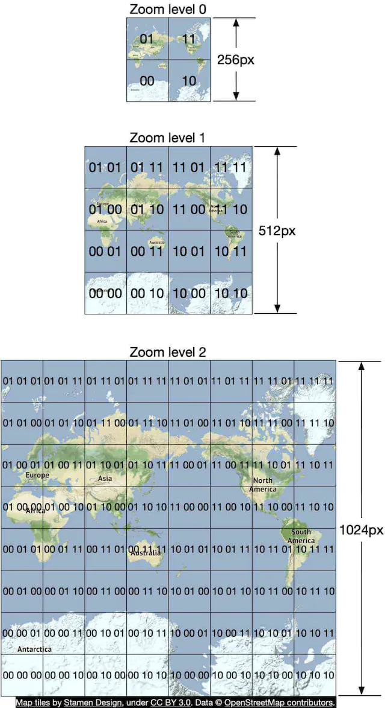

##### 优化：使用向量

随着 WebGL 的开发和实现，一项潜在的改进是将设计从通过网络发送图像改为发送矢量信息（路径和多边形）。客户端根据矢量信息绘制路径和多边形。

矢量切片的一个明显优势是矢量数据的压缩效果比图像好得多。带宽节省是巨大的。

一个不太明显的好处是矢量切片提供了更好的缩放体验。对于光栅化图像，当客户端从一个级别放大到另一个级别时，所有内容都会被拉伸并看起来像素化。视觉效果相当不和谐。通过矢量化图像，客户端可以适当缩放每个元素，从而提供更流畅的缩放体验。

#### 导航服务

接下来我们深入了解一下导航服务。该服务负责查找最快的路线。设计图如图17所示。

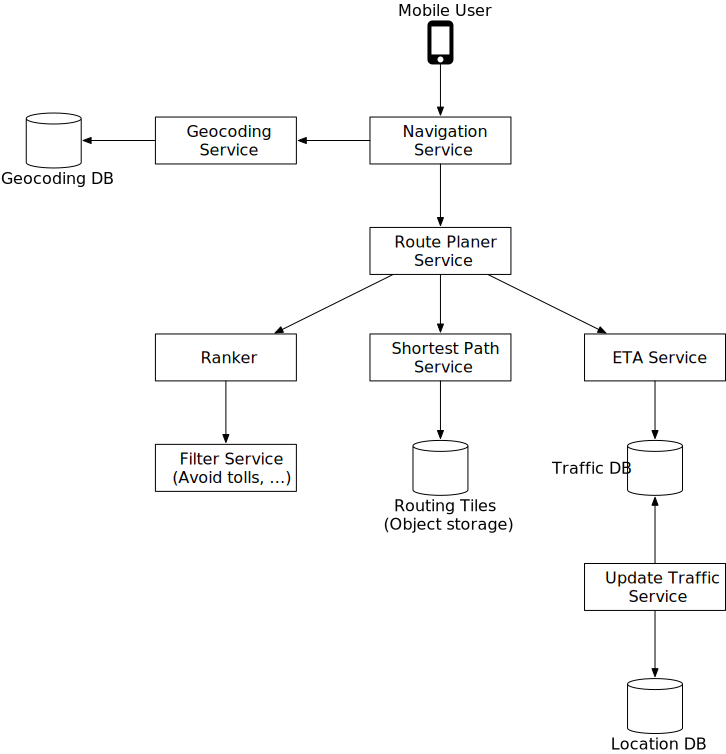

让我们回顾一下系统中的每个组件。

##### 地理编码服务

首先，我们需要一个服务来将地址解析为纬度和经度对的位置。地址可以采用不同的格式，例如，它可以是地名或文本地址。

以下是来自 Google 地理编码 API 的请求和响应示例。

**要求**：

```
https://maps.googleapis.com/maps/api/geocode/json?address=1600+Amphitheatre+Parkway,+Mountain+View,+CA
```

**JSON 响应：**

```json
{
   "results" : [
      {
         "formatted_address" : "1600 Amphitheatre Parkway, Mountain View, CA 94043, USA",
         "geometry" : {
            "location" : {
               "lat" : 37.4224764,
               "lng" : -122.0842499
            },
            "location_type" : "ROOFTOP",
            "viewport" : {
               "northeast" : {
                  "lat" : 37.4238253802915,
                  "lng" : -122.0829009197085
               },
               "southwest" : {
                  "lat" : 37.4211274197085,
                  "lng" : -122.0855988802915
               }
            }
         },
         "place_id" : "ChIJ2eUgeAK6j4ARbn5u_wAGqWA",
         "plus_code": {
            "compound_code": "CWC8+W5 Mountain View, California, United States",
            "global_code": "849VCWC8+W5"
         },
         "types" : [ "street_address" ]
      }
   ],
   "status" : "OK"
}
```

导航服务调用此服务对出发地和目的地进行地理编码，然后再向下游传递纬度/经度对以查找路线。

##### 路线规划服务

该服务根据当前交通和道路状况计算针对行驶时间优化的建议路线。它与接下来讨论的几个服务交互。

##### 最短路径服务

最短路径服务接收纬度/经度对中的出发地和目的地，并返回前 k 个最短路径，而不考虑流量或当前条件。该计算仅取决于道路的结构。在这里，缓存路线可能是有益的，因为图表很少改变。

最短路径服务针对对象存储中的路由图块运行 A* 寻路算法的变体。以下是概述：

- 该算法以纬度/经度对的形式接收出发地和目的地。纬度/经度对被转换为地理哈希，然后用于加载路由图块的起点和终点。
- 该算法从原始路由图块开始，遍历图数据结构，并在扩展搜索区域时从对象存储（或其本地缓存，如果之前加载过）中合并其他相邻图块。值得注意的是，同一区域的一层瓷砖与另一层瓷砖之间存在连接。例如，这就是算法如何“输入”仅包含高速公路的较大图块的方式。该算法通过根据需要水化更多相邻图块（或不同分辨率的图块）来继续扩展其搜索，直到找到一组最佳路线。

图 18（基于 [16]）给出了图遍历中使用的图块的概念概述。

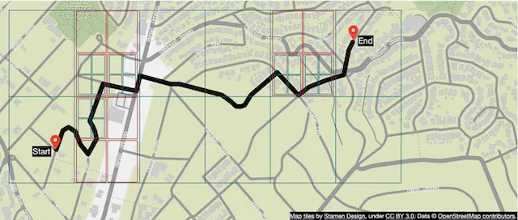

##### 预计到达时间服务

一旦路线规划器收到可能的最短路径列表，它就会为每条可能的路线调用 ETA 服务并获取时间估计。为此，ETA 服务使用机器学习根据当前流量和历史数据来预测 ETA。

这里的挑战之一是我们不仅需要实时交通数据，还需要预测 10 或 20 分钟后的交通状况。这类挑战需要在算法层面上解决，本节不会讨论。如果你有兴趣，请参阅[17]和[18]。

**排名服务**

最后，在路线规划器获得 ETA 预测后，它会将这些信息传递给排名器以应用用户定义的可能的过滤器。一些示例过滤器包括避开收费公路或避开高速公路的选项。然后，排序服务将可能的路线从最快到最慢进行排序，并将前 k 个结果返回给导航服务。

##### 更新服务

这些服务利用 Kafka 位置更新流并异步更新一些重要数据库以使其保持最新。交通数据库和路线图块就是一些示例。

路线图块处理服务负责将包含新发现的道路和道路封闭的道路数据集转换为持续更新的路线图块集。这有助于最短路径服务更加准确。

交通更新服务从活动用户发送的位置更新流中提取交通状况。这种洞察力被输入到实时流量数据库中。这使得 ETA 服务能够提供更准确的估计。

##### 改进：自适应预计到达时间和重新路由

当前设计不支持自适应 ETA 和重新路由。为了解决这个问题，服务器需要跟踪所有活跃的导航用户，并在交通状况发生变化时持续更新预计到达时间。在这里我们需要回答几个重要的问题：

- 我们如何跟踪主动导航的用户？
- 我们如何存储数据，以便在数百万条导航路线中高效定位受流量变化影响的用户？

让我们从一个简单的解决方案开始。在图 19 中，user_1 的导航路线由路线图块 r_1、r_2、r_3、...、r_7 表示。

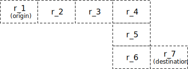

该数据库存储主动导航用户和路线信息，可能如下所示：

用户_1：r_1，r_2，r_3，...，r_k

用户_2：r_4，r_6，r_9，...，r_n

用户_3：r_2，r_8，r_9，...，r_m

……

用户n：r_2，r_10，r21，...，r_l

假设路线图块 2 (r_2) 中发生了交通事故。为了确定哪些用户受到影响，我们扫描每一行并检查路由图块 2 是否在我们的路由图块列表中（请参见下面的示例）。

用户_1：r_1，**r_2**，r_3，...，r_k

用户_2：r_4，r_6，r_9，...，r_n

用户_3：**r_2**，r_8，r_9，...，r_m

……

用户n：**r_2**，r_10，r_21，...，r_l

假设表中的行数为*n*，导航路线的平均长度为*m*。查找受流量变化影响的所有用户的时间复杂度为O(n * m)。

我们可以让这个过程更快吗？让我们探索一种不同的方法。对于每个主动导航的用户，我们保留当前的路线图块、包含它的下一个分辨率级别的路线图块，并递归地查找下一个分辨率级别的路线图块，直到我们也在图块中找到用户的目的地（图 20） ）。通过这样做，我们可以得到这样的数据库表的一行。

用户_1，r_1，超级（r_1），超级（超级（r_1）），...

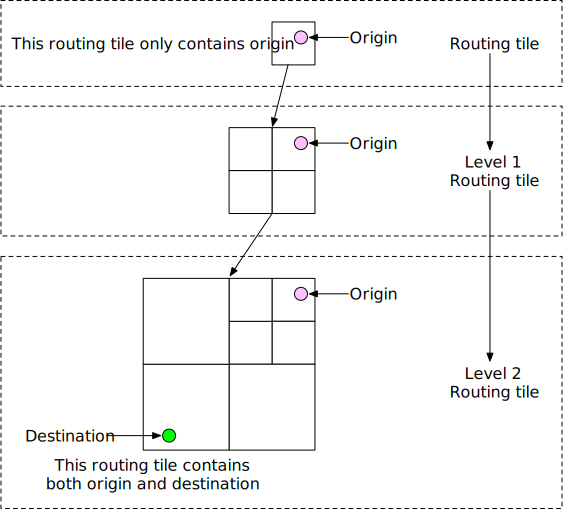

要查明用户是否受到流量变化的影响，我们只需检查路由图块是否位于数据库中一行的最后一个路由图块内。如果不是，用户不会受到影响。如果是，用户就会受到影响。通过这样做，我们可以快速过滤掉很多用户。

此方法没有指定交通畅通时会发生什么。例如，如果路由图块 2 清除并且用户可以返回到旧路由，那么用户如何知道重新路由可用？一种想法是跟踪导航用户的所有可能路线，定期重新计算 ETA，并在发现具有更短 ETA 的新路线时通知用户。

**交付协议**

事实上，在导航过程中，路线条件可能会发生变化，服务器需要一种可靠的方式将数据推送到移动客户端。对于从服务器到客户端的传输协议，我们的选项包括移动推送通知、长轮询、WebSocket 和服务器发送事件 (SSE)。

- 移动推送通知不是一个很好的选择，因为有效负载大小非常有限（iOS 为 4,096 字节）并且不支持 Web 应用程序。
- WebSocket 通常被认为是比长轮询更好的选择，因为它在服务器上的占用空间非常小。
- 由于我们已经排除了移动推送通知和长轮询，因此主要在 WebSocket 和 SSE 之间进行选择。尽管两者都可以工作，但我们倾向于 WebSocket，因为它支持双向通信，并且最后一英里交付等功能可能需要双向实时通信。

有关 ETA 和重新路由的更多详细信息，请参阅[17]。

现在我们把设计的每一个部分都放在一起了。请参见图 21 中的更新设计。

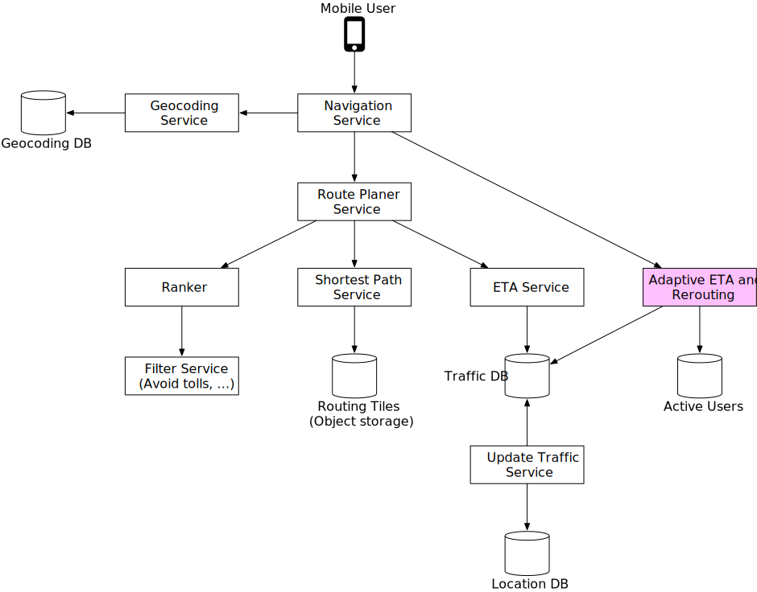

## 第 4 步 - 总结

在本章中，我们设计了一个简化的 Google 地图应用程序，具有位置更新、预计到达时间、路线规划和地图渲染等关键功能。如果你有兴趣扩展该系统，一项潜在的改进是为企业客户提供多站导航功能。例如，对于一组给定的目的地，我们必须根据实时交通状况找到访问所有目的地的最佳顺序并提供正确的导航。这对于 Door dash、Uber、Lyft 等送货服务可能会有帮助。

恭喜你已经走到这一步了！现在拍拍自己的背吧。好工作！

## 章节总结

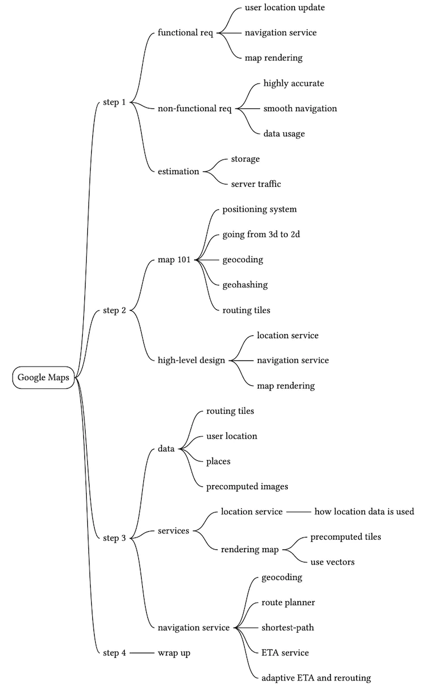

## 参考资料

[1] 谷歌地图：[https://developers.google.com/maps?hl =en_US](https://developers.google.com/maps?hl=en_US)

[2] 谷歌地图平台：https://cloud.google.com/maps-platform/

[3] 花蕊设计：[http://maps.stamen.com](http://maps.stamen.com/)

[4] OpenStreetMap： [https://www.openstreetmap.org](https://www.openstreetmap.org/)

[5] 制作更平滑的地图原型：https://medium.com/google-design/google-maps-cb0326d165f5

[6] 墨卡托投影：https://en.wikipedia.org/wiki/Mercator_projection

[7] 皮尔士梅花投影：https://en.wikipedia.org/wiki/Peirce_quincuncial_projection

[8] Gall-Peters 投影：[https://en.wikipedia.org/wiki/Gall-Peters_projection](https://en.wikipedia.org/wiki/Gall–Peters_projection)

[9] 温克尔三重投影：https://en.wikipedia.org/wiki/Winkel_tripel_projection

[10] 地址地理编码：[https ://en.wikipedia.org/wiki/Address_geocoding](https://en.wikipedia.org/wiki/Address_geocoding)

[11] 地理哈希：https://kousiknath.medium.com/system-design-design-a-geo-spatial-index-for-real-time-location-search-10968fe62b9c

[12] HTTP 保持活动：[https ://en.wikipedia.org/wiki/HTTP_persistent_connection](https://en.wikipedia.org/wiki/HTTP_persistent_connection)

[13] 路线 API：[https://developers.google.com/maps/documentation/directions/start ?hl=en_US](https://developers.google.com/maps/documentation/directions/start?hl=en_US)

[14] 邻接列表： [https://en.wikipedia.org/wiki/Adjacency_list](https://en.wikipedia.org/wiki/Adjacency_list)

[15] CAP定理：https://en.wikipedia.org/wiki/CAP_theorem

[16] 路由图块：https://valhalla.readthedocs.io/en/latest/mjolnir/why_tiles/

[17] 带有 GNN 的 ETA：https://deepmind.com/blog/article/traffic-prediction-with-advanced-graph-neural-networks

[18] Google 地图 101：人工智能如何帮助预测交通并确定路线：
[https://blog.google/products/maps/google-maps-101-how-ai-helps-predict-traffic-and-define-routes/](https://blog.google/products/maps/google-maps-101-how-ai-helps-predict-traffic-and-determine-routes/)