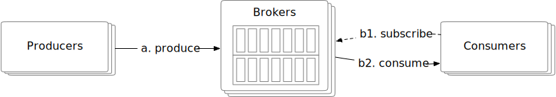

在本章中，我们探讨系统设计面试中的一个常见问题：设计分布式消息队列。在现代建筑中，系统被分解为小型且独立的构建块，它们之间具有明确定义的接口。消息队列为这些构建块提供通信和协调。消息队列带来什么好处？

- 解耦。消息队列消除了组件之间的紧密耦合，因此它们可以独立更新。
- 提高了可扩展性。我们可以根据流量负载独立扩展生产者和消费者。例如，在高峰时段，可以添加更多消费者来处理增加的流量。
- 提高可用性。如果系统的一部分离线，其他组件可以继续与队列交互。
- 更好的性能。消息队列使异步通信变得容易。生产者可以将消息添加到队列中，而无需等待响应，而消费者只要消息可用就消费消息。他们不需要互相等待。

图 1 显示了市场上一些最流行的分布式消息队列。

**消息队列与事件流平台**

严格来说，Apache Kafka 和 Pulsar 不是消息队列，因为它们是事件流平台。然而，功能的融合开始模糊消息队列（RocketMQ、ActiveMQ、RabbitMQ、ZeroMQ 等）和事件流平台（Kafka、Pulsar）之间的区别。例如，RabbitMQ是一个典型的消息队列，它添加了可选的流功能，以允许重复的消息消费和长时间的消息保留，并且其实现使用仅附加日志，很像事件流平台。 Apache Pulsar 主要是 Kafka 的竞争对手，但它也足够灵活和高性能，可以用作典型的分布式消息队列。

在本章中，我们将设计一个具有附加功能的分布式消息队列，例如长期数据保留、消息的重复消费等，这些功能通常仅在事件流平台上可用。这些附加功能使设计更加复杂。在本章中，我们将重点介绍如果你的采访重点围绕更传统的分布式消息队列，则可以简化设计的地方。

## 第 1 步 - 了解问题并确定设计范围

简而言之，消息队列的基本功能很简单：生产者将消息发送到队列，消费者从队列中消费消息。除了这个基本功能之外，还有其他考虑因素，包括性能、消息传递语义、数据保留等。以下一组问题将有助于澄清需求并缩小范围。

**候选人**：消息的格式和平均大小是多少？是只有文字吗？允许使用多媒体吗？
**面试官**：只发短信。消息通常以千字节 (KB) 为单位进行测量。

**候选人**：消息可以重复消费吗？
**面试官**：是的，消息可以被不同的消费者重复消费。请注意，这是一个附加功能。传统的分布式消息队列在消息成功传递给消费者后不会保留消息。因此，传统消息队列中的消息无法被重复消费。

**候选人**：消息的消费顺序是否与其产生的顺序相同？
**采访者**：是的，消息应该按照它们产生的顺序被消费。请注意，这是一个附加功能。传统的分布式消息队列通常不能保证传递顺序。

**候选人**：数据需要持久化吗？什么是数据保留？
**面试官**：是的，我们假设数据保留两周。这是一个附加功能。传统的分布式消息队列不保留消息。

**候选人**：我们要支持多少生产者和消费者？
**面试官**：越多越好。

**候选人**：我们需要支持什么数据传递语义？例如，最多一次、至少一次和恰好一次。
**采访者**：我们肯定希望至少支持一次。理想情况下，我们应该支持所有这些并使其可配置。

**候选人**：目标吞吐量和端到端延迟是多少？
**面试官**：它应该支持日志聚合等用例的高吞吐量。它还应该支持更传统的消息队列用例的低延迟交付。

通过上面的对话，我们假设我们有以下功能需求：

- 生产者将消息发送到消息队列。
- 消费者从消息队列中消费消息。
- 消息可以重复使用或仅使用一次。
- 历史数据可以被截断。
- 消息大小以千字节为单位。
- 能够按照消息添加到队列的顺序将消息传递给消费者。
- 数据传输语义（至少一次、最多一次或恰好一次）可以由用户配置。

### 非功能性需求

- 高吞吐量或低延迟，可根据用例进行配置。
- 可扩展。该系统本质上应该是分布式的。它应该能够支持消息量的突然激增。
- 持久耐用。数据应保留在磁盘上并跨多个节点复制。

### 对传统消息队列的调整

像 RabbitMQ 这样的传统消息队列没有事件流平台那么强的保留要求。传统队列将消息在内存中保留足够长的时间以供使用。它们提供的磁盘溢出容量 [1] 比事件流平台所需的容量小几个数量级。传统的消息队列通常不维护消息顺序。消息的消费顺序可以与生成顺序不同。这些差异极大地简化了我们将在适当的时候讨论的设计。

## 第 2 步 - 提出高级设计并获得认可

首先，我们来讨论一下消息队列的基本功能。

图 2 显示了消息队列的关键组件以及这些组件之间的简化交互。

- 生产者将消息发送到消息队列。
- Consumer 订阅队列并消费订阅的消息。
- 消息队列是一种中间服务，它将生产者与消费者解耦，允许每个人独立操作和扩展。
- 在客户端/服务器模型中，生产者和消费者都是客户端，而消息队列是服务器。客户端和服务器通过网络进行通信。

### 消息传递模型

最流行的消息传递模型是点对点和发布-订阅。

#### 点对点

这种模型常见于传统的消息队列中。在点对点模型中，消息被发送到队列并由一个且仅一个消费者使用。队列中可以有多个消费者等待消费消息，但每条消息只能被单个消费者消费。在图 3 中，消息 A 仅被消费者 1 消费。

一旦消费者确认消息已被消费，该消息就会从队列中删除。点对点模型中没有数据保留。相比之下，我们的设计包括一个持久层，可以将消息保留两周，从而允许消息被重复使用。

虽然我们的设计可以模拟点对点模型，但其功能更自然地映射到发布-订阅模型。

#### 发布-订阅

首先，我们引入一个新概念，即主题。主题是用于组织消息的类别。每个主题都有一个在整个消息队列服务中唯一的名称。消息被发送到特定主题并从特定主题读取。

在发布-订阅模型中，消息被发送到主题并由订阅该主题的消费者接收。如图4所示，消息A被消费者1和消费者2同时消费。

我们的分布式消息队列支持这两种模型。发布订阅模型是通过**主题**来实现的，点对点模型可以通过**消费者组**的概念来模拟，这将在消费者组部分进行介绍。

### 主题、分区和代理

如前所述，消息由主题保存。如果主题中的数据量太大，单个服务器无法处理怎么办？

解决这个问题的一种方法称为**分区（sharding）**。如图 5 所示，我们将主题划分为多个分区，并跨分区均匀地传递消息。将分区视为主题消息的一个小子集。分区均匀分布在消息队列集群中的服务器上。这些保存分区的服务器称为**代理**。 Brokers之间分区的分布是支持高可扩展性的关键要素。我们可以通过扩大分区数量来扩展主题容量。

每个主题分区以队列的形式运行，具有 FIFO（先进先出）机制。这意味着我们可以保持分区内消息的顺序。消息在分区中的位置称为**偏移量**。

当生产者发送消息时，它实际上被发送到主题的分区之一。每条消息都有一个可选的消息键（例如用户的ID），并且同一消息键的所有消息都被发送到同一个分区。如果消息密钥不存在，则消息被随机发送到其中一个分区。

当消费者订阅某个主题时，它会从一个或多个分区中提取数据。当有多个消费者订阅一个主题时，每个消费者负责该主题的分区子集。消费者形成一个主题的**消费者组。**

具有代理和分区的消息队列集群如图 6 所示。

### 消费群体

正如前面提到的，我们需要同时支持点对点和订阅-发布模型。**消费者组**是一组消费者，它们一起工作以消费来自主题的消息。

消费者可以被组织成组。每个消费者组可以订阅多个主题并维护自己的消费偏移量。例如，我们可以按用例对消费者进行分组，一组用于计费，另一组用于会计。

同一组中的实例可以并行消耗流量，如图 7 所示。

- 消费者组1订阅主题A。
- 消费者组 2 订阅了主题 A 和 B。
- 主题A同时被消费者组1和2订阅，即同一条消息被多个消费者消费。该模式支持订阅/发布模型。

然而，有一个问题。并行读取数据提高了吞吐量，但无法保证同一分区内消息的消费顺序。例如，如果消费者1和消费者2都从分区1读取，我们将无法保证分区1中的消息消费顺序。

好消息是我们可以通过添加一个约束来解决这个问题，即单个分区只能由同一组中的一个消费者使用。如果一个Group的消费者数量大于某个Topic的分区数量，则部分消费者将无法从该Topic获取数据。例如，在图 7 中，组 2 中的消费者 3 无法消费来自主题 B 的消息，因为该消息已被同一消费者组中的消费者 4 消费。

有了这个约束，如果我们把所有消费者都放在同一个消费者组中，那么同一个分区中的消息只会被一个消费者消费，相当于点对点模型。由于分区是最小的存储单元，我们可以提前分配足够的分区，以避免动态增加分区的数量。为了处理大规模，我们只需要添加消费者。

### 高层架构

图 8 显示了更新后的高层设计。

客户

- 生产者：将消息推送到特定主题。
- 消费者组：订阅主题、消费消息。

核心服务和存储

- Broker：持有多个分区。分区保存某个主题的消息子集。
- 贮存：
  - 数据存储：消息持久保存在分区的数据存储中。
  - 状态存储：消费者状态由状态存储管理。
  - 元数据存储：主题的配置和属性保存在元数据存储中。
- 协调服务：
  - 服务发现：哪些代理还活着。
  - 领导者选举：选择其中一名经纪人作为主动控制者。集群中只有一个活动控制器。活动控制器负责分配分区。
  - Apache Zookeeper [2] 或 etcd [3] 通常用于选择控制器。

## 第 3 步 - 深入设计

为了实现高吞吐量，同时满足高数据保留要求，我们做出了三个重要的设计选择，现在我们将详细解释。

- 我们选择了一种磁盘数据结构，该结构利用了旋转磁盘的出色顺序访问性能和现代操作系统的积极磁盘缓存策略。
- 我们设计的消息数据结构允许消息从生产者传递到队列，最后传递到消费者，无需任何修改。这最大限度地减少了复制的需要，复制在大容量和高流量的系统中是非常昂贵的。
- 我们设计的系统有利于批处理。小 I/O 是高吞吐量的敌人。因此，只要有可能，我们的设计就鼓励批处理。生产者批量发送消息。消息队列以更大的批量保存消息。消费者也会在可能的情况下批量获取消息。

### 数据存储

现在让我们更详细地探讨保存消息的选项。为了找到最佳选择，让我们考虑消息队列的流量模式。

- 重写、重读。
- 没有更新或删除操作。顺便说一句，传统的消息队列不会持久化消息，除非队列落后，在这种情况下，当队列赶上时将会有“删除”操作。我们这里讨论的是数据流平台的持久化。
- 主要是顺序读/写访问。

选项 1：数据库

第一个选项是使用数据库。

- 关系数据库：创建主题表并将消息以行形式写入表中。
- NoSQL 数据库：创建集合作为主题并将消息写入文档。

数据库可以满足存储需求，但它们并不理想，因为很难设计一个同时支持大规模写入和读取访问模式的数据库。该数据库解决方案不太适合我们特定的数据使用模式。

这意味着数据库不是最佳选择，并且可能成为系统的瓶颈。

选项 2：预写日志 (WAL)

第二个选项是预写日志（WAL）。 WAL 只是一个普通文件，其中新条目附加到仅附加日志中。 WAL在很多系统中都有使用，比如MySQL中的重做日志，ZooKeeper中的WAL。

我们建议将消息作为 WAL 日志文件保存在磁盘上。 WAL 具有纯顺序读/写访问模式。顺序存取的磁盘性能非常好[4]。此外，旋转磁盘容量大，而且价格相当实惠。

如图 9 所示，一条新消息被附加到分区的尾部，偏移量单调递增。最简单的选择是使用日志文件的行号作为偏移量。但是，文件不能无限增长，因此最好将其分成多个段。

对于段，新消息仅附加到活动段文件中。当活动段达到一定大小时，会创建一个新的活动段来接收新消息，并且当前活动段将变为非活动状态，就像其他非活动段一样。非活动段仅服务于读请求。如果旧的非活动段文件超出保留或容量限制，则可能会被截断。

同一分区的段文件组织在名为“Partition-{:partition_id}”的文件夹中。其结构如图10所示。

**关于磁盘性能的说明**

为了满足高数据保留要求，我们的设计严重依赖磁盘驱动器来保存大量数据。人们普遍误解旋转磁盘速度很慢，但这实际上只是随机访问的情况。对于我们的工作负载，只要我们设计磁盘数据结构以利用顺序访问模式，RAID 配置中的现代磁盘驱动器（即，将磁盘条带在一起以获得更高的性能）就可以轻松达到数百 MB/秒的读写速度。这对于我们的需求来说是绰绰有余的，而且成本结构也是有利的。

此外，现代操作系统非常积极地在主内存中缓存磁盘数据，以至于它会很乐意使用所有可用的空闲内存来缓存磁盘数据。正如我们上面所描述的，WAL 也利用了繁重的操作系统磁盘缓存。

### 消息数据结构

消息的数据结构是高吞吐量的关键。它定义了生产者、消息队列和消费者之间的契约。我们的设计通过消除消息从生产者到队列并最终到消费者的传输过程中不必要的数据复制来实现高性能。如果系统的任何部分不同意此合同，则需要对消息进行变异，这涉及昂贵的复制。它可能会严重损害系统的性能。

以下是消息数据结构的示例架构：

| 字段名称 | 数据类型 |
| :------- | :------- |
| **钥匙** | 字节[]   |
| **价值** | 字节[]   |
| 话题     | 细绳     |
| 分割     | 整数     |
| 抵消     | 长的     |
| 时间戳   | 长的     |
| 尺寸     | 整数     |
| CRC [5]  | 整数     |

表1 消息数据结构

#### 留言键

消息的key用于确定消息的分区。如果未定义密钥，则随机选择分区。否则，通过*hash(key) % numPartitions*选择分区。如果我们需要更大的灵活性，生产者可以定义自己的映射算法来选择分区。请注意，密钥不等于分区号。

键可以是字符串或数字。它通常携带一些商业信息。分区号是消息队列中的一个概念，不应该显式暴露给客户端。

通过适当的映射算法，即使分区数量发生变化，消息仍然可以均匀地发送到所有分区。

#### 留言价值

消息值是消息的有效负载。它可以是纯文本或压缩的二进制块。

| **提醒**                                                     |
| :----------------------------------------------------------- |
| 消息的键和值与键值 (KV) 存储中的键值对不同。在KV存储中，键是唯一的，我们可以通过键找到值。在消息中，键不需要是唯一的。有时它们甚至不是强制性的，我们不需要通过键查找值。 |

### 

#### 消息的其他字段

- 主题：消息所属主题的名称。
- Partition：消息所属分区的ID。
- Offset：消息在分区中的位置。我们可以通过三个字段的组合找到一条消息：主题、分区、偏移量。
- 时间戳：存储该消息时的时间戳。
- 大小：该消息的大小。
- CRC：循环冗余校验（CRC）用于保证原始数据的完整性。

为了支持附加功能，可以根据需要添加一些可选字段。例如，如果标签是可选字段的一部分，则可以按标签过滤消息。

### 配料

批处理在这种设计中很普遍。我们在生产者、消费者和消息队列本身中对消息进行批处理。批处理对于系统的性能至关重要。在本节中，我们主要关注消息队列中的批处理。我们很快就会更详细地讨论生产者和消费者的批处理。

批处理对于提高性能至关重要，因为：

- 它允许操作系统将消息分组到单个网络请求中，并分摊昂贵的网络往返成本。
- 代理将消息以大块的形式写入追加日志，这会导致由操作系统维护的更大的顺序写入块和更大的连续磁盘缓存块。两者都会带来更大的顺序磁盘访问吞吐量。

吞吐量和延迟之间需要权衡。如果系统部署为传统的消息队列，其中延迟可能更重要，则可以调整系统以使用较小的批量大小。在此用例中，磁盘性能会受到一些影响。如果针对吞吐量进行调整，每个主题可能需要更多数量的分区，以弥补较慢的顺序磁盘写入吞吐量。

到目前为止，我们已经介绍了主磁盘存储子系统及其相关的磁盘数据结构。现在，让我们换个话题来讨论生产者流和消费者流。然后我们将回来并完成对消息队列其余部分的深入研究。

### 生产者流程

如果生产者想要向分区发送消息，它应该连接到哪个代理？第一个选择是引入路由层。发送到路由层的所有消息都会路由到“正确的”代理。如果代理被复制，“正确”的代理就是领导者副本。稍后我们将介绍复制。

如图 11 所示，生产者尝试将消息发送到主题 A 的分区 1。

1. 生产者将消息发送到路由层。
2. 路由层从元数据存储中读取副本分布方案[1](#user-content-fn-1)并缓存在本地。当消息到达时，它将消息路由到分区 1 的领导副本，该副本存储在代理 1 中。
3. 领导者副本接收消息，跟随者副本从领导者那里拉取数据。
4. 当“足够”的副本同步消息时，领导者将提交数据（保存在磁盘上），这意味着可以使用数据。然后它响应生产者。

你可能想知道为什么我们需要领导者和追随者副本。原因是容错。我们在“同步副本”部分深入探讨了这个过程。

这种方法有效，但有一些缺点：

- 新的路由层意味着由开销和额外网络跃点引起的额外网络延迟。
- 请求批处理是效率的重要驱动因素之一。这个设计没有考虑到这一点。

图 12 显示了改进的设计。

路由层被包装到生产者中，并且缓冲组件被添加到生产者中。两者都可以作为生产者客户端库的一部分安装在生产者中。这一变化带来了几个好处：

- 更少的网络跃点意味着更低的延迟。
- 生产者可以有自己的逻辑来确定消息应发送到哪个分区。
- 批处理会在内存中缓冲消息并在单个请求中发送更大的批次。这增加了吞吐量。

批量大小的选择是吞吐量和延迟之间的典型权衡（图 13）。如果批量大小较大，吞吐量会增加，但由于累积批量的等待时间较长，因此延迟会更高。如果批量大小较小，请求会发送得更快，因此延迟会较低，但吞吐量会受到影响。生产者可以根据用例调整批量大小。

### 消费流程

消费者指定其在分区中的偏移量并接收从该位置开始的事件块。图 14 显示了一个示例。

#### 推与拉

需要回答的一个重要问题是经纪人是否应该将数据推送给消费者，或者消费者是否应该从经纪人那里提取数据。

**推送模式**

优点：

- 低延迟。代理可以在收到消息后立即将消息推送给消费者。

缺点：

- 如果消费率低于生产率，消费者可能会不知所措。
- 与具有不同处理能力的消费者打交道很困难，因为经纪人控制着数据传输的速率。

**拉模型**

优点：

- 消费者控制消费速度。我们可以让一组消费者实时处理消息，另一组消费者以批处理方式处理消息。
- 如果消费率低于生产率，我们可以扩大消费者规模，或者在可能的情况下迎头赶上。
- 拉模型更适合批量处理。在推送模型中，代理不知道消费者是否能够立即处理消息。如果代理一次向消费者发送一条消息并且消费者已备份，则新消息最终将在缓冲区中等待。拉取模型会拉取消费者在日志中的当前位置之后的所有可用消息（或直到可配置的最大大小）。它适用于激进的数据批处理。

缺点：

- 当代理中没有消息时，消费者可能仍然继续拉取数据，浪费资源。为了克服这个问题，许多消息队列支持长轮询模式，该模式允许拉取新消息等待指定的时间[6]。

基于这些考虑，大多数消息队列都会选择pull模型。

图 15 显示了消费者拉动模型的工作流程。

1. 一个新的消费者想要加入组1并订阅主题A。它通过散列组名找到相应的broker节点。通过这样做，同一组中的所有消费者都连接到同一个代理，该代理也称为该消费者组的协调者。尽管命名相似，但消费者组协调器与图 8 中提到的协调服务不同。该协调器协调消费者组，而前面提到的协调服务协调代理集群。
2. 协调器确认消费者已加入组并将分区 2 分配给消费者。有不同的分区分配策略，包括循环、范围等[7]
3. 消费者从最后消费的偏移量中获取消息，该偏移量由状态存储管理。
4. 消费者处理消息并将偏移量提交给代理。数据处理和偏移量提交的顺序会影响消息传递语义，稍后将对此进行讨论。

### 消费者再平衡

消费者重新平衡决定哪个消费者负责哪个分区子集。该过程可能发生在消费者加入、消费者离开、消费者崩溃或分区调整时。

当消费者重新平衡发生时，协调员扮演着重要的角色。我们先来看看什么是协调员。协调员是负责与消费者沟通以实现消费者再平衡的经纪人之一。协调器接收来自消费者的心跳并管理它们在分区上的偏移量。

我们通过一个例子来了解一下协调者和消费者是如何协同工作的。

- 如图 16 所示，每个消费者都属于一个组。它通过散列组名称找到专用协调器。来自同一组的所有消费者都连接到同一个协调器。
- 协调员维护一个加入的消费者列表。当列表发生变化时，协调员会选举该组的新领导者。
- 作为消费者组的新领导者，它生成新的分区调度计划并将其报告给协调者。协调员将向组中的其他消费者广播该计划。

在分布式系统中，消费者可能会遇到各种问题，包括网络问题、崩溃、重启等。从协调者的角度来看，他们将不再有心跳。发生这种情况时，协调器将触发重新平衡过程来重新分派分区，如图 17 所示。

让我们模拟一些重新平衡场景。假设组中有2个消费者，订阅的主题有4个分区。图18展示了新消费者B加入组时的流程。

1. 最初，该组中只有消费者 A。它消耗所有分区并与协调器保持心跳。
2. 消费者B发送加入该组的请求。
3. 协调者知道是时候重新平衡了，因此它以被动的方式通知组中的所有消费者。当协调器收到A的心跳后，请求A重新加入组。
4. 一旦所有消费者重新加入该组，协调员就会选择其中一个作为领导者，并将选举结果通知所有消费者。
5. 领导者消费者生成分区调度计划并将其发送给协调者。 Follower 消费者向协调者询问分区调度计划。
6. 消费者开始消费来自新分配分区的消息。

图19展示了现有消费者A离开群组时的流程。

1. 消费者A和B属于同一个消费者组。
2. 消费者A需要关闭，因此请求离开群组。
3. 协调员知道是时候重新平衡了。当协调器收到B的心跳后，请求B重新加入组。
4. 其余步骤与图 18 中所示的相同。

图20展示了现有消费者A崩溃时的流程。

1. 消费者A和B与协调者保持心跳。
2. 消费者A崩溃了，因此消费者A没有向协调器发送心跳。由于协调器在指定时间内没有从消费者 A 收到任何心跳信号，因此将消费者标记为已死亡。
3. 协调器触发重新平衡过程。
4. 以下步骤与上一场景中的步骤相同。

现在我们已经完成了生产者和消费者流的绕行，让我们回来完成对消息队列代理其余部分的深入研究。

### 状态存储

在消息队列代理中，状态存储存储：

- 分区和消费者之间的映射。
- 每个分区的消费者组最后消费的偏移量。如图 21 所示，消费者组 1 最后消费的偏移量为 6，消费者组 2 的最后消费偏移量为 13。

例如，如图21所示，组1中的消费者按顺序消费来自分区的消息，并提交消费的偏移量6。这意味着偏移量6之前和偏移量6处的所有消息都已被消费。如果消费者崩溃，同一组中的另一个新消费者将通过从状态存储中读取最后消费的偏移量来恢复消费。

消费者状态的数据访问模式是：

- 读写操作频繁但量不高。
- 数据经常更新，很少被删除。
- 随机读写操作。
- 数据一致性很重要。

许多存储解决方案可用于存储消费者状态数据。考虑到数据一致性和快速读写需求，像Zookeeper这样的KV存储是一个不错的选择。 Kafka 已将偏移存储从 Zookeeper 转移到 Kafka 代理。有兴趣的读者可以阅读参考资料[8]来了解更多。

### 元数据存储

元数据存储存储主题的配置和属性，包括分区数量、保留期限和副本分布。

元数据变化不频繁，数据量较小，但一致性要求较高。 Zookeeper 是存储元数据的不错选择。

### 动物园管理员

通过阅读前面的章节，你可能已经感觉到 Zookeeper 对于设计分布式消息队列非常有帮助。如果你不熟悉，Zookeeper 是提供分层键值存储的分布式系统的基本服务。它通常用于提供分布式配置服务、同步服务和命名注册表[2]。

ZooKeeper 用于简化我们的设计，如图 22 所示。

让我们简单回顾一下这一变化。

- 元数据和状态存储移至 Zookeeper。
- 代理现在只需要维护消息的数据存储。
- Zookeeper 帮助进行代理集群的领导者选举。

### 复制

在分布式系统中，硬件问题是常见且不容忽视的。当磁盘损坏或永久出现故障时，数据就会丢失。复制是实现高可用性的经典解决方案。

如图 23 所示，每个分区都有 3 个副本，分布在不同的代理节点上。

对于每个分区，突出显示的副本是领导者，其他副本是追随者。生产者仅向领导者副本发送消息。追随者副本不断从领导者那里拉取新消息。一旦消息同步到足够的副本，领导者就会向生产者返回确认。我们将在下面的同步副本部分详细介绍如何定义“足够”。

每个分区的副本分布称为副本分布计划。例如，图23中的副本分配计划可以描述为：

- 主题 A 的分区 1：3 个副本，broker 1 中的 Leader，broker 2 和 3 中的 follower；
- 主题 A 的分区 2：3 个副本，broker 2 中的领导者，broker 3 和 4 中的追随者；
- 主题 B 的分区 1：3 个副本，代理 3 中的领导者，代理 4 和 1 中的追随者。

谁制定副本分配计划？它的工作原理如下；在协调服务的帮助下，其中一个代理节点被选举为领导者。它生成副本分发计划并将该计划保留在元数据存储中。现在所有经纪人都可以按照计划进行工作了。

如果你有兴趣了解有关复制的更多信息，请查看《设计数据密集型应用程序》[9]一书的“第 5 章复制”。

#### 同步副本

我们提到消息被持久化在多个分区中以避免单节点故障，并且每个分区有多个副本。消息仅写入领导者，追随者从领导者同步数据。我们需要解决的一个问题是保持它们同步。

同步副本（ISR）是指与领导者“同步”的副本。 “同步”的定义取决于主题配置。例如，如果replica.lag.max.messages的值为4，则意味着只要follower落后leader不超过3条消息，就不会从ISR中删除[10]。默认情况下，领导者是 ISR。

让我们使用如图 24 所示的示例来展示 ISR 的工作原理。

- 领导者副本中的已提交偏移量为 13。两条新消息已写入领导者，但尚未提交。提交偏移量意味着该偏移量之前和该偏移量处的所有消息都已同步到 ISR 中的所有副本。
- Replica-2 和replica-3 已经完全追上了leader，因此它们处于ISR 中并且可以获取新消息。
- Replica-4 没有在配置的延迟时间内完全追上领导者，因此它不在 ISR 中。当它再次赶上时，可以将其添加到ISR中。

为什么我们需要情监侦？原因是 ISR 反映了性能和耐用性之间的权衡。如果生产者不想丢失任何消息，最安全的方法是在发送确认之前确保所有副本已经同步。但缓慢的副本会导致整个分区变慢或不可用。

现在我们已经讨论了 ISR，让我们看一下确认设置。生产者可以选择接收确认，直到*K*个 ISR 收到消息，其中*K*是可配置的。

**确认=全部**

图 25 说明了 ACK=all 的情况。当 ACK=all 时，当所有 ISR 都收到消息时，生产者会收到 ACK。这意味着发送消息需要更长的时间，因为我们需要等待最慢的 ISR，但它提供了最强的消息持久性。

**确认=1**

当 ACK=1 时，一旦领导者持久化消息，生产者就会收到 ACK。通过不等待数据同步来改善延迟。如果领导者在消息被确认后但在追随者节点复制该消息之前立即失败，则该消息将丢失。此设置适用于可接受偶尔数据丢失的低延迟系统。

**确认=0**

生产者不断向领导者发送消息而不等待任何确认，并且从不重试。此方法以潜在的消息丢失为代价提供最低的延迟。此设置可能适合收集指标或记录数据等用例，因为数据量很大并且偶尔的数据丢失是可以接受的。

可配置的 ACK 使我们能够以耐用性换取性能。

现在让我们看看消费者方面。最简单的设置是让消费者连接到领导者副本来消费消息。

你可能想知道领导者副本是否会因这种设计而不堪重负，以及为什么不从 ISR 读取消息。原因是：

- 设计和操作简单。
- 由于一个分区中的消息仅分发给消费者组中的一个消费者，因此这限制了与主副本的连接数量。
- 只要主题不是超级热门，与领导副本的连接数量通常不会很大。
- 如果某个主题很热门，我们可以通过扩大分区和消费者的数量来进行扩展。

在某些情况下，从领导者副本读取可能不是最佳选择。例如，如果消费者位于与领导者副本不同的数据中心，则读取性能会受到影响。在这种情况下，让消费者能够读取最近的 ISR 是值得的。有兴趣的读者可以查看这方面的参考资料[11]。

ISR 非常重要。它如何确定副本是否是 ISR？通常，每个分区的领导者通过计算每个副本与其自身的滞后来跟踪 ISR 列表。如果你对详细算法感兴趣，可以在参考资料[12][13]中找到实现。

### 可扩展性

到目前为止，我们在分布式消息队列系统的设计上已经取得了很大的进展。下一步，我们来评估不同系统组件的可扩展性：

- 制片人
- 消费者
- 经纪人
- 分区

**制片人**

生产者在概念上比消费者简单得多，因为它不需要群体协调。生产者的可扩展性可以通过添加或删除生产者实例轻松实现。

**消费者**

消费者组之间是相互隔离的，因此很容易添加或删除消费者组。在消费者组内部，再平衡机制有助于处理消费者添加、删除或崩溃的情况。通过消费者组和再平衡机制，可以实现消费者的可扩展性和容错性。

**经纪人**

在讨论broker端的可扩展性之前，我们首先考虑一下broker的故障恢复。

让我们使用图 28 中的示例来解释故障恢复的工作原理。

1. 假设有4个broker，分区（副本）分配方案如下：
   - 主题 A 的分区 1：代理 1（领导者）、2 和 3 中的副本。
   - 主题 A 的分区 2：代理 2（领导者）、3 和 4 中的副本。
   - 主题 B 的分区 1：代理 3（领导者）、4 和 1 中的副本。
2. Broker 3崩溃，这意味着该节点上的所有分区都丢失了。分区分配方案改为：
   - 主题 A 的分区 1：代理 1（领导者）和 2 中的副本。
   - 主题 A 的分区 2：代理 2（领导者）和 4 中的副本。
   - 主题 B 的分区 1：代理 4 和 1 中的副本。
3. Broker 控制器检测到 Broker 3 已关闭，并为其余 Broker 节点生成新的分区分配计划：
   - 主题 A 的分区 1：代理 1（领导者）、2 和 4（新）中的副本。
   - 主题 A 的分区 2：代理 2（领导者）、4 和 1（新）中的副本。
   - 主题 B 的分区 1：代理 4（领导者）、1 和 2（新）中的副本。
4. 新的副本作为追随者并追赶领导者。

为了使代理具有容错能力，需要注意以下几点：

- ISR 的最小数量指定在消息被视为成功提交之前生产者必须接收多少个副本。数字越高，越安全。但另一方面，我们需要平衡延迟和安全性。
- 如果一个分区的所有副本都在同一个broker节点中，那么我们就不能容忍这个节点的故障。在同一个节点复制数据也是一种资源的浪费。因此，副本不应该位于同一节点。
- 如果某个分区的所有副本都崩溃，则该分区的数据将永远丢失。在选择副本数量和副本位置时，需要在数据安全、资源成本和延迟之间进行权衡。跨数据中心分布副本更安全，但这会导致在副本之间同步数据带来更多的延迟和成本。作为一种解决方法，数据镜像可以帮助跨数据中心复制数据，但这超出了范围。参考资料 [14] 涵盖了这个主题。

现在让我们回到讨论代理的可扩展性。最简单的解决方案是在添加或删除代理节点时重新分配副本。

然而，还有更好的方法。代理控制器可以暂时允许系统中的副本数量多于配置文件中的副本数量。当新添加的代理赶上时，我们可以删除不再需要的代理。让我们使用如图 29 所示的示例来理解该方法。

1. 初始设置：3 个代理、2 个分区、每个分区 3 个副本。
2. 添加了新经纪人 4。假设代理控制器将分区 2 的副本分配更改为代理 (2, 3, 4)。 Broker 4 中的新副本开始从 Leader Broker 2 复制数据。现在 Partition 2 的副本数量暂时超过 3 个。
3. 在代理 4 中的副本赶上之后，代理 1 中的冗余分区将被正常删除。

通过遵循此过程，可以避免添加代理时的数据丢失。可以应用类似的过程来安全地删除代理。

**分割**

出于各种操作原因，例如扩展主题、吞吐量调整、平衡可用性/吞吐量等，我们可能会更改分区的数量。当分区数量发生变化时，生产者与任何broker通信后都会收到通知，消费者将触发消费者重新平衡。因此，对于生产者和消费者来说都是安全的。

现在我们来考虑分区数量变化时的数据存储层。如图 30 所示，我们已向主题添加了一个分区。

- 持久化消息仍在旧分区中，因此没有数据迁移。
- 添加新分区（partition-3）后，新消息将持久保存在所有 3 个分区中。

因此，通过增加分区来扩展主题是很简单的。

**减少分区数量**

减少分区更为复杂，如图 31 所示。

- Partition-3 已停用，因此新消息仅由剩余分区（partition-1 和partition-2）接收。
- 无法立即删除停用的分区（partition-3），因为消费者当前可能会消耗数据一段时间。只有超过配置的保留期限后，数据才能被截断并释放存储空间。减少分区并不是回收数据空间的捷径。
- 在此过渡期间（当分区 3 停用时），生产者仅向其余 2 个分区发送消息，但消费者仍然可以从所有 3 个分区进行消费。退役分区的保留期到期后，消费者组需要重新平衡。

### 数据传递语义

现在我们了解了分布式消息队列的不同组件，让我们讨论不同的传递语义：最多一次、至少一次和恰好一次。

#### 至多一次

顾名思义，最多一次意味着消息不会被传递超过一次。消息可能会丢失，但不会重新传送。这就是高层交付的最多一次工作方式。

- 生产者异步向主题发送消息，无需等待确认 (ack=0)。如果消息传递失败，则不会重试。
- 消费者在处理数据之前获取消息并提交偏移量。如果消费者在偏移量提交后崩溃，则消息将不会被重新消费。

它适用于监控指标等可以接受少量数据丢失的用例。

#### 至少一次

通过这种数据传递语义，多次传递消息是可以接受的，但不应丢失任何消息。以下是它在高层次上的工作原理。

- Producer 通过响应回调同步或异步发送消息，设置 ack=1 或 ack=all，以确保消息传递到代理。如果消息传递失败或超时，生产者将不断重试。
- Consumer只有在数据处理成功后才获取消息并提交offset。如果消费者无法处理消息，它将重新消费该消息，因此不会丢失数据。另一方面，如果消费者处理了消息但未能将偏移量提交给代理，那么当消费者重新启动时，该消息将被重新消费，从而导致重复。
- 一条消息可能会多次传递给代理和消费者。

用例：至少一次，消息不会丢失，但同一条消息可能会被传递多次。虽然从用户的角度来看并不理想，但至少一次交付语义通常足以满足数据重复不是大问题或在消费者方面可以进行重复数据删除的用例。例如，通过每条消息中的唯一键，将重复数据写入数据库时可以拒绝消息。

#### 正好一次

Exactly Once 是最难实现的交付语义。它对用户友好，但对于系统的性能和复杂度来说代价较高。

用例：与金融相关的用例（支付、交易、会计等）。当重复不可接受且下游服务或第三方不支持幂等性时，Exactly Once 尤为重要。

### 高级功能

在本节中，我们简单讨论一些高级功能，例如消息过滤、延迟消息和定时消息。

#### 消息过滤

主题是包含相同类型消息的逻辑抽象。然而，某些消费者组可能只想消费某些子类型的消息。例如，订单系统将订单的所有活动发送到一个主题，但支付系统只关心与结帐和退款相关的消息。

一种选择是为支付系统构建一个专用主题，并为订购系统构建另一个主题。这种方法很简单，但可能会引起一些担忧。

- 如果其他系统要求不同的消息子类型怎么办？我们是否需要为每个消费者请求建立专门的主题？
- 在不同的主题上保存相同的消息是一种资源浪费。
- 每当新的消费者需求出现时，生产者都需要进行更改，因为生产者和消费者现在紧密耦合。

因此，我们需要使用不同的方法来解决这个需求。幸运的是，消息过滤可以解决这个问题。

消息过滤的一个简单的解决方案是消费者获取完整的消息集并在处理期间过滤掉不必要的消息。这种方法很灵活，但会引入不必要的流量，从而影响系统性能。

更好的解决方案是在broker端过滤消息，这样消费者只会得到他们关心的消息。实施这一点需要仔细考虑。如果数据过滤需要数据解密或反序列化，则会降低代理的性能。此外，如果消息包含敏感数据，则它们在消息队列中不应该是可读的。

因此，代理中的过滤逻辑不应提取消息有效负载。最好将用于过滤的数据放入消息的元数据中，以便代理可以有效地读取。例如，我们可以为每条消息附加一个标签。通过消息标签，代理可以过滤该维度中的消息。如果附加更多标签，则可以对消息进行多个维度的过滤。因此，标签列表可以支持大部分过滤需求。为了支持更复杂的逻辑（例如数学公式），代理将需要语法解析器或脚本执行器，这对于消息队列来说可能过于重量级。

通过为每条消息附加标签，消费者可以根据指定的标签订阅消息，如图35所示。有兴趣的读者可以参考参考资料[15]。

#### 延迟消息和预定消息

有时你希望将消息传递到消费者指定的时间段内。例如，如果订单创建后 30 分钟内未付款，则订单应被关闭。延迟验证消息（检查支付是否完成）会立即发送，但会在 30 分钟后发送给消费者。当消费者收到消息时，它会检查付款状态。如果付款未完成，订单将被关闭。否则，该消息将被忽略。

与发送即时消息不同，我们可以将延迟消息发送到 Broker 端的临时存储，而不是立即发送到主题，然后在时间到时将其传递到主题。图 36 显示了其高级设计。

系统的核心部分包括临时存储和定时功能。

- 临时存储可以是一个或多个特殊消息主题。
- 计时功能超出了范围，但这里有两种流行的解决方案：
  - 具有预定义延迟级别的专用延迟队列[16]。例如，RocketMQ不支持任意时间精度的延迟消息，但支持特定级别的延迟消息。消息延迟级别为1s、5s、10s、30s、1m、2m、3m、4m、6m、8m、9m、10m、20m、30m、1h和2h。
  - 分层时间轮[17]。

预定消息意味着消息应在预定时间传递给消费者。整体设计与延迟消息非常相似。

## 第 4 步 - 总结

在本章中，我们介绍了分布式消息队列的设计，该队列具有数据流平台中常见的一些高级功能。如果采访结束时还有额外的时间，这里有一些额外的谈话要点：

- 协议：它定义了如何在不同节点之间交换信息和传输数据的规则、语法和API。在分布式消息队列中，协议应该能够：

  - 覆盖生产、消费、心跳等所有活动。
  - 有效传输大量数据。
  - 验证数据的完整性和正确性。

  一些流行的协议包括高级消息队列协议（AMQP）[18]和Kafka协议[19]。

- 重试消费。如果某些消息无法成功消费，我们需要重试该操作。为了不阻塞传入的消息，我们如何在一定时间段后重试操作？一种想法是将失败的消息发送到专用的重试主题，以便稍后使用它们。

- 历史数据存档。假设存在基于时间或基于容量的日志保留机制。如果消费者需要重播一些已经被截断的历史消息，我们该怎么做呢？一种可能的解决方案是使用大容量的存储系统（例如HDFS或对象存储）来存储历史数据。

恭喜你已经走到这一步了！现在拍拍自己的背吧。好工作！

## 章节总结

## 参考资料

[1] 队列长度限制：[https://www.rabbitmq.com/maxlength.html](https://www.rabbitmq.com/maxlength.html.svg)

[2] Apache ZooKeeper - 维基百科：
https://en.wikipedia.org/wiki/Apache_ZooKeeper

[3]etcd：https://etcd.io/

[4] 磁盘和内存性能对比：https://deliveryimages.acm.org/10.1145/1570000/1563874/jacobs3.jpg

[5] 循环冗余检查：https://en.wikipedia.org/wiki/Cyclic_redundancy_check

[6] 推与拉：https://kafka.apache.org/documentation/#design_pull

[7]Kafka 2.0文档：https://kafka.apache.org/20/documentation.html#consumerconfigs

[8] Kafka 不再需要 ZooKeeper：https://towardsdatascience.com/kafka-no-longer-requires-zookeeper-ebfbf3862104

[9] 马丁·克莱普曼。 （2017）。*设计数据密集型应用程序*中的“复制” 。奥莱利媒体。第 151-197 页

[10] Apache Kafka 中的 ISR：https://www.cloudkarafka.com/blog/what-does-in-sync-in-apache-kafka-really-mean.html

[11] Apache Kafka 允许消费者从最近的副本获取：https://cwiki.apache.org/confluence/display/KAFKA/KIP-392%3A+Allow+consumers+to+fetch+from+closest+replica

[12] 免提 Kafka 复制：[https://www.confluence.io/blog/hands-free-kafka-replication-a-lesson-in-operational-simplicity/](https://www.confluent.io/blog/hands-free-kafka-replication-a-lesson-in-operational-simplicity/)

[13]Kafka高水印：https://rongxinblog.wordpress.com/2016/07/29/kafka-high-watermark/

[14]Kafka镜像：[https://cwiki.apache.org/confluence/pages/viewpage.action? pageId=27846330](https://cwiki.apache.org/confluence/pages/viewpage.action?pageId=27846330)

[15] RocketMQ中的消息过滤：https://partners-intl.aliyun.com/help/doc-detail/29543.htm

[16] Apache RocketMQ中的定时消息和延迟消息：https://partners-intl.aliyun.com/help/doc-detail/43349.htm

[17] 散列和分层计时轮：http://www.cs.columbia.edu/~nahum/w6998/papers/sosp87-timing-wheels.pdf

[18] 高级消息队列协议：https://en.wikipedia.org/wiki/Advanced_Message_Queuing_Protocol

[19]Kafka协议指南：https://kafka.apache.org/protocol

## 脚注

1. 每个分区的副本分布称为副本分布计划[↩](#user-content-fnref-1)