在本章中，我们探讨了可扩展指标监控和警报系统的设计。精心设计的监控和警报系统在提供基础设施运行状况的清晰可视性以确保高可用性和可靠性方面发挥着关键作用。

图 1 显示了市场上一些最流行的指标监控和警报服务。在本章中，我们设计了一个类似的服务，可供大公司内部使用。

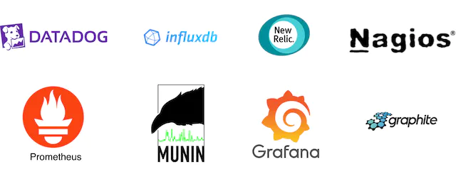

## 第 1 步 - 了解问题并确定设计范围

指标监控和警报系统对于不同的公司可能意味着许多不同的事情，因此必须首先与面试官确定确切的要求。例如，如果面试官只考虑基础设施指标，你就不想设计一个专注于 Web 服务器错误或访问日志等日志的系统。

在深入研究细节之前，我们首先要充分理解问题并确定设计范围。

**候选人**：我们为谁构建这个系统？我们是为 Facebook 或 Google 等大公司构建内部系统，还是设计 Datadog [1]、Splunk [2] 等 SaaS 服务？
**面试官**：这是一个很好的问题。我们构建它仅供内部使用。

**候选人**：我们想要收集哪些指标？
**面试官**：我们想收集操作系统指标。这些可以是操作系统的低级使用数据，例如CPU负载、内存使用和磁盘空间消耗。它们也可以是高级概念，例如服务的每秒请求数或 Web 池的正在运行的服务器计数。业务指标不在本设计的范围内。

**候选人**：我们用这个系统监控的基础设施的规模有多大？
**面试官**：1亿日活跃用户，1000个服务器池，每个池100台机器。

**候选人**：我们应该将数据保留多长时间？
**面试官**：假设我们想要保留 1 年。

**候选人**：为了长期存储，我们可以降低指标数据的分辨率吗？
**面试官**：这是一个很好的问题。我们希望能够将新收到的数据保留 7 天。 7 天后，你可以将其滚动到 1 分钟的分辨率，持续 30 天。 30 天后，你可以进一步以 1 小时为单位进行汇总。

**候选人**：支持哪些警报渠道？
**面试官**：电子邮件、电话、PagerDuty 或 webhooks（HTTP 端点）。

**候选人**：我们是否需要收集日志，例如错误日志或访问日志？
**面试官**：没有。

**候选人**：我们需要支持分布式系统追踪吗？
**面试官**：没有。

### 高层要求和假设

现在你已经完成了从面试官那里收集的要求，并且对设计范围有了清晰的认识。要求是：

- 被监控的基础设施规模很大。
  - 1亿日活跃用户
  - 假设我们有 1,000 个服务器池，每个池有 100 台机器，每台机器有 100 个指标 => 约 1000 万个指标
  - 1 年数据保留
  - 数据保留政策：原始形式保留 7 天，1 分钟分辨率保留 30 天，1 小时分辨率保留 1 年。
- 可以监控多种指标，例如：
  - CPU使用率
  - 请求数
  - 内存使用情况
  - 消息队列中的消息计数

### 非功能性需求

- 可扩展性。系统应该具有可扩展性，以适应不断增长的指标和警报量。
- 低延迟。系统需要对仪表板和警报具有较低的查询延迟。
- 可靠性。系统应该高度可靠，以避免错过关键警报。
- 灵活性。技术不断变化，因此管道应该足够灵活，以便在未来轻松集成新技术。

哪些要求超出了范围？

- 日志监控。 Elasticsearch、Logstash、Kibana (ELK) 堆栈在收集和监控日志方面非常流行 [3]。
- 分布式系统跟踪[4][5]。分布式跟踪是指跟踪流经分布式系统的服务请求的跟踪解决方案。当请求从一项服务发送到另一项服务时，它会收集数据。

## 第 2 步 - 提出高级设计并获得认可

在本节中，我们将讨论构建系统、数据模型和高层设计的一些基础知识。

### 基础知识

指标监控和警报系统通常包含五个组件，如图 2 所示。

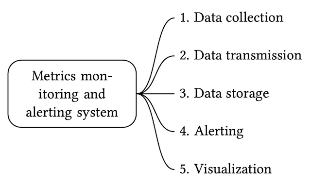

- 数据收集：从不同来源收集指标数据。
- 数据传输：将数据从源传输到指标监控系统。
- 数据存储：组织和存储传入的数据。
- 警报：分析传入数据、检测异常并生成警报。系统必须能够向不同的通信渠道发送警报。
- 可视化：以图形、图表等形式呈现数据。当数据以可视化方式呈现时，工程师更擅长识别模式、趋势或问题，因此我们需要可视化功能。

### 数据模型

指标数据通常记录为时间序列，其中包含一组值及其关联的时间戳。系列本身可以通过其名称来唯一标识，也可以选择通过一组标签来唯一标识。

让我们看两个例子。

示例 1：生产服务器实例 i631 在 20:00 的 CPU 负载是多少？

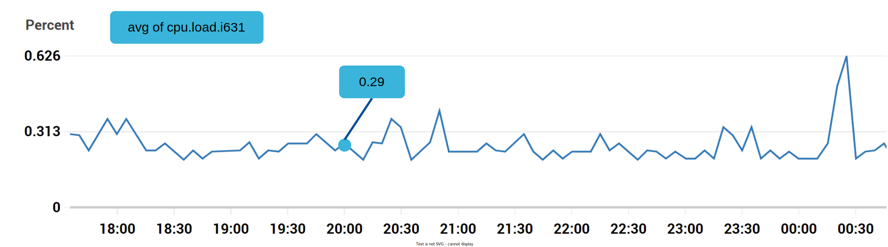

图 3 中突出显示的数据点可由表 1 表示。

图 3 中突出显示的数据点可由表 1 表示。

| **指标名称** | cpu负载                |
| :----------- | :--------------------- |
| **标签**     | 主机：i631，环境：产品 |
| **时间戳**   | 1613707265             |
| **价值**     | 0.29                   |

表1 表格表示的数据点

在此示例中，时间序列由指标名称、标签 (host:i631,env:prod) 和特定时间的单点值表示。

示例 2：过去 10 分钟美国西部地区所有 Web 服务器的平均 CPU 负载是多少？从概念上讲，我们将从存储中提取类似的内容，其中指标名称为“CPU.load”，区域标签为“us-west”：

CPU.load主机= webserver01，区域= us-west 1613707265 50

CPU.load主机= webserver01，区域= us-west 1613707265 62

CPU.load主机= webserver02，区域= us-west 1613707265 43

CPU.load主机= webserver02，区域= us-west 1613707265 53

...

CPU.load主机= webserver01，区域= us-west 1613707265 76

CPU.load主机= webserver01，区域= us-west 1613707265 83

平均 CPU 负载可以通过对每行末尾的值进行平均来计算。上例中的线路格式称为线路协议。它是市场上许多监控软件的通用输入格式。 Prometheus [6] 和 OpenTSDB [7] 是两个例子。

每个时间序列由以下内容组成[8]：

| 姓名               | 类型                  |
| :----------------- | :-------------------- |
| 指标名称           | 细绳                  |
| 一组标签/标签      | <key:value> 对列表    |
| 值及其时间戳的数组 | <值，时间戳> 对的数组 |

表2 时间序列

#### 数据访问模式

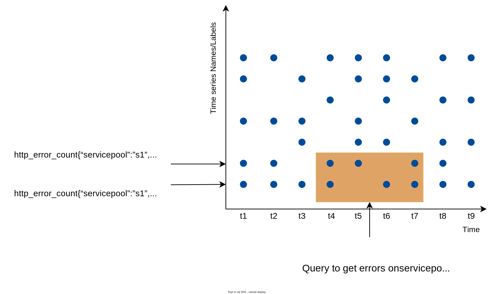

图4 数据访问模式

在图 4 中，y 轴上的每个标签代表一个时间序列（由名称和标签唯一标识），而 x 轴代表时间。

写入负载很重。正如你所看到的，任何时刻都可以写入许多时间序列数据点。正如我们在“高层需求”一节中提到的，每天大约有1000万个操作指标被写入，而且很多指标的采集频率很高，所以流量无疑是大写入量。

与此同时，读取负载激增。可视化和警报服务都会向数据库发送查询，并且根据图形和警报的访问模式，读取量可能会出现突发情况。

换句话说，系统处于持续的重写入负载之下，而读取负载则处于尖峰状态。

#### 数据存储系统

数据存储系统是设计的核心。不建议构建自己的存储系统或使用通用存储系统（例如MySQL）来完成此作业。

理论上，通用数据库可以支持时间序列数据，但需要专家级的调整才能使其在我们的规模上工作。具体来说，关系数据库并未针对你通常针对时间序列数据执行的操作进行优化。例如，计算滚动时间窗口中的移动平均值需要复杂的 SQL，难以阅读（深入研究部分有一个示例）。此外，为了支持标记/标签数据，我们需要为每个标签添加一个索引。此外，通用关系数据库在持续的重写入负载下表现不佳。在我们的规模下，我们需要花费大量精力来调整数据库，即使这样，它也可能表现不佳。

NoSQL 怎么样？理论上，市场上的一些NoSQL数据库可以有效地处理时序数据。例如，Cassandra 和 Bigtable [9] 都可以用于时间序列数据。然而，这需要深入了解每个 NoSQL 的内部工作原理，以设计可扩展的架构来有效地存储和查询时间序列数据。随着工业规模的时间序列数据库随处可见，使用通用 NoSQL 数据库已经不再有吸引力。

有许多针对时间序列数据进行优化的存储系统。通过优化，我们可以使用更少的服务器来处理相同数量的数据。其中许多数据库还具有专门为分析时间序列数据而设计的自定义查询接口，比 SQL 更易于使用。有些甚至提供管理数据保留和数据聚合的功能。以下是时间序列数据库的一些示例。

OpenTSDB是一个分布式时序数据库，但由于它基于Hadoop和HBase，运行Hadoop/HBase集群会增加复杂性。 Twitter 使用 MetricsDB [10]，Amazon 提供 Timestream 作为时间序列数据库 [11]。根据 DB-engines [12] 的研究，两个最流行的时序数据库是 InfluxDB [13] 和 Prometheus，它们旨在存储大量时序数据并快速对该数据进行实时分析。它们都主要依赖于内存缓存和磁盘存储。它们都很好地处理了耐用性和性能。如图 5 所示，具有 8 个核心和 32GB RAM 的 InfluxDB 每秒可以处理超过 250,000 次写入。

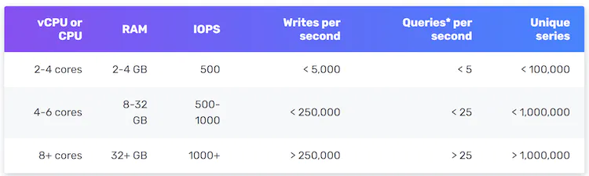

由于时间序列数据库是一种专门的数据库，因此除非你在简历中明确提及，否则你不需要在面试中了解其内部结构。出于面试的目的，重要的是要了解指标数据本质上是时间序列的，我们可以选择时间序列数据库（例如 InfluxDB）来存储它们。

强大的时序数据库的另一个特点是通过标签（有些数据库中也称为标签）对大量时序数据进行高效聚合和分析。例如，InfluxDB在标签上建立索引，以方便通过标签快速查找时间序列[13]。它提供了有关如何使用标签的清晰最佳实践指南，而不会使数据库过载。关键是确保每个标签的基数较低（具有一小组可能的值）。此功能对于可视化至关重要，使用通用数据库构建此功能需要花费大量精力。

### 高层设计

高层设计图如图 6 所示。

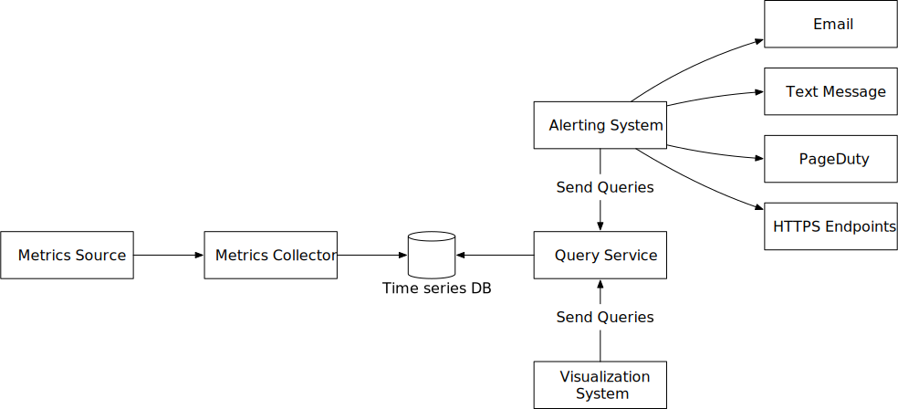

图6 高层设计

- **指标来源。**这可以是应用程序服务器、SQL 数据库、消息队列等。
- **指标收集器。**它收集指标数据并将数据写入时间序列数据库。
- **时间序列数据库。**这将指标数据存储为时间序列。它通常提供自定义的查询接口，用于分析和汇总大量的时间序列数据。它维护标签上的索引，以便于通过标签快速查找时序数据。
- **查询服务。**查询服务可以轻松地从时序数据库中查询和检索数据。如果我们选择一个好的时间序列数据库，这应该是一个非常薄的包装。它也可以完全被时序数据库自己的查询接口所取代。
- **警报系统。**这会将警报通知发送到各个警报目的地。
- **可视化系统。**这以各种图形/图表的形式显示指标。

## 第 3 步 - 深入设计

在系统设计面试中，候选人应该深入研究几个关键组件或流程。在本节中，我们详细研究以下主题：

- 指标收集
- 扩展指标传输管道
- 查询服务
- 存储层
- 警报系统
- 可视化系统

### 指标收集

对于计数器或 CPU 使用率等指标收集，偶尔的数据丢失并不是世界末日。客户解雇后就忘记是可以接受的。现在让我们看一下指标收集流程。系统的这一部分位于虚线框内（图 7）。

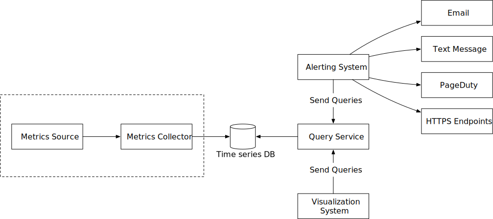

图7 指标收集流程

#### 拉式模型与推式模型

收集指标数据的方式有两种：拉取或推送。关于哪一个更好，这是一场例行辩论，并且没有明确的答案。让我们仔细看看。

##### 拉模型

图 8 显示了通过 HTTP 使用拉取模型进行的数据收集。我们有专门的指标收集器，可以定期从正在运行的应用程序中提取指标值。

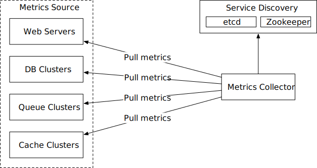

图8 拉模型

在这种方法中，指标收集器需要知道要从中提取数据的服务端点的完整列表。一种简单的方法是使用一个文件来保存“指标收集器”服务器上每个服务端点的 DNS/IP 信息。虽然想法很简单，但这种方法很难在频繁添加或删除服务器的大规模环境中维护，并且我们希望确保指标收集器不会错过从任何新服务器收集指标的过程。好消息是，我们通过服务发现提供了一个可靠、可扩展且可维护的解决方案，由 etcd [14]、Zookeeper [15] 等提供，其中服务注册其可用性，并且服务可以通知指标收集器每当服务端点列表发生变化时发现组件。

服务发现包含有关何时何地收集指标的配置规则，如图 9 所示。

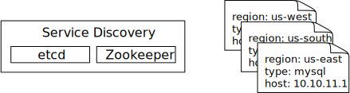

图9 服务发现

图 10 详细解释了拉模型。

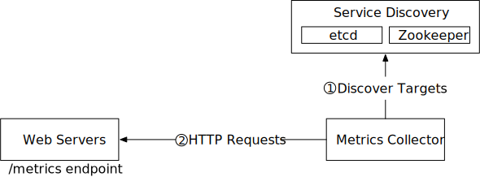

图10 拉动模型详细信息

1. 指标收集器从服务发现中获取服务端点的配置元数据。元数据包括拉取间隔、IP地址、超时和重试参数等。
2. 指标收集器通过预定义的 HTTP 端点（例如 /metrics）提取指标数据。要公开端点，通常需要将客户端库添加到服务中。在图 10 中，服务是 Web 服务器。
3. 或者，指标收集器向服务发现注册更改事件通知，以便在服务端点发生更改时接收更新。或者，指标收集器可以定期轮询端点变化。

在我们的规模下，单个指标收集器将无法处理数千台服务器。我们必须使用指标收集器池来处理需求。当存在多个收集器时，一个常见问题是多个实例可能会尝试从同一资源中提取数据并产生重复的数据。实例之间必须存在某种协调方案来避免这种情况。

一种可能的方法是将每个收集器指定到一致哈希环中的一个范围，然后通过哈希环中的唯一名称映射正在监视的每个服务器。这可确保一台指标源服务器仅由一台收集器处理。让我们看一个例子。

如图 11 所示，有四个收集器和六个指标源服务器。每个收集器负责从一组不同的服务器收集指标。收集器 2 负责从服务器 1 和服务器 5 收集指标。

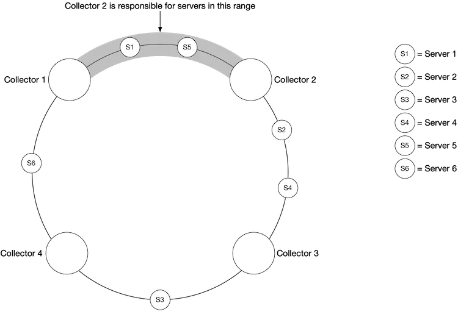

图 11 一致性哈希

##### 推送模式

如图 12 所示，在推送模型中，各种指标源（例如 Web 服务器、数据库服务器等）直接将指标发送到指标收集器。

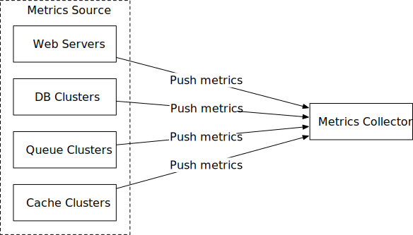

图12 推送模型

在推送模型中，收集代理通常安装在每台受监控的服务器上。收集代理是一个长时间运行的软件，它从服务器上运行的服务收集指标，并定期将这些指标推送到指标收集器。收集代理还可以在将指标发送到指标收集器之前在本地聚合指标（尤其是简单的计数器）。

聚合是减少发送到指标收集器的数据量的有效方法。如果推送流量很高并且指标收集器因错误而拒绝推送，则代理可以在本地保留一小部分数据缓冲区（可能通过将它们存储在本地磁盘上），并稍后重新发送它们。但是，如果服务器位于频繁轮换的自动缩放组中，则当指标收集器落后时，本地保存数据（即使是暂时的）可能会导致数据丢失。

为了防止指标收集器在推送模型中落后，指标收集器应该位于自动扩展集群中，并且前面有一个负载均衡器（图 13）。集群应根据指标收集器服务器的 CPU 负载进行扩展和缩减。

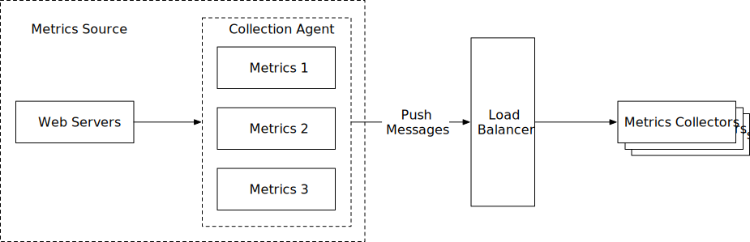

图 13 负载均衡器

##### 拉还是推？

那么，哪一种对我们来说是更好的选择呢？就像生活中的许多事情一样，没有明确的答案。双方都广泛采用了现实世界的用例。

- 拉式架构的示例包括 Prometheus。
- 推送架构的示例包括 Amazon CloudWatch [16] 和 Graphite [17]。

了解每种方法的优点和缺点比在面试中选择获胜者更重要。表 3 比较了推式和拉式架构的优缺点 [18] [19] [20] [21]。

|                        | **拉**                                                       | **推**                                                       |
| ---------------------- | ------------------------------------------------------------ | ------------------------------------------------------------ |
| 调试方便               | 应用程序服务器上用于拉取指标的 /metrics 端点可用于随时查看指标。你甚至可以在笔记本电脑上执行此操作。**拉胜**。 | 如果指标收集器未收到指标，则问题可能是由网络问题引起的。     |
| 健康检查               | 如果应用程序服务器没有响应拉取，你可以快速确定应用程序服务器是否已关闭。**拉胜**。 | 如果指标收集器未收到指标，则问题可能是由网络问题引起的。     |
| 短暂的工作             |                                                              | 一些批处理作业可能是短暂的，并且持续时间不足以被拉动。**推胜**。这可以通过引入拉模型的推网关来解决[22]。 |
| 防火墙或复杂的网络设置 | 让服务器拉取指标要求所有指标端点均可访问。这在多个数据中心设置中可能会出现问题。它可能需要更复杂的网络基础设施。 | 如果指标收集器设置了负载均衡器和自动缩放组，则可以从任何地方接收数据。 **推胜。** |
| 表现                   | 拉取方法通常使用 TCP。                                       | 推送方法通常使用 UDP。这意味着推送方法提供了较低延迟的指标传输。这里的反驳是，与发送度量有效负载相比，建立 TCP 连接的工作量很小。 |
| 数据真实性             | 从中收集指标的应用程序服务器预先在配置文件中定义。从这些服务器收集的指标保证是真实的。 | 任何类型的客户端都可以将指标推送到指标收集器。这可以通过将接受指标的服务器列入白名单或要求身份验证来解决。 |

表 3 拉式与推式

如上所述，拉与推是一个常规的争论话题，没有明确的答案。大型组织可能需要同时支持两者，尤其是随着无服务器 [23] 如今的流行。可能没有办法安装代理来首先推送数据。

### 扩展指标传输管道

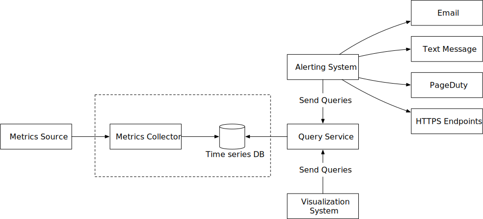

图14 Metrics传输管道

让我们放大一下指标收集器和时间序列数据库。无论使用推模型还是拉模型，指标收集器都是一个服务器集群，并且该集群接收大量数据。无论是推还是拉，指标收集器集群都设置为自动缩放，以确保有足够数量的收集器实例来处理需求。

然而，如果时序数据库不可用，则存在数据丢失的风险。为了缓解这个问题，我们引入了一个排队组件，如图 15 所示。

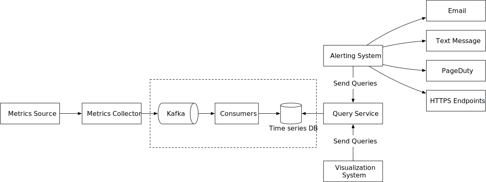

图15 添加队列

在此设计中，指标收集器将指标数据发送到 Kafka 等队列系统。然后消费者或者Apache Storm、Flink、Spark等流处理服务处理数据并将其推送到时序数据库。这种方法有几个优点：

- Kafka 被用作高度可靠且可扩展的分布式消息传递平台。
- 它将数据收集和数据处理服务相互解耦。
- 通过将数据保留在Kafka中，可以在数据库不可用时轻松防止数据丢失。

#### 通过 Kafka 进行扩展

我们可以通过多种方式利用 Kafka 的内置分区机制来扩展我们的系统。

- 根据吞吐量需求配置分区数量。
- 按指标名称对指标数据进行分区，以便消费者可以按指标名称聚合数据。

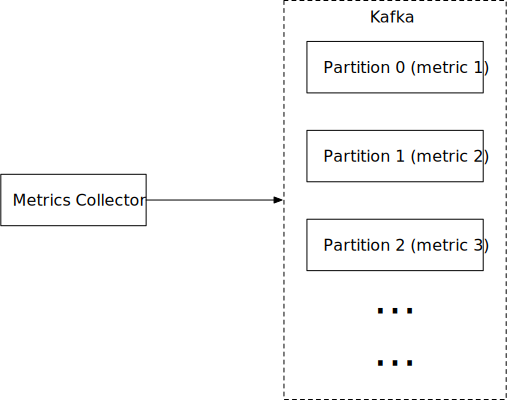

图16 Kafka分区

- 使用标签/标签进一步划分指标数据。
- 对指标进行分类和优先级排序，以便可以首先处理重要的指标。

#### Kafka 的替代品

维护生产规模的 Kafka 系统并非易事。面试官可能会对此提出反对。有正在使用的大规模监控摄取系统，而不使用中间队列。 Facebook 的 Gorilla [24] 内存时间序列数据库就是一个很好的例子；即使出现部分网络故障，它也能保持高写入可用性。可以说，这样的设计与像 Kafka 这样的中间队列一样可靠。

### 可以发生聚合的地方

指标可以在不同的地方聚合；在收集代理（在客户端）、摄取管道（在写入存储之前）和查询端（在写入存储之后）。让我们仔细看看它们中的每一个。

**代收**。安装在客户端的采集代理仅支持简单的聚合逻辑。例如，在发送到指标收集器之前每分钟聚合一个计数器。

**摄取管道**。为了在写入存储之前聚合数据，我们通常需要 Flink 等流处理引擎。由于只将计算结果写入数据库，因此写入量将显着减少。然而，处理迟到事件可能是一个挑战，另一个缺点是我们失去了数据精度和一些灵活性，因为我们不再存储原始数据。

**查询端**。可以在查询时聚合给定时间段内的原始数据。此方法不会丢失数据，但查询速度可能会较慢，因为查询结果是在查询时计算的，并且是针对整个数据集运行的。

### 查询服务

查询服务由查询服务器集群组成，这些服务器访问时间序列数据库并处理来自可视化或警报系统的请求。拥有一组专用的查询服务器可以将时间序列数据库与客户端（可视化和警报系统）分离。这使我们能够在需要时灵活地更改时间序列数据库或可视化和警报系统。

#### 缓存层

为了减轻时序数据库的负载，提高查询服务的性能，添加了缓存服务器来存储查询结果，如图17所示。

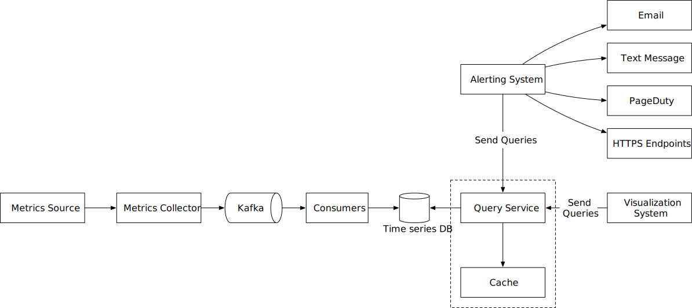

图17 缓存层

#### 针对查询服务的案例

可能没有迫切需要引入我们自己的抽象（查询服务），因为大多数工业规模的视觉和警报系统都有强大的插件来与市场上众所周知的时间序列数据库进行交互。并且使用精心选择的时间序列数据库，也无需添加我们自己的缓存。

#### 时序数据库查询语言

大多数流行的指标监控系统（例如 Prometheus 和 InfluxDB）不使用 SQL，并且有自己的查询语言。造成这种情况的一个主要原因是很难构建 SQL 查询来查询时间序列数据。例如，如此处 [25] 中提到的，计算指数移动平均值在 SQL 中可能如下所示：

```sql
select id,
       temp,
       avg(temp) over (partition by group_nr order by time_read) as rolling_avg
from (
  select id,
         temp,
         time_read,
         interval_group,
         id - row_number() over (partition by interval_group order by time_read) as group_nr
  from (
    select id,
    time_read,
    "epoch"::timestamp + "900 seconds"::interval * (extract(epoch from time_read)::int4 / 900) as interval_group,
    temp
    from readings
  ) t1
) t2
order by time_read;
```

而在 Flux（一种针对时间序列分析进行优化的语言（在 InfluxDB 中使用）中）中，它看起来像这样。正如你所看到的，它更容易理解。

```
from(db:"telegraf")
  |> range(start:-1h)
  |> filter(fn: (r) => r._measurement == "foo")
  |> exponentialMovingAverage(size:-10s)
```

### 存储层

现在让我们深入了解存储层。

#### 谨慎选择时序数据库

根据 Facebook 发表的一篇研究论文 [24]，对运营数据存储的所有查询中至少 85% 是针对过去 26 小时内收集的数据。如果我们使用利用此属性的时间序列数据库，它可能会对整体系统性能产生重大影响。如果你对存储引擎的设计感兴趣，请参考Influx DB存储引擎的设计文档[26]。

#### 空间优化

正如高级需求中所解释的，要存储的指标数据量是巨大的。以下是解决此问题的一些策略。

##### 数据编码和压缩

数据编码和压缩可以显着减小数据的大小。这些特征通常被内置到一个好的时间序列数据库中。这是一个简单的例子。


图18 数据编码

如上图所示，1610087371和1610087381仅相差10秒，只需要4位即可表示，而不是32位的完整时间戳。因此，不是存储绝对值，而是可以将值的增量与一个基值一起存储，例如：*1610087371, 10, 10, 9, 11*

##### 下采样

下采样是将高分辨率数据转换为低分辨率以减少总体磁盘使用量的过程。由于我们的数据保留期为 1 年，因此我们可以对旧数据进行下采样。例如，我们可以让工程师和数据科学家为不同的指标定义规则。这是一个例子：

- 保留：7天，不采样
- 保留：30 天，下采样至 1 分钟分辨率
- 保留：1 年，采样分辨率降低至 1 小时

我们再来看一个具体的例子。它将 10 秒分辨率数据聚合为 30 秒分辨率数据。

| **公制**   | **时间戳**           | **主机名** | **指标值** |
| ---------- | -------------------- | ---------- | ---------- |
| 中央处理器 | 2021-10-24T19:00:00Z | 主机A      | 10         |
| 中央处理器 | 2021-10-24T19:00:10Z | 主机A      | 16         |
| 中央处理器 | 2021-10-24T19:00:20Z | 主机A      | 20         |
| 中央处理器 | 2021-10-24T19:00:30Z | 主机A      | 30         |
| 中央处理器 | 2021-10-24T19:00:40Z | 主机A      | 20         |
| 中央处理器 | 2021-10-24T19:00:50Z | 主机A      | 30         |

表4 10秒分辨率数据

从 10 秒分辨率数据汇总到 30 秒分辨率数据。

| **公制**   | **时间戳**           | **主机名** | **指标值（平均值）** |
| ---------- | -------------------- | ---------- | -------------------- |
| 中央处理器 | 2021-10-24T19:00:00Z | 主机A      | 19                   |
| 中央处理器 | 2021-10-24T19:00:30Z | 主机A      | 25                   |

表5 30秒分辨率数据

##### 冷库

冷存储是很少使用的非活动数据的存储。冷藏的财务成本要低得多。

简而言之，我们应该使用第三方可视化和警报系统，而不是构建我们自己的系统。

### 警报系统

为了采访的目的，我们来看看警报系统，如下图 19 所示。

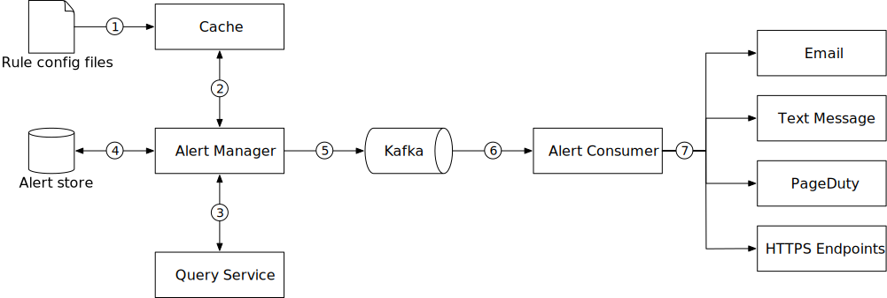

图19 报警系统

警报流程的工作原理如下：

1. 将配置文件加载到缓存服务器。规则被定义为磁盘上的配置文件。 YAML [27] 是定义规则的常用格式。以下是警报规则的示例：

```yaml
- name: instance_down
  rules:

  # Alert for any instance that is unreachable for >5 minutes.
  - alert: instance_down
    expr: up == 0
    for: 5m
    labels:
      severity: page
```

2. 警报管理器从缓存中获取警报配置。

3. 根据配置规则，警报管理器按预定义的时间间隔调用查询服务。如果该值违反阈值，则会创建警报事件。警报管理器负责以下事项：
   1. 过滤、合并和重复数据删除警报。以下是合并在短时间内在一个实例（实例 1）内触发的警报的示例（图 20）。
    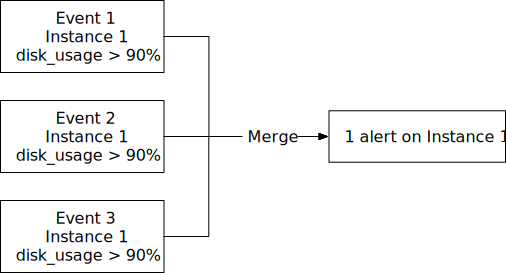
    2. 访问控制。为了避免人为错误并确保系统安全，必须将某些警报管理操作的访问权限限制为仅授权个人。
    3. 重试。警报管理器检查警报状态并确保至少发送一次通知。

4. 警报存储是一个键值数据库，例如 Cassandra，它保存所有警报的状态（非活动、待处理、触发、已解决）。它确保通知至少发送一次。

5. 符合条件的警报被插入到 Kafka 中。

6. 警报消费者从 Kafka 中提取警报事件。

7. 警报使用者处理来自 Kafka 的警报事件，并将通知发送到不同的渠道，例如电子邮件、短信、PagerDuty 或 HTTP 端点。

#### 警报系统 - 构建与购买

有许多现成的工业规模警报系统可用，并且大多数都提供与流行的时间序列数据库的紧密集成。其中许多警报系统与现有通知渠道（例如电子邮件和 PagerDuty）很好地集成。在现实世界中，证明构建自己的警报系统的合理性是一个艰难的决定。在面试中，尤其是高级职位的面试中，要准备好证明你的决定是正确的。

### 可视化系统

可视化建立在数据层之上。指标可以显示在不同时间范围内的指标仪表板上，并且警报可以显示在警报仪表板上。图 21 显示了一个仪表板，其中显示了一些指标，例如当前服务器请求、内存/CPU 利用率、页面加载时间、流量和登录信息 [28]。

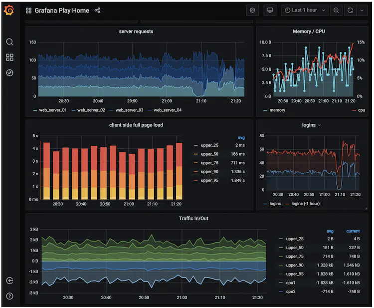

图 21 Grafana 用户界面

高质量的可视化系统很难构建。使用现成系统的理由非常充分。例如，Grafana 就是一个非常适合此目的的系统。它与你可以购买的许多流行的时间序列数据库完美集成。

## 第 4 步 - 总结

在本章中，我们介绍了指标监控和警报系统的设计。在高层次上，我们讨论了数据收集、时间序列数据库、警报和可视化。然后我们深入研究了一些最重要的技术/组件：

- 用于收集指标数据的拉动模型与拉动模型。
- 利用 Kafka 来扩展系统。
- 选择正确的时间序列数据库。
- 使用下采样来减小数据大小。
- 警报和可视化系统的构建与购买选项。

我们经过几次迭代来完善设计，最终的设计如下所示：

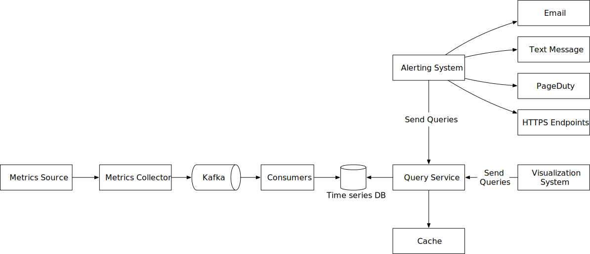

图 22 最终设计

恭喜你已经走到这一步了！现在拍拍自己的背吧。好工作！

## 章节总结

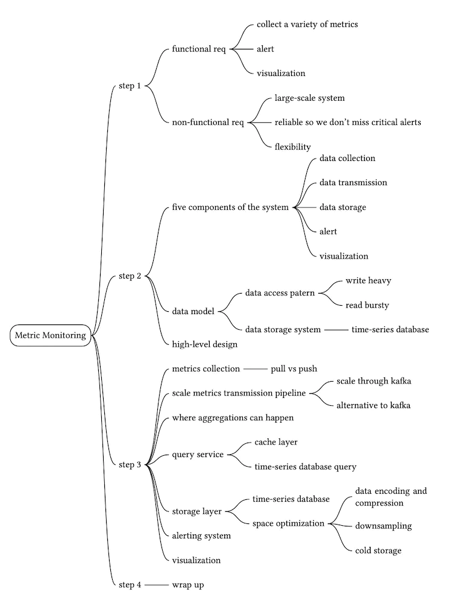

## 参考资料

[1] 数据狗：https://www.datadoghq.com/

[2] Splunk：https://www.splunk.com/

[3] 弹性堆栈：https://www.elastic.co/elastic-stack

[4] Dapper，大规模分布式系统跟踪基础设施：https://research.google/pubs/pub36356/

[5] 使用 Zipkin 进行分布式系统跟踪：https://blog.twitter.com/engineering/en_us/a/2012/distributed-systems-tracing-with-zipkin.html

[6]普罗米修斯：https://prometheus.io/docs/introduction/overview/

[7] OpenTSDB - 分布式、可扩展的监控系统：http://opentsdb.net/

[8] 数据模型：：https://prometheus.io/docs/concepts/data_model/

[9] 时序数据的模式设计 |云 Bigtable 文档 https://cloud.google.com/bigtable/docs/schema-design-time-series

[10] MetricsDB：用于存储 Twitter 指标的 TimeSeries 数据库：[https://blog.twitter.com/engineering/en_us/topics/infrastruct/2019/metricsdb.html](https://blog.twitter.com/engineering/en_us/topics/infrastructure/2019/metricsdb.html)

[11]亚马逊时间流：https://aws.amazon.com/timestream/

[12] DB-Engines 时序 DBMS 排名：https://db-engines.com/en/ranking/time+series+dbms

[13] InfluxDB：https://www.influxdata.com/

[14]etcd：[https://etcd.io](https://etcd.io/)

[15] 使用 Zookeeper 进行服务发现 https://cloud.spring.io/spring-cloud-zookeeper/1.2.x/multi/multi_spring-cloud-zookeeper-discovery.html

[16]亚马逊CloudWatch：https://aws.amazon.com/cloudwatch/

[17]石墨：https://graphiteapp.org/

[18]推与拉：http://bit.ly/3aJEPxE

[19] Pull 无法扩展 - 或者可以吗？：https://prometheus.io/blog/2016/07/23/pull-does-not-scale-or-does-it/

[20] 监控架构：https://developer.lightbend.com/guides/monitoring-at-scale/monitoring-architecture/architecture.html

[21] 监控系统中的推与拉：https://giedrius.blog/2019/05/11/push-vs-pull-in-monitoring-systems/

[22] Pushgateway：https://github.com/prometheus/pushgateway

[23] 使用无服务器架构构建应用程序 https://aws.amazon.com/lambda/serverless-architectures-learn-more/

[24] Gorilla：快速、可扩展的内存时间序列数据库：http://www.vldb.org/pvldb/vol8/p1816-teller.pdf

[25] 为什么我们要构建 Flux，一种新的数据脚本和查询语言：[https://www.influxdata.com/blog/why-were-building-flux-a-new-data-scripting-and-query-语言/](https://www.influxdata.com/blog/why-were-building-flux-a-new-data-scripting-and-query-language/)

[26] InfluxDB存储引擎：https://docs.influxdata.com/influxdb/v2.0/reference/internals/storage-engine/

[27] YAML：https://en.wikipedia.org/wiki/YAML

[28] Grafana 演示：https://play.grafana.org/