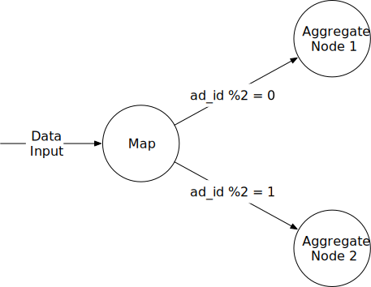
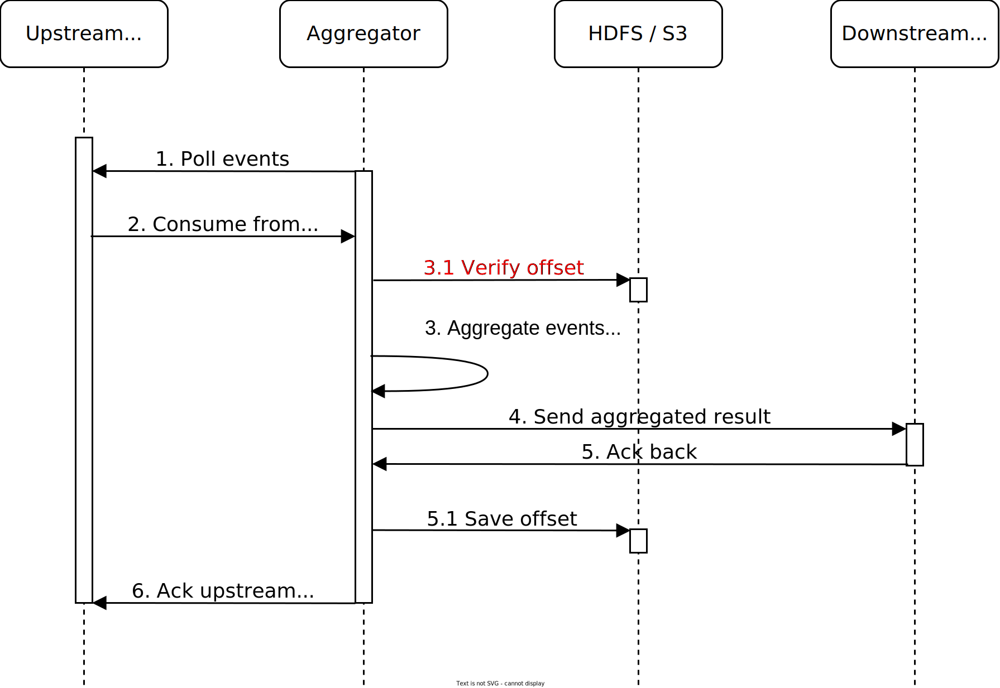

随着 Facebook、YouTube、TikTok 和在线媒体经济的崛起，数字广告在总广告支出中所占的份额越来越大。因此，跟踪广告点击事件非常重要。在本章中，我们将探讨如何设计 Facebook 或 Google 规模的广告点击事件聚合系统。

在深入探讨技术设计之前，我们先来了解一下在线广告的核心概念，以便更好地理解这一主题。在线广告的一个核心优势是可测量性，可以通过实时数据进行量化。

数字广告有一个核心流程，称为实时竞价 (RTB)，在此过程中买卖数字广告库存。图 1 显示了在线广告流程的工作原理。


RTB 过程的速度很重要，因为它通常在不到 1 秒的时间内发生。

数据准确性也非常重要。广告点击事件聚合在衡量在线广告的效果方面起着至关重要的作用，这实质上影响了广告商支付的费用。根据点击聚合结果，广告活动经理可以控制预算或调整竞价策略，例如更改目标受众群体、关键字等。在线广告中使用的关键指标，包括点击率 (CTR) [1] 和转化率 (CVR) [2]，都取决于聚合的广告点击数据。

## 步骤 1 - 了解问题并确定设计范围

以下一组问题有助于澄清要求并缩小范围。

**候选人**：输入数据的格式是什么？
**面试官**：它是一个位于不同服务器的日志文件，最新的点击事件会附加到日志文件的末尾。事件有以下属性：*ad_id、click_timestamp、user_id、ip*和*country*。

**候选人**：数据量有多大？
**面试官**：每天广告点击量10亿次，总共有200万条广告。广告点击事件数量同比增长30%。

**候选人**：需要支持的最重要的查询有哪些？
**面试官**：系统需要支持以下 3 个查询：

- *返回过去M*分钟内特定广告的点击事件数量。
- 返回过去 1 分钟内点击次数最多的前 100 个广告。两个参数都应该是可配置的。每分钟进行一次汇总。
- 支持通过*ip*、*user_id*或*country*对以上两种查询进行数据过滤。

**候选人**：我们需要担心极端情况吗？我能想到以下几种情况：

- 可能会发生比预期晚发生的事件。
- 可能会有重复的事件。
- 系统的不同部分可能随时出现故障，因此我们需要考虑系统恢复。

**面试官**：这个清单很好。是的，考虑一下这些。

**候选人**：延迟要求是多少？
**面试官**：端到端延迟几分钟。请注意，RTB 和广告点击聚合的延迟要求非常不同。虽然由于响应性要求，RTB 的延迟通常小于一秒，但广告点击事件聚合的延迟几分钟是可以接受的，因为它主要用于广告计费和报告。

通过收集以上信息，我们既有功能性需求，也有非功能性需求。

### 功能要求

- 汇总过去*M分钟内**ad_id*的点击次数。
- 返回每分钟点击次数最多的前 100 个*ad_id 。*
- 支持按不同属性进行聚合过滤。
- 数据集规模与 Facebook 或 Google 相当（有关详细的系统规模要求，请参阅下面的粗略估计部分）。

### 非功能性需求

- 由于数据用于 RTB 和广告计费，因此聚合结果的正确性非常重要。
- 正确处理延迟或重复的事件。
- 稳健性。系统应该能够抵御部分故障。
- 延迟要求。端到端延迟最多应为几分钟。

### 信封背面估计

让我们做一个估算来了解系统的规模和我们需要解决的潜在挑战。

- 10亿DAU。
- 假设平均每个用户每天点击 1 个广告。那么每天就有 10 亿次广告点击事件。
- 广告点击 QPS = 10^9 个事件 / 一天 10^5 秒 = 10,000
- 假设峰值广告点击 QPS 是平均数的 5 倍。峰值 QPS = 50,000 QPS。
- 假设单个广告点击事件占用0.1KB存储空间，每日存储需求为：0.1KB * 10亿=100GB，每月存储需求约为3TB。

## 第 2 步 - 提出高层设计并获得认可

在本节中，我们讨论查询 API 设计、数据模型和高级设计。

### 查询 API 设计

API 设计的目的是在客户端和服务器之间达成一致。在消费者应用中，客户端通常是使用产品的最终用户。但在我们的案例中，客户端是针对聚合服务运行查询的仪表板用户（数据科学家、产品经理、广告商等）。

让我们回顾一下功能需求，以便更好地设计 API：

- 汇总过去*M分钟内**ad_id*的点击次数。
- 返回过去*M*分钟内点击次数最多的前*N个**ad_id*。
- 支持按不同属性进行聚合过滤。

我们只需要两个 API 来支持这三种用例，因为可以通过向请求添加查询参数来支持过滤（最后一个要求）。

**API 1：汇总过去*M分钟内ad_id*的点击次数。**

| **API**                                | **细节**                      |
| :------------------------------------- | :---------------------------- |
| 获取 /v1/ads/{:ad_id}/aggregated_count | 返回给定 ad_id 的聚合事件计数 |

表 1 点击次数统计 API

请求参数为：

| **场地** | **描述**                                                     | **类型** |
| :------- | :----------------------------------------------------------- | :------- |
| 从       | 开始分钟（默认为减 1 分钟）                                  | 长的     |
| 到       | 结束分钟（默认为现在）                                       | 长的     |
| 筛选     | 不同过滤策略的标识符。例如，filter = 001 会过滤掉美国以外的点击 | 长的     |

表 2 /v1/ads/{:ad_id}/aggregated_count 请求参数

回复：

| **场地** | **描述**                     | **类型** |
| :------- | :--------------------------- | :------- |
| 广告 ID  | 广告标识符                   | 细绳     |
| 数数     | 开始和结束分钟之间的累计计数 | 长的     |

**API 2：返回过去*M*分钟内点击次数最多的前*N 个** ad_id

| **API**                  | **细节**                                    |
| :----------------------- | :------------------------------------------ |
| 获取 /v1/ads/popular_ads | 返回过去*M*分钟内点击次数最多的前*N 个广告* |

请求参数为：

| **场地** | **描述**                            | **类型** |
| :------- | :---------------------------------- | :------- |
| 数数     | 点击次数最多的前*N 个*广告          | 整数     |
| 窗户     | 聚合窗口大小（*M*）（以分钟为单位） | 整数     |
| 筛选     | 不同过滤策略的标识符                | 长的     |

回复：

| **场地** | **描述**               | **类型** |
| :------- | :--------------------- | :------- |
| 广告 ID  | 点击次数最多的广告列表 | 大批     |

### 数据模型

系统中有两种类型的数据：原始数据和汇总数据。

#### 原始数据

下面显示了日志文件中的原始数据：

```
[AdClickEvent] ad001, 2021-01-01 00:00:01, user 1, 207.148.22.22, USA
```

表 7 以结构化的方式列出了数据字段的样子。数据分散在不同的应用服务器上。

| **广告 ID** | **点击时间戳**      | **用户** | **知识产权**  | **国家** |
| ----------- | ------------------- | -------- | ------------- | -------- |
| ad001       | 2021-01-01 00:00:01 | 用户1    | 207.148.22.22 | 美国     |
| ad001       | 2021-01-01 00:00:02 | 用户1    | 207.148.22.22 | 美国     |
| ad002       | 2021-01-01 00:00:02 | 用户2    | 209.153.56.11 | 美国     |

#### 汇总数据

假设每分钟聚合一次广告点击事件，聚合结果如表8所示。

| 广告 ID | 点击分钟     | 数数 |
| :------ | :----------- | :--- |
| ad001   | 202101010000 | 5    |
| ad001   | 202101010001 | 7    |

为了支持广告过滤，我们在表中添加了一个名为*filter_id*的附加字段。具有相同*ad_id*和*click_minute 的记录按**filter_id*分组（如表 9 所示），过滤器定义在表 10 中。

| 广告 ID | 点击分钟     | 过滤器 ID | 数数 |
| :------ | :----------- | :-------- | :--- |
| ad001   | 202101010000 | *0012*    | 2    |
| ad001   | 202101010000 | *0023*    | 3    |
| ad001   | 202101010001 | *0012*    | 1    |
| ad001   | 202101010001 | *0023*    | 6    |

| 过滤器 ID | 地区 | 知识产权  | 用户身份 |
| :-------- | :--- | :-------- | :------- |
| 0012      | 我们 | *         | *        |
| 0013      | *    | 123.1.2.3 | *        |

为了支持查询返回过去*M分钟内点击次数最多的前**N*个广告，使用了以下结构。

| **最多点击的广告** |        |                                     |
| ------------------ | ------ | ----------------------------------- |
| 窗口大小           | 整数   | 聚合窗口大小（*M*）（以分钟为单位） |
| 更新时间_分钟      | 时间戳 | 上次更新时间戳（以 1 分钟为单位）   |
| 最多点击的广告     | 大批   | JSON 格式的广告 ID 列表。           |

#### 比较

存储原始数据和聚合数据的比较如下所示：

|          | **仅原始数据**                   | **仅限聚合数据**                                             |
| -------- | -------------------------------- | ------------------------------------------------------------ |
| **优点** | 完整数据集支持数据过滤和重新计算 | 较小的数据集快速查询                                         |
| **缺点** | 海量数据存储慢查询               | 数据丢失。这是派生数据。例如，10 个条目可能会聚合为 1 个条目 |

表 12 原始数据与汇总数据

我们应该存储原始数据还是聚合数据？我们的建议是存储两者。让我们来看看为什么。

- 保留原始数据是个好主意。如果出现问题，我们可以使用原始数据进行调试。如果由于严重的错误导致聚合数据损坏，我们可以在修复错误后根据原始数据重新计算聚合数据。
- 聚合数据也应该存储。原始数据的数据量非常大。庞大的数据量使得直接查询原始数据非常低效。为了缓解这个问题，我们对聚合数据运行读取查询。
- 原始数据作为备份数据，一般情况下，除非需要重新计算，否则我们不需要查询原始数据。旧的原始数据可以移至冷存储以降低成本。
- 聚合数据充当活动数据。它针对查询性能进行了调整。

#### 选择正确的数据库

在选择正确的数据库时，我们需要评估以下几点：

- 数据是什么样子的？数据是关系型的吗？它是文档还是 blob？
- 工作流程是读取量大、写入量大，还是两者兼有？
- 是否需要交易支持？
- 查询是否依赖于许多联机分析处理 (OLAP) 函数[3]（例如 SUM、COUNT）？

我们先来看一下原始数据。虽然我们在正常操作期间不需要查询原始数据，但对于数据科学家或机器学习工程师来说，研究用户响应预测、行为定位、相关反馈等还是很有用的。[4]

从粗略估算可以看出，平均写入 QPS 为 10,000，峰值 QPS 可达 50,000，因此系统写入量较大。在读取方面，原始数据用作备份和重新计算的来源，因此理论上读取量较低。

关系数据库可以完成这项工作，但扩展写入可能具有挑战性。Cassandra 和 InfluxDB 等 NoSQL 数据库更适合，因为它们针对写入和时间范围查询进行了优化。

另一种选择是使用 ORC [5]、Parquet [6] 或 AVRO [7] 等列式数据格式之一将数据存储在 Amazon S3 中。我们可以对每个文件的大小设置上限（例如 10GB），当达到大小上限时，负责写入原始数据的流处理器可以处理文件轮换。由于这种设置对许多人来说可能不熟悉，因此在本设计中我们以 Cassandra 为例。

对于聚合数据，它本质上是时间序列，工作流的读写操作都很繁重。这是因为，对于每个广告，我们需要每分钟查询一次数据库，以显示客户的最新聚合计数。此功能对于自动刷新仪表板或及时触发警报非常有用。由于总共有 200 万条广告，因此工作流的读取操作很繁重。聚合服务每分钟都会聚合和写入数据，因此写入操作也很繁重。我们可以使用相同类型的数据库来存储原始数据和聚合数据。

现在我们已经讨论了查询 API 设计和数据模型，让我们将高层设计放在一起。

### 高层设计

在实时大数据 [8] 处理中，数据通常以无界数据流的形式流入和流出处理系统。聚合服务的工作方式相同；输入是原始数据（无界数据流），输出是聚合结果（见图 2）。


#### 异步处理

我们目前的设计是同步的。这并不好，因为生产者和消费者的容量并不总是相等。考虑以下情况；如果流量突然增加，并且生成的事件数量远远超出消费者可以处理的范围，消费者可能会出现内存不足错误或遇到意外关闭。如果同步链路中的一个组件发生故障，整个系统就会停止工作。

一种常见的解决方案是采用消息队列（Kafka）来解耦生产者和消费者。这使得整个过程异步，并且生产者/消费者可以独立扩展。

综合以上讨论，我们得出了如图 3 所示的高级设计。日志观察器、聚合服务和数据库通过两个消息队列解耦。数据库写入器从消息队列中轮询数据，将数据转换为数据库格式，然后将其写入数据库。


第一个消息队列中存储了什么？它包含广告点击事件数据，如表13所示。

| **广告 ID** | **点击时间戳** | **用户身份** | **知识产权** | **国家** |
| ----------- | -------------- | ------------ | ------------ | -------- |
|             |                |              |              |          |

第二个消息队列中存储了什么？第二个消息队列包含两种类型的数据：

1. 以每分钟为单位汇总的广告点击次数。

| 广告 ID | 点击分钟 | 数数 |
| :------ | :------- | :--- |
|         |          |      |

1. 以每分钟为单位汇总点击次数最多的前*N 个广告。*

| 更新时间_分钟 | 最多点击的广告 |
| :------------ | :------------- |
|               |                |

你可能想知道为什么我们不直接将聚合结果写入数据库。简而言之，我们需要第二个消息队列（如 Kafka）来实现端到端的精确一次语义（原子提交）。


接下来，让我们深入了解聚合服务的细节。

#### 聚合服务

MapReduce 框架是聚合广告点击事件的不错选择。有向无环图 (DAG) 就是一个很好的模型 [9]。DAG 模型的关键是将系统分解为小的计算单元，如 Map/Aggregate/Reduce 节点，如图 5 所示。


每个节点负责一项单一任务，并将处理结果发送给下游节点。

**地图节点**

Map节点从数据源读取数据，然后进行过滤和转换，例如图6所示，一个Map节点将*ad_id % 2 = 0*的广告发给节点1，其他广告发给节点2。



你可能想知道为什么我们需要 Map 节点。另一种选择是设置 Kafka 分区或标签，并让聚合节点直接订阅 Kafka。这可行，但输入数据可能需要清理或规范化，这些操作可以由 Map 节点完成。另一个原因是我们可能无法控制数据的生成方式，因此具有相同 ad_id 的事件*可能*会落入不同的 Kafka 分区。

**聚合节点**

Aggregate 节点每分钟在内存中根据*ad_id*统计一次广告点击事件。在 MapReduce 范式中，Aggregate 节点是 Reduce 的一部分。因此 map-aggregate-reduce 过程实际上意味着 map-reduce-reduce。

**减少节点**

Reduce 节点将所有“Aggregate”节点的聚合结果缩减为最终结果。例如，如图 7 所示，有三个聚合节点，每个节点包含节点内点击次数最多的前 3 个广告。Reduce 节点将点击次数最多的广告总数缩减为 3 个。


DAG 模型代表了著名的 MapReduce 范式。它旨在处理大数据，并使用并行分布式计算将大数据转化为小数据或常规数据。

在DAG模型中，中间数据可以存储在内存中，不同节点之间可以通过TCP（节点运行在不同进程中）或者共享内存（节点运行在不同线程中）进行通信。

#### 主要用例

现在我们了解了 MapReduce 的高层工作原理，让我们看看如何利用它来支持主要用例：

- *汇总过去_M分钟内*广告id的点击次数。
- 返回*过去 _M 分钟内*点击次数最多的前*N 个*广告 ID 。
- 数据过滤。

##### 用例 1：汇总点击次数

如图8所示，输入事件在Map节点中按ad_id（ad_id % 3）进行分区，然后由Aggregation节点进行聚合。


##### 用例 2：返回点击次数最多的前*N*个广告

图 9 展示了获取点击次数最多的前 3 个广告的简化设计，该设计可以扩展到前*N 个*。输入事件使用 ad_id 进行映射，每个聚合节点维护一个堆数据结构，以便高效地获取节点内的前 3 个广告。在最后一步中，Reduce 节点将 9 个广告（每个聚合节点的前 3 个）缩减为每分钟点击次数最多的前 3 个广告。


##### 用例 3：数据过滤

为了支持“仅显示美国境内 ad001 的聚合点击次数”之类的数据过滤，我们可以预先定义过滤条件并根据这些条件进行聚合。例如，ad001 和 ad002 的聚合结果如下所示：

| **广告 ID** | **点击分钟** | **国家** | **数数** |
| :---------- | :----------- | :------- | :------- |
| ad001       | 202101010001 | 美国     | 100      |
| ad001       | 202101010001 | 黄金分割 | 200      |
| ad001       | 202101010001 | 其他的   | 3000     |
| ad002       | 202101010001 | 美国     | 10       |
| ad002       | 202101010001 | 黄金分割 | 二十五   |
| ad002       | 202101010001 | 其他的   | 12       |

表 16 汇总结果（按国家过滤）

这种技术称为星型模式 [11]，在数据仓库中得到广泛应用。过滤字段称为维度。这种方法具有以下优点：

- 它很容易理解和构建。
- 可以重用当前的聚合服务来在星型模式中创建更多维度。无需其他组件。
- 根据过滤条件访问数据很快，因为结果是预先计算的。

这种方法的局限性是它会创建更多的存储桶和记录，尤其是当我们有很多过滤条件时。

## 步骤 3 - 深入设计

在本节中，我们将深入探讨以下内容：

- 流式处理与批处理
- 时间和聚合窗口
- 送货保证
- 扩展系统
- 数据监控和正确性
- 最终设计图
- 容错

### 流式处理与批处理

我们在图 3 中提出的高级架构是一种流处理系统。表 17 显示了三类系统的比较 [12]：

|              | **服务（在线系统）** | **批量系统（离线系统）**     | **流式系统（近实时系统）** |
| ------------ | -------------------- | ---------------------------- | -------------------------- |
| **响应能力** | 快速回复客户         | 无需回复客户                 | 无需回复客户               |
| **输入**     | 用户请求             | 有界输入，大小有限。大量数据 | 输入没有边界（无限流）     |
| **输出**     | 回复客户             | 物化视图、聚合指标等         | 物化视图、聚合指标等       |
| **绩效衡量** | 可用性，潜伏         | 吞吐量                       | 吞吐量、延迟               |
| **例子**     | 网上购物             | 映射Reduce                   | Flink [13]                 |

在我们的设计中，流处理和批处理都得到了使用。我们利用流处理来处理到达的数据并以近乎实时的方式生成聚合结果。我们利用批处理进行历史数据备份。

对于同时包含两条处理路径（批处理和流处理）的系统，这种架构称为 lambda [14]。lambda 架构的一个缺点是，你有两条处理路径，这意味着需要维护两个代码库。Kappa 架构 [15] 将批处理和流处理结合在一个处理路径中，解决了这个问题。其关键思想是使用单个流处理引擎来处理实时数据处理和连续数据再处理。图 10 显示了 lambda 和 kappa 架构的比较。


我们的高层设计采用 Kappa 架构，其中历史数据的重新处理也经过实时聚合服务。有关详细信息，请参阅下面的“数据重新计算”部分。

**数据重新计算**

有时我们必须重新计算聚合数据，这也称为历史数据重放。例如，如果我们发现聚合服务中存在重大错误，则需要从引入错误的点开始，从原始数据重新计算聚合数据。图 11 显示了数据重新计算流程：

1. 重新计算服务从原始数据存储中检索数据。这是一项批处理作业。
2. 检索到的数据被发送到专用的聚合服务，以便实时处理不受历史数据重放的影响。
3. 聚合结果被发送到第二个消息队列，然后在聚合数据库中更新。


重新计算过程重用数据聚合服务，但使用不同的数据源（原始数据）。

### 时间

我们需要一个时间戳来执行聚合。时间戳可以在两个不同的地方生成：

- 事件时间：广告点击发生的时间。
- 处理时间：指处理点击事件的聚合服务器的系统时间。

由于网络延迟和异步环境（数据通过消息队列），事件时间和处理时间之间的差距可能很大。如图 12 所示，事件 1 很晚才到达聚合服务（5 小时后）。


如果使用事件时间进行聚合，就需要处理延迟事件；如果使用处理时间进行聚合，聚合结果可能不准确。没有完美的解决方案，因此需要考虑权衡。

|          | **优点**                                         | **缺点**                                                     |
| :------- | :----------------------------------------------- | :----------------------------------------------------------- |
| 活动时间 | 聚合结果更加准确，因为客户确切知道广告何时被点击 | 这取决于客户端生成的时间戳。客户端的时间可能有误，或者时间戳可能是由恶意用户生成的 |
| 处理时间 | 服务器时间戳更可靠                               | 如果事件到达系统的时间太晚，则时间戳不准确                   |

由于数据准确性非常重要，我们建议使用事件时间进行聚合。在这种情况下，我们如何正确处理延迟事件？一种称为“水印”的技术通常用于处理稍微延迟的事件。

在图 13 中，广告点击事件在 1 分钟滚动窗口中聚合（有关更多详细信息，请参阅“聚合窗口”部分）。如果使用事件时间来判断事件是否在窗口中，则窗口 1 会错过事件 2，而窗口 3 会错过事件 5，因为它们到达的时间略晚于其聚合窗口的结束时间。


缓解此问题的一种方法是使用“水印”（图 14 中的扩展矩形），将其视为聚合窗口的扩展。这提高了聚合结果的准确性。通过延长额外的 15 秒（可调）聚合窗口，窗口 1 能够包含事件 2，窗口 3 能够包含事件 5。

水印的设置值取决于业务需求。较长的水印可以捕获很晚到达的事件，但会增加系统的延迟。较短的水印意味着数据不太准确，但会增加系统的延迟。


请注意，水印技术无法处理具有较长延迟的事件。我们可以说，为低概率事件设计复杂的设计不值得投资回报 (ROI)。我们总是可以通过日终对账来纠正微小的不准确性（请参阅对账部分）。需要考虑的一个权衡是，使用水印可以提高数据准确性，但由于等待时间延长，会增加总体延迟。

### 聚合窗口

根据 Martin Kleppmann 所著的《设计数据密集型应用程序》一书 [16]，窗口函数有四种类型：滚动窗口（也称为固定窗口）、跳跃窗口、滑动窗口和会话窗口。我们将讨论滚动窗口和滑动窗口，因为它们与我们的系统最相关。

在滚动窗口（图 15 中突出显示）中，时间被划分为长度相同、不重叠的块。滚动窗口非常适合每分钟汇总广告点击事件（用例 1）。


在滑动窗口（图 16 中突出显示）中，事件按照指定的间隔分组在数据流中滑动的窗口中。滑动窗口可以是重叠的。这是满足我们的第二个用例的好策略；获取过去*M*分钟内点击次数最多的前*N 个*广告。


### 送货保证

由于聚合结果用于计费，因此数据的准确性和完整性非常重要。系统需要能够回答以下问题：

- 如何避免处理重复事件？
- 如何确保所有事件都被处理？

Kafka 等消息队列通常提供三种投递语义：最多一次、至少一次、恰好一次。

**我们应该选择哪一种送货方式？**

在大多数情况下，如果可以接受少量重复，则至少一次处理就足够了。

然而，我们的系统并非如此。数据点的百分之几的差异可能会导致数百万美元的差异。因此，我们建议系统只进行一次投放。如果你有兴趣了解有关现实生活中的广告聚合系统的更多信息，请查看 Yelp 如何实现它 [17]。

### 重复数据删除

最常见的数据质量问题之一是重复数据。重复数据的来源多种多样，本节我们将讨论两种常见来源。

- 客户端。例如，客户端可能会多次重新发送同一事件。恶意发送的重复事件最好由广告欺诈/风险控制组件处理。如果对此感兴趣，请参阅参考资料 [18]。
- 服务器中断。如果聚合服务节点在聚合过程中发生故障，而上游服务尚未收到确认，则可能会再次发送和聚合相同的事件。让我们仔细看看。

图 17 展示了聚合服务节点（Aggregator）宕机如何引入重复数据。Aggregator 通过在上游 Kafka 中存储偏移量来管理数据消费的状态。


如果步骤 6 失败（可能是由于聚合器中断），则从 100 到 110 的事件已发送到下游，但新的偏移量 110 未持久保存在上游 Kafka 中。在这种情况下，新的聚合器将从偏移量 100 再次消费，即使这些事件已被处理，也会导致数据重复。

最直接的解决方案（图 18）是使用外部文件存储（例如 HDFS 或 S3）来记录偏移量。但是，这种解决方案也存在问题。


在步骤 3 中，仅当外部存储器中存储的最后一个偏移量为 100 时，聚合器才会处理从偏移量 100 到 110 的事件。如果存储器中存储的偏移量为 110，则聚合器将忽略偏移量 110 之前的事件。

但这种设计有一个主要问题：在将聚合结果发送到下游之前，偏移量会保存到 HDFS / S3（步骤 3.2）。如果步骤 4 由于聚合器中断而失败，则从 100 到 110 的事件将永远不会被新启动的聚合器节点处理，因为存储在外部存储中的偏移量是 110。

为了避免数据丢失，我们需要在收到下游的确认后保存偏移量。更新后的设计如图 19 所示。



在这个设计中，如果聚合器在执行步骤 5.1 之前关闭，则事件 100 到 110 将再次向下游发送。为了实现“精确一次”处理，我们需要将步骤 4 到步骤 6 之间的操作放在一个分布式事务中。分布式事务是跨多个节点工作的事务。如果任何操作失败，整个事务都会回滚。


可以看出，在大规模系统中，重复数据删除并不容易。如何实现一次性处理是一个高级课题。如果你对细节感兴趣，请参阅参考资料[19]。

### 扩展系统

根据粗略估计，我们知道业务每年增长 30%，流量每 3 年翻一番。我们该如何应对这种增长？让我们来看看。

我们的系统由三个独立的组件组成：消息队列、聚合服务和数据库。由于这些组件是解耦的，我们可以独立扩展每个组件。

#### **扩展消息队列**

我们已经在“分布式消息队列”一章中广泛讨论了如何扩展消息队列，因此我们只简单谈一下几点。

**生产者**。 我们不限制生产者实例的数量，因此可以轻松实现生产者的可扩展性。

**消费者**。在消费者组内部，重新平衡机制有助于通过添加或删除节点来扩展消费者。如图 21 所示，通过添加两个消费者，每个消费者仅处理来自一个分区的事件。


当系统中有数百个 Kafka 消费者时，消费者重新平衡可能会非常慢，可能需要几分钟甚至更长时间。因此，如果需要添加更多消费者，请尝试在非高峰时段进行，以将影响降至最低。

**经纪人**

- **哈希密钥**

  > 使用*ad_id*作为 Kafka 分区的哈希键，将来自同一*ad_id*的事件存储在同一 Kafka 分区中。在这种情况下，聚合服务可以从一个分区订阅同一*ad_id的所有事件。*

- **分区数**

  > 如果分区数发生变化，同一个*ad_id*的事件可能会被映射到不同的分区。因此，建议提前分配足够的分区，以避免在生产中动态增加分区数。

- **主题物理分片**

  > 单一主题通常是不够的。我们可以按地理位置（topic_north_america、topic_europe、topic_asia 等）或按业务类型（topic_web_ads、topic_mobile_ads 等）划分数据。

  - 优点：将数据切分到不同的主题有助于提高系统吞吐量。单个主题的消费者数量越少，重新平衡消费者组的时间就越少。
  - 缺点：它引入了额外的复杂性并增加了维护成本。

#### 扩展聚合服务

在高级设计中，我们讨论了聚合服务作为 map/reduce 操作。图 22 显示了事物如何连接在一起。


如果你对细节感兴趣，可以参考参考资料[20]。聚合服务可以通过添加或删除节点来水平扩展。这是一个有趣的问题；我们如何提高聚合服务的吞吐量？有两种选择。

选项1：将不同ad_id的事件分配给不同的线程，如图23所示。


选项 2：在 Apache Hadoop YARN [21] 等资源提供商上部署聚合服务节点。你可以将此方法视为利用多处理。

方案 1 更容易实现，并且不依赖于资源提供者。但实际上，方案 2 的使用更为广泛，因为我们可以通过添加更多计算资源来扩展系统。

#### 扩展数据库

Cassandra 本身支持水平扩展，方式类似于一致性哈希。


数据以适当的复制因子均匀分布到每个节点。每个节点根据哈希值保存自己环中的部分，同时也保存来自其他虚拟节点的副本。

如果我们向集群添加新节点，它会自动在所有节点之间重新平衡虚拟节点。无需手动重新分片。有关更多详细信息，请参阅 Cassandra 的官方文档 [22]。

#### 热点问题

接收的数据比其他分片或服务多得多的分片或服务称为热点。之所以出现这种情况，是因为大公司拥有数百万美元的广告预算，而且他们的广告点击率更高。由于事件按*ad_id*分区，因此某些聚合服务节点可能比其他节点接收更多的广告点击事件，从而可能导致服务器过载。

可以通过分配更多聚合节点来处理热门广告来缓解此问题。让我们看一个如图 25 所示的示例。假设每个聚合节点只能处理 100 个事件。

1. 由于聚合节点中有300个事件（超出了节点的处理能力），因此它通过资源管理器申请额外的资源。
2. 资源管理器分配更多资源（例如，添加两个聚合节点），以使原始聚合节点不会超载。
3. 原有的聚合节点将事件分成3组，每个聚合节点处理100个事件。
4. 将结果写回到原聚合节点。


还有更复杂的方法来处理这个问题，比如全局-本地聚合或拆分不同聚合。有关更多信息，请参阅[23]。

### 容错

让我们讨论一下聚合服务的容错能力。由于聚合发生在内存中，因此当聚合节点发生故障时，聚合结果也会丢失。我们可以通过重播来自上游 Kafka 代理的事件来重建计数。

从 Kafka 的开头重放数据很慢。一个好的做法是将“系统状态”（如上游偏移量）保存到快照并从上次保存的状态恢复。在我们的设计中，“系统状态”不仅仅是上游偏移量，因为我们需要存储过去*M分钟内点击次数最多的前**N 个*广告等数据。

图 26 显示了快照中数据的简单示例。


有了快照，聚合服务的故障转移过程就变得非常简单。如果一个聚合服务节点发生故障，我们会启动一个新节点并从最新快照中恢复数据（图 27）。如果在拍摄上一次快照后有新事件到达，新的聚合节点将从 Kafka 代理中提取这些数据进行重播。


### 数据监控和正确性

如前所述，聚合结果可用于 RTB 和计费目的。监控系统运行状况并确保正确性至关重要。

#### 持续监控

以下是我们可能想要监控的一些指标：

- 延迟。由于每个阶段都可能引入延迟，因此在事件流经系统不同部分时跟踪时间戳非常有用。这些时间戳之间的差异可以作为延迟指标显示出来。
- 消息队列大小。如果队列大小突然增加，我们可能需要添加更多聚合节点。请注意，Kafka 是一个作为分布式提交日志实现的消息队列，因此我们需要监控记录滞后指标。
- 聚合节点上的系统资源：CPU、磁盘、JVM等。

#### 和解

对账意味着比较不同的数据集以确保数据的完整性。与银行业对账不同，银行业可以将自己的记录与银行的记录进行比较，而广告点击汇总的结果没有第三方结果可供对账。

我们可以做的是，在一天结束时使用批处理作业对每个分区中的广告点击事件按事件时间进行排序，并与实时聚合结果进行协调。如果我们对准确性有更高的要求，我们可以使用较小的聚合窗口；例如一个小时。请注意，无论使用哪个聚合窗口，批处理作业的结果可能与实时聚合结果不完全匹配，因为某些事件可能会延迟到达（请参阅时间部分）。

图 28 显示了具有协调支持的最终设计图。


### 替代设计

在通用系统设计面试中，你不需要了解大数据管道中使用的不同专用软件的内部结构。解释你的思维过程并讨论权衡非常重要，这就是我们提出通用解决方案的原因。另一种选择是将广告点击数据存储在 Hive 中，并构建一个 ElasticSearch 层以加快查询速度。聚合通常在 OLAP 数据库中完成，例如 ClickHouse [24] 或 Druid [25]。图 29 显示了架构。


有关更多详细信息，请参阅参考资料[26]。

第 4 步 - 总结
在本章中，我们介绍了设计 Facebook 或 Google 规模的广告点击事件聚合系统的过程。我们涵盖了：

数据模型和API设计。

使用MapReduce范式聚合广告点击事件。

扩展消息队列、聚合服务和数据库。

缓解热点问题。

持续监控系统。

使用协调来确保正确性。

容错。

广告点击事件聚合系统是一个典型的大数据处理系统。如果你具有 Apache Kafka、Apache Flink 或 Apache Spark 等行业标准解决方案的先验知识或经验，那么理解和设计它将更容易。

恭喜你走到这一步！现在给自己一点鼓励吧。干得好！

## 章节总结


## 参考资料

[1] 点击率（CTR）：定义：[https://support.google.com/google-ads/answer/2615875? hl=en](https://support.google.com/google-ads/answer/2615875?hl=en)

[2] 转化率：定义：[https://support.google.com/google-ads/answer/2684489? hl=en](https://support.google.com/google-ads/answer/2684489?hl=en)

[3] OLAP 函数：https://docs.oracle.com/database/121/OLAXS/olap_functions.htm#OLAXS169

[4] 基于实时竞价（RTB）和行为定位的展示广告：https://arxiv.org/pdf/1610.03013.pdf

[5] LanguageManual ORC：https://cwiki.apache.org/confluence/display/hive/languagemanual+orc

[6] 实木复合地板：https://databricks.com/glossary/what-is-parquet

[7] 什么是 avro：https://www.ibm.com/topics/avro

[8] 大数据：https://www.datakwery.com/techniques/big-data/

[9] DAG模型[https://en.wikipedia.org/wiki/Directed_acirclic_graph](https://en.wikipedia.org/wiki/Directed_acyclic_graph)

[10] Java 流：https://docs.oracle.com/javase/8/docs/api/java/util/stream/Stream.html

[11] 了解星型模式及其对 Power BI 的重要性：https://docs.microsoft.com/en-us/power-bi/guidance/star-schema

[12] Martin Kleppmann，《设计数据密集型应用程序》，2017 年

[13]Apache Flink：https://flink.apache.org/

[14] Lambda 架构：https://databricks.com/glossary/lambda-architecture

[15] Kappa 架构：https://hazelcast.com/glossary/kappa-architecture/

[16] Martin Kleppmann，“流处理，设计数据密集型应用程序”，2017 年

[17] 广告流的端到端精确一次聚合：[https://www.youtube.com/watch ?v=hzxytnPcAUM](https://www.youtube.com/watch?v=hzxytnPcAUM)

[18] 广告流量质量： [https://www.google.com/ads/adtrafficquality](https://www.google.com/ads/adtrafficquality/)

[19] Apache Flink 中端到端 Exactly-Once 处理概述：https://flink.apache.org/features/2018/03/01/end-to-end-exactly-once-apache-flink.html

[20] 了解 Hadoop 中的 MapReduce：https://www.section.io/engineering-education/understanding-map-reduce-in-hadoop/

[21] Apache Yarn 上的 Flinkhttps://ci.apache.org/projects/flink/flink-docs-release-1.13/docs/deployment/resource-providers/yarn/

[22] 数据如何在集群中分布（使用虚拟节点）：
https://docs.datastax.com/en/cassandra-oss/3.0/cassandra/architecture/archDataDistributeDistribute.html

[23] Flink 性能调优：https://nightlies.apache.org/flink/flink-docs-master/docs/dev/table/tuning/

[24] ClickHouse：https://clickhouse.com/

[25] 德鲁伊：https://druid.apache.org/

[26] 使用 Apache Flink、Kafka 和 Pinot 实现实时精确一次广告事件处理：[https://eng.uber.com/real-time-exactly-once-ad-event-processing/](https://eng.uber.com/real-time-exactly-once-ad-event-processing)