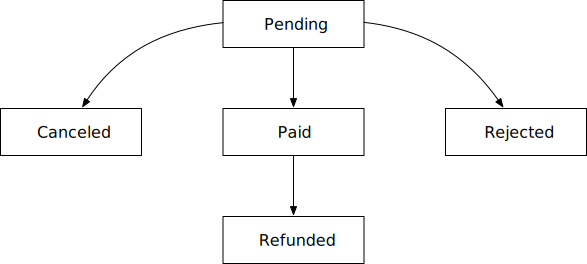
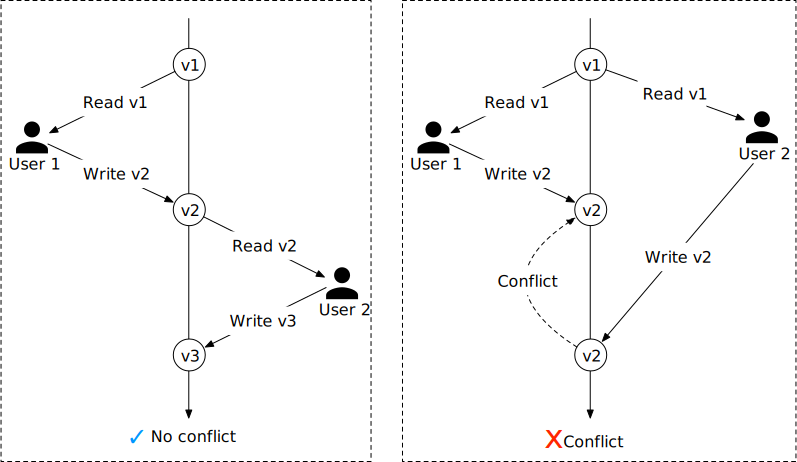

在本章中，我们为万豪国际等连锁酒店设计酒店预订系统。本章中使用的设计和技术也适用于其他热门的预订相关面试主题：

- 设计 Airbnb
- 设计航班预订系统
- 设计一个电影票预订系统

## 步骤 1 - 了解问题并确定设计范围

酒店预订系统非常复杂，其组件根据业务用例而有所不同。在深入研究设计之前，你应该向面试官询问一些澄清问题，以缩小范围。

**候选人**：这个系统的规模有多大？
**面试官**：假设我们正在为一家连锁酒店建立网站，这家酒店总共有 5000 家酒店和 100 万间客房。

**候选人**：客户是在预订时付款还是到达酒店时付款？
**面试官**：为简单起见，他们在预订时全额付款。

**候选人**：客户是否只能通过酒店网站预订酒店房间？我们是否需要支持其他预订方式，例如电话预订？
**面试官**：假设人们可以通过酒店网站或应用程序预订酒店房间。

**候选人**：顾客可以取消预约吗？
**面试官**：可以。

**候选人**：还有其他需要考虑的事情吗？
**面试官**：是的，我们允许 10% 的超额预订。如果你不知道，超额预订意味着酒店将出售比实际拥有的更多的房间。酒店这样做是因为预计一些客户会取消预订。

**候选人**：由于时间有限，我认为酒店房间搜索不在我们的考虑范围内。我们主要关注以下功能。

- 显示酒店相关页面。
- 显示酒店房间相关详情页面。
- 預訂房間。
- 管理面板用于添加/删除/更新酒店或房间信息。
- 支持超额预订功能。

**面试官**：听起来不错。

**面试官：**还有一件事，酒店价格是动态变化的。酒店房间的价格取决于酒店在某一天的入住率。对于这次面试，我们可以假设价格每天都会有所不同。
**候选人**：我会记住这一点。

接下来，你可能想谈谈最重要的非功能性需求。

### 非功能性需求

- 支持高并发。在旺季或大型活动期间，一些热门酒店可能会有大量客户试图预订同一间房间。
- 中等延迟。当用户进行预订时，最好有快速的响应时间，但如果系统需要几秒钟来处理预订请求，这也是可以接受的。

### 简单估算

- 总计5000家酒店、100万间客房。
- 假设70％的房间被占用，平均入住时间为3天。
- 预计每日预订量：（100 万 * 0.7）/ 3 = 233,333（四舍五入为 ~240,000）
- 每秒预订量 = 240,000 / 一天 10^5 秒 = ~3。我们可以看到，每秒平均预订交易量 (TPS) 并不高。

接下来我们粗略计算一下系统中所有页面的QPS，一个典型的客户流程分为三个步骤：

1. 查看酒店/房间详情页面。用户浏览该页面（查询）。
2. 查看预订页面，用户可在预订前确认预订详情，如日期、人数、付款信息等（查询）。
3. 预订房间。用户点击“预订”按钮进行预订，房间被预订（交易）。

假设约有 10% 的用户进入下一步，90% 的用户在到达最后一步之前退出流程。我们还可以假设没有实现预取功能（在用户到达下一步之前预取内容）。图 1 显示了不同步骤的 QPS 的粗略估计。我们知道最终预留 TPS 为 3，因此我们可以沿着漏斗反向工作。订单确认页面的 QPS 为 30，详细信息页面的 QPS 为 300。


## 第 2 步 - 提出高层设计并获得认可

在本节中，我们将讨论：

- API 设计
- 数据模型
- 高层设计

### API 设计

我们探索酒店预订系统的 API 设计。下面使用 RESTful 约定列出了最重要的 API。

请注意，本章重点介绍酒店预订系统的设计。对于完整的酒店网站，设计需要提供直观的功能，以便客户根据大量标准搜索房间。这些搜索功能的 API 虽然很重要，但在技术上并不具有挑战性。它们超出了本章的范围。

**酒店相关API**

| **API**            | **细节**                                  |
| ------------------ | ----------------------------------------- |
| 获取 /v1/酒店/ID   | 获取有关酒店的详细信息。                  |
| POST /v1/酒店      | 添加新酒店。此 API 仅供酒店工作人员使用。 |
| 放置 /v1/酒店/ID   | 更新酒店信息，此API仅供酒店工作人员使用。 |
| 删除 /v1/hotels/ID | 删除酒店。此API仅供酒店工作人员使用。     |

表1 酒店相关API

**房间相关API**

| **API**                     | **细节**                                  |
| --------------------------- | ----------------------------------------- |
| 获取 /v1/hotels/ID/rooms/ID | 获取有关房间的详细信息。                  |
| POST /v1/酒店/ID/房间       | 添加房间。此API仅供酒店工作人员使用。     |
| PUT /v1/酒店/ID/房间/ID     | 更新房间信息，此API仅对酒店工作人员开放。 |
| 删除 /v1/hotels/ID/rooms/ID | 删除房间，此API仅对酒店工作人员开放。     |

表 2 Room 相关 API

**预订相关 API**

| **API**                  | **细节**                     |
| ------------------------ | ---------------------------- |
| 获取 /v1/reservations    | 获取登录用户的预约历史记录。 |
| 获取 /v1/reservations/ID | 获取有关预订的详细信息。     |
| POST /v1/预订            | 进行新的预订。               |
| 删除 /v1/reservations/ID | 取消预订。                   |

表 3 预约相关 API

进行新预订是一项非常重要的功能。进行新预订的请求参数（POST /v1/reservations）可能如下所示。

```json
{
  "startDate":"2021-04-28",
  "endDate":"2021-04-30",
  "hotelID":"245",
  "roomID":"U12354673389",
  "reservationID":"13422445"
}
```

请注意，*reservationID*用作幂等键以防止重复预订。重复预订意味着同一天对同一间客房进行多次预订。详细信息在“深入探讨”部分中的“并发问题”中进行了说明。

### 数据模型

在决定使用哪个数据库之前，让我们仔细看看数据访问模式。对于酒店预订系统，我们需要支持以下查询：

查询 1：查看有关酒店的详细信息。

查询 2：根据给定的日期范围查找可用的房间类型。

查询 3：记录预订。

查询 4：查找预订或过去的预订历史记录。

从粗略估计来看，我们知道系统的规模不大，但我们需要为大型活动期间的流量激增做好准备。考虑到这些要求，我们选择了关系型数据库，因为：

- 关系数据库非常适合读取密集、写入频率较低的工作流程。这是因为访问酒店网站/应用程序的用户数量比实际进行预订的用户数量高出几个数量级。NoSQL 数据库通常针对写入进行了优化，而关系数据库对于读取密集的工作流程来说已经足够好了。
- 关系数据库提供 ACID（原子性、一致性、隔离性、持久性）保证。ACID 属性对于预订系统非常重要。如果没有这些属性，就很难防止负余额、双重收费、双重预订等问题。ACID 属性使应用程序代码变得简单得多，并使整个系统更易于推理。关系数据库通常提供这些保证。
- 关系型数据库可以很容易地对数据进行建模。业务数据的结构非常清晰，不同实体（酒店、房间、房间类型等）之间的关系稳定。这种数据模型很容易通过关系型数据库进行建模。

既然我们已经选择了关系数据库作为数据存储，那么让我们来探索一下模式设计。图 2 显示了一个简单的模式设计，对于许多候选人来说，这是对酒店预订系统进行建模的最自然的方式。


大多数属性都是不言自明的，我们只解释预订表中的*状态字段。**状态*字段可以是以下状态之一：待处理、已付款、已退款、已取消、已拒绝。状态机如图 3 所示。



这种架构设计存在一个重大问题。这种数据模型适用于 Airbnb 等公司，因为*room_id*（可能称为*listing_id*）是在用户预订时提供的。然而，酒店的情况并非如此。用户实际上是在特定酒店预订**一种类型的房间**，而不是特定的房间。例如，房间类型可以是标准间、特大号床间、带两张大床的大号床间等。房间号是在客人入住时提供的，而不是在预订时提供的。我们需要更新我们的数据模型以反映这一新要求。有关更多详细信息，请参阅“深入研究”部分中的“改进的数据模型”。

### 高层设计

我们为这个酒店预订系统使用了微服务架构。在过去的几年中，微服务架构已经非常流行。使用微服务的公司包括亚马逊、Netflix、Uber、Airbnb、Twitter 等。如果你想了解有关微服务架构的好处的更多信息，可以查看一些不错的资源 [1] [2]。

我们的设计采用微服务架构建模，高级设计图如图 4 所示。


我们将从上到下简要介绍系统的每个组件。

- 用户：用户通过手机或电脑预订酒店房间。
- 管理员（酒店工作人员）：授权的酒店工作人员执行行政操作，例如退款给客户、取消预订、更新房间信息等。
- CDN（内容分发网络）：为了缩短加载时间，CDN 用于缓存所有静态资产，包括 JavaScript 包、图像、视频、HTML 等。
- 公共 API 网关：这是一项完全托管的服务，支持速率限制、身份验证等。API 网关配置为根据端点将请求定向到特定服务。例如，加载酒店主页的请求被定向到酒店服务，预订酒店房间的请求被路由到预订服务。
- 内部 API：这些 API 仅供授权的酒店员工使用。它们可通过内部软件或网站访问。它们通常受到 VPN（虚拟专用网络）的进一步保护。
- 酒店服务：提供酒店和房间的详细信息。酒店和房间数据通常是静态的，因此可以轻松缓存。
- 房价服务：提供未来不同日期的房价。酒店业的一个有趣事实是，房间价格取决于酒店预计在某一天的入住率。
- 预订服务：接收预订请求并预订酒店房间。此服务还会在客房被预订或取消预订时跟踪客房库存。
- 支付服务：执行客户付款，一旦付款交易成功，则将预订状态更新为“已付款”，如果交易失败，则更新为“拒绝”。
- 酒店管理服务：仅向授权的酒店员工开放。酒店员工可以使用以下功能：查看即将预订的记录、为客户预订房间、取消预订等。

为了清晰起见，图 4 省略了微服务之间交互的许多箭头。例如，如图 5 所示，预订服务和费率服务之间应该有一个箭头。预订服务向费率服务查询房价。这用于计算预订的总房费。另一个例子是，应该有许多箭头将酒店管理服务与大多数其他服务连接起来。当管理员通过酒店管理服务进行更改时，请求将转发到拥有数据的实际服务，以处理更改。


对于生产系统，服务间通信通常采用现代高性能远程过程调用 (RPC) 框架，如 gPRC。使用此类框架有很多好处。要了解有关 gPRC 的更多信息，请查看 [3]。

## 步骤 3 - 深入设计

现在我们已经讨论了高层设计，下面让我们更深入地讨论一下。

- 改进的数据模型
- 并发问题
- 扩展系统
- 解决微服务架构中的数据不一致问题

### 改进的数据模型

正如高级设计中提到的，当我们预订酒店房间时，我们实际上预订的是一类房间，而不是特定的房间。我们需要对 API 和架构进行哪些更改才能适应这种情况？

对于预订 API，请求参数中的 roomID 将替换为 roomTypeID。预订 API 如下所示：

```
POST /v1/reservations
```

请求参数：

```json
{
  "startDate":"2021-04-28",
  "endDate":"2021-04-30",
  "hotelID":"245",
  "roomTypeID":"12354673389",
  "roomCount":"3",
  "reservationID":"13422445"
}
```

更新后的模式如图 6 所示。


我们将简要介绍一些最重要的表格。

**房间**：包含有关房间的信息。

**room_type_rate**：存储特定房型未来日期的价格数据。

**预订**：记录客人预订数据。

**room_type_inventory**：存储酒店客房的库存数据。此表对于预订系统非常重要，因此让我们仔细看看每一列。

- hotel_id：酒店ID
- room_type_id：房间类型的ID。
- 日期：单个日期。
- total_inventory：总客房数减去暂时下架的客房数。部分客房可能会因维护而下架。
- 总预订量：根据指定的 _hotel_id 、*room_type_id*和*date**预订的客房总数*。

还有其他方法可以设计*room_type_inventory*表，但每个日期一行可以方便管理日期范围内的预订和查询。如图 6 所示，( *hotel_id, room_type_id, date* ) 是复合主键。通过查询 2 年内所有未来日期的库存数据，可以预先填充表的行。我们有一个计划的每日作业，当日期进一步推进时，预先填充库存数据。

现在我们已经完成了架构设计，让我们对存储量进行一些估算。正如在粗略估算中提到的，我们有 5,000 家酒店。假设每家酒店有 20 种类型的房间。那就是 (5000 家酒店 * 20 种类型的房间 * 2 年 * 365 天) = 7300 万行。7300 万行数据并不多，单个数据库就足以存储这些数据。但是，单个服务器意味着单点故障。为了实现高可用性，我们可以跨多个区域或可用区域设置数据库复制。

*表 4 显示了“ room_type_inventory* ”表的示例数据。

| **hotel_id** | **房间类型 ID** | **日期**   | **总库存** | **总预留** |
| ------------ | --------------- | ---------- | ---------- | ---------- |
| 211          | 1001            | 2021-06-01 | 100        | 80         |
| 211          | 1001            | 2021-06-02 | 100        | 82         |
| 211          | 1001            | 2021-06-03 | 100        | 86         |
| 211          | 1001            | ...        | ...        |            |
| 211          | 1001            | 2023-05-31 | 100        | 0          |
| 211          | 1002            | 2021-06-01 | 200        | 16         |
| 2210         | 101             | 2021-06-01 | 三十       | 23         |
| 2210         | 101             | 2021-06-02 | 三十       | 二十五     |

表 4 room_type_inventory 表样本数据

room_type_inventory*表*用于检查客户是否可以预订特定类型的房间。预订的输入和输出可能如下所示：

- 输入：startDate（2021-07-01）、endDate（2021-07-03）、roomTypeId、hotelId、numberOfRoomsToReserve
- 输出：如果指定类型的房间有库存且用户可以预订，则返回 True。否则，返回 false。

从SQL角度看，包含以下两个步骤：

1. 选择日期范围内的行

   ```sql
   SELECT date, total_inventory, total_reserved
   FROM room_type_inventory
   WHERE room_type_id = ${roomTypeId} AND hotel_id = ${hotelId}
   AND date between ${startDate} and ${endDate}
   ```

   此查询返回如下数据：

   | **日期**   | **总库存** | **总预留** |
   | ---------- | ---------- | ---------- |
   | 2021-07-01 | 100        | 97         |
   | 2021-07-02 | 100        | 96         |
   | 2021-07-03 | 100        | 95         |

   表 5 酒店库存

2. 对于每个条目，应用程序检查以下条件：

   ```sql
   if (total_reserved + ${numberOfRoomsToReserve}) <= total_inventory
   ```

   如果条件对所有条目都返回真，则意味着日期范围内的每个日期都有足够的房间。

   其中一项要求是支持 10% 的超额预订。使用新架构，可以轻松实现：

   ```sql
   if (total_reserved + ${numberOfRoomsToReserve}) <= 110% * total_inventory
   ```

此时，面试官可能会问一个后续问题：“如果预订数据对于单个数据库来说太大，你会怎么做？”有几种策略：

- 仅存储当前和未来的预订数据。预订历史记录不经常访问。因此，它们可以存档，甚至可以将一些数据移至冷库。
- 数据库分片。最常见的查询包括预订或按名称查找预订。在这两个查询中，我们都需要先选择酒店，这意味着*hotel_id*是一个很好的分片键。数据可以通过 hash(hotel_id) % number_of_servers 进行分片。

### 并发问题

另一个需要注意的重要问题是重复预订。我们需要解决两个问题：1）同一个用户多次点击“预订”按钮。2）多个用户同时尝试预订同一个房间。

我们先来看第一种场景，如图7所示，进行了两次预订。


解决此问题有两种常见方法：

- 客户端实现。一旦发送请求，客户端可以将“提交”按钮变灰、隐藏或禁用。这在大多数情况下应该可以防止双击问题。但是，这种方法不太可靠。例如，用户可以禁用 JavaScript，从而绕过客户端检查。
- 幂等 API。在预订 API 请求中添加幂等键。如果 API 调用无论调用多少次都产生相同的结果，则该调用是幂等的。图 8 显示了如何使用幂等键 ( *reservation_id* ) 来避免双重预订问题。详细步骤如下所述。


1. 生成预订订单。客户输入预订的详细信息（房间类型、入住日期、退房日期等）并点击“继续”按钮后，预订服务将生成预订订单。

2. 系统生成预订订单供客户查看。唯一的*reservation_id*由全局唯一 ID 生成器生成，并作为 API 响应的一部分返回。此步骤的 UI 可能如下所示：


3a. 提交预订 1. *reservation_id*包含在请求中。它是预订表的主键（图 6）。请注意，幂等键不一定是 reservation_id *。*我们选择*reservation_id 是*因为它已经存在并且非常适合我们的设计。

3b. 如果用户第二次点击“完成我的预订”按钮，则提交预订 2。由于*reservation_id*是预订表的主键，我们可以依靠该键的唯一约束来确保不会发生重复预订。

图10解释了为什么可以避免双重预留。


场景 2：如果多个用户同时预订同一类型的房间，而房间只剩下一间，会发生什么情况？让我们考虑如图 11 所示的场景。


1. 假设数据库隔离级别为不可序列化 [5]。用户 1 和用户 2 尝试同时预订同一类型的房间，但只剩下 1 间房间。我们将用户 1 的执行称为“事务 1”，将用户 2 的执行称为“事务 2”。此时，酒店共有 100 间客房，其中 99 间已被预订。
2. *事务 2 通过检查(total_reserved + rooms_to_book) <= total_inventory 来*检查是否有足够的剩余房间。由于剩余 1 个房间，因此返回 true。
3. *事务 1 通过检查 ( total_reserved + rooms_to_book) <= total_inventory 来*检查是否有足够的房间。由于还剩下 1 个房间，因此它也返回 true。
4. 事务1预订房间并更新库存：*reserved_room*变为100。
5. 然后事务 2 预订房间。ACID中的**隔离**属性意味着数据库事务必须独立于其他事务完成其任务。因此，事务 1 所做的数据更改在事务 1 完成（提交）之前对事务 2 不可见。因此，事务 2 仍然看到*total_reserved*为 99，并通过更新库存来预订房间：*reserved_room*变为 100。这导致系统允许两个用户预订房间，即使只剩下 1 个房间。
6. 事务 1 成功提交更改。
7. 事务 2 成功提交更改。

解决这个问题通常需要某种形式的锁定机制。我们探索了以下技术：

- 悲观锁定
- 乐观锁定
- 数据库约束

在开始修复之前，让我们先看一下用于预订房间的 SQL 伪代码。该 SQL 包含两个部分：

- 检查房间库存

- 预订房间

  ```sql
  # step 1: check room inventory
  SELECT date, total_inventory, total_reserved
  FROM room_type_inventory
  WHERE room_type_id = ${roomTypeId} AND hotel_id = ${hotelId}
  AND date between ${startDate} and ${endDate}
  
  # For every entry returned from step 1
  if((total_reserved + ${numberOfRoomsToReserve}) > 110% * total_inventory) {
    Rollback
  }
  
  # step 2: reserve rooms
  UPDATE room_type_inventory
  SET total_reserved = total_reserved + ${numberOfRoomsToReserve}
  WHERE room_type_id = ${roomTypeId}
  AND date between ${startDate} and ${endDate}
  
  Commit
  ```

#### 选项 1：悲观锁

悲观锁定 [6]，也称为悲观并发控制，通过在一个用户开始更新记录时立即锁定记录来防止同时更新。尝试更新记录的其他用户必须等到第一个用户释放锁定（提交更改）。

对于 MySQL，“SELECT ... FOR UPDATE”语句通过锁定选择查询返回的行来工作。假设一个事务由“事务 1”启动。其他事务必须等待事务 1 完成才能开始另一个事务。详细说明如图 12 所示。


在图 12 中，事务 2 的“SELECT ... FOR UPDATE”语句等待事务 1 完成，因为事务 1 锁定了行。事务 1 完成后，*total_reserved*变为 100，这意味着用户 2 没有房间可以预订。

**优点：**

- 防止应用程序更新正在或已经更改的数据。
- 它易于实现，并且通过序列化更新来避免冲突。当数据争用严重时，悲观锁定很有用。

**缺点：**

- 当多个资源被锁定时，可能会发生死锁。编写无死锁的应用程序代码可能具有挑战性。
- 这种方法不可扩展。如果一个事务被锁定的时间太长，其他事务就无法访问该资源。这对数据库性能有重大影响，尤其是当事务持续时间长或涉及大量实体时。

由于这些限制，我们不建议在预订系统中使用悲观锁。

#### 选项 2：乐观锁

乐观锁定 [7]，也称为乐观并发控制，允许多个并发用户尝试更新同一资源。

实现乐观锁定的常用方法有两种：版本号和时间戳。版本号通常被认为是更好的选择，因为服务器时钟可能会随着时间的推移而变得不准确。我们将解释乐观锁定如何与版本号配合使用。

图13显示了一个成功案例和一个失败案例。



1. 数据库表中添加了一个名为“版本”的新列。
2. 在用户修改数据库行之前，应用程序会读取该行的版本号。
3. 当用户更新该行时，应用程序将版本号增加 1 并将其写回数据库。
4. 进行数据库验证检查；下一个版本号应比当前版本号大 1。如果验证失败，则事务中止，用户从步骤 2 开始重试。

乐观锁通常比悲观锁更快，因为我们不锁定数据库。但是，当并发性很高时，乐观锁的性能会急剧下降。

要理解原因，请考虑许多客户端同时尝试预订酒店房间的情况。由于对可以读取可用房间数的客户端数量没有限制，因此所有客户端都会读回相同的可用房间数和当前版本号。当不同的客户端进行预订并将结果写回数据库时，只有其中一个会成功，其余客户端会收到版本检查失败消息。这些客户端必须重试。在后续的重试中，再次只有一个客户端成功，其余客户端必须重试。虽然最终结果是正确的，但重复重试会导致非常不愉快的用户体验。

优点：

- 它可以防止应用程序编辑陈旧的数据。
- 我们不需要锁定数据库资源。从数据库的角度来看，实际上没有锁定。处理版本号的逻辑完全由应用程序决定。
- 乐观锁定通常用于数据争用较少的情况。当冲突很少时，事务无需管理锁即可完成。

缺点：

- 当数据争用严重时，性能会很差。

对于酒店预订系统来说，乐观锁定是一个不错的选择，因为预订的 QPS 通常不高。

#### 选项 3：数据库约束

这种方法与乐观锁定非常相似。让我们探索一下它的工作原理。在*room_type_inventory*表中，添加以下约束：

```sql
CONSTRAINT `check_room_count` CHECK((`total_inventory - total_reserved` >= 0))
```

使用与图 14 中相同的示例，当用户 2 尝试预订房间时，*total_reserved*变为 101，这违反了*total_inventory (100) - total_reserved (101) >= 0*约束。然后事务被回滚。


**优点**

- 容易實施。
- 当数据争用最少时，它可以很好地工作。

**缺点**

- 与乐观锁定类似，当数据争用严重时，可能会导致大量故障。用户可能会看到有空房，但当他们尝试预订时，他们得到的回复是“没有空房”。这种体验可能会让用户感到沮丧。
- 数据库约束不能像应用程序代码那样轻松地进行版本控制。
- 并非所有数据库都支持约束。当我们从一个数据库解决方案迁移到另一个数据库解决方案时，这可能会引起问题。

由于这种方法易于实现，并且酒店预订的数据争用通常不高（低 QPS），因此它是酒店预订系统的另一个不错的选择。

### 可扩展性

通常，酒店预订系统的负载不高。但是，面试官可能会问：“如果酒店预订系统不仅用于连锁酒店，还用于 booking.com 或 expedia.com 等热门旅游网站，情况会怎样？”在这种情况下，QPS 可能会高出 1,000 倍。

当系统负载很高时，我们需要了解什么可能成为瓶颈。我们所有的服务都是无状态的，因此可以通过添加更多服务器轻松扩展。但是，数据库包含所有状态，不能通过简单地添加更多数据库来扩展。让我们探索如何扩展数据库。

#### 数据库分片

扩展数据库的一种方法是应用数据库分片。其理念是将数据拆分到多个数据库中，以便每个数据库仅包含一部分数据。

当我们对数据库进行分片时，我们需要考虑如何分发数据。从数据模型部分我们可以看到，大多数查询都需要按*hotel_id*进行筛选。因此，一个自然的结论就是我们按*hotel_id*对数据进行分片。在图 15 中，负载分布在 16 个分片中。假设 QPS 为 30,000。数据库分片后，每个分片处理 30,000 / 16 = 1875 QPS，这在单个 MySQL 服务器的负载能力范围内。


#### 缓存

酒店库存数据有一个有趣的特点；只有当前和未来的酒店库存数据才有意义，因为客户只能在不久的将来预订房间。

因此，对于存储选择，理想情况下，我们希望有一个生存时间 (TTL) 机制来自动使旧数据过期。历史数据可以在不同的数据库上查询。Redis 是一个不错的选择，因为 TTL 和最近最少使用 (LRU) 缓存驱逐策略可以帮助我们最佳地利用内存。

如果加载速度和数据库可扩展性成为问题（例如，我们设计时规模与 booking.com 或 expedia.com 相当），我们可以在数据库上添加一个缓存层，将查询客房库存和预订客房的逻辑移至缓存层，如图 16 所示。在这种设计中，只有一小部分请求会命中库存数据库，因为大多数不符合条件的请求都被库存缓存阻止了。值得一提的是，即使 Redis 中显示的库存足够多，我们仍然需要在数据库端重新检查库存以防万一。数据库是库存数据的真实来源。


让我们首先了解一下该系统中的每个组件。

**预订服务**：支持以下库存管理API：

- 查询给定酒店 ID、房间类型和日期范围内的可用房间数量。
- *通过执行total_reserved + 1*来预订房间。
- 当用户取消预订时更新库存。

**库存缓存**：所有库存管理查询操作都移至库存缓存 (Redis)，我们需要将库存数据预先填充到缓存中。缓存是一个键值存储，结构如下：

```
key: hotelID_roomTypeID_{date}
value: the number of available rooms for the given hotel ID, room type ID and date.
```

对于酒店预订系统，读取操作（查看房间库存）的数量比写入操作高出一个数量级。大多数读取操作都由缓存来响应。

**库存数据库**：存储库存数据作为真实来源。

**缓存带来的新挑战**

添加缓存层大大增加了系统的可扩展性和吞吐量，但也带来了一个新的挑战：如何维护数据库和缓存之间的数据一致性。

当用户预订房间时，快乐路径中会执行两个操作：

1. 查询房间库存，了解是否有足够的剩余房间。查询在库存缓存上运行。
2. 更新库存数据。首先更新库存数据库。然后将更改异步传播到缓存。此异步缓存更新可以由应用程序代码调用，该代码在将数据保存到数据库后更新库存缓存。它也可以使用变更数据捕获 (CDC) [8] 进行传播。CDC 是一种从数据库读取数据更改并将更改应用于另一个数据系统的机制。一种常见的解决方案是 Debezium [9]。它使用源连接器从数据库读取更改并将其应用于 Redis [10] 等缓存解决方案。

由于库存数据是先在数据库上更新的，因此有可能缓存不能反映最新的库存数据。例如，数据库说没有剩余房间，但缓存可能报告仍有空房，反之亦然。

如果仔细思考，就会发现库存缓存和数据库之间的不一致实际上并不重要，只要数据库进行最终的库存验证检查。

让我们看一个例子。假设缓存显示仍有空房间，但数据库显示没有。在这种情况下，当用户查询房间库存时，他们发现仍有空房间，因此他们尝试预订。当请求到达库存数据库时，数据库进行验证并发现没有剩余房间。在这种情况下，客户端会收到一个错误，表明其他人刚刚预订了他们之前的最后一间房间。当用户刷新网站时，他们可能会看到没有剩余房间，因为在他们单击刷新按钮之前，数据库已将库存数据同步到缓存中。

**优点**

- 减少数据库负载。由于读取查询由缓存层应答，因此数据库负载显著减少。
- 高性能。读取查询非常快，因为结果是从内存中获取的。

**缺点**

- 维护数据库和缓存之间的数据一致性很难。我们需要仔细考虑这种不一致会如何影响用户体验。

### 服务间数据一致性

在传统的单体架构 [11] 中，使用共享关系数据库来确保数据一致性。在我们的微服务设计中，我们选择了一种混合方法，让预订服务同时处理预订和库存 API，这样库存和预订数据库表就存储在同一个关系数据库中。如“并发问题”部分所述，这种安排使我们能够利用关系数据库的 ACID 属性来优雅地处理预订流程中出现的许多并发问题。

然而，如果你的面试官是微服务纯粹主义者，他们可能会质疑这种混合方法。在他们看来，对于微服务架构，每个微服务都有自己的数据库，如图 17 右侧所示。


这种纯粹的设计引入了许多数据一致性问题。由于这是我们第一次讨论微服务，让我们解释一下它是如何以及为什么会发生的。为了更容易理解，本次讨论中只使用了两个服务。在现实世界中，一家公司可能有数百个微服务。在单体架构中，如图 18 所示，不同的操作可以包装在单个事务中以确保 ACID 属性。


然而，在微服务架构中，每个服务都有自己的数据库。一个逻辑上的原子操作可以跨越多个服务。这意味着我们不能使用单个事务来确保数据一致性。如图 19 所示，如果预订数据库中的更新操作失败，我们需要回滚库存数据库中的预订房间数量。通常，只有一条快乐路径，但许多失败情况可能导致数据不一致。


为了解决数据不一致的问题，这里对业界成熟的技术进行了高度概括。如果你想了解详细信息，请参阅参考资料。

- 两阶段提交 (2PC) [12]。2PC 是一种数据库协议，用于保证跨多个节点的原子事务提交，即所有节点要么成功，要么所有节点都失败。由于 2PC 是一种阻塞协议，因此单个节点故障会阻塞进程，直到该节点恢复为止。它的性能不佳。
- Saga。Saga 是一系列本地事务。每个事务都会更新并发布一条消息以触发下一个事务步骤。如果某个步骤失败，Saga 将执行补偿事务以撤消先前事务所做的更改 [13]。2PC 作为单个提交来执行 ACID 事务，而 Saga 由多个步骤组成并依赖于最终一致性。

值得注意的是，解决微服务之间的数据不一致问题需要一些复杂的机制，这大大增加了整体设计的复杂性。作为架构师，你需要决定增加的复杂性是否值得。对于这个问题，我们认为不值得，因此采用了更务实的方法，将预订和库存数据存储在同一个关系数据库中。

## 第 4 步 - 总结

在本章中，我们介绍了酒店预订系统的设计。我们首先收集需求并计算了粗略估计以了解规模。在高级设计中，我们介绍了 API 设计、数据模型的初稿和系统架构图。在深入研究中，我们探索了替代的数据库模式设计，因为我们意识到预订应该在房间类型级别进行，而不是在特定房间进行。我们深入讨论了竞争条件并提出了一些潜在的解决方案：

- 悲观锁定
- 乐观锁定
- 数据库约束

然后，我们讨论了扩展系统的不同方法，包括数据库分片和使用 Redis 缓存。最后，我们解决了微服务架构中的数据一致性问题，并简要介绍了几种解决方案。

恭喜你走到这一步！现在给自己一点鼓励吧。干得好！

## 章节总结


## 参考资料

[1] 微服务：https://en.wikipedia.org/wiki/Microservices

[2] 微服务架构有什么好处？：https://www.appdynamics.com/topics/benefits-of-microservices

[3] gRPC：https://www.grpc.io/docs/what-is-grpc/introduction/

[4] 来源：Booking.com iOS 应用

[5] 可序列化性：https://en.wikipedia.org/wiki/Serializability

[6] 乐观和悲观记录锁定：https://ibm.co/3Eb293O

[7] 乐观并发控制：https://en.wikipedia.org/wiki/Optimistic_concurrency_control

[8] 变更数据捕获：https://docs.oracle.com/cd/B10500_01/server.920/a96520/cdc.htm

[9]Debizium：https://debezium.io/

[10] Redis 接收器：https://bit.ly/3r3AEUD

[11] 单体架构：https://microservices.io/patterns/monolithic.html

[12]两阶段提交协议：https://en.wikipedia.org/wiki/Two-phase_commit_protocol

[13] Saga：https://microservices.io/patterns/data/saga.html