在本章中，我们设计一个大型电子邮件服务，例如 Gmail、Outlook 或 Yahoo Mail。互联网的增长导致电子邮件数量激增。2020 年，Gmail 拥有超过 18 亿活跃用户，Outlook 在全球拥有超过 4 亿用户 [1] [2]。


## 步骤 1 - 了解问题并确定设计范围

多年来，电子邮件服务的复杂性和规模发生了巨大变化。现代电子邮件服务是一个具有许多功能的复杂系统。我们不可能在 45 分钟内设计出一个现实世界的系统。因此，在开始设计之前，我们一定要问一些澄清问题，以缩小范围。

**候选人**：有多少人使用该产品？
**面试官**：十亿用户。

**候选人**：我认为以下特点很重要：

- 验证。
- 发送和接收电子邮件。
- 获取所有电子邮件。
- 按已读和未读状态过滤电子邮件。
- 按主题、发件人和正文搜索电子邮件。
- 反垃圾邮件和反病毒。

**面试官**：这个列表很好。我们不需要担心身份验证。让我们关注你提到的其他功能。

**候选人**：用户如何连接邮件服务器？
**面试官**：传统上，用户通过使用 SMTP、POP、IMAP 和供应商特定协议的本机客户端连接邮件服务器。这些协议在某种程度上是遗留的，但仍然非常流行。在本次面试中，我们假设 HTTP 用于客户端和服务器通信。

**候选人**：邮件可以带附件吗？
**面试官**：可以。

### 非功能性需求

接下来，让我们讨论一下最重要的非功能性需求。

**可靠性。**我们不应该丢失电子邮件数据。

**可用性**。电子邮件和用户数据应自动跨多个节点复制，以确保可用性。此外，即使部分系统出现故障，系统仍应继续运行。

**可扩展性**。随着用户数量的增长，系统应该能够处理不断增加的用户和电子邮件数量。系统的性能不应因用户或电子邮件数量的增加而下降。

**灵活性和可扩展性**。灵活/可扩展的系统允许我们通过添加新组件轻松添加新功能或提高性能。传统的电子邮件协议（如 POP 和 IMAP）功能非常有限（有关这方面的更多信息，请参阅高级设计）。因此，我们可能需要自定义协议来满足灵活性和可扩展性的要求。

### 信封背面估计

让我们进行一个粗略的计算来确定规模并发现我们的解决方案需要解决的一些挑战。从设计上讲，电子邮件是存储量很大的应用程序。

- 10亿用户。
- 假设一个人每天平均发送10封邮件，那么发送邮件的QPS = 10^9 * 10 / (10^5) = 100,000。
- 假设一个人一天平均收到 40 封电子邮件 [3]，电子邮件元数据的平均大小为 50KB。元数据是指与电子邮件相关的所有内容，不包括附件文件。
- 假设元数据存储在数据库中。1 年内维护元数据的存储需求：10 亿用户 * 40 封电子邮件/天 * 365 天 * 50 KB = 730 PB。
- 假设 20% 的电子邮件包含附件，平均附件大小为 500 KB。
- 1 年附件存储量为：10 亿用户 * 40 封电子邮件/天 * 365 天 * 20% * 500 KB = 1,460 PB

从这个简单的计算可以看出，我们将处理大量数据。因此，我们很可能需要一个分布式数据库解决方案。

## 第 2 步 - 提出高层设计并获得认可

在本节中，我们首先讨论有关电子邮件服务器的一些基础知识以及电子邮件服务器如何随时间演变。然后我们研究分布式电子邮件服务器的高级设计。内容结构如下：

- 电子邮件知识 101
- 传统邮件服务器
- 分布式邮件服务器

### 电子邮件知识 101

有多种电子邮件协议可用于发送和接收电子邮件。从历史上看，大多数邮件服务器使用电子邮件协议，例如 POP、IMAP 和 SMTP。

#### 电子邮件协议

**SMTP** ：简单邮件传输协议 (SMTP) 是从一个邮件服务器向另一个邮件服务器**发送**电子邮件的标准协议。

最流行的**检索**电子邮件协议是邮局协议 (POP) 和互联网邮件访问协议 (IMAP)。

**POP**是一种标准邮件协议，用于从远程邮件服务器接收电子邮件并将其下载到本地电子邮件客户端。一旦电子邮件下载到你的计算机或手机，它们就会从电子邮件服务器中删除，这意味着你只能在一台计算机或手机上访问电子邮件。RFC 1939 [4] 中介绍了 POP 的详细信息。POP 要求邮件客户端下载整个电子邮件。如果电子邮件包含较大的附件，则这可能需要很长时间。

**IMAP**也是本地电子邮件客户端接收电子邮件的标准邮件协议。当你阅读电子邮件时，你会连接到外部邮件服务器，数据会传输到你的本地设备。IMAP 仅在你单击时下载邮件，并且电子邮件不会从邮件服务器中删除，这意味着你可以从多个设备访问电子邮件。IMAP 是个人电子邮件帐户使用最广泛的协议。当连接速度较慢时，它效果很好，因为只有电子邮件标题信息才会被下载，直到打开。

**从技术上讲， HTTPS**并不是邮件协议，但它可用于访问邮箱，尤其是基于 Web 的电子邮件。例如，Microsoft Outlook 通常通过 HTTPS 与移动设备通信，使用一种名为 ActiveSync 的定制协议 [5]。

#### 域名服务 (DNS)

DNS 服务器用于查找收件人域的邮件交换器记录 (MX 记录)。如果你从命令行运行 gmail.com 的 DNS 查找，你可能会获得如图 2 所示的 MX 记录。

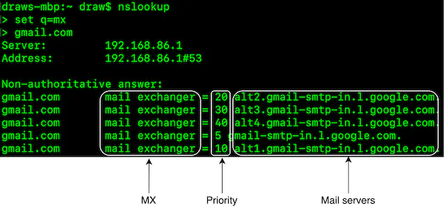

优先级数字表示偏好，优先级数字越低的邮件服务器越受青睐。在图 2 中，首先使用 gmail-smtp-in.l.google.com（优先级 5）。发送邮件服务器将首先尝试连接并向此邮件服务器发送消息。如果连接失败，发送邮件服务器将尝试连接到下一个优先级最低的邮件服务器，即 alt1.gmail-smtp-in.l.google.com（优先级 10）。

#### 依恋

电子邮件附件随电子邮件消息一起发送，通常使用 Base64 编码 [6]。电子邮件附件通常有大小限制。例如，截至 2021 年 6 月，Outlook 和 Gmail 分别将附件大小限制为 20MB 和 25MB。此数字高度可配置，并且因个人和公司帐户而异。多用途互联网邮件扩展 (MIME) [7] 是一种允许通过互联网发送附件的规范。

### 传统邮件服务器

在深入研究分布式邮件服务器之前，让我们先回顾一下历史，看看传统邮件服务器是如何工作的，因为这样做可以很好地了解如何扩展电子邮件服务器系统。你可以将传统邮件服务器视为在电子邮件用户有限的情况下（通常在单个服务器上）工作的系统。

#### 传统邮件服务器架构

图 3 描述了 Alice 使用传统电子邮件服务器向 Bob 发送电子邮件时发生的情况。

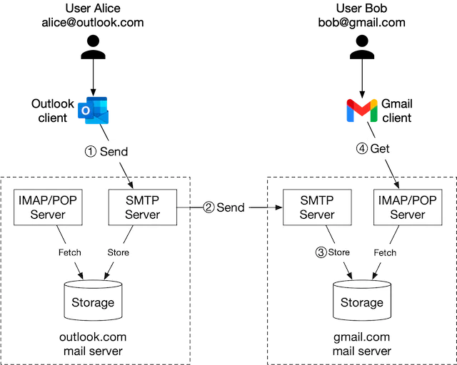

该过程包括 4 个步骤：

1. Alice 登录 Outlook 客户端，撰写电子邮件，然后按下“发送”按钮。电子邮件被发送到 Outlook 邮件服务器。Outlook 客户端和邮件服务器之间的通信协议是 SMTP。
2. Outlook 邮件服务器查询 DNS（图中未显示）以查找收件人的 SMTP 服务器地址。在本例中，它是 Gmail 的 SMTP 服务器。接下来，它将电子邮件传输到 Gmail 邮件服务器。邮件服务器之间的通信协议是 SMTP。
3. Gmail 服务器存储电子邮件并将其提供给收件人 Bob。
4. 当 Bob 登录 Gmail 时，Gmail 客户端通过 IMAP/POP 服务器获取新电子邮件。

#### 贮存

在传统的邮件服务器中，电子邮件存储在本地文件目录中，每封电子邮件都存储在具有唯一名称的单独文件中。每个用户都维护一个用户目录来存储配置数据和邮箱。Maildir 是在邮件服务器上存储电子邮件消息的一种流行方式（图 4）。

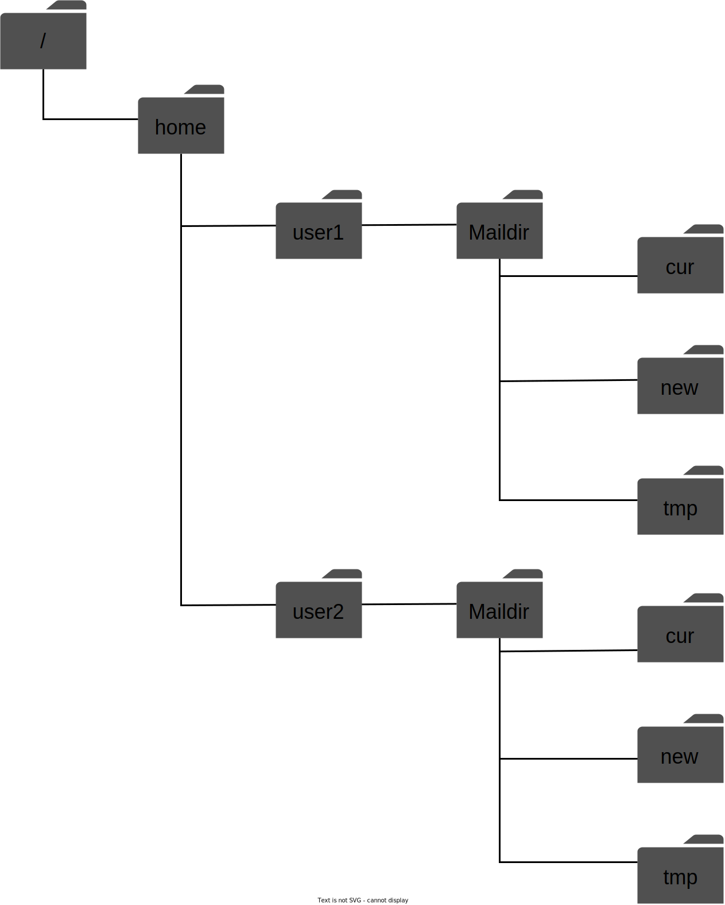

当用户群较小时，文件目录运行良好，但检索和备份数十亿封电子邮件却是一项挑战。随着电子邮件数量的增加和文件结构变得越来越复杂，磁盘 I/O 成为瓶颈。本地目录也无法满足我们的高可用性和可靠性要求。磁盘可能会损坏，服务器可能会宕机。我们需要更可靠的分布式存储层。

#### 

自 20 世纪 60 年代发明以来，电子邮件功能已经发生了巨大的变化，从基于文本的格式发展到多媒体、线程 [8]、搜索、标签等丰富的功能。但电子邮件协议（POP、IMAP 和 SMTP）发明已久，它们并非为支持这些新功能而设计的，也无法扩展以支持数十亿用户。

### 分布式邮件服务器

分布式邮件服务器旨在支持现代用例并解决规模和弹性问题。本节介绍电子邮件 API、分布式电子邮件服务器架构、电子邮件发送和电子邮件接收流程。

#### 电子邮件 API

电子邮件 API 对于不同的邮件客户端或电子邮件生命周期的不同阶段可能具有截然不同的含义。例如；

- 适用于原生移动客户端的 SMTP/POP/IMAP API。
- 发送方和接收方邮件服务器之间的 SMTP 通信。
- 通过 HTTP 实现的 RESTful API，适用于功能齐全且交互式的基于 Web 的电子邮件应用程序。

由于本书篇幅有限，我们仅介绍一些最重要的 Webmail API。Webmail 通信的常见方式是通过 HTTP 协议。

**1. 端点**：**POST /v1/messages**

向“收件人”、“抄送”和“密件抄送”标头中的收件人发送消息。

**2. 端点**：**GET /v1/folders**

返回电子邮件帐户的所有文件夹。

**回复**：

```json
[{id: string        Unique folder identifier.
  name: string      Name of the folder.
                    According to RFC6154 [9], the default folders can be one of
                    the following: All, Archive, Drafts, Flagged, Junk, Sent,
                    and Trash.
  user_id: string   Reference to the account owner
}]
```

**3. 端点**：**GET /v1/folders/{:folder_id}/messages**

返回文件夹下的所有消息。请记住，这是一个高度简化的 API。实际上，这需要支持分页。

**回复**：

消息对象列表。

**4. 端点**：**GET /v1/messages/{:message_id}**

获取有关特定邮件的所有信息。邮件是电子邮件应用程序的核心构建块，包含有关发件人、收件人、邮件主题、正文、附件等的信息。

**回复**：

消息的对象。

```json
{
  user_id: string                      // Reference to the account owner.
  from: {name: string, email: string}  // <name, email> pair of the sender.
  to: [{name: string, email: string}]  // A list of <name, email> paris
  subject: string                      // Subject of an email
  body: string                         //  Message body
  is_read: boolean                     //  Indicate if a message is read or not.
}
```

#### 分布式邮件服务器架构

虽然设置一个处理少量用户的电子邮件服务器很容易，但很难扩展到一台服务器之外。这主要是因为传统的电子邮件服务器设计为只能与一台服务器一起工作。跨服务器同步数据可能很困难，而且防止电子邮件被收件人的邮件服务器错误地归类为垃圾邮件非常具有挑战性。在本节中，我们将探讨如何利用云技术来简化这一过程。图 5 显示了高级设计。

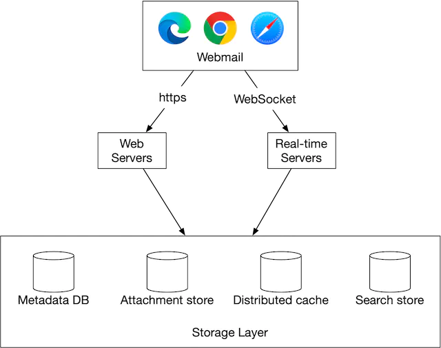

让我们仔细看看每一个组件。

**Webmail**。用户使用网络浏览器接收和发送电子邮件。

**Web 服务器。Web**服务器是面向公众的请求/响应服务，用于管理登录、注册、用户资料等功能。在我们的设计中，所有电子邮件 API 请求（例如发送电子邮件、加载邮件文件夹、加载文件夹中的所有邮件等）都通过 Web 服务器。

**实时服务器。**实时服务器负责实时向客户端推送新的电子邮件更新。实时服务器是有状态的服务器，因为它们需要保持持久连接。为了支持实时通信，我们有几个选项，例如长轮询和 WebSocket。WebSocket 是一种更优雅的解决方案，但它的一个缺点是浏览器兼容性。一种可能的解决方案是尽可能建立 WebSocket 连接，并使用长轮询作为后备。

下面是一个真实邮件服务器（Apache James [10]）的示例，它通过 WebSocket [11] 实现了 JSON 元应用程序协议（JMAP）子协议。

**元数据数据库。**该数据库存储邮件元数据，包括邮件主题、正文、发件人、收件人等。我们将在深入探讨部分讨论数据库的选择。

**附件存储。**我们选择对象存储（例如 Amazon Simple Storage Service (S3)）作为附件存储。S3 是一种可扩展的存储基础设施，适合存储大型文件（例如图像、视频、文件等）。附件最大可达 25MB。由于以下两个原因，Cassandra 等 NoSQL 列系列数据库可能不太适合：

- 尽管 Cassandra 支持 blob 数据类型，并且 Blob 的理论最大大小为 2GB，但实际限制小于 1MB [12]。
- 在 Cassandra 中放置附件的另一个问题是，我们不能使用行缓存，因为附件占用了太多内存空间。

**分布式缓存。**由于客户端会反复加载最新的电子邮件，因此将最近的电子邮件缓存在内存中可显著缩短加载时间。我们可以在这里使用 Redis，因为它提供了列表等丰富的功能，并且易于扩展。

**搜索存储。**搜索存储是一个分布式文档存储。它使用一种称为倒排索引 [13] 的数据结构，支持非常快速的全文搜索。我们将在深入探讨部分更详细地讨论这一点。

现在我们已经讨论了构建分布式邮件服务器的一些最重要的组件，让我们将两个主要的工作流程组合在一起。

- 电子邮件发送流程。
- 电子邮件接收流程。

#### 电子邮件发送流程

电子邮件发送流程如图6所示。

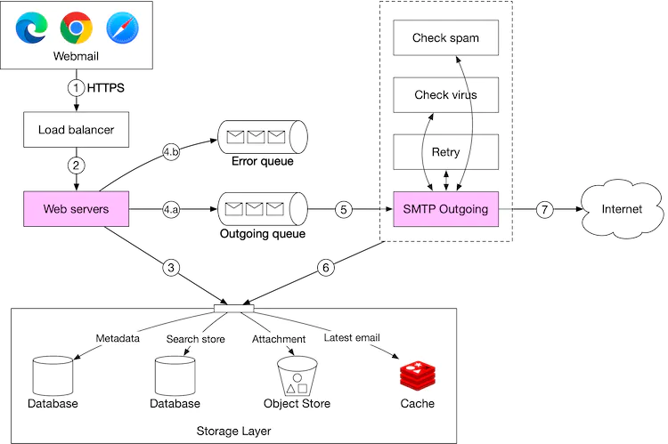

1. 用户在 webmail 上写完邮件后点击“发送”按钮，请求被发送到负载均衡器。

2. 负载均衡器确保其不超过速率限制并将流量路由到 Web 服务器。

3. Web 服务器负责：

   3a. 基本电子邮件验证。每封收到的电子邮件都会根据预定义的规则（如电子邮件大小限制）进行检查。

   3b. 检查收件人电子邮件地址的域名是否与发件人相同。如果相同，则 Web 服务器确保电子邮件数据是垃圾邮件且无病毒。如果是，则将电子邮件数据插入发件人的“已发送文件夹”和收件人的“收件箱文件夹”。收件人可以通过 RESTful API 直接获取电子邮件。无需转到步骤 4。

4. 消息队列。

   4a. 如果基本电子邮件验证成功，则电子邮件数据将传递到传出队列。如果附件太大而无法放入队列，我们可以将附件存储在对象存储中，并将对象引用保存在排队消息中。

   4b. 如果基本电子邮件验证失败，则该电子邮件将被放入错误队列。

5. SMTP 传出工作人员从传出队列中提取消息并确保电子邮件不含垃圾邮件和病毒。

6. 发出的邮件保存在存储层的“已发送文件夹”中。

7. SMTP 传出服务器将电子邮件发送到收件人的邮件服务器。

传出队列中的每条消息都包含创建电子邮件所需的所有元数据。分布式消息队列是允许异步邮件处理的关键组件。通过将 SMTP 传出工作器与 Web 服务器分离，我们可以独立扩展 SMTP 传出工作器。

我们密切监控发件队列的大小。如果队列中有大量邮件滞留，我们需要分析问题的原因。以下是一些可能性：

- 收件人的邮件服务器不可用。在这种情况下，我们需要稍后重试发送电子邮件。指数退避 [14] 可能是一种很好的重试策略。
- 没有足够的消费者发送电子邮件。在这种情况下，我们可能需要更多的消费者来减少处理时间。

#### 电子邮件接收流程

下图演示了电子邮件接收流程。

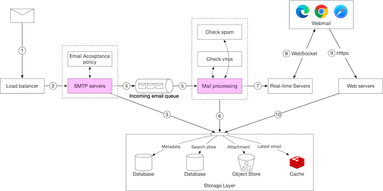

1. 传入的电子邮件到达 SMTP 负载均衡器。
2. 负载均衡器在 SMTP 服务器之间分配流量。电子邮件接受策略可在 SMTP 连接级别配置和应用。例如，无效电子邮件将被退回，以避免不必要的电子邮件处理。
3. 如果电子邮件的附件太大，无法放入队列，我们可以将其放入附件存储（s3）。
4. 电子邮件被放入传入电子邮件队列。队列将邮件处理人员与 SMTP 服务器分离开来，以便它们可以独立扩展。此外，如果电子邮件数量激增，队列还可以充当缓冲区。
5. 邮件处理员负责很多工作，包括过滤垃圾邮件，阻止病毒等。以下步骤假设电子邮件通过了验证。
6. 电子邮件存储在邮件存储、缓存和对象数据存储中。
7. 如果接收者当前在线，则电子邮件将被推送到实时服务器。
8. 实时服务器是 WebSocket 服务器，允许客户端实时接收新电子邮件。
9. 对于离线用户，电子邮件存储在存储层中。当用户重新上线时，Webmail 客户端通过 RESTful API 连接到 Web 服务器。
10. Web 服务器从存储层提取新电子邮件并将其返回给客户端。

## 步骤 3 - 深入设计

现在我们已经讨论了电子邮件服务器的所有部分，让我们深入了解一些关键组件并研究如何扩展系统。

- 元数据数据库
- 搜索
- 传递能力
- 可扩展性

### 元数据数据库

在本节中，我们讨论电子邮件元数据的特点，选择正确的数据库、数据模型和对话线程（加分点）。

#### 电子邮件元数据的特征

- 电子邮件标题通常较小且经常被访问。
- 电子邮件正文大小不一，但很少被访问。通常，你只会阅读一封电子邮件。
- 大多数邮件操作（例如获取邮件、将电子邮件标记为已读和搜索）都与单个用户隔离。换句话说，用户拥有的邮件只能由该用户访问，并且所有邮件操作都由同一用户执行。
- 数据新近度会影响数据使用情况。用户通常只阅读最近的电子邮件。82% 的读取查询针对的是 16 天以内的数据 [15]。
- 数据具有高可靠性要求。数据丢失是不能接受的。

#### 选择正确的数据库

在 Gmail 或 Outlook 规模上，数据库系统通常是定制的，以减少每秒输入/输出操作 (IOPS) [16]，因为这很容易成为系统的主要制约因素。选择正确的数据库并不容易。在决定最合适的数据库之前，考虑我们桌上的所有选项会很有帮助。

- 关系数据库。其主要动机是高效地搜索电子邮件。我们可以为电子邮件标题和正文建立索引。有了索引，简单的搜索查询就很快了。但是，关系数据库通常针对小块数据条目进行了优化，并不适用于大块数据条目。一封典型的电子邮件通常大于几 KB，当涉及 HTML 时，很容易超过 100KB。你可能会认为 BLOB 数据类型旨在支持大数据条目。但是，对非结构化 BLOB 数据类型的搜索查询效率不高。因此，MySQL 或 PostgreSQL 等关系数据库并不合适。
- 分布式对象存储。另一个潜在的解决方案是将原始电子邮件存储在 Amazon S3 等云存储中，这可以作为备份存储的一个不错的选择，但很难有效地支持将电子邮件标记为已读、根据关键字搜索电子邮件、线程电子邮件等功能。
- NoSQL 数据库。Gmail 使用 Google Bigtable，因此它绝对是一个可行的解决方案。但是，Bigtable 不是开源的，电子邮件搜索如何实现仍然是个谜。Cassandra 可能也是一个不错的选择，但我们还没有看到任何大型电子邮件提供商使用它。

根据以上分析，现有的解决方案似乎很少能完美满足我们的需求。大型电子邮件服务提供商倾向于构建自己的高度定制的数据库。然而，在面试环境中，我们没有时间设计一个新的分布式数据库，但重要的是解释数据库应该具备的以下特征。

- 单列可以是一位数 MB。
- 强数据一致性。
- 旨在减少磁盘 I/O。
- 它应该具有高可用性和容错能力。
- 创建增量备份应该很容易。

#### 数据模型

存储数据的一种方法是使用*user_id*作为分区键，这样每个用户的数据就存储在一个分片上。此数据模型的一个限制是消息不能在多个用户之间共享。由于这不是我们本次采访的要求，所以我们不需要担心。

现在让我们定义表。主键包含两个组件，分区键和聚类键。

- 分区键：负责在节点之间分配数据。一般来说，我们希望均匀分布数据。
- 聚类键：负责对分区内的数据进行排序。

从高层次来看，电子邮件服务需要在数据层支持以下查询：

- 第一个查询是获取用户的所有文件夹。
- 第二个查询是显示特定文件夹的所有电子邮件。
- 第三个查询是创建/删除/获取特定的电子邮件。
- 第四个查询是获取所有已读或未读的电子邮件。
- 加分点：获得对话线索。

让我们逐一看一下。

**查询 1：获取用户的所有文件夹。**

如表1所示，*user_id*是分区键，因此同一个用户拥有的文件夹位于一个分区。

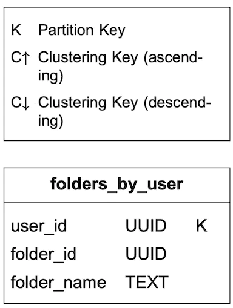

**查询 2：显示特定文件夹的所有电子邮件。**

当用户加载收件箱时，电子邮件通常按时间戳排序，最新邮件显示在顶部。为了将同一文件夹的所有电子邮件存储在一个分区中，使用复合分区键*<user_id, folder_id>* 。另一个需要注意的列是*email_id*。它的数据类型是 TIMEUUID [17]，它是按时间顺序对电子邮件进行排序的聚类键。

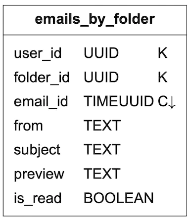

**查询 3：创建/删除/获取电子邮件**

由于篇幅限制，我们仅解释如何获取有关电子邮件的详细信息。表 3 中的两个表旨在支持此查询。简单查询如下所示：

```sql
SELECT * FROM emails_by_user WHERE email_id = 123;
```

一封电子邮件可以有多个附件，可以通过*email_id*和*filename*字段的组合来检索。

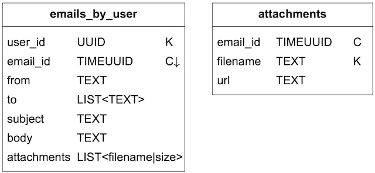

**查询 4：获取所有已读或未读的电子邮件**

如果我们的领域模型是关系数据库，那么获取所有已读电子邮件的查询将如下所示：

```sql
SELECT * FROM emails_by_folder
WHERE user_id = <user_id> and folder_id = <folder_id> and is_read = true
ORDER BY email_id;
```

获取所有未读电子邮件的查询看起来非常相似。我们只需要将上述查询中的“is_read = true”更改为“is_read = false”。

然而，我们的数据模型是为 NoSQL 设计的。NoSQL 数据库通常仅支持对分区和群集键的查询。由于*emails_by_folder*表中的*is_read*不属于这两个类型，因此大多数 NoSQL 数据库都会拒绝此查询。

解决此限制的一种方法是获取用户的整个文件夹并在应用程序中执行过滤。这对于小型电子邮件服务可能有效，但在我们的设计规模下效果不佳。

在 NoSQL 中，这个问题通常通过非规范化来解决。为了支持已读/未读查询，我们将*emails_by_folder*数据非规范化为两个表，如表 4 所示。

- read_emails：存储所有处于已读状态的电子邮件。
- unread_emails：存储所有未读状态的电子邮件。

要将未读电子邮件标记为已读，需要将该电子邮件从*unread_emails*中删除，然后插入到 read_emails 中。

要获取特定文件夹的所有未读电子邮件，我们可以运行如下查询：

```sql
SELECT * FROM unread_emails
WHERE user_id = <user_id> and folder_id = <folder_id>
ORDER BY email_id;
```

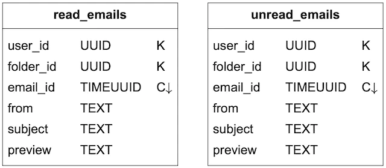

如上所示的非规范化是一种常见做法。它使应用程序代码更加复杂且更难维护，但它可以提高这些查询的大规模读取性能。

**加分点：对话主题**

线程是许多电子邮件客户端都支持的功能。它将电子邮件回复与其原始消息分组 [8]。这允许用户检索与一个对话相关的所有电子邮件。传统上，线程是使用 JWZ 算法 [18] 等算法实现的。我们不会详细介绍该算法，而只是解释其背后的核心思想。电子邮件标头通常包含以下三个字段：

```
{
  "headers" {
     "Message-Id": "<7BA04B2A-430C-4D12-8B57-862103C34501@gmail.com>",
     "In-Reply-To": "<CAEWTXuPfN=LzECjDJtgY9Vu03kgFvJnJUSHTt6TW@gmail.com>",
     "References": ["<7BA04B2A-430C-4D12-8B57-862103C34501@gmail.com>"]
  }
}
```

| 消息 ID | 消息ID的值，由客户端在发送消息时生成。 |
| :------ | :------------------------------------- |
| 回复    | 该消息回复的父 Message-Id。            |
| 参考    | 与某个主题相关的消息 ID 列表。         |

表 5 电子邮件标题

如果回复链中的所有消息都已预加载，则电子邮件客户端可以利用这些字段从消息中重建邮件对话。

#### 一致性权衡

依赖复制来实现高可用性的分布式数据库必须在一致性和可用性之间做出根本性的权衡。正确性对于电子邮件系统非常重要，因此在设计上我们希望任何给定的邮箱都有一个主邮箱。如果发生故障转移，客户端将无法访问邮箱，因此其同步/更新操作将暂停，直到故障转移结束。它以可用性换取一致性。

### 电子邮件传递率

设置邮件服务器并开始发送电子邮件很容易。困难的部分是将电子邮件真正发送到用户的收件箱。如果电子邮件最终进入垃圾邮件文件夹，则意味着收件人很可能不会阅读它。电子邮件垃圾邮件是一个大问题。根据 Statista [19] 的研究，发送的所有电子邮件中有 50% 以上是垃圾邮件。如果我们设置了新的邮件服务器，我们的电子邮件很可能会进入垃圾邮件文件夹，因为新的电子邮件服务器没有信誉。有几个因素需要考虑以提高电子邮件的送达率。

**专用 IP**。建议使用专用 IP 地址来发送电子邮件。电子邮件提供商不太可能接受来自没有历史记录的新 IP 地址的电子邮件。

**对电子邮件进行分类**。从不同的 IP 地址发送不同类别的电子邮件。例如，你可能希望避免从同一服务器发送营销和重要电子邮件，因为这可能会使 ISP 将所有电子邮件标记为促销电子邮件。

**电子邮件发件人信誉。**慢慢地预热新的电子邮件服务器 IP 地址以建立良好的信誉，因此 Office365、Gmail、Yahoo Mail 等大型提供商不太可能将我们的电子邮件放入垃圾邮件文件夹。根据 Amazon Simple Email Service [20] 的说法，预热新 IP 地址大约需要 2 到 6 周的时间。

**迅速禁止垃圾邮件发送者**。应迅速禁止垃圾邮件发送者，以免他们对服务器的声誉造成重大影响。

**反馈处理**。与 ISP 建立反馈回路非常重要，这样我们才能保持较低的投诉率并迅速禁止垃圾邮件帐户。如果电子邮件无法送达或用户投诉，则会出现以下结果之一：

- 硬退回。这意味着电子邮件被 ISP 拒绝，因为收件人的电子邮件地址无效。
- 软退回。软退回表示电子邮件由于临时情况（例如 ISP 太忙）而无法送达。
- 投诉。这意味着收件人点击了“举报垃圾邮件”按钮。

图 8 显示了收集和处理退回/投诉的过程。我们对软退回、硬退回和投诉使用单独的队列，以便可以单独管理它们。

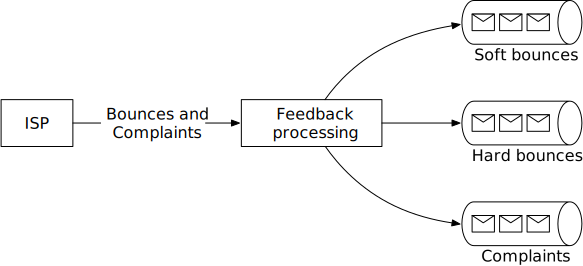

**电子邮件身份验证。**根据 Verizon 提供的 2018 年数据泄露调查报告，网络钓鱼和伪装占了违规行为的 93% [21]。打击网络钓鱼的一些常用技术包括：发件人策略框架 (SPF) [22]、域名密钥识别邮件 (DKIM) [23] 和基于域的消息认证、报告和一致性 (DMARC) [24]。

图 9 显示了 Gmail 邮件的示例标头。如你所见，发件人 @info6.citi.com 已通过 SPF、DKIM 和 DMARC 身份验证。

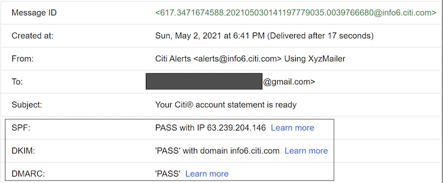

你不需要记住所有这些术语。重要的是要记住，让电子邮件按预期工作很难。它不仅需要领域知识，还需要与 ISP 建立良好的关系。

### 搜索

基本邮件搜索是指搜索主题或正文中包含任何输入关键字的电子邮件。更高级的功能包括按“发件人”、“主题”、“未读”或其他属性进行过滤。一方面，每当发送、接收或删除电子邮件时，我们都需要重新编制索引。另一方面，只有当用户按下“搜索”按钮时才会运行搜索查询。这意味着电子邮件系统中的搜索功能的写入次数远多于读取次数。与 Google 搜索相比，电子邮件搜索具有完全不同的特点，如表 6 所示。

|              | **范围**           | **排序**                                     | **准确性**                                                   |
| ------------ | ------------------ | -------------------------------------------- | ------------------------------------------------------------ |
| 谷歌搜索     | 整个互联网         | 按相关性排序                                 | 索引通常需要时间，因此某些项目可能不会立即显示在搜索结果中。 |
| 电子邮件搜索 | 用户自己的电子邮箱 | 按时间、是否包含附件、日期、未读等属性排序。 | 索引应该接近实时，并且结果必须准确。                         |

表 6 Google 搜索与电子邮件搜索

为了支持搜索功能，我们比较了两种方法：Elasticsearch 和嵌入在数据存储中的本机搜索。

**选项 1：Elasticsearch**

图 10 显示了使用 Elasticsearch 进行电子邮件搜索的高级设计。由于查询大多在用户自己的电子邮件服务器上执行，因此我们可以使用*user_id*作为分区键将底层文档分组到同一个节点。

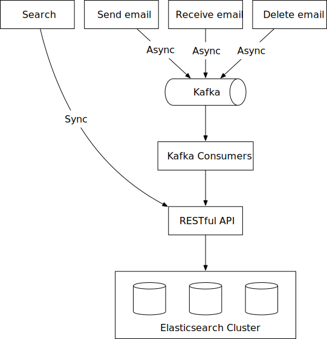

当用户点击“搜索”按钮时，用户会等待，直到收到搜索响应。搜索请求是同步的。当触发“发送电子邮件”、“接收电子邮件”或“删除电子邮件”等事件时，无需向客户端返回任何与搜索相关的内容。需要重新索引，这可以通过离线作业来完成。设计中使用 Kafka 来将触发重新索引的服务与实际执行重新索引的服务分离。

截至 2021 年 6 月，Elasticsearch 是最受欢迎的搜索引擎数据库 [25]，它非常支持电子邮件的全文搜索。添加 Elasticsearch 的一个挑战是让我们的主要电子邮件存储与其保持同步。中国最大的电子邮件提供商之一腾讯 QQ 电子邮件使用 Elasticsearch [26]。

**选项 2：自定义搜索解决方案**

大型电子邮件提供商通常会开发自己的自定义搜索引擎来满足其特定要求。设计电子邮件搜索引擎是一项非常复杂的任务，超出了本章的范围。这里我们只简要介绍磁盘 I/O 瓶颈，这是我们在自定义搜索引擎中面临的主要挑战。

粗略计算后发现，每天新增的元数据和附件大小都在PB级别，而一个邮箱账户中邮件数量动辄就超过50万封，索引服务器的主要瓶颈通常是磁盘I/O。

由于构建索引的过程写入繁重，因此一个好的策略可能是使用日志结构合并树 (LSM) [27] 来构造磁盘上的索引数据（图 11）。通过仅执行顺序写入来优化写入路径。LSM 树是 BigTable、Cassandra 和 RocksDB 等数据库背后的核心数据结构。当新电子邮件到达时，它首先被添加到 0 级内存缓存中，当内存中的数据大小达到预定义的阈值时，数据将合并到下一级。使用 LSM 的另一个原因是将经常更改的数据与不经常更改的数据分开。例如，电子邮件数据通常不会更改，但由于不同的过滤规则，文件夹信息往往会更频繁地更改。在这种情况下，我们可以将它们分成两个不同的部分，这样如果请求与文件夹更改有关，我们只会更改文件夹，而不会更改电子邮件数据。

如果你有兴趣了解有关电子邮件搜索的更多信息，强烈建议你了解一下 Microsoft Exchange 服务器中的搜索工作原理 [28]。

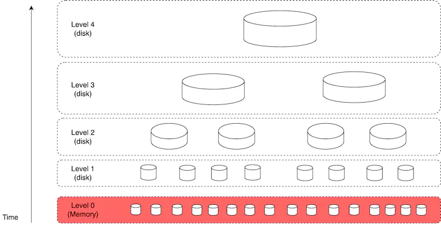

每种方法都有优点和缺点：

| **特征**     | **Elasticsearch**                                            | **自定义搜索引擎**                                     |
| :----------- | :----------------------------------------------------------- | :----------------------------------------------------- |
| 可扩展性     | 在一定程度上具有可扩展性。                                   | 由于我们可以针对电子邮件用例优化系统，因此更容易扩展。 |
| 系统复杂性   | 需要维护两个不同的系统：数据存储和Elasticsearch。            | 一个系统。                                             |
| 数据一致性   | 两个数据副本。一个在元数据数据存储中，另一个在 Elasticsearch 中。数据一致性很难维护。 | 元数据数据存储中的单一数据副本。                       |
| 可能丢失数据 | 否。如果发生故障，可以从主存储重建 Elasticsearch 索引。      | 不。                                                   |
| 开发工作     | 易于集成。为了支持大规模电子邮件搜索，可能需要专门的 Elasticsearch 团队。 | 开发自定义电子邮件搜索引擎需要大量的工程努力。         |

表 7 Elastic 搜索与自定义搜索引擎

一般经验法则是，对于规模较小的电子邮件系统，Elasticsearch 是一个不错的选择，因为它易于集成，并且不需要大量的工程工作。对于规模较大的电子邮件系统，Elasticsearch 可能有用，但我们可能需要一个专门的团队来开发和维护电子邮件搜索基础设施。为了支持 Gmail 或 Outlook 规模的电子邮件系统，最好在数据库中嵌入本机搜索，而不是采用单独的索引方法。

### 可扩展性和可用性

由于各个用户的数据访问模式彼此独立，我们预计系统中的大多数组件都是水平可扩展的。

为了提高可用性，数据在多个数据中心之间进行复制。用户与网络拓扑中物理上更接近他们的邮件服务器进行通信。在网络分区期间，用户可以访问来自其他数据中心的消息（图 12）。

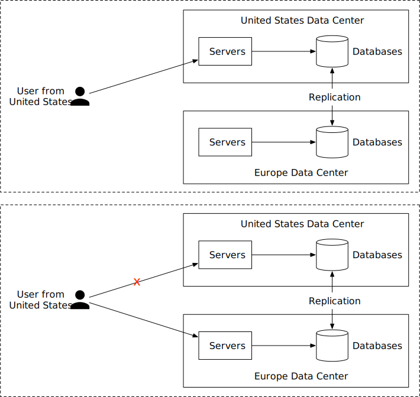

## 第 4 步 - 总结

在本章中，我们介绍了构建大型电子邮件服务器的设计。我们首先收集需求并进行了一些粗略计算，以便对规模有一个大致的了解。在高级设计中，我们讨论了传统电子邮件服务器的设计方式以及它们为什么不能满足现代用例。我们还讨论了电子邮件 API 以及发送和接收流程的高级设计。最后，我们深入探讨了元数据数据库设计、电子邮件传递能力、搜索和可扩展性。

如果面试结束时还有额外时间，以下是一些额外的谈话要点：

- 容错。系统的许多部分都可能出现故障，你可以讨论如何处理节点故障、网络问题、事件延迟等。
- 合规性。电子邮件服务在世界各地都可以使用，并且需要遵守法律法规。例如，我们需要以符合《通用数据保护条例》（GDPR）[29] 的方式处理和存储来自欧洲的个人身份信息 (PII)。合法拦截是该领域的另一个典型特征 [30]。
- 安全性。电子邮件安全非常重要，因为电子邮件包含敏感信息。Gmail 提供安全功能，例如网络钓鱼保护、安全浏览、主动警报、帐户安全、机密模式和电子邮件加密 [31]。
- 优化。有时，同一封电子邮件会发送给多个收件人，并且同一个电子邮件附件会在群发邮件的对象存储 (S3) 中存储多次。我们可以做的一项优化是在执行昂贵的保存操作之前检查存储中是否存在附件。

恭喜你走到这一步！现在给自己一点鼓励吧。干得好！

## 章节总结

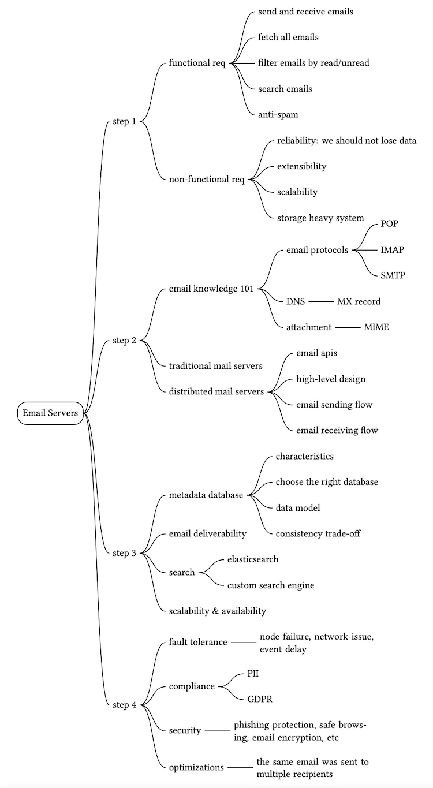

## 参考资料

[1] Gmail 活跃用户数量：https://financesonline.com/number-of-active-gmail-users/

[2] 展望：https://en.wikipedia.org/wiki/Outlook.com

[3] 2021 年每天发送多少封电子邮件？：https://review42.com/resources/how-many-emails-are-sent-per-day/

[4] RFC 1939 - 邮局协议 - 版本 3：http://www.faqs.org/rfcs/rfc1939.html

[5]ActiveSync：https://en.wikipedia.org/wiki/ActiveSync

[6] 邮件附件：https://en.wikipedia.org/wiki/Email_attachment

[7] MIME：https://en.wikipedia.org/wiki/MIME

[8] 线程：https://en.wikipedia.org/wiki/Conversation_threading

[9] 特殊用途邮箱的 IMAP LIST 扩展：https://datatracker.ietf.org/doc/html/rfc6154

[10] 阿帕奇詹姆斯：https://james.apache.org/

[11] WebSocket 的 JSON 元应用协议 (JMAP) 子协议：https://tools.ietf.org/id/draft-ietf-jmap-websocket-07.html#RFC7692

[12] Cassandra 的局限性：https://cwiki.apache.org/confluence/display/CASSANDRA2/CassandraLimitations

[13]倒排索引：https://en.wikipedia.org/wiki/Inverted_index

[14] 指数退避：https://en.wikipedia.org/wiki/Exponential_backoff

[15] QQ邮箱系统优化：https://www.slideshare.net/areyouok/06-qq-5431919

[16] IOPS：https://en.wikipedia.org/wiki/IOPS

[17] UUID 和 timeuuid 类型：https://docs.datastax.com/en/cql-oss/3.3/cql/cql_reference/uuid_type_r.html

[18] 消息线程：https://www.jwz.org/doc/threading.html

[19] 全球垃圾邮件数量：https://www.statista.com/statistics/420391/spam-email-traffic-share/

[20] 预热专用 IP 地址：https://docs.aws.amazon.com/ses/latest/dg/dedicated-ip-warming.html

[21] 2018 年数据泄露调查报告：https://enterprise.verizon.com/resources/reports/DBIR_2018_Report.pdf

[22] 发件人策略框架：https://en.wikipedia.org/wiki/Sender_Policy_Framework

[23] DomainKeys 识别邮件：https://en.wikipedia.org/wiki/DomainKeys_Identified_Mail

[24] 基于域的消息认证、报告和一致性：https://dmarc.org/

[25] DB-Engines 搜索引擎排名：https://db-engines.com/en/ranking/search+engine

[26] 重构实践：基于腾讯云Elasticsearch构建QQ邮箱全文搜索：https://www.programmersought.com/article/24097547237/

[27] 对数结构合并树：https://en.wikipedia.org/wiki/Log-structured_merge-tree

[28] Microsoft Exchange Conference 2014 在 Exchange 中搜索：[https://www.youtube.com/watch?v =5EXGCSzzQak&t=2173s](https://www.youtube.com/watch?v=5EXGCSzzQak&t=2173s)

[29]通用数据保护条例：https://en.wikipedia.org/wiki/General_Data_Protection_Regulation

[30] 合法拦截：https://en.wikipedia.org/wiki/Lawful_interception

[31] 电子邮件安全：https://safety.google/intl/en_us/gmail/