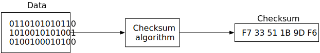

在本章中，我们设计了一个类似于 Amazon Simple Storage Service (S3) 的对象存储服务。S3 是 Amazon Web Services (AWS) 提供的一项服务，通过基于 RESTful API 的接口提供对象存储。以下是有关 AWS S3 的一些事实：

- 2006 年 6 月推出。
- S3 在 2010 年添加了版本控制、存储桶策略和分段上传支持。
- S3 在 2011 年添加了服务器端加密、多对象删除和对象过期功能。
- 亚马逊报告称，截至 2013 年，S3 中存储的对象数量已达 2 万亿。
- 生命周期策略、事件通知和跨区域复制支持于 2014 年和 2015 年推出。
- 亚马逊报告称，到 2021 年，S3 中存储的对象将超过 100 万亿个。

在深入研究对象存储之前，让我们首先回顾一下存储系统并定义一些术语。

## 存储系统 101

从高层次来看，存储系统分为三类：

- 块存储
- 文件存储
- 对象存储

**块存储**

块存储最早出现于 20 世纪 60 年代。物理连接到服务器的常见存储设备（如硬盘驱动器 (HDD) 和固态驱动器 (SSD)）都被视为块存储。

块存储将原始块作为卷呈现给服务器。这是最灵活、用途最广泛的存储形式。服务器可以格式化原始块并将其用作文件系统，也可以将这些块的控制权交给应用程序。某些应用程序（如数据库或虚拟机引擎）会直接管理这些块，以充分利用它们的性能。

块存储并不局限于物理连接的存储。块存储可以通过高速网络或行业标准连接协议（如光纤通道 (FC) [1] 和 iSCSI [2]）连接到服务器。从概念上讲，网络连接块存储仍然呈现原始块。对于服务器来说，它的工作方式与物理连接的块存储相同。

**文件存储**

文件存储建立在块存储之上。它提供了更高级别的抽象，使处理文件和目录变得更加容易。数据以文件的形式存储在分层目录结构下。文件存储是最常见的通用存储解决方案。大量服务器可以使用常见的文件级网络协议（如 SMB/CIFS [3] 和 NFS [4]）访问文件存储。访问文件存储的服务器无需处理管理块、格式化卷等复杂问题。文件存储的简单性使其成为在组织内共享大量文件和文件夹的绝佳解决方案。

**对象存储**

对象存储是一种新事物。它经过深思熟虑，牺牲了性能，以换取高耐用性、大规模和低成本。它针对相对“冷”的数据，主要用于存档和备份。对象存储将所有数据作为对象存储在平面结构中。没有分层目录结构。数据访问通常通过 RESTful API 提供。与其他存储类型相比，它相对较慢。大多数公共云服务提供商都提供对象存储产品，例如 AWS S3、Google 对象存储和 Azure blob 存储。

**比较**


表 1 比较了块存储、文件存储和对象存储。

| **块存储** | **文件存储**                        | **对象存储**                  |                                       |
| ---------- | ----------------------------------- | ----------------------------- | ------------------------------------- |
| 可变内容   | 是                                  | 是                            | N（支持对象版本控制，不支持就地更新） |
| 成本       | 高的                                | 中至高                        | 低的                                  |
| 表现       | 中至高，非常高                      | 中至高                        | 低至中等                              |
| 一致性     | 强一致性                            | 强一致性                      | 强一致性 [5]                          |
| 数据访问   | SAS [6]/iSCSI/FC                    | 标准文件访问、CIFS/SMB 和 NFS | REST 风格的 API                       |
| 可扩展性   | 中等可扩展性                        | 高可扩展性                    | 高度可扩展                            |
| 适合       | 虚拟机 (VM)、数据库等高性能应用程序 | 通用文件系统访问              | 二进制数据、非结构化数据              |

表 1 存储选项

### 术语

要设计类似 S3 的对象存储，我们首先需要了解一些核心的对象存储概念。本节概述了适用于对象存储的术语。

**存储桶**。对象的逻辑容器。存储桶名称是全局唯一的。要将数据上传到 S3，我们必须先创建一个存储桶。

**对象**。对象是我们存储在存储桶中的单个数据。它包含对象数据（也称为有效负载）和元数据。对象数据可以是我们想要存储的任何字节序列。元数据是一组描述对象的名称-值对。

**版本控制**。将对象的多个变体保存在同一存储桶中的功能。此功能在存储桶级别启用。此功能使用户能够恢复意外删除或覆盖的对象。

**统一资源标识符 (URI)**。对象存储提供 RESTful API 来访问其资源，即存储桶和对象。每个资源都由其 URI 唯一标识。

**服务级别协议 (SLA)**。服务级别协议是服务提供商与客户之间的合同。例如，Amazon S3 标准 - 不频繁访问存储类提供以下 SLA [7]：

- 设计旨在实现跨多个可用区域的对象 99.999999999% 的耐用性。
- 即使整个可用区域遭到破坏，数据仍然具有弹性。
- 设计可用性达 99.9%。

## 步骤 1 - 了解问题并确定设计范围

以下问题有助于明确要求并缩小范围。

**候选人**：设计中应该包含哪些功能？
**面试官**：我们希望你设计一个类似 S3 的对象存储系统，具有以下功能：

- 存储桶创建。
- 对象的上传和下载。
- 对象版本控制。
- 列出存储桶中的对象。它类似于“aws s3 ls”命令 [8]。

**候选人**：典型的数据大小是多少？
**面试官**：我们需要高效地存储海量对象（几GB或更多）和大量小对象（几十KB）。

**候选人**：我们一年需要存储多少数据？
**面试官**：100PB（PB）。

**候选人**：我们能否假设数据持久性为 6 个 9 (99.9999%)，服务可用性为 4 个 9 (99.99%)？
**面试官**：是的，这听起来很合理。

### 非功能性需求

- 100 PB 数据
- 数据持久性达到 6 个 9
- 服务可用性达到 4 个 9
- 存储效率。降低存储成本，同时保持高可靠性和性能。

### 信封背面估计

对象存储很可能在磁盘容量或每秒磁盘输入/输出 (IOPS) 方面存在瓶颈。我们来看一下。

- 磁盘容量。假设对象遵循以下分布：
  - 所有对象中有 20% 是小对象（小于 1MB）。
  - 60％的对象是中等大小的对象（1MB~64MB）。
  - 20％是大对象（大于 64MB）。
- IOPS。我们假设一块硬盘（SATA 接口，7200 rpm）每秒可以进行 100~150 次随机寻道（100-150 IOPS）。

根据这些假设，我们可以估算系统可以保留的对象总数。为了简化计算，我们使用每种对象类型的中值大小（小对象为 0.5MB，中型对象为 32MB，大型对象为 200MB）。40% 的存储使用率可得出：

- 100 PB = 100*1000*1000*1000 MB = 10^11 MB
- 10^11*0.4/(0.2*0.5MB+0.6*32MB+0.2*200MB)=6.8亿个对象。
- 如果我们假设一个对象的元数据大小约为 1KB，则我们需要 0.68 TB 的空间来存储所有元数据信息。

即使我们可能不会使用这些数字，但对系统的规模和约束有一个大致的了解也是有益的。

## 第 2 步 - 提出高层设计并获得认可

在深入研究设计之前，让我们先探讨一下对象存储的一些有趣属性，因为它们可能会影响它。

**对象不可变性**。对象存储与其他两种类型的存储系统之间的主要区别之一是，存储在对象存储中的对象是不可变的。我们可以删除它们或用新版本完全替换它们，但我们不能进行增量更改。

**键值存储**。我们可以使用对象 URI 来检索对象数据（清单 1）。对象 URI 是键，对象数据是值。

```html
Request:
GET /bucket1/object1.txt HTTP/1.1

Response:
HTTP/1.1 200 OK
Content-Length: 4567

[4567 bytes of object data]
```

清单 1 使用对象 URI 检索对象数据

**一次写入，多次读取**。对象数据的数据访问模式是一次写入，多次读取。根据 LinkedIn 的研究，95% 的请求都是读取操作 [9]。

**同时支持小物体和大物体**。物体尺寸可能不同，我们需要同时支持两者。

对象存储的设计理念与 UNIX 文件系统非常相似。在 UNIX 中，当我们在本地文件系统中保存文件时，它不会将文件名和文件数据一起保存。相反，文件名存储在名为“inode” [10] 的数据结构中，而文件数据存储在不同的磁盘位置。inode 包含指向文件数据的磁盘位置的文件块指针列表。当我们访问本地文件时，我们首先获取 inode 中的元数据。然后，我们通过跟踪文件块指针到实际的磁盘位置来读取文件数据。

对象存储的工作原理类似。inode 成为存储所有对象元数据的元数据存储库。硬盘成为存储对象数据的数据存储。在 UNIX 文件系统中，inode 使用文件块指针来记录数据在硬盘上的位置。在对象存储中，元数据存储库使用对象的 ID 通过网络请求在数据存储中查找相应的对象数据。图 2 显示了 UNIX 文件系统和对象存储。


分离元数据和对象数据简化了设计。数据存储包含不可变数据，而元数据存储包含可变数据。这种分离使我们能够独立实现和优化这两个组件。图 3 显示了存储桶和对象的样子。


### 高层设计

图 4 显示了高级设计。


让我们逐一介绍一下各个组件。

**负载均衡器**。在多个 API 服务器之间分配 RESTful API 请求。

**API 服务**。协调对身份和访问管理服务、元数据服务和存储的远程过程调用。此服务是无状态的，因此可以水平扩展。

**身份和访问管理 (IAM)**。处理身份验证、授权和访问控制的中心位置。身份验证可验证你的身份，而授权可验证根据你的身份你可以执行哪些操作。

**数据存储**。存储和检索实际数据。所有与数据相关的操作均基于对象 ID（UUID）。

**元数据存储**。存储对象的元数据。

请注意，元数据和数据存储只是逻辑组件，有多种实现方式。例如，在 Ceph 的 Rados Gateway [11] 中，没有独立的元数据存储。所有内容（包括对象存储桶）都作为一个或多个 Rados 对象持久化。

现在我们对高层设计有了基本的了解，让我们探索对象存储中一些最重要的工作流程。

- 正在上传对象。
- 正在下载对象。
- 对象版本控制和列出存储桶中的对象。它们将在“深入探究”部分中解释。

### 上传对象


对象必须驻留在存储桶中。在此示例中，我们首先创建一个名为“bucket-to-share”的存储桶，然后将一个名为“script.txt”的文件上传到存储桶。图 5 以 7 个步骤说明了此流程的工作原理。

1. 客户端发送 HTTP PUT 请求来创建一个名为“bucket-to-share”的存储桶。该请求被转发到 API 服务。
2. API 服务调用 IAM 来确保用户被授权并具有写权限。
3. API 服务调用元数据存储，在元数据数据库中创建一个包含 bucket 信息的条目。创建条目后，将向客户端返回成功消息。
4. 创建存储桶后，客户端发送HTTP PUT请求来创建名为“script.txt”的对象。
5. API 服务验证用户的身份并确保用户对存储桶具有写权限。
6. 验证成功后，API 服务会将 HTTP PUT 负载中的对象数据发送到数据存储。数据存储将负载作为对象持久化，并返回该对象的 UUID。
7. API 服务调用元数据存储，在元数据数据库中创建新条目。它包含重要的元数据，例如 object_id (UUID)、bucket_id（对象属于哪个 bucket）、object_name 等。表 2 显示了一个示例条目。

| **对象名称** | **对象 ID**                          | **bucket_id**                        |
| ------------ | ------------------------------------ | ------------------------------------ |
| 脚本.txt     | 239D5866-0052-00F6-014E-C914E61ED42B | 82AA1B2E-F599-4590-B5E4-1F51AAE5F7E4 |

表 2 样本条目

上传对象的 API 可能如下所示：

```html
PUT /bucket-to-share/script.txt HTTP/1.1
Host: foo.s3example.org
Date: Sun, 12 Sept 2021 17:51:00 GMT
Authorization: authorization string
Content-Type: text/plain
Content-Length: 4567
x-amz-meta-author: Alex

[4567 bytes of object data]
```

清单 2 上传对象

### 下载对象

存储桶没有目录层次结构。但是，我们可以通过将存储桶名称和对象名称连接起来来创建逻辑层次结构，以模拟文件夹结构。例如，我们将对象命名为“bucket-to-share/script.txt”，而不是“script.txt”。要获取对象，我们在 GET 请求中指定对象名称。下载对象的 API 如下所示：

```html
GET /bucket-to-share/script.txt HTTP/1.1
Host: foo.s3example.org
Date: Sun, 12 Sept 2021 18:30:01 GMT
Authorization: authorization string
```


如前所述，数据存储不存储对象的名称，它仅支持通过 object_id（UUID）进行对象操作。为了下载对象，我们首先将对象名称映射到 UUID。下载对象的工作流程如下所示：

1. 客户端向负载均衡器发送 HTTP GET 请求：GET /bucket-to-share/script.txt
2. API 服务查询 IAM 以验证用户是否具有对存储桶的读取访问权限。
3. 一旦验证，API 服务就会从元数据存储中获取相应对象的 UUID。
4. 接下来，API 服务通过 UUID 从数据存储中获取对象数据。
5. API 服务通过 HTTP GET 响应将对象数据返回给客户端。

## 步骤 3 - 深入设计

在本节中，我们将深入探讨以下几个领域：

- 数据存储
- 元数据数据模型
- 列出存储桶中的对象
- 对象版本控制
- 优化大文件上传
- 垃圾收集

### 数据存储

让我们仔细看看数据存储的设计。如前所述，API 服务处理来自用户的外部请求并调用不同的内部服务来满足这些请求。为了持久化或检索对象，API 服务会调用数据存储。图 7 显示了 API 服务和数据存储之间用于上传和下载对象的交互。


#### 数据存储的高级设计

数据存储有三个主要组件，如图 8 所示。


**数据路由服务**

数据路由服务提供 RESTful 或 gRPC [12] API 来访问数据节点集群。它是一种无状态服务，可以通过添加更多服务器进行扩展。此服务具有以下职责：

- 查询放置服务以获取最佳数据节点来存储数据。
- 从数据节点读取数据并将其返回给API服务。
- 将数据写入数据节点。

**安置服务**

放置服务确定应选择哪些数据节点（主节点和副本节点）来存储对象。它维护一个虚拟集群映射，该映射提供集群的物理拓扑。虚拟集群映射包含每个数据节点的位置信息，放置服务使用这些信息来确保副本在物理上是分开的。这种分离是高耐久性的关键。有关详细信息，请参阅下面的“耐久性”部分。图 9 显示了虚拟集群映射的示例。


放置服务通过心跳持续监控所有数据节点。如果某个数据节点在可配置的 15 秒宽限期内未发送心跳，则放置服务会在虚拟集群图中将该节点标记为“关闭”。

这是一项关键服务，因此我们建议使用 Paxos [13] 或 Raft [14] 共识协议构建一个由 5 个或 7 个放置服务节点组成的集群。共识协议确保只要超过一半的节点健康，整个服务就能继续工作。例如，如果放置服务集群有 7 个节点，它可以容忍 3 个节点故障。要了解有关共识协议的更多信息，请参阅参考资料 [13] [14]。

**数据节点**

数据节点存储实际的对象数据。它通过将数据复制到多个数据节点（也称为复制组）来确保可靠性和耐用性。

每个数据节点上都运行着一个数据服务守护进程。数据服务守护进程不断向放置服务发送心跳。心跳消息包含以下基本信息：

- 数据节点管理多少个磁盘驱动器（HDD 或 SSD）？
- 每个驱动器上存储了多少数据？

当放置服务第一次接收到心跳时，它会为该数据节点分配一个ID，将其添加到虚拟集群图中，并返回以下信息：

- 数据节点的唯一 ID
- 虚拟集群图
- 在哪里复制数据

#### 数据持久化流程


现在我们看一下数据是如何在数据节点中持久化的。

1. API 服务将对象数据转发到数据存储。
2. 数据路由服务为该对象生成一个 UUID，并向放置服务查询用于存储该对象的数据节点。放置服务检查虚拟集群图并返回主数据节点。
3. 数据路由服务将数据连同其 UUID 一起直接发送到主数据节点。
4. 主数据节点将数据保存在本地，并复制到两个从数据节点，当数据成功复制到所有从节点后，主节点响应数据路由服务。
5. 对象的UUID（ObjId）返回给API服务。

在步骤 2 中，给定对象的 UUID 作为输入，放置服务将返回对象的复制组。放置服务如何做到这一点？请记住，此查找必须是确定性的，并且必须在添加或删除复制组后继续存在。一致性哈希是此类查找函数的常见实现。有关更多信息，请参阅 [15]。

在步骤 4 中，主数据节点在返回响应之前将数据复制到所有辅助节点。这使得所有数据节点之间的数据具有高度一致性。这种一致性伴随着延迟成本，因为我们必须等到最慢的副本完成。图 11 显示了一致性和延迟之间的权衡。


1. 三个节点都保存完数据才算保存成功，这种方式一致性最好，但是延迟也最高。
2. 当主服务器和其中一个辅助服务器存储数据后，数据即被视为成功保存。此方法具有中等一致性和中等延迟。
3. 主节点持久化数据后才认为数据保存成功，这种方式一致性最差，但延迟最低。

2和3都是最终一致性的形式。

#### 数据的组织方式

现在让我们看看每个数据节点如何管理数据。一个简单的解决方案是将每个对象存储在一个独立的文件中。这种方法可行，但当小文件过多时，性能会受到影响。当文件系统上有太多小文件时，会出现两个问题。首先，它会浪费许多数据块。文件系统将文件存储在离散的磁盘块中。磁盘块的大小相同，并且在初始化卷时大小是固定的。典型的块大小约为 4 KB。对于小于 4 KB 的文件，它仍会占用整个磁盘块。如果文件系统包含大量小文件，则会浪费大量磁盘块，每个磁盘块只能容纳一个小文件。

其次，它可能超出系统的 inode 容量。文件系统将文件的位置和其他信息存储在一种称为 inode 的特殊块中。对于大多数文件系统，在初始化磁盘时 inode 的数量是固定的。对于数百万个小文件，它冒着耗尽所有 inode 的风险。此外，即使积极缓存文件系统元数据，操作系统也无法很好地处理大量 inode。出于这些原因，将小对象存储为单个文件在实践中效果不佳。

为了解决这些问题，我们可以将许多小对象合并到一个更大的文件中。从概念上讲，它的工作原理类似于预写日志 (WAL)。当我们保存一个对象时，它会被附加到现有的读写文件中。当读写文件达到其容量阈值（通常设置为几 GB）时，读写文件将被标记为只读，并创建一个新的读写文件来接收新对象。一旦文件被标记为只读，它就只能处理读取请求。图 12 解释了这个过程的工作原理。


请注意，对读写文件的写入访问必须序列化。如图 12 所示，对象按顺序一个接一个地存储在读写文件中。为了保持这种磁盘布局，并行处理传入写入请求的多个核心必须轮流写入读写文件。对于具有大量并行处理许多传入请求的核心的现代服务器，这严重限制了写入吞吐量。为了解决这个问题，我们可以提供专用的读写文件，每个处理传入请求的核心一个。

#### 对象查找

每个数据文件包含许多小对象，数据节点如何通过 UUID 定位对象？数据节点需要以下信息：

- 包含对象的数据文件
- 对象在数据文件中的起始偏移量
- 物体的大小

支持此查找的数据库模式如表 3 所示。


| **场地**   | **描述**             |
| ---------- | -------------------- |
| 对象 ID    | 对象的 UUID          |
| 文件名     | 包含对象的文件的名称 |
| 起始偏移量 | 文件中对象的起始地址 |
| 对象大小   | 对象中的字节数       |

表 4 Object_mapping 字段

我们考虑了两种存储此映射的选项：基于文件的键值存储（例如 RocksDB [16]）或关系数据库。RocksDB 基于 SSTable [17]，写入速度快但读取速度慢。关系数据库通常使用基于 B+ 树 [18] 的存储引擎，读取速度快但写入速度慢。如前所述，数据访问模式是一次写入多次读取。由于关系数据库提供更好的读取性能，因此它是比 RocksDB 更好的选择。

我们应该如何部署这个关系数据库？在我们的规模下，映射表的数据量非常庞大。部署一个大型集群来支持所有数据节点是可行的，但很难管理。请注意，此映射数据在每个数据节点内都是隔离的。无需在数据节点之间共享。要利用此属性，我们可以在每个数据节点上部署一个简单的关系数据库。SQLite [19] 是一个不错的选择。它是一个基于文件的关系数据库，声誉良好。

#### 更新了数据持久性流程

由于我们对数据节点做了相当多的更改，让我们重新看一下如何在数据节点中保存一个新对象（图13）。

1. API 服务发送请求以保存名为“对象 4”的新对象。
2. 数据节点服务将名为“object 4”的对象附加到名为“/data/c”的读写文件末尾。
3. *在object_mapping*表中插入了新的“对象 4”记录。
4. 数据节点服务将UUID返回给API服务。


#### 耐用性

数据可靠性对于数据存储系统来说极其重要。我们如何才能创建一个提供 6 个 9 耐用性的存储系统？必须仔细考虑每个故障情况，并正确复制数据。

##### 硬件故障及故障域

无论我们使用哪种介质，硬盘故障都是不可避免的。某些存储介质的耐用性可能优于其他介质，但我们不能依赖单个硬盘来实现我们的耐用性目标。提高耐用性的一种行之有效的方法是将数据复制到多个硬盘上，这样单个磁盘故障就不会影响整个数据的可用性。在我们的设计中，我们将数据复制三次。

假设旋转硬盘的年故障率为 0.81% [20]。这个数字在很大程度上取决于型号和制造商。制作 3 份数据副本可获得 1-(0.0081)^3=~0.999999 的可靠性。这是一个非常粗略的估计。有关更复杂的计算，请阅读 [20]。

为了进行完整的耐久性评估，我们还需要考虑不同故障域的影响。故障域是环境中的物理或逻辑部分，当关键服务遇到问题时，它会受到负面影响。在现代数据中心，服务器通常被放入机架 [21]，机架按行/楼层/房间分组。由于每个机架共享网络交换机和电源，因此机架中的所有服务器都位于机架级故障域中。现代服务器共享主板、处理器、电源、硬盘驱动器等组件。服务器中的组件位于节点级故障域中。

这是大规模故障域隔离的一个很好的例子。通常，数据中心将不共享任何内容的基础设施划分为不同的可用区 (AZ)。我们将数据复制到不同的可用区以最大限度地减少故障影响（图 14）。请注意，故障域级别的选择不会直接提高数据的持久性，但它会在极端情况下提高可靠性，例如大规模停电、冷却系统故障、自然灾害等。


##### 擦除编码

制作三份完整的数据副本可让我们获得大约 6 个 9 的数据持久性。还有其他选项可以进一步提高持久性吗？是的，擦除编码就是其中一种选择。擦除编码 [22] 以不同的方式处理数据持久性。它将数据分块成更小的块（放置在不同的服务器上），并创建奇偶校验以实现冗余。如果发生故障，我们可以使用块数据和奇偶校验来重建数据。让我们看一个具体的示例（4 + 2 擦除编码），如图 15 所示。


1. 数据被分成四个均等大小的数据块 d1、d2、d3 和 d4。
2. 数学公式 [23] 用于计算奇偶校验 p1 和 p2。举一个更简化的例子，p1 = d1 + 2*d2 - d3 + 4*d4 和 p2 = -d1 + 5*d2 + d3 - 3*d4 [24]。
3. 由于节点崩溃，数据 d3 和 d4 丢失。
4. 利用数学公式，利用已知的 d1、d2、p1 和 p2 值，重建丢失的数据 d3 和 d4。

让我们看一下图 16 所示的另一个示例，以便更好地理解纠删码如何与故障域配合使用。 (8+4) 纠删码设置将原始数据均匀分成 8 个块并计算 4 个奇偶校验。所有 12 个数据块的大小相同。所有 12 个数据块分布在 12 个不同的故障域中。纠删码背后的数学原理确保当最多 4 个节点发生故障时可以重建原始数据。


与数据路由器只需从一个健康节点读取对象数据的复制相比，在纠删码中，数据路由器必须从至少 8 个健康节点读取数据。这是一种架构设计权衡。我们使用更复杂且访问速度较慢的解决方案，以换取更高的耐用性和更低的存储成本。对于主要成本是存储的对象存储，这种权衡可能是值得的。

纠删码需要多少额外空间？每两个数据块，我们需要一个奇偶校验块，因此存储开销为 50%（图 17）。而在 3 副本复制中，存储开销为 200%（图 17）。


纠删码能提高数据耐久性吗？假设一个节点的年故障率为 0.81%。根据 Backblaze [20] 的计算，纠删码可以实现 11 个 9 的耐久性。计算需要复杂的数学运算。如果你有兴趣，请参阅 [20] 了解详细信息。

表 5 比较了复制和擦除编码的优缺点。

|          | **复制**                                                     | **擦除编码**                                                 |
| -------- | ------------------------------------------------------------ | ------------------------------------------------------------ |
| 耐久性   | 6 个 9 的耐用性（数据复制 3 次）                             | 11 个 9 的耐久性（8+4 擦除编码）。**擦除编码胜出**。         |
| 存储效率 | 200% 的存储开销。                                            | 50% 的存储开销。**纠删码胜出**。                             |
| 计算资源 | 无需计算。**复制获胜。**                                     | 更高程度地利用计算资源来计算奇偶校验。                       |
| 写入性能 | 将数据复制到多个节点。无需计算。 **复制获胜。**              | 增加了写入延迟，因为我们需要在将数据写入磁盘之前计算奇偶校验。 |
| 读取性能 | 在正常运行中，读取由同一副本提供。故障模式下的读取不受影响，因为读取可由无故障副本提供。**复制胜出。** | 在正常运行中，每次读取都必须来自集群中的多个节点。故障模式下的读取速度较慢，因为必须先重建丢失的数据。 |

表 5 复制与纠删码

总之，复制在延迟敏感型应用中被广泛采用，而擦除编码通常用于最小化存储成本。擦除编码因其成本效益和耐用性而具有吸引力，但它极大地复杂化了数据节点设计。因此，对于此设计，我们主要关注复制。

#### 正确性验证

擦除编码可以在存储成本相当的情况下提高数据持久性。现在我们可以继续解决另一个难题：数据损坏。

如果磁盘完全失效，且可以检测到故障，则可以将其视为数据节点故障。在这种情况下，我们可以使用擦除编码重建数据。然而，内存数据损坏在大型系统中很常见。

可以通过在进程边界之间验证校验和 [25] 来解决此问题。校验和是用于检测数据错误的小数据块。图 18 说明了校验和的生成方式。



如果我们知道原始数据的校验和，我们就可以计算传输后的数据的校验和：

- 如果它们不同，则数据已损坏。
- 如果它们相同，则数据未损坏的可能性非常高。可能性不是 100%，但在实践中，我们可以假设它们是相同的。


校验和算法有很多，例如 MD5 [26]、SHA1[27]、HMAC [28] 等。好的校验和算法通常即使输入发生很小的变化，也会输出明显不同的值。在本章中，我们选择一种简单的校验和算法，例如 MD5。

在我们的设计中，我们在每个对象的末尾附加校验和。在将文件标记为只读之前，我们在末尾添加整个文件的校验和。图 20 显示了布局。


采用（8+4）擦除编码和校验和验证后，读取数据时会发生以下情况：

1. 获取对象数据和校验和。

2. 根据收到的数据计算校验和。

   （a）. 如果两个校验和匹配，则数据没有错误。

   (b). 如果校验和不同，则数据已损坏。我们将尝试通过从其他故障域读取数据来恢复。

3. 重复步骤 1 和 2，直到返回所有 8 条数据。然后我们重建数据并将其发送回客户端。

### 元数据数据模型

在本节中，我们首先讨论数据库模式，然后深入研究数据库的扩展。

##### 架构

数据库模式需要支持以下 3 个查询：

查询 1：通过对象名称查找对象 ID。

查询2：根据对象名称插入和删除对象。

查询 3：列出存储桶中具有相同前缀的对象。

图 21 显示了架构设计。我们需要两个数据库表：bucket 和 object。


##### 扩展 bucket 表

由于用户可以创建的存储桶数量通常有限制，因此存储桶表的大小很小。假设我们有 100 万个客户，每个客户拥有 10 个存储桶，每条记录占用 1 KB。这意味着我们需要 10 GB（100 万 * 10 * 1KB）的存储空间。整个表可以轻松装入现代数据库服务器中。但是，单个数据库服务器可能没有足够的 CPU 或网络带宽来处理所有读取请求。如果是这样，我们可以将读取负载分散到多个数据库副本之间。

##### 缩放对象表

对象表保存对象元数据。我们设计规模的数据集可能不适合单个数据库实例。我们可以通过分片来扩展对象表。

*一种选择是按bucket_id*进行分片，这样同一存储桶下的所有对象都存储在一个分片中。这行不通，因为它会导致热点分片，因为一个存储桶可能包含数十亿个对象。

另一个选项是按*object_id*进行分片。这种分片方案的好处是可以均匀分布负载。但是我们将无法高效地执行查询 1 和查询 2，因为这两个查询都是基于 URI 的。

*我们选择使用bucket_name*和*object_name*的组合进行分片。这是因为大多数元数据操作都是基于对象 URI 的，例如通过 URI 查找对象 ID，或者通过 URI 上传对象。为了均匀分布数据，我们可以使用 ( *bucket_name* , *object_name)*的哈希作为分片键。

使用这种分片方案，很容易支持前两个查询，但最后一个查询就不那么明显了。我们来看看。

### 列出存储桶中的对象

对象存储以平面结构排列文件，而不是像文件系统那样采用层次结构。可以使用以下格式的路径访问对象：*s3://bucket-name/object-name。*例如，*s3://mybucket/abc/d/e/f/file.txt*包含：

- 存储桶名称：mybucket
- 对象名称：abc/d/e/f/file.txt

为了帮助用户在存储桶中组织对象，S3 引入了一个名为“前缀”的概念。前缀是对象名称开头的字符串。S3 使用前缀以类似于目录的方式组织数据。但是，前缀不是目录。按前缀列出存储桶会将结果限制为仅以前缀开头的对象名称。

在上面的示例中，路径为*s3://mybucket/abc/d/e/f/file.txt*，前缀是*abc/d/e/f/。*

AWS S3 列表命令有 3 种典型用途：

1. 列出用户拥有的所有存储桶。命令如下：

   ```sh
   aws s3 list-buckets
   ```

2. 列出存储桶中与指定前缀同级的所有对象。命令如下：

   ```sh
   aws s3 ls s3://mybucket/abc/
   ```

   在此模式下，名称中前缀后带有更多斜杠的对象将汇总为一个通用前缀。例如，存储桶中的这些对象：

   ```sh
   CA/cities/losangeles.txt
   CA/cities/sanfranciso.txt
   NY/cities/ny.txt
   federal.txt
   ```

   列出带有“/”前缀的存储桶将返回以下结果，其中将汇总 CA/ 和 NY/ 下的所有内容：

   CA/ NY/ 联邦.txt

3. 以递归方式列出存储桶中具有相同前缀的所有对象。命令如下所示：

   ```sh
   aws s3 ls s3://mybucket/abc/ --recursive
   ```

   使用与上述相同的示例，列出带有`CA/`前缀的存储桶将返回以下结果：

   ```sh
   CA/cities/losangeles.txt
   CA/cities/sanfranciso.txt
   ```

#### 单一数据库

首先，我们来探索如何使用单个数据库支持 listing 命令。要列出用户拥有的所有 bucket，我们运行以下查询：

```sql
SELECT * FROM bucket WHERE owner_id={id}
```

为了列出存储桶中共享相同前缀的所有对象，我们运行如下查询。

```sql
SELECT * FROM object WHERE bucket_id = "123" AND object_name LIKE `abc/%`
```

在此示例中，我们查找 bucket_id 等于“123”且共享前缀“abc/”的所有对象。任何在指定前缀后名称中带有更多斜杠的对象都会被汇总到应用程序代码中，如前面用例 2 中所述。

相同的查询将支持递归列表模式，如前面用例 3 中所述。应用程序代码将列出共享相同前缀的每个对象，而无需执行任何汇总。

#### 分布式数据库

当元数据表被分片时，很难实现列表功能，因为我们不知道哪些分片包含数据。最明显的解决方案是对所有分片运行搜索查询，然后汇总结果。为了实现这一点，我们可以执行以下操作：

1. 元数据服务通过运行以下查询来查询每个分片：

   ```sql
   SELECT * FROM object WHERE bucket_id = “123” AND object_name LIKE `a/b/%`
   ```

2. 元数据服务聚合从每个分片返回的所有对象并将结果返回给调用者。

此解决方案有效，但实现分页有点复杂。在解释原因之前，让我们回顾一下单个数据库的简单情况下分页的工作原理。要返回每页包含 10 个对象的列表页面，SELECT 查询应以此开头：

```sql
SELECT * FROM object WHERE
bucket_id = "123" AND object_name LIKE `a/b/%`
ORDER BY object_name OFFSET 0 LIMIT 10
```

OFFSET 和 LIMIT 会将结果限制为前 10 个对象。在下一次调用中，用户将带有提示的请求发送到服务器，因此它知道使用 OFFSET 10 构建第二页的查询。此提示通常使用服务器随每页返回给客户端的游标来完成。偏移信息已编码在游标中。客户端会将游标包含在下一页的请求中。服务器解码游标并使用其中嵌入的偏移信息来构建下一页的查询。继续上面的例子，第二页的查询如下所示：

```sql
SELECT * FROM metadata
WHERE bucket_id = "123" AND object_name LIKE `a/b/%`
ORDER BY object_name OFFSET 10 LIMIT 10
```

这个客户端-服务器请求循环持续到服务器返回标记整个列表结束的特殊游标。

现在，让我们探讨一下为什么支持分片数据库的分页很复杂。由于对象分布在各个分片中，因此分片可能会返回不同数量的结果。一些分片会包含整页 10 个对象，而其他分片则只包含部分对象或为空。在我们的示例中，应用程序代码会从每个分片接收结果，对其进行聚合和排序，然后仅返回一页 10 个对象。当前轮次中未包含的对象必须在下一轮中再次考虑。这意味着每个分片可能具有不同的偏移量。服务器必须跟踪所有分片的偏移量并将这些偏移量与游标关联起来。如果有数百个分片，则需要跟踪数百个偏移量。

我们有一个可以解决这个问题的解决方案，但也有一些权衡。由于对象存储针对大规模和高耐用性进行了调整，因此对象列表性能很少成为优先事项。事实上，所有商业对象存储都支持性能不佳的对象列表。为了利用这一点，我们可以将列表数据非规范化为按存储桶 ID 分片的单独表。此表仅用于列出对象。通过这种设置，即使包含数十亿个对象的存储桶也能提供可接受的性能。这将列表查询隔离到单个数据库，从而大大简化了实现。

### 对象版本控制

版本控制是一种将对象的多个版本保存在存储桶中的功能。通过版本控制，我们可以恢复意外删除或覆盖的对象。例如，我们可以修改文档并将其保存在同一个存储桶内，并使用相同的名称。如果没有版本控制，文档元数据的旧版本将被元数据存储中的新版本替换。文档的旧版本被标记为已删除，因此其存储空间将被垃圾收集器回收。通过版本控制，对象存储会将文档的所有先前版本保存在元数据存储中，并且文档的旧版本永远不会在对象存储中标记为已删除。

图 22 说明了如何上传版本控制对象。要实现此功能，我们首先需要在存储桶上启用版本控制。


1. 客户端发送HTTP PUT请求，上传名为“script.txt”的对象。
2. API服务验证用户的身份，并确保用户对存储桶具有写权限。
3. 验证通过后，API 服务会将数据上传到数据存储。数据存储将数据作为新对象持久化，并向 API 服务返回新的 UUID。
4. API服务调用元数据存储来存储该对象的元数据信息。
5. 为了支持版本控制，元数据存储的对象表有一个名为 object_version 的列，仅在启用版本控制时使用。不会覆盖现有记录，而是插入一条新记录，其 bucket_id 和 object_name 与旧记录相同，但具有新的 object_id 和 object_version。object_id 是步骤 3 中返回的新对象的 UUID。object_version 是插入新行时生成的 TIMEUUID [29]。无论我们为元数据存储选择哪个数据库，查找对象的当前版本都应该是高效的。当前版本在所有具有相同 object_name 的条目中具有最大的 TIMEUUID。有关我们如何存储版本化元数据的说明，请参见图 23。


除了上传版本化对象外，还可以删除版本化对象。我们来看一下。

当我们删除一个对象时，所有版本都会保留在存储桶中，并且我们会插入一个删除标记，如图 24 所示。


删除标记是对象的新版本，插入后即成为对象的当前版本。在对象的当前版本为删除标记时执行 GET 请求将返回 404 Object Not Found 错误。

### 优化大文件上传

我们粗略估计，20% 的对象很大。有些对象可能大于几 GB。可以直接上传这么大的对象文件，但可能需要很长时间。如果在上传过程中网络连接失败，我们就必须重新开始。更好的解决方案是将大对象分割成较小的部分，然后单独上传。所有部分上传完成后，对象存储会从这些部分重新组装对象。此过程称为分段上传。

图 25 说明了分段上传的工作原理：


1. 客户端调用对象存储发起分段上传。
2. 数据存储返回一个 uploadID，它唯一地标识该上传。
3. 客户端将大文件分割成小对象并开始上传。假设文件大小为 1.6GB，客户端将其分割成 8 个部分，因此每个部分大小为 200 MB。客户端将第一部分连同在步骤 2 中收到的 uploadID 一起上传到数据存储区。
4. 当某个部分上传后，数据存储会返回一个 ETag，它本质上是该部分的 md5 校验和。它用于验证分段上传。
5. 所有段上传完成后，客户端会发送完整的分段上传请求，该请求包含uploadID，段号，ETag等信息。
6. 数据存储根据零件编号将对象的各个部分重新组装。由于对象非常大，此过程可能需要几分钟。重组完成后，它会向客户端返回成功消息。

这种方法的一个潜在问题是，在将对象重新组装后，旧部件不再有用。为了解决这个问题，我们可以引入垃圾收集服务，负责释放不再需要的部件的空间。

### 垃圾收集

垃圾收集是自动回收不再使用的存储空间的过程。数据可能通过以下几种方式变成垃圾：

- 惰性对象删除。对象在删除时被标记为已删除，但实际上并未被删除。
- 孤立数据。例如，上传了一半的数据或被放弃的分段上传。
- 数据损坏。 校验和验证失败的数据。

垃圾收集器不会立即从数据存储中删除对象。已删除的对象将通过压缩机制定期清理。

垃圾收集器还负责回收副本中未使用的空间。对于复制，我们从主节点和备份节点中删除对象。对于擦除编码，如果我们使用 (8+4) 设置，我们会从所有 12 个节点中删除对象。

图 26 显示了压缩工作原理的一个示例。

1. 垃圾收集器将对象从“/data/b”复制到名为“/data/d”的新文件。请注意，垃圾收集器会跳过“对象 2”和“对象 5”，因为它们的删除标志都设置为 true。
2. 复制所有对象后，垃圾收集器会更新 object_mapping 表。例如，“对象 3”的 obj_id 和 object_size 字段保持不变，但 file_name 和 start_offset 会更新以反映其新位置。为了确保数据一致性，最好将对 file_name 和 start_offset 的更新操作包装在数据库事务中。


从图 26 中我们可以看出，压缩后的新文件大小小于旧文件。为了避免创建大量小文件，垃圾收集器通常会等到有大量只读文件需要压缩时，压缩过程会将许多只读文件中的对象追加到少数几个大的新文件中。

## 第 4 步 - 总结

本章我们描述了类似 S3 的对象存储的高层设计，并比较了块存储、文件存储和对象存储之间的差异。

这次采访的重点是对象存储的设计，因此我们列出了在对象存储中通常如何上传、下载、列出存储桶中的对象以及对象的版本控制。

然后我们深入研究了设计。对象存储由数据存储和元数据存储组成。我们解释了如何将数据持久保存到数据存储中，并讨论了两种提高可靠性和耐用性的方法：复制和擦除编码。对于元数据存储，我们解释了如何执行分段上传以及如何设计数据库模式以支持典型用例。最后，我们解释了如何对元数据存储进行分片以支持更大的数据量。

恭喜你走到这一步！现在给自己一点鼓励吧。干得好！

## 章节总结


## 参考资料

[1] 光纤通道：https://en.wikipedia.org/wiki/Fibre_Channel

[2] iSCSI：https://en.wikipedia.org/wiki/ISCSI

[3] 服务器消息块：https://en.wikipedia.org/wiki/Server_Message_Block

[4] 网络文件系统：https://en.wikipedia.org/wiki/Network_File_System

[5] Amazon S3 强一致性：https://aws.amazon.com/s3/consistency/

[6] 串行连接 SCSI：https://en.wikipedia.org/wiki/Serial_Attached_SCSI

[7] AWS CLI ls 命令：https://docs.aws.amazon.com/cli/latest/reference/s3/ls.html

[8] Amazon S3 服务水平协议：https://aws.amazon.com/s3/sla/

[9] Ambry：LinkedIn 的可扩展地理分布式对象存储：[https: //assured-cloud-computing.illinois.edu/files/2014/03/Ambry-LinkedIns-Scalable-GeoDistributed-Object-Store.pdf](https://assured-cloud-computing.illinois.edu/files/2014/03/Ambry-LinkedIns-Scalable-GeoDistributed-Object-Store.pdf)

[10] inode：https://en.wikipedia.org/wiki/Inode

[11] Ceph 的 Rados 网关：https://docs.ceph.com/en/pacific/radosgw/index.html

[12] grpc：https://grpc.io/

[13]Paxos：https://en.wikipedia.org/wiki/Paxos_(computer_science)

[14] Raft：https://raft.github.io/

[15]一致性哈希：https://www.toptal.com/big-data/consistent-hashing

[16] RocksDB：https://github.com/facebook/rocksdb

[17] SSTable：https://www.igvita.com/2012/02/06/sstable-and-log-structured-storage-leveldb/

[18] B+树：https://en.wikipedia.org/wiki/B%2B_tree

[19] SQLite：https://www.sqlite.org/index.html

[20] 数据耐久性计算：https://www.backblaze.com/blog/cloud-storage-durability/

[21] 机架：https://en.wikipedia.org/wiki/19-inch_rack

[22] 擦除编码：https://en.wikipedia.org/wiki/Erasure_code

[23] Reed–Solomon 错误更正：[https://en.wikipedia.org/wiki/Reed%E2%80%93Solomon_error_correction](https://en.wikipedia.org/wiki/Reed–Solomon_error_correction)

[24] 解密纠删码：[https://www.youtube.com/watch? v=Q5kVuM7zEUI](https://www.youtube.com/watch?v=Q5kVuM7zEUI)

[25] 校验和：https://en.wikipedia.org/wiki/Checksum

[26]MD5：https://en.wikipedia.org/wiki/MD5

[27] Sha1：https://en.wikipedia.org/wiki/SHA-1

[28]Hmac：https://en.wikipedia.org/wiki/HMAC

[29] TIMEUUID：https://docs.datastax.com/en/cql-oss/3.3/cql/cql_reference/timeuuid_functions_r.html