在本章中，我们将介绍设计在线手机游戏排行榜的挑战。

什么是排行榜？排行榜在游戏和其他领域很常见，用于显示谁在特定锦标赛或比赛中处于领先地位。用户完成任务或挑战后会获得积分，积分最高的人将位居排行榜榜首。图 1 显示了移动游戏排行榜的示例。排行榜显示领先竞争对手的排名，并显示用户在排行榜上的位置。

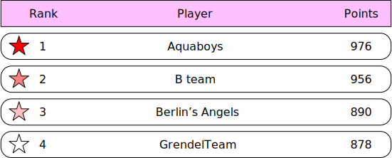

## 步骤 1 - 了解问题并确定设计范围

排行榜可能非常简单，但有许多不同的问题可能会增加复杂性。我们应该明确要求。

**候选人：**排行榜的得分是如何计算的？
**面试官：**用户赢得比赛时会获得一分。我们可以采用一个简单的积分系统，每个用户都有一个与之相关的分数。每次用户赢得比赛时，我们都应该在他们的总分上加一分。

**候选人：**排行榜上会包括所有选手吗？
**面试官：**是的。

**候选人：**排行榜是否有时间段？
**面试官：**每个月都会有一场新的锦标赛开始，从而产生新的排行榜。

**候选人：**我们可以假设我们只关心前 10 名用户吗？
**面试官：**我们想显示前 10 名用户以及特定用户在排行榜上的位置。如果时间允许，我们还讨论如何返回比特定用户高 4 位和低 4 位的用户。

**候选人：**一场锦标赛有多少用户？
**面试官：**平均每日活跃用户（DAU）500万，每月活跃用户（MAU）2500万。

**候选人：**一届比赛平均打多少场比赛?
**面试官：**平均每个球员每天打10场比赛。

**候选人：**如果两个选手得分相同，如何确定排名？
**面试官：**这样他们的排名就相同了。如果时间允许，我们可以讨论一下打破平局的方法。

**候选人：**排行榜需要实时吗？
**面试官：**是的，我们希望展示实时结果，或者尽可能接近实时结果。展示批量历史结果并不好。

现在我们已经收集了所有需求，让我们列出功能需求。

- 显示排行榜上排名前 10 位的玩家。
- 显示用户的具体排名。
- 显示比期望用户 (奖励) 高出和低四位的玩家。

除了明确功能需求之外，了解非功能需求也很重要。

**非功能性需求**

- 实时更新分数。
- 分数更新实时反映在排行榜上。
- 一般可扩展性、可用性和可靠性要求。

### 简单估算

让我们看一些简单的计算来确定我们的解决方案需要解决的潜在规模和挑战。

如果 DAU 为 500 万，那么如果游戏在 24 小时内玩家分布均匀，则平均每秒会有 50 名用户（5,000,000 DAU / 10^5 秒 = ~50）。但是，我们知道使用量很可能分布不均匀，晚上可能会出现高峰，因为晚上不同时区的许多人都有时间玩游戏。考虑到这一点，我们可以假设峰值负载是平均值的 5 倍。因此，我们希望允许每秒 250 名用户的峰值负载。

积分用户QPS：假设某用户平均每天玩10个游戏，则积分用户QPS为：50*10=~500，峰值QPS是平均值的5倍：500*5=2500。

获取前 10 名排行榜的 QPS：假设用户每天打开游戏一次，并且仅在用户首次打开游戏时加载前 10 名排行榜。此 QPS 约为 50。

## 第 2 步 - 提出高层设计并获得认可

在本节中，我们将讨论 API 设计、高级架构和数据模型。

### API 设计

从高层次来看，我们需要以下三个 API：

**发布 /v1/分数**

当用户赢得游戏时更新用户在排行榜上的位置。请求参数如下所列。这应该是只能由游戏服务器调用的内部 API。客户端不应该能够直接更新排行榜得分。

| **场地** | **描述**                     |
| :------- | :--------------------------- |
| 用户身份 | 赢得游戏的用户。             |
| 点       | 用户赢得游戏所获得的积分数。 |

表格1

回复：

| **姓名**     | **描述**             |
| :----------- | :------------------- |
| 200 正常     | 成功更新用户的分数。 |
| 400 错误请求 | 无法更新用户的分数。 |

表 2

**获取 /v1/分数**

从排行榜中获取前 10 名玩家。

示例响应：

```json
{
  "data": [
    {
      "user_id": "user_id1",
      "user_name": "alice",
      "rank": 1,
      "score": 12543
    },
    {
      "user_id": "user_id2",
      "user_name": "bob",
      "rank": 2,
      "score": 11500
    }
  ],
  ...
  "total": 10
}
```

**获取 /v1/scores/{:user_id}**

获取特定用户的排名。

| **场地** | **描述**                        |
| :------- | :------------------------------ |
| 用户身份 | 我们想要获取其排名的用户的 ID。 |

表3

示例响应：

```json
{
    "user_info": {
        "user_id": "user5",
        "score": 1000,
        "rank": 6,
    }
}
```

### 高级架构

高级设计图如图 2 所示。此设计包含两项服务。游戏服务允许用户玩游戏，排行榜服务创建并显示排行榜。

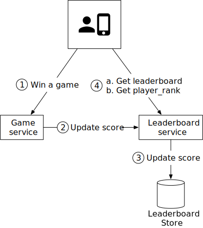

1. 当玩家赢得游戏时，客户端会向游戏服务发送请求。

2. 游戏服务确保胜利有效并调用排行榜服务来更新分数。

3. 排行榜服务更新排行榜商店中的用户得分。

4. 玩家直接调用排行榜服务来获取排行榜数据，包括：

   a. 前十名排行榜。

   b. 玩家在排行榜上的排名。

在确定这个设计之前，我们考虑了几种方案，但最终还是放弃了。仔细思考一下并比较不同的方案可能会有所帮助。

**客户端是否应该直接与排行榜服务对话？**

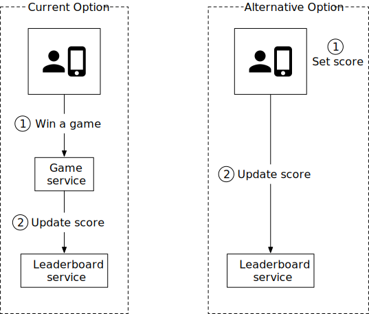

在备选设计中，分数由客户端设置。此选项并不安全，因为它容易受到中间人攻击 [x]，玩家可以随意设置代理并更改分数。因此，我们需要在服务器端设置分数。

请注意，对于服务器授权的游戏（例如在线扑克），客户端可能不需要明确调用游戏服务器来设置分数。游戏服务器处理所有游戏逻辑，它知道游戏何时结束，并且可以在没有任何客户端干预的情况下设置分数。

**游戏服务和排行榜服务之间是否需要消息队列？**

这个问题的答案很大程度上取决于游戏分数的使用方式。如果数据在其他地方使用或支持多种功能，那么将数据放入 Kafka 中可能是有意义的，如图 4 所示。这样，同一份数据就可以被多个消费者使用，例如排行榜服务、分析服务、推送通知服务等。当游戏是回合制或多人游戏时尤其如此，我们需要通知其他玩家分数更新。由于这不是与面试官对话的明确要求，因此我们在设计中不使用消息队列。

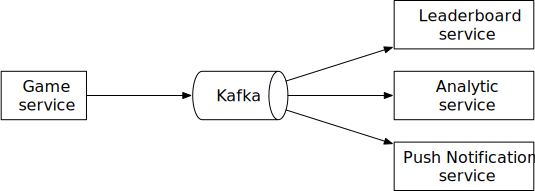

### 数据模型

系统中的关键组件之一是排行榜存储。我们将讨论三种可能的解决方案：关系数据库、Redis 和 NoSQL（NoSQL 解决方案将在深入介绍中解释）。

#### 关系数据库解决方案

首先，让我们退一步，从最简单的解决方案开始。如果规模不重要，而且我们只有少数用户，该怎么办？

我们最有可能选择使用关系数据库系统 (RDS) 来提供一个简单的排行榜解决方案。每个月度排行榜都可以表示为一个包含用户 ID 和分数列的数据库表。当用户赢得比赛时，如果用户是新用户，则奖励该用户 1 分，或者将其现有分数提高 1 分。要确定用户在排行榜上的排名，我们会按分数降序对表格进行排序。详细信息如下所述。

排行榜数据库表：

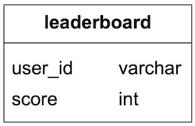

实际上，排行榜表还包含其他信息，例如 game_id、时间戳等。但是，查询和更新排行榜的底层逻辑保持不变。为简单起见，我们假设排行榜表中仅存储了当前月份的排行榜数据。

**用户赢得一分：**


假设每次分数更新都会增加 1。如果用户本月尚未进入排行榜，则第一次插入的内容将是：

```sql
INSERT INTO leaderboard (user_id, score) VALUES ('mary1934', 1);
```

用户分数的更新如下：

```sql
UPDATE leaderboard set score=score + 1 where user_id='mary1934';
```

**查找用户的排行榜位置：**


为了获取用户排名，我们将对排行榜表进行排序并按分数排名：

```sql
SELECT (@rownum := @rownum + 1) AS rank, user_id, score
FROM leaderboard
ORDER BY score DESC;
```

SQL 查询的结果如下所示：

| **秩** | **用户身份** | **分数** |
| :----- | :----------- | :------- |
| 1      | 快乐番茄     | 987      |
| 2      | 锦葵         | 902      |
| 3      | 史密斯       | 870      |
| 4      | 玛丽1934     | 850      |

表 4 按分数排序的结果

这个方案在数据集较小的时候还行，但是当数据量达到几百万行的时候查询就会变得非常慢，我们来看看为什么。

要确定用户的排名，我们需要将每个玩家排序到排行榜上的正确位置，这样我们才能准确确定正确的排名。请记住，也可能有重复的分数，因此排名不仅仅是用户在列表中的位置。

当我们必须处理大量不断变化的信息时，SQL 数据库的性能并不理想。尝试对数百万行进行排名操作将花费数十秒的时间，这对于所需的实时方法是不可接受的。由于数据不断变化，因此考虑缓存也是不可行的。

关系数据库并非为处理此实现所需的高负载读取查询而设计的。如果以批处理操作的形式完成，RDS 可以成功使用，但这不符合返回排行榜上用户的实时位置的要求。

我们可以做的一项优化是添加索引并使用 LIMIT 子句限制要扫描的页面数量。查询如下所示：

```sql
SELECT (@rownum := @rownum + 1) AS rank, user_id, score
FROM leaderboard
ORDER BY score DESC
LIMIT 10
```

但是，这种方法的可扩展性不佳。首先，查找用户的排名并不高效，因为它本质上需要进行表扫描来确定排名。其次，这种方法没有提供直接的解决方案来确定不在排行榜顶端的用户的排名。

#### Redis 解决方案

我们希望找到一种解决方案，即使对于数百万用户也能提供可预测的性能，并允许我们轻松访问常见的排行榜操作，而无需依赖复杂的数据库查询。

Redis 为我们的问题提供了一个潜在的解决方案。Redis 是一个支持键值对的内存数据存储。由于它在内存中工作，因此可以快速读取和写入。Redis 有一种称为**有序集**的特定数据类型，非常适合解决排行榜系统设计问题。

##### 什么是有序集？

有序集合是一种类似于集合的数据类型。有序集合的每个成员都与一个分数相关联。集合的成员必须是唯一的，但分数可以重复。分数用于按升序对有序集合进行排序。

我们的排行榜用例完美地映射到排序集。在内部，排序集由两个数据结构实现：哈希表和跳跃列表 [1]。哈希表将用户映射到分数，跳跃列表将分数映射到用户。在排序集中，用户按分数排序。理解排序集的一个好方法是将其描绘成一个包含分数和成员列的表格，如图 8 所示。该表按分数降序排列。

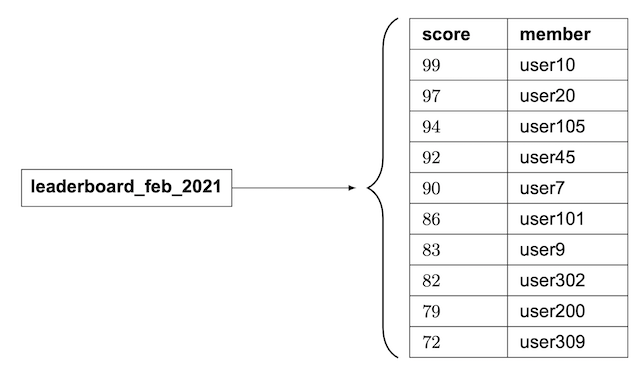

在本章中，我们不会深入讨论有序集的实现细节，但会介绍其高层思想。

跳跃表是一种可以快速搜索的列表结构。它由一个基本排序链表和多级索引组成。我们来看一个例子。在图 9 中，基本列表是一个排序的单链表。插入、移除和搜索操作的时间复杂度为*O(n)*。

我们如何才能使这些操作更快？一种想法是像二分搜索算法那样快速到达中间。为了实现这一点，我们添加一个跳过其他每个节点的 1 级索引，然后添加一个跳过 1 级索引的其他每个节点的 2 级索引。我们不断引入额外的级别，每个新级别都会跳过前一级的其他每个节点。当节点之间的距离为 n/2 - 1 时，我们停止这种添加，其中 n 是节点总数。如图 9 所示，当我们拥有多级索引时，搜索数字 45 的速度要快得多。

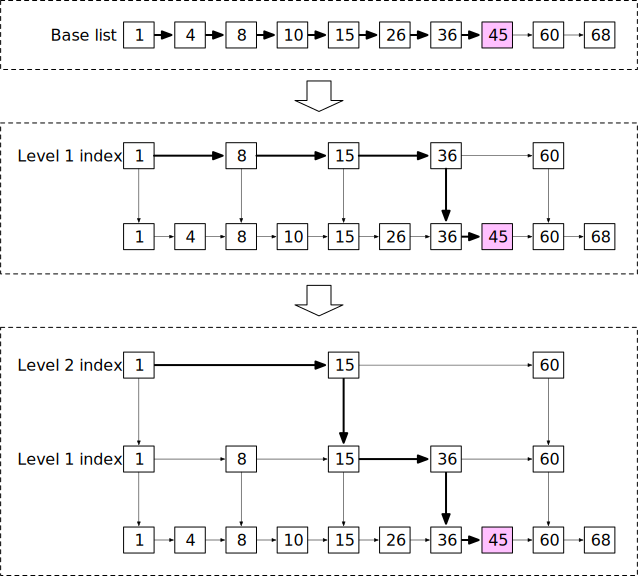

当数据集较小时，使用跳跃表对速度的提升并不明显。图 10 显示了具有 5 级索引的跳跃表的示例。在基础链表中，需要遍历 62 个节点才能到达正确节点。在跳跃表中，只需要遍历 11 个节点 [2]。


排序集比关系数据库具有更高的性能，因为每个元素在插入或更新期间都会自动定位到正确的顺序，并且排序集中的添加或查找操作的复杂度是对数的：*O(logn)*。

相反，为了计算关系数据库中特定用户的排名，我们需要运行嵌套查询：

```sql
SELECT *,(SELECT COUNT(*) FROM leaderboard lb2
WHERE lb2.score >= lb1.score) RANK
FROM leaderboard lb1
WHERE lb1.user_id = {:user_id};
```

##### 

##### 使用 Redis 排序集实现

现在我们知道排序集很快，让我们看一下将用于构建排行榜的 Redis 操作 [3] [4] [5] [6]：

- ZADD：如果用户尚不存在，则将其插入集合中。否则，更新用户的分数。执行时间为*O(log(n)) 。*
- ZINCRBY：按指定的增量增加用户的分数。如果用户在集合中不存在，则假定分数从 0 开始。执行时间为*O(log(n)) 。*
- ZRANGE/ZREVRANGE：获取按分数排序的用户范围。我们可以指定顺序（范围与重新范围）、条目数以及起始位置。执行此操作需要*O(log(n)+m) ，其中**m*是要获取的条目数（在我们的例子中通常很小），*n*是排序集中的条目数。
- ZRANK/ZREVRANK：以对数时间按升序/降序排序获取任意用户的位置。

**带排序集的工作流程**

1. 用户得分


我们每个月都会创建一个新的排行榜排序集，之前的排序集会移至历史数据存储中。当用户赢得比赛时，他们会获得 1 分；因此我们调用 ZINCRBY 来将用户在该月排行榜中的得分增加 1 分，或者如果用户之前不在排行榜中，则将其添加到排行榜集。ZINCRBY 的语法为：

```sh
ZINCRBY <key> <increment> <user>
```

以下命令在用户“mary1934”赢得比赛后为其添加一分。

```sh
ZINCRBY leaderboard_feb_2021 1 'mary1934'
```

2. 用户获取全球排行榜前 10 名


我们将调用 ZREVRANGE 以降序获取成员，因为我们想要最高分数，并传递“WITHSCORES”属性以确保它还返回每个用户的总分以及得分最高的用户集。以下命令获取 2021 年 2 月排行榜上的前 10 名玩家。

```sh
ZREVRANGE leaderboard_feb_2021 0 9 WITHSCORES
```

这将返回如下列表：

```sh
[(user2,score2),(user1,score1),(user5,score5)...]
```

3. 用户想要获取自己的排行榜位置


为了获取用户在排行榜中的位置，我们将调用 ZREVRANK 来检索他们在排行榜上的排名。同样，我们调用该命令的 rev 版本，因为我们想按得分从高到低进行排序。

```sh
ZREVRANK leaderboard_feb_2021 'mary1934'
```

4. 获取用户在排行榜中的相对位置。示例如图 14 所示。

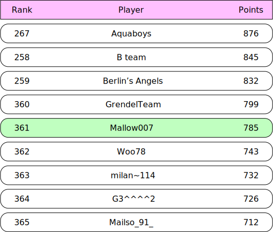

虽然没有明确要求，但我们可以利用 ZREVRANGE 以及所需玩家上方和下方的结果数量，轻松获取用户的相对位置。例如，如果用户 Mallow007 的排名是 361，并且我们想要获取其上方和下方的 4 名玩家，我们将运行以下命令。

```sh
ZREVRANGE leaderboard_feb_2021 357 365
```

##### 存储要求

至少，我们需要存储用户 ID 和分数。最坏的情况是，所有 2500 万月活跃用户都至少赢过一场比赛，并且他们都在当月的排行榜中占有一席之地。假设 ID 是一个 24 个字符的字符串，而分数是一个 16 位整数（或 2 个字节），则每个排行榜条目需要 26 字节的存储空间。考虑到每个 MAU 一个排行榜条目的最坏情况，我们需要 26 字节 * 2500 万 = 6.5 亿字节或 ~650 MB 的 Redis 缓存用于排行榜存储。即使我们将内存使用量翻倍以解决跳过列表和有序集哈希的开销，一台现代 Redis 服务器也足以容纳这些数据。

另一个需要考虑的相关因素是 CPU 和 I/O 使用率。根据我们的粗略估计，峰值 QPS 为 2500 次更新/秒。这完全在单个 Redis 服务器的性能范围内。

关于 Redis 缓存的一个问题是持久性，因为 Redis 节点可能会发生故障。幸运的是，Redis 确实支持持久性，但从磁盘重新启动大型 Redis 实例很慢。通常，Redis 配置了一个只读副本，当主实例发生故障时，将提升只读副本，并附加一个新的只读副本。

此外，我们需要在 MySQL 等关系数据库中拥有 2 个支持表（用户和积分）。用户表将存储用户 ID 和用户的显示名称（在实际应用程序中，这将包含更多数据）。积分表将包含用户 ID、分数和他们赢得游戏的时间戳。这可以用于其他游戏功能，例如游戏历史记录，也可以用于在发生基础设施故障时重新创建 Redis 排行榜。

作为一项小型性能优化，创建额外的用户详细信息缓存可能是有意义的，可能针对前 10 名玩家，因为他们被检索的频率最高。但是，这并不会占用大量数据。

### 步骤 3 - 深入设计

现在我们已经讨论了高层设计，让我们深入讨论以下内容：

- 是否使用云提供商
  - 管理我们自己的服务
  - 利用 Amazon Web Services (AWS) 等云服务提供商
- 扩展 Redis
- 替代解决方案：NoSQL
- 其他考虑因素

#### 是否使用云提供商

根据现有的基础设施，我们通常有两种部署解决方案的方案。让我们分别了解一下。

##### 管理我们自己的服务

在这种方法中，我们将每月创建一个排行榜排序集来存储该期间的排行榜数据。排序集存储成员和分数信息。有关用户的其余详细信息（例如其姓名和个人资料图片）存储在 MySQL 数据库中。在获取排行榜时，除了排行榜数据之外，API 服务器还会查询数据库以获取相应的用户姓名和个人资料图片以显示在排行榜上。如果从长远来看这种方法效率太低，我们可以利用用户个人资料缓存来存储前 10 名玩家的用户详细信息。设计如图 15 所示。

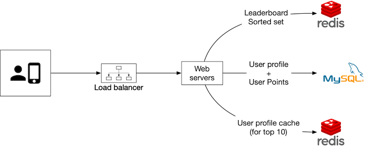

##### 在云上构建

第二种方法是利用云基础设施。在本节中，我们假设我们现有的基础设施建立在 AWS 上，并且在云上构建排行榜是天作之合。我们将在本设计中使用两种主要的 AWS 技术：Amazon API Gateway 和 AWS Lambda 函数 [7]。Amazon API 网关提供了一种定义 RESTful API 的 HTTP 端点并将其连接到任何后端服务的方法。我们使用它来连接到我们的 AWS lambda 函数。Restful API 和 lambda 函数之间的映射如表 5 所示。

| **蜜蜂**                   | **Lambda 函数**    |
| -------------------------- | ------------------ |
| 获取 /v1/分数              | 排行榜获取前10名   |
| 获取 /v1/scores/{:user_id} | 排行榜获取玩家排名 |
| 发布 /v1/分数              | 排行榜更新分数     |

表 5 Lambda 函数

AWS Lambda 是最流行的无服务器计算平台之一。它允许我们运行代码，而无需自己配置或管理服务器。它只在需要时运行，并会根据流量自动扩展。无服务器是云服务中最热门的话题之一，所有主要的云服务提供商都支持它。例如，Google Cloud 有 Google Cloud Functions [8]，微软将其产品命名为 Microsoft Azure Functions [9]。

从高层次来看，我们的游戏会调用 Amazon API Gateway，然后后者会调用相应的 lambda 函数。我们将使用 AWS Lambda 函数在存储层（Redis 和 MySQL）上调用相应的命令，并将结果返回到 API Gateway，然后再返回到应用程序。

我们可以利用 Lambda 函数来执行所需的查询，而无需启动服务器实例。AWS 提供对可从 Lambda 函数调用的 Redis 客户端的支持。这还允许根据 DAU 增长的需要自动扩展。用户得分和检索排行榜的设计图如下所示：

**用例 1：得分**

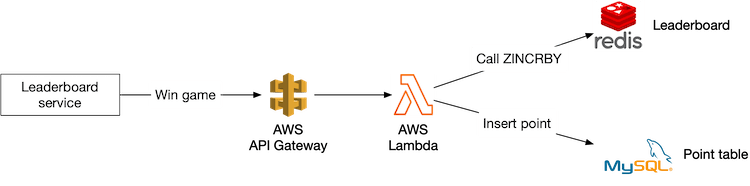

**用例 2：检索排行榜**

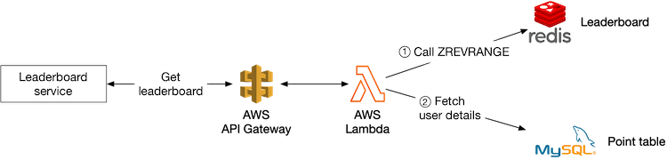

Lambda 非常棒，因为它们是一种无服务器方法，并且基础设施将根据需要自动扩展该函数。这意味着我们不需要管理扩展和环境设置和维护。鉴于此，如果我们从头开始构建游戏，我们建议采用无服务器方法。

#### 扩展 Redis

有了 500 万 DAU，从存储和 QPS 的角度来看，我们可以使用一个 Redis 缓存。但是，假设我们有 5 亿 DAU，这是我们原始规模的 100 倍。现在，排行榜大小的最坏情况上升到 65 GB（650 MB *100），我们的 QPS 上升到每秒 250,000（2,500 * 100）个查询。这需要分片解决方案。

##### 数据分片

我们考虑采用以下两种方式之一进行分片：固定分区或哈希分区。

**固定隔断**

了解固定分区的一种方法是查看排行榜上积分的总体范围。假设一个月内获得的积分数范围为 1 到 1000，我们按范围划分数据。例如，我们可以有 10 个分片，每个分片有 100 个分数范围（例如，1-100、101-200、201-300，...），如图 18 所示。

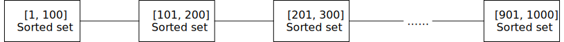

为了实现这一点，我们希望确保排行榜上的分数分布均匀。否则，我们需要调整每个分片中的分数范围，以确保相对均匀的分布。在这种方法中，我们在应用程序代码中自行对数据进行分片。

当我们插入或更新用户的分数时，我们需要知道他们位于哪个分片中。我们可以通过从 MySQL 数据库计算用户的当前分数来做到这一点。这可以工作，但更高效的选择是创建一个辅助缓存来存储从用户 ID 到分数的映射。当用户增加分数并在分片之间移动时，我们需要小心。在这种情况下，我们需要将用户从其当前分片中删除并将其移动到新分片。

要获取排行榜中的前 10 名玩家，我们将从得分最高的分片（排序集）中获取前 10 名玩家。在图 18 中，得分为 [901, 1000] 的最后一个分片包含前 10 名玩家。

要获取用户的排名，我们需要计算其在当前分片中的排名（本地排名），以及所有分片中得分较高的玩家总数。请注意，可以通过运行“ *info keyspace* ”命令（复杂度为*O(1)* [10]）来检索分片中的玩家总数。

##### 哈希分区

第二种方法是使用 Redis 集群，如果得分非常聚集或聚集，这种方法是理想的。Redis 集群提供了一种在多个 Redis 节点之间自动分片数据的方法。它不使用一致性哈希，而是使用另一种形式的分片，其中每个键都是**哈希槽的一部分。共有 16384 个哈希槽 [11]，我们可以通过执行***CRC16( \*key\* )% 16384* [12]来计算给定键的哈希槽。这使我们能够轻松地在集群中添加和删除节点，而无需重新分配所有键。在图 19 中，我们有 3 个节点，其中：

- 第一个节点包含哈希槽 [0, 5500]。
- 第二个节点包含哈希槽 [5501, 11000]。
- 第三个节点包含哈希槽 [11001, 16383]。

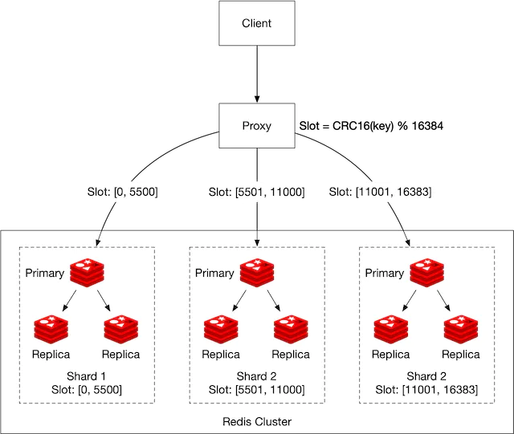

更新只会更改相应分片中用户的分数（由*CRC16(key)%16384*确定）。检索排行榜上排名前 10 的玩家则更为复杂。我们需要从每个分片中收集排名前 10 的玩家，并让应用程序对数据进行排序。图 20 显示了一个具体示例。这些查询可以并行化以减少延迟。

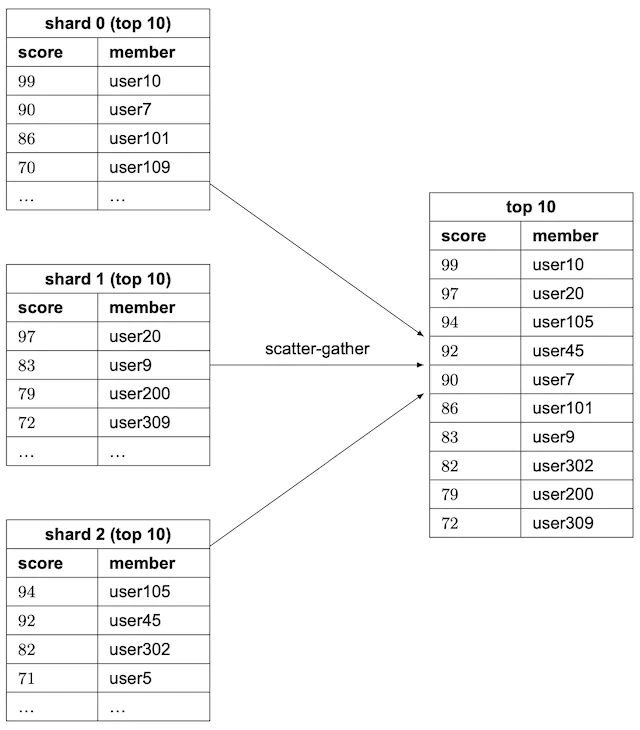

这种方法有一些局限性：

- 当我们需要返回排行榜上的前 K 个结果（其中 K 是一个非常大的数字）时，延迟会很高，因为每个分片都会返回大量条目并且需要进行排序。
- 如果我们有很多分区，延迟就会很高，因为查询必须等待最慢的分区。
- 这种方法的另一个问题是它没有提供确定特定用户排名的直接解决方案。

因此，我们倾向于第一个建议：固定分区。

##### 调整 Redis 节点大小

在确定 Redis 节点大小时，需要考虑多个因素 [13]。写入密集型应用程序需要更多可用内存，因为我们需要能够容纳所有写入，以便在发生故障时创建快照。为了安全起见，请为写入密集型应用程序分配两倍的内存量。

Redis 提供了一个名为 Redis-benchmark 的工具，它允许我们通过模拟多个客户端执行多个查询并返回给定硬件的每秒请求数来对 Redis 设置的性能进行基准测试。要了解有关 Redis-benchmark 的更多信息，请参阅 [14]。

#### 替代解决方案：NoSQL

需要考虑的另一种解决方案是 NoSQL 数据库。我们应该使用哪种 NoSQL？理想情况下，我们希望选择具有以下属性的 NoSQL：

- 针对写入进行了优化。
- 按分数对同一分区内的项目进行有效排序。

NoSQL 数据库（例如 Amazon 的 DynamoDB [15]、Cassandra 或 MongoDB）可能非常适合。在本章中，我们使用 DynamoDB 作为示例。DynamoDB 是一个完全托管的 NoSQL 数据库，可提供可靠的性能和出色的可扩展性。为了能够高效地访问具有主键以外属性的数据，我们可以利用 DynamoDB 中的全局二级索引 [16]。全局二级索引包含来自父表的属性选择，但它们使用不同的主键进行组织。让我们看一个例子。

更新后的系统图如图21所示，Redis和MySQL被DynamoDB取代。


假设我们为国际象棋游戏设计了排行榜，我们的初始表格如图 22 所示。它是排行榜和用户表的非规范化视图，包含呈现排行榜所需的一切。

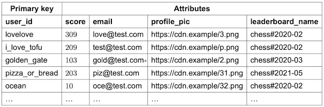

这种表格方案虽然有效，但扩展性不佳。随着更多行的添加，我们必须扫描整个表格才能找到最高分。

为了避免线性扫描，我们需要添加索引。我们第一次尝试使用“ *game_name#{year-month}* ”作为分区键，使用分数作为排序键，如图 23 所示。


这种方法可行，但在高负载下会遇到问题。DynamoDB 使用一致性哈希将数据拆分到多个节点。每个项目都基于其分区键位于相应的节点中。我们希望构建数据，以便数据均匀分布在各个分区中。在我们的表设计中（图 23），最近一个月的所有数据都将存储在一个分区中，并且该分区将成为热分区。我们如何解决这个问题？

我们可以将数据拆分为*N 个*分区，并将分区号 (user_id % number_of_partitions) 附加到分区键。这种模式称为写入分片。写入分片增加了读取和写入操作的复杂性，因此我们应该仔细考虑权衡。

我们需要回答的第二个问题是，我们应该有多少个分区？它可以基于写入量或 DAU。需要记住的重要一点是，分区负载和读取复杂性之间存在权衡。由于同一个月的数据均匀分布在多个分区中，因此单个分区的负载要轻得多。但是，要读取给定月份的项目，我们必须查询所有分区并合并结果，这会增加读取复杂性。

分区键如下所示：“ *game_name#{year-month}#p{partition_number}* ”。图 24 显示了更新后的架构表。

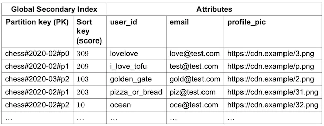

全局二级索引使用“ *game_name#{year-month}#p{partition_number}* ”作为分区键，使用分数作为排序键。我们最终得到的是*N 个*分区，它们都在自己的分区内排序（本地排序）。如果我们假设我们有 3 个分区，那么为了获取前 10 名排行榜，我们将使用前面提到的称为“分散-聚集”的方法。我们将在每个分区中获取前 10 个结果（这是“分散”部分），然后我们将允许应用程序在所有分区中对结果进行排序（这是“聚集”部分）。图 25 显示了一个示例。

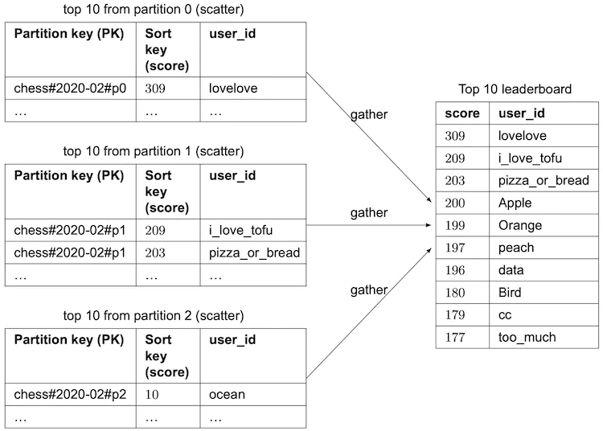

我们如何确定分区数量？这可能需要进行一些仔细的基准测试。更多分区会减少每个分区的负载，但会增加复杂性，因为我们需要分散到更多分区来构建最终的排行榜。通过使用基准测试，我们可以更清楚地看到权衡。

但是，与前面提到的 Redis 分区解决方案类似，这种方法无法提供确定用户相对排名的直接解决方案。但可以获取用户排名的百分位数，这可能已经足够好了。在现实生活中，告诉玩家他们处于前 10-20% 可能比显示确切排名（例如 1,200,001）更好。因此，如果规模大到需要分片，我们可以假设分数分布在所有分片中大致相同。如果这个假设成立，我们可以有一个 cron 作业来分析每个分片的分数分布，并缓存结果。

结果看起来是这样的：

```
10th percentile = score < 100
20th percentile = score < 500
...
90th percentile = score < 6500
```

然后我们可以快速返回用户的相对排名（比如第 90 个百分位）。

### 第 4 步 - 总结

在本章中，我们创建了一个解决方案，用于构建具有数百万 DAU 规模的实时游戏排行榜。我们探索了使用 MySQL 数据库的直接解决方案，但拒绝了该方法，因为它无法扩展到数百万用户。然后，我们使用 Redis 排序集设计了排行榜。我们还研究了通过利用跨不同 Redis 缓存的分片将解决方案扩展到 5 亿 DAU。我们还提出了一种替代的 NoSQL 解决方案。

如果面试结束时你还有一些空闲时间，你可以讨论以下几个话题：

**更快检索和打破平局**

Redis 哈希提供了字符串字段和值之间的映射。我们可以利用哈希来实现以下两种用例：

1. 存储用户 ID 到我们可以在排行榜上显示的用户对象的映射。这比必须进入数据库来获取用户对象更快。
2. 如果两个玩家得分相同，我们可以根据谁先获得该分数对用户进行排名。当我们增加用户的分数时，我们还可以存储用户 ID 到最近获胜游戏的时间戳的映射。如果出现平局，则时间戳较早的用户排名较高。

**系统故障恢复**

Redis 集群可能会遭遇大规模故障。根据上述设计，我们可以创建一个脚本，利用 MySQL 数据库在每次用户赢得游戏时记录带有时间戳的条目这一事实。我们可以遍历每个用户的所有条目，并针对每个用户的每个条目调用一次 ZINCRBY。如果发生大规模中断，这将允许我们在必要时离线重新创建排行榜。

恭喜你走到这一步！现在给自己一点鼓励吧。干得好！

## 章节总结

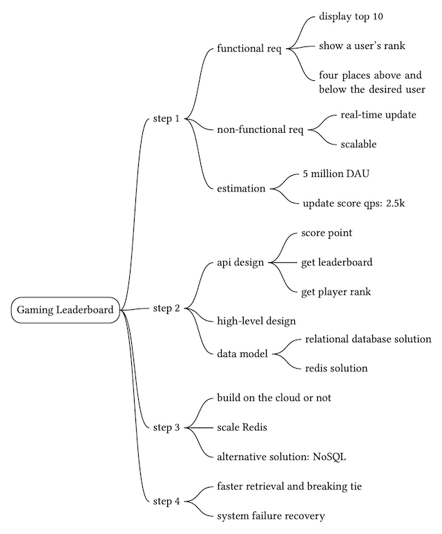

## 参考资料

[1] Redis Sorted Set 源码：https://github.com/redis/redis/blob/unstable/src/t_zset.c

[2] 极客邦：https://static001.geekbang.org/resource/image/46/a9/46d283cd82c987153b3fe0c76dfba8a9.jpg

[3] 使用 Redis 构建实时排行榜：https://medium.com/@sandeep4.verma/building-real-time-leaderboard-with-redis-82c98aa47b9f

[4] 使用 Amazon ElastiCache for Redis 构建实时游戏排行榜：https://aws.amazon.com/blogs/database/building-a-real-time-gaming-leaderboard-with-amazon-elasticache-for-redis

[5] 我们如何为百万用户创建实时排行榜：https://levelup.gitconnected.com/how-we-created-a-real-time-leaderboard-for-a-million-users-555aaa3ccf7b

[6] 排行榜：[https:](https://redislabs.com/solutions/use-cases/leaderboards) //redislabs.com/solutions/use-cases/leaderboards/

[7] Lambda：https://aws.amazon.com/lambda/

[8] Google云功能：[https：//cloud.google.com/functions](https://cloud.google.com/functions)

[9] Azure 函数：https://azure.microsoft.com/en-us/services/functions/

[10]信息命令：https://redis.io/commands/INFO

[11] 为什么 redis 集群只有 16384 个插槽：https://stackoverflow.com/questions/36203532/why-redis-cluster-only-have-16384-slots

[12] 循环冗余校验：https://en.wikipedia.org/wiki/Cyclic_redundancy_check

[13] 选择节点大小：https://docs.aws.amazon.com/AmazonElastiCache/latest/red-ug/nodes-select-size.html

[14] Redis 速度有多快？：https://redis.io/topics/benchmarks

[15] 在 DynamoDB 中使用全局二级索引：https://docs.aws.amazon.com/amazondynamodb/latest/developerguide/GSI.html~~。~~

[16] 排行榜和写入分片：https://www.dynamodbguide.com/leaderboard-write-sharding/