在本章中，我们设计一个支付系统。近年来，电子商务在世界各地迅速流行起来。每笔交易的实现都离不开一个在幕后运行的支付系统。一个可靠、可扩展且灵活的支付系统至关重要。

什么是支付系统？根据维基百科，“支付系统是通过货币价值转移结算金融交易的任何系统。这包括使其交换成为可能的机构、工具、人员、规则、程序、标准和技术”[1]。

支付系统表面上很容易理解，但对于许多开发人员来说，使用起来却很困难。一个小失误可能会导致重大的收入损失并破坏用户的信誉。但不要害怕！在本章中，我们将揭开支付系统的神秘面纱。

## 步骤 1 - 了解问题并确定设计范围

支付系统对不同的人来说可能意味着非常不同的东西。有些人可能认为它是像 Apple Pay 或 Google Pay 这样的数字钱包。其他人可能认为它是一个处理付款的后端系统，例如 PayPal 或 Stripe。在面试开始时确定确切的要求非常重要。以下是你可以问面试官的一些问题：

**候选人**：我们正在构建什么样的支付系统？
**面试官**：假设你正在为亚马逊这样的电子商务应用程序构建支付后端。当客户在亚马逊上下订单时，支付系统会处理与资金流动相关的所有事务。

**候选人**：支持哪些支付方式？信用卡、PayPal、银行卡等？
**面试官**：现实生活中，支付系统应该支持所有这些支付方式。不过，在这次面试中，我们可以使用信用卡支付作为示例。

**候选人**：我们自己处理信用卡付款吗？
**面试官**：不，我们使用第三方支付处理器，例如 Stripe、Braintree、Square 等。

**候选人：**我们的系统中是否存储信用卡数据？
**面试官：**由于安全性和合规性要求极高，我们不会直接在系统中存储卡号。我们依靠第三方支付处理器来处理敏感的信用卡数据。

**候选人**：这个应用是全球性的吗？我们需要支持不同的货币和国际支付吗？
**面试官**：这个问题问得好。是的，这个应用是全球性的，但我们假设在这次面试中只使用一种货币。

**候选人**：每天有多少笔支付交易？
**面试官**：每天 100 万笔。

**候选人**：我们需要支持像亚马逊这样的电子商务网站每月向卖家付款的支付流程吗？
**面试官**：是的，我们需要支持。

**候选人**：我想我已经收集了所有要求。还有什么需要注意的吗？
**面试官**：是的。支付系统与许多内部服务（会计、分析等）和外部服务（支付服务提供商）交互。当服务发生故障时，我们可能会看到服务之间的状态不一致。因此，我们需要执行协调并修复任何不一致之处。这也是一项要求。

通过这些问题，我们清楚地了解了功能性和非功能性需求。在这次采访中，我们专注于设计一个支持以下内容的支付系统。

### 功能要求

- 付款流程：支付系统代表卖家从客户处收取款项。
- 支付流程：支付系统将钱款发送给世界各地的卖家。

### 非功能性需求

- 可靠性和容错性。付款失败需要谨慎处理。
- 需要在内部服务（支付系统、会计系统）和外部服务（支付服务提供商）之间进行对帐流程。该流程异步验证这些系统之间的支付信息是否一致。

### 信封背面估计

该系统每天需要处理 100 万笔交易，即 1,000,000 笔交易/10^5 秒 = 每秒 10 笔交易（TPS）。对于典型的数据库来说，10 TPS 并不是一个很大的数字，这意味着本次系统设计面试的重点是如何正确处理支付交易，而不是追求高吞吐量。

## 第 2 步 - 提出高层设计并获得认可

从高层次来看，支付流程分为两个步骤来反映资金的流动方式：

- 付款流程
- 付款流程

以电商网站亚马逊为例，买家下单后，钱会流入亚马逊的银行账户，这就是入账流程。虽然钱在亚马逊的银行账户里，但亚马逊并不拥有所有的钱，卖家拥有其中很大一部分，亚马逊只是充当资金托管人，收取一定费用。之后，当产品发货并释放资金后，扣除费用后的余额会从亚马逊的银行账户流向卖家的银行账户，这就是出账流程。简化的入账和出账流程如图 1 所示。

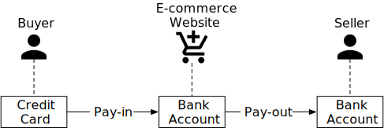

### 付款流程

图 2 显示了付款流程的高级设计图。让我们看一下系统的每个组件。

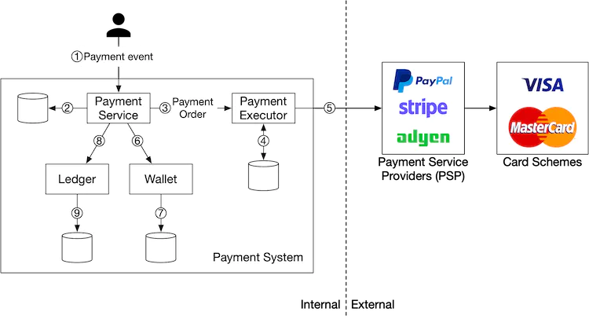

**支付服务**

支付服务接受用户的付款事件并协调付款流程。它通常做的第一件事是风险检查，评估是否符合反洗钱/反恐怖融资 [2] 等法规，以及是否存在洗钱或资助恐怖主义等犯罪活动的证据。支付服务只处理通过此风险检查的付款。通常，风险检查服务使用第三方提供商，因为它非常复杂且高度专业化。

**付款执行人**

支付执行者通过支付服务提供商（PSP）执行单笔支付订单，一个支付事件可能包含多笔支付订单。

**支付服务提供商 (PSP)**

PSP 将资金从账户 A 转移到账户 B。在这个简化的例子中，PSP 将资金从买家的信用卡账户中转出。

**信用卡计划**

信用卡组织是处理信用卡业务的组织。知名的信用卡组织有 Visa、MasterCard、Discovery 等。信用卡组织生态系统非常复杂 [3]。

**总帐**

账本保存支付交易的财务记录。例如，当用户向卖家付款时1，瓦埃𝑟埃𝐶𝑜𝑟𝑑我吨𝐴𝑠𝑑埃𝑏我吨1 ，*记录**为**借记*****************1 美元从用户那里扣除，并将 1 美元记入卖家账户。分类账系统在付款后分析中非常重要，例如计算电子商务网站的总收入或预测未来收入。

**钱包**

钱包保存着商家的账户余额。它还可能记录某个用户总共支付了多少钱。

如图 2 所示，典型的付款流程如下：

1. 当用户点击“下订单”按钮时，就会生成支付事件并发送到支付服务。
2. 支付服务将支付事件存储在数据库中。
3. 有时，单个支付事件可能包含多个支付订单。例如，你可能在一次结账过程中选择了来自多个卖家的产品。如果电商网站将结账拆分为多个支付订单，则支付服务会为每个支付订单调用支付执行器。
4. 支付执行器将支付指令存储于数据库中。
5. 付款执行者调用外部 PSP 来处理信用卡付款。
6. 在支付执行器成功处理付款后，支付服务会更新钱包以记录特定卖家有多少钱。
7. 钱包服务器将更新的余额信息存储在数据库中。
8. 钱包服务成功更新卖家余额信息后，支付服务会调用分类账进行更新。
9. 分类账服务将新的分类账信息附加到数据库。

#### 支付服务API

我们对支付服务使用 RESTful API 设计约定。

**发布 /v1/payments**

该端点执行支付事件，如上文所述，单个支付事件可能包含多个支付订单，请求参数如下：

| **场地**   | **描述**                                                | **类型** |
| :--------- | :------------------------------------------------------ | :------- |
| 买家信息   | 买家信息                                                | json     |
| 结账编号   | 此结帐的全局唯一 ID                                     | 细绳     |
| 信用卡信息 | 这可能是加密的信用卡信息或支付令牌。该值是 PSP 特定的。 | json     |
| 付款订单   | 付款订单列表                                            | 列表     |

表1 API请求参数（执行支付事件）

payment_orders如下所示*：*

| **场地**     | **描述**           | **类型**               |
| :----------- | :----------------- | :--------------------- |
| 卖家账户     | 哪个卖家将收到钱   | 细绳                   |
| 数量         | 订单交易金额       | 细绳                   |
| 货币         | 订单所用的货币     | 字符串（ISO 4217 [4]） |
| 付款订单编号 | 此付款的全球唯一ID | 细绳                   |

表 2 payment_orders

注意，*payment_order_id*是全局唯一的，当支付执行方向第三方PSP发送支付请求时，payment_order_id*会*被PSP作为去重ID，也叫幂等键。

你可能已经注意到，“金额”字段的数据类型是“字符串”，而不是“双精度”。 Double 不是一个好的选择，因为：

1. 不同的协议、软件和硬件在序列化和反序列化中可能支持不同的数值精度。这种差异可能会导致意外的舍入错误。
2. 这个数字可能非常大（例如，日本2020 日历年的 GDP 约为 5x10 14日元），也可能非常小（例如，比特币的 1 聪为 10 -8）。

建议在传输和存储过程中将数字保留为字符串格式，只有用于显示或计算时才会解析为数字。

**获取 /v1/payments/{:id}**

该端点根据*payment_order_id*返回单笔支付订单的执行状态。

上面提到的支付 API 与一些知名 PSP 的 API 类似。如果你对支付 API 的更全面了解感兴趣，请查看 Stripe 的 API 文档 [5]。

#### 支付服务数据模型

支付业务需要两个表：支付事件表和支付订单表。在为支付系统选择存储方案时，性能通常不是最重要的因素，我们更看重以下几点：

1. 经过验证的稳定性。存储系统是否已被其他大型金融公司使用多年（例如超过 5 年）并获得积极反馈。
2. 支持工具的丰富性，例如监控和调查工具。
3. 数据库管理员（DBA）就业市场的成熟度。我们能否招聘到经验丰富的DBA是一个非常重要的考虑因素。

通常，我们更喜欢具有 ACID 事务支持的传统关系数据库，而不是 NoSQL/NewSQL。

付款事件表包含详细的付款事件信息。它如下所示：

| **姓名**   | **类型**       |
| :--------- | :------------- |
| 结账编号   | 字符串**PK**   |
| 买家信息   | 细绳           |
| 卖家信息   | 细绳           |
| 信用卡信息 | 取决于卡提供商 |
| 付款已完成 | 布尔值         |

表 3 付款事件

支付订单表存储了每笔支付订单的执行状态。它如下所示：

| **姓名**             | **类型**     |
| :------------------- | :----------- |
| 付款订单编号         | 字符串**PK** |
| 买家账户             | 细绳         |
| 数量                 | 细绳         |
| 货币                 | 细绳         |
| 结账编号             | 字符串**FK** |
| payment_order_status | 细绳         |
| ledger_updated       | 布尔值       |
| wallet_updated       | 布尔值       |

表4 付款顺序

在深入研究表格之前，让我们先看一些背景信息。

- checkout_id是外键。单次结账会创建一个付款事件，该事件可能包含多个付款订单*。*
- 当我们调用第三方PSP从买家的信用卡扣款时，钱并不是直接打到卖家的账户上，而是打到电商网站的银行账户上，这个过程就叫打款。当打款条件满足，比如商品发货了，卖家才会发起打款，这时钱才会从电商网站的银行账户打到卖家的银行账户上。所以在打款的流程中，我们只需要买家的卡信息，不需要卖家的银行账户信息。

在支付订单表（表4）中，*payment_order_status*是一个枚举类型（enum），保存了支付订单的执行状态，执行状态包括*NOT_STARTED、EXECUTING、SUCCESS、FAILED*，更新逻辑为：

1. *payment_order_status*的初始状态为*NOT_STARTED*。
2. 当支付服务将支付订单发送给支付执行者时，*payment_order_status*为*EXECUTING*。
3. 支付服务根据支付执行者的响应将*payment_order_status*更新为*SUCCESS*或*FAILED 。*

一旦*payment_order_status*为*SUCCESS*，支付服务就会调用钱包服务来更新卖家余额，并将*wallet_updated*字段更新为*TRUE*。在这里，我们通过假设钱包更新总是成功来简化设计。

完成后，支付服务的下一步是调用分类账服务，通过将*ledger_updated*字段更新为*TRUE*来更新分类账数据库。

当同一*checkout_id*下的所有付款订单都成功处理后，付款服务会将付款事件表中的*is_payment_done*更新为 TRUE。计划作业通常以固定间隔运行，以监控正在进行的付款订单的状态。当付款订单未在阈值内完成时，它会发出警报，以便工程师进行调查。

#### 复式记账系统

分类账系统中有一个非常重要的设计原则：复式记账原则（也称为复式记账/簿记 [6]）。复式记账系统是任何支付系统的基础，也是准确记账的关键。它将每笔支付交易记录到两个金额相同的单独分类账中。一个账户记入借方，另一个账户记入相同金额（表 5）。

| 帐户 | 借方   | 信用   |
| :--- | :----- | :----- |
| 买方 | 1 美元 |        |
| 卖方 |        | 1 美元 |

表 5 复式记账系统

复式记账系统规定所有交易条目的总和必须为 0。一分钱的损失意味着其他人赚了一分钱。它提供端到端的可追溯性，并确保整个支付周期的一致性。要了解有关实施复式记账系统的更多信息，请参阅 Square 关于不可变复式记账数据库服务的工程博客 [7]。

#### 托管支付页面

大多数公司不愿意在内部存储信用卡信息，因为如果这样做，他们就必须处理复杂的法规，例如美国的支付卡行业数据安全标准 (PCI DSS) [8]。为了避免处理信用卡信息，公司使用 PSP 提供的托管信用卡页面。对于网站，它是一个小部件或 iframe，而对于移动应用程序，它可能是来自支付 SDK 的预构建页面。图 3 展示了 PayPal 集成的结账体验示例。这里的关键点是 PSP 提供了一个托管支付页面，可以直接捕获客户的卡信息，而不是依赖于我们的支付服务。

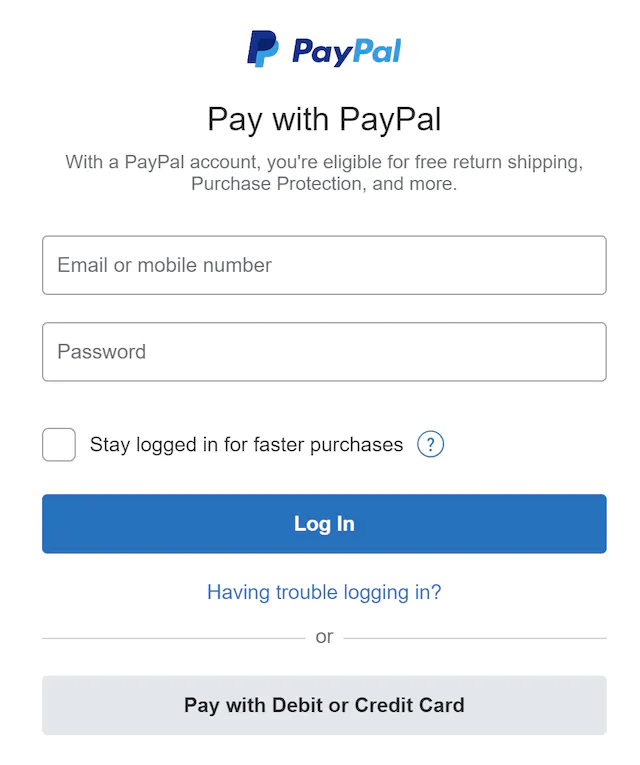

### 付款流程

付款流程的组成部分与入账流程非常相似。一个区别是，付款流程不是使用 PSP 将钱从买家的信用卡转移到电子商务网站的银行账户，而是使用第三方付款提供商将钱从电子商务网站的银行账户转移到卖家的银行账户。

通常，支付系统使用 Tipalti [9] 等第三方应付账款提供商来处理付款。付款也有很多记账和监管要求。

## 步骤 3 - 深入设计

在本节中，我们将重点介绍如何让系统运行得更快、更稳定、更安全。在分布式系统中，错误和故障不仅不可避免，而且很常见。例如，如果客户多次按下“付款”按钮，会发生什么情况？他们会被多次扣款吗？我们如何处理因网络连接不佳而导致的付款失败？在本节中，我们将深入探讨几个关键主题。

- PSP 集成
- 和解
- 处理付款延迟
- 内部服务之间的通信
- 处理付款失败
- 精确一次交付
- 一致性
- 安全

### PSP 集成

如果支付系统可以直接连接到银行或 Visa 或 MasterCard 等信用卡组织，则无需 PSP 即可付款。这些直接连接并不常见，而且非常专业。它们通常只用于真正大型的公司，这些公司可以证明这种投资是合理的。对于大多数公司来说，支付系统会通过以下两种方式之一与 PSP 集成：

1. 如果公司能够安全地存储敏感支付信息并选择这样做，则可以使用 API 集成 PSP。公司负责开发支付网页、收集和存储敏感支付信息。PSP 负责连接到银行或信用卡计划。
2. 如果公司由于复杂的法规和安全问题而选择不存储敏感的支付信息，PSP 会提供托管支付页面来收集卡支付详细信息并将其安全地存储在 PSP 中。这是大多数公司采取的方法。

我们使用图4来详细解释托管支付页面的工作原理。

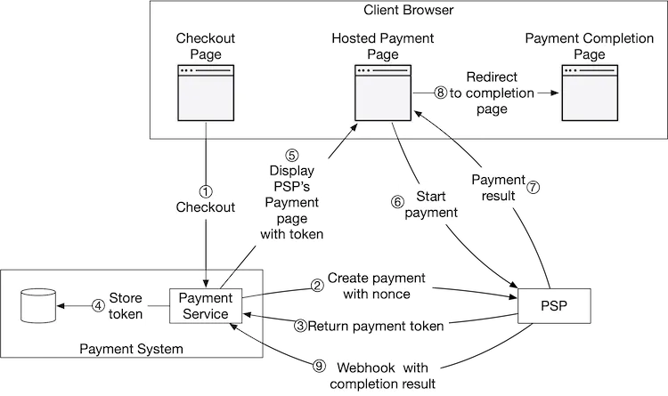

为了简单起见，我们在图 4 中省略了支付执行器、账本和钱包。支付服务负责协调整个支付流程。

1. 用户在客户端浏览器中点击“结账”按钮。客户端使用支付订单信息调用支付服务。

2. 支付服务在收到支付订单信息后，向PSP发送支付注册请求。该注册请求包含支付信息，例如金额、货币、支付请求的到期日期以及重定向URL。由于支付订单只能注册一次，因此有一个UUID字段来确保仅注册一次。这个UUID也称为nonce [10]。通常，这个UUID是支付订单的ID。

3. PSP 将一个 token 返回给支付服务。Token 是 PSP 端的 UUID，用于唯一标识支付注册。我们可以稍后使用此 token 检查支付注册和支付执行状态。

4. 支付服务在调用 PSP 托管的支付页面之前将令牌存储在数据库中。

5. 一旦令牌被持久化，客户端就会显示一个 PSP 托管的支付页面。移动应用程序通常使用 PSP 的 SDK 集成来实现此功能。这里我们使用 Stripe 的 Web 集成作为示例（图 5）。Stripe 提供了一个 JavaScript 库，用于显示支付 UI、收集敏感支付信息并直接调用 PSP 来完成支付。敏感支付信息由 Stripe 收集。它永远不会到达我们的支付系统。托管支付页面通常需要两条信息：

   - 我们在步骤 4 中收到的令牌。PSP 的 javascript 代码使用该令牌从 PSP 的后端检索有关付款请求的详细信息。一个重要的信息是要收取多少钱。
   - 另一个重要信息是重定向 URL。这是付款完成后调用的网页 URL。当 PSP 的 JavaScript 完成付款时，它会将浏览器重定向到重定向 URL。通常，重定向 URL 是一个显示结帐状态的电子商务网页。请注意，重定向 URL 与步骤 9 中的 webhook [11] URL 不同。

   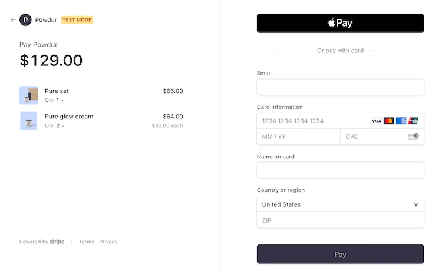

6. 用户在PSP的网页上填写付款信息，如信用卡号、持卡人姓名、有效期等，然后点击支付按钮，PSP开始处理付款。

7. PSP 返回付款状态。

8. 网页现在重定向到重定向 URL。第 7 步中收到的付款状态通常附加到 URL。例如，完整的重定向 URL 可能是 [12]：`https://your-company.com/?tokenID=JIOUIQ123NSF&payResult=X324FSa`

9. PSP 通过 webhook 异步调用支付服务，获取付款状态。webhook 是支付系统端的 URL，在与 PSP 进行初始设置时已向 PSP 注册。当支付系统通过 webhook 收到付款事件时，它会提取付款状态并更新付款订单数据库表中的*payment_order_status字段。*

到目前为止，我们解释了托管支付页面的顺利路径。实际上，网络连接可能不可靠，上述所有 9 个步骤都可能失败。是否有系统性的方法处理失败情况？答案是协调。

### 和解

当系统组件异步通信时，无法保证消息一定会被传递，也无法保证响应一定会返回。这在支付业务中非常常见，支付业务通常使用异步通信来提高系统性能。外部系统（例如 PSP 或银行）也更喜欢异步通信。那么在这种情况下，我们如何确保正确性呢？

答案就是对帐。这是一种定期比较相关服务之间的状态以验证它们是否一致的做法。它通常是支付系统的最后一道防线。

每天晚上，PSP 或银行都会向其客户发送结算文件。结算文件包含银行账户余额以及白天在该银行账户上发生的所有交易。对账系统解析结算文件并将详细信息与分类账系统进行比较。下图 6 显示了对账流程在系统中的位置。

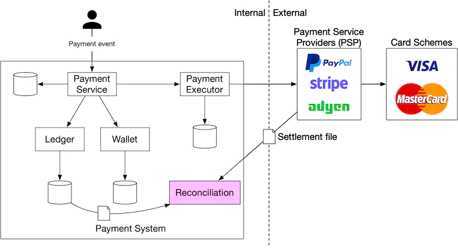

对账还用于验证支付系统内部是否一致。例如，账本和钱包的状态可能不同，我们可以使用对账系统来检测任何差异。

为了修复对账过程中发现的不匹配问题，我们通常依靠财务团队进行手动调整。不匹配和调整通常分为三类：

1. 不匹配是可分类的，调整可以自动化。在这种情况下，我们知道不匹配的原因，知道如何修复它，编写一个程序来自动进行调整是划算的。工程师可以自动进行不匹配分类和调整。
2. 不匹配是可以分类的，但我们无法自动调整。在这种情况下，我们知道不匹配的原因以及如何修复它，但编写自动调整程序的成本太高。不匹配被放入作业队列，财务团队手动修复不匹配。
3. 不匹配无法分类。在这种情况下，我们不知道不匹配是如何发生的。不匹配被放入一个特殊的作业队列。财务团队手动调查。

### 处理付款延迟

如前所述，端到端支付请求经过许多组件，涉及内部和外部各方。虽然在大多数情况下，支付请求会在几秒钟内完成，但在某些情况下，支付请求会停滞，有时需要数小时或数天才能完成或被拒绝。以下是支付请求可能比平时花费更长时间的一些示例：

- PSP 认为支付请求风险高，需要人工审核。
- 信用卡需要额外的保护，例如 3D 安全认证 [13]，它需要持卡人提供额外的详细信息来验证购买。

支付服务必须能够处理这些需要很长时间才能处理的支付请求。如果购买页面由外部 PSP 托管（这在当今非常常见），PSP 将通过以下方式处理这些长时间运行的支付请求：

- PSP 将向我们的客户返回待处理状态。我们的客户将向用户显示该状态。我们的客户还将为客户提供一个页面来检查当前的付款状态。
- PSP 代表我们跟踪待处理的付款，并通过向 PSP 注册的支付服务的 webhook 通知支付服务任何状态更新。

当支付请求最终完成时，PSP 会调用上面提到的已注册的 webhook。支付服务会更新其内部系统并完成向客户的发货。

或者，一些 PSP 不会通过 webhook 更新支付服务，而是将负担放在支付服务上，让支付服务轮询 PSP 以获取任何待处理的支付请求的状态更新。

### 内部服务之间的通信

内部服务使用两种类型的通信模式进行通信：同步与异步。下面将对这两种模式进行解释。

**同步通信**

像 HTTP 这样的同步通信对于小规模系统来说效果很好，但随着规模的扩大，它的缺点变得显而易见。它会产生一个依赖于许多服务的较长的请求和响应周期。这种方法的缺点是：

- 性能低下。如果链中的任何一项服务性能不佳，整个系统都会受到影响。
- 故障隔离性差。如果 PSP 或任何其他服务发生故障，客户端将不再收到响应。
- 紧耦合。请求发送者需要知道接收者。
- 难以扩展。如果不使用队列作为缓冲区，则很难扩展系统以支持流量的突然增加。

**异步通信**

异步通信可以分为两类：

- 单一接收者：每个请求（消息）由一个接收者或服务处理。它通常通过共享消息队列实现。消息队列可以有多个订阅者，但一旦处理了一条消息，它就会从队列中删除。让我们看一个具体的例子。在图 9 中，服务 A 和服务 B 都订阅了一个共享消息队列。当 m1 和 m2 分别被服务 A 和服务 B 使用时，两条消息都会从队列中删除，如图 10 所示。

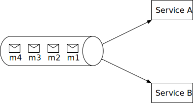

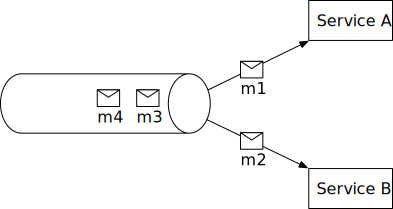

- 多个接收者：每个请求（消息）由多个接收者或服务处理。Kafka 在这里表现很好。消费者收到消息时，不会将其从 Kafka 中移除。同一条消息可以由不同的服务处理。此模型可以很好地映射到支付系统，因为同一个请求可能会触发多种副作用，例如发送推送通知、更新财务报告、分析等。图 11 显示了一个例子。支付事件发布到 Kafka 并由不同的服务（例如支付系统、分析服务和计费服务）使用。

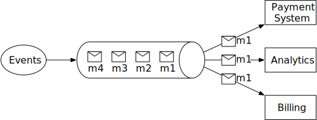

一般来说，同步通信的设计更简单，但它不允许服务自主。随着依赖图的增长，整体性能会受到影响。异步通信以设计的简单性和一致性为代价，以换取可扩展性和故障恢复能力。对于具有复杂业务逻辑和大量第三方依赖关系的大型支付系统，异步通信是更好的选择。

### 处理付款失败

每个支付系统都必须处理失败的交易。可靠性和容错能力是关键要求。我们回顾了一些应对这些挑战的技术。

#### 追踪付款状态

在支付周期的任何阶段拥有明确的支付状态至关重要。每当发生故障时，我们都可以确定支付交易的当前状态并决定是否需要重试或退款。支付状态可以保留在仅附加的数据库表中。

#### 重试队列和死信队列

为了妥善处理故障，我们使用重试队列和死信队列，如图 12 所示。

- 重试队列：可重试的错误（例如瞬态错误）将被路由到重试队列。
- 死信队列 [14]：如果一条消息反复失败，它最终会进入死信队列。死信队列可用于调试和隔离有问题的消息，以便检查以确定它们未成功处理的原因。

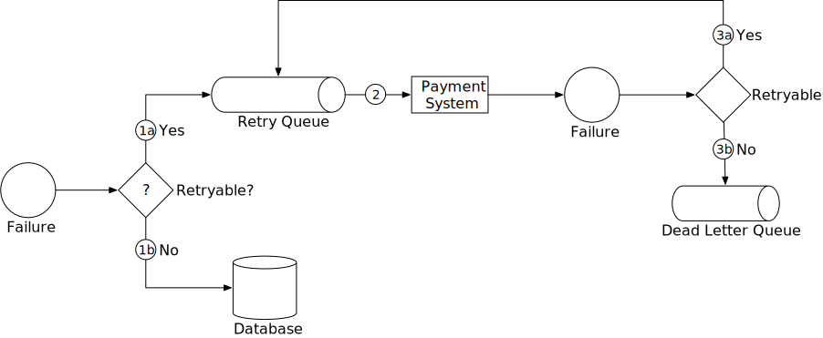

1. 检查失败是否可以重试。

   1a. 可重试的失败将被路由到重试队列。

   1b. 对于不可重试的故障（例如无效输入），错误将存储在数据库中。

2. 支付系统使用重试队列中的事件并重试失败的支付交易。

3. 如果支付交易再次失败：

   3a. 如果重试次数未超过阈值，则事件将被路由到重试队列。

   3b. 如果重试次数超过阈值，事件将被放入死信队列。这些失败的事件可能需要调查。

如果你对使用这些队列的真实示例感兴趣，请看一下 Uber 的支付系统，该系统利用 Kafka 来满足可靠性和容错要求 [16]。

### 精确一次传送

支付系统可能遇到的最严重问题之一是向客户收取双重费用。在我们的设计中，保证支付系统只执行一次支付订单非常重要 [16]。

乍一看，精确一次交付似乎很难解决，但如果我们将问题分成两部分，就容易得多。从数学上讲，如果满足以下条件，则操作精确执行一次：

1. 它至少执行一次。
2. 同时，它最多执行一次。

我们将解释如何使用重试实现至少一次，以及如何使用幂等性检查实现最多一次。

#### 重试

有时，由于网络错误或超时，我们需要重试支付交易。重试提供了至少一次的保证。例如，如图 13 所示，客户端尝试支付 10 美元，但由于网络连接不佳，支付请求不断失败。在此示例中，网络最终恢复，请求在第四次尝试时成功。

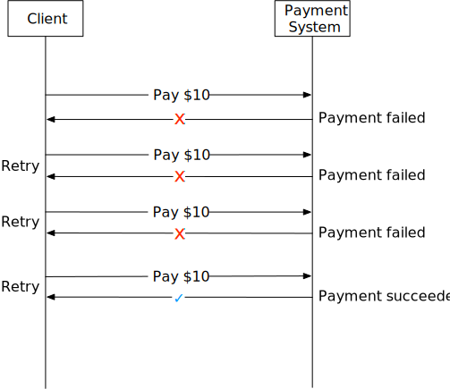

确定重试之间的适当时间间隔非常重要。以下是一些常见的重试策略。

- 立即重试：客户端立即重新发送请求。
- 固定间隔：在付款失败和再次重试之间等待固定的时间。
- 增量间隔：客户端第一次重试时等待一小段时间，然后逐步增加后续重试的时间。
- 指数退避 [17]：每次重试失败后，将重试之间的等待时间加倍。例如，当请求第一次失败时，我们会在 1 秒后重试；如果第二次失败，我们会在下次重试前等待 2 秒；如果第三次失败，我们会在下次重试前等待 4 秒。
- 取消：客户端可以取消请求。当失败是永久性的或重复的请求不太可能成功时，这是一种常见的做法。

确定合适的重试策略很困难。没有“一刀切”的解决方案。作为一般准则，如果网络问题不太可能在短时间内得到解决，请使用指数退避。过于激进的重试策略会浪费计算资源并可能导致服务过载。一个好的做法是提供带有 Retry-After 标头的错误代码。

重试的一个潜在问题是重复付款。让我们来看看两种情况。

**场景 1**：支付系统使用托管支付页面与 PSP 集成，客户单击支付按钮两次。

**场景二**：支付成功被PSP处理，但由于网络错误，响应未能到达我方支付系统，用户再次点击“支付”按钮或客户端重试支付。

为了避免重复支付，支付必须最多执行一次。这种最多一次的保证也称为幂等性。

#### 幂等性

幂等性是确保最多一次保证的关键。根据维基百科，“幂等性是数学和计算机科学中某些运算的属性，这些运算可以多次应用，而不会改变初次应用之外的结果”[18]。从 API 的角度来看，幂等性意味着客户端可以重复进行相同的调用并产生相同的结果。

对于客户端（Web 和移动应用程序）与服务器之间的通信，幂等密钥通常是客户端生成的唯一值，并在一定时间后过期。UUID 通常用作幂等密钥，许多科技公司（如 Stripe [19] 和 PayPal [20]）都推荐使用它。要执行幂等支付请求，需要在 HTTP 标头中添加幂等密钥：*<idempotency-key: key_value>*。

现在我们了解了幂等性的基本知识，让我们看看它如何帮助解决上面提到的双重支付问题。

**场景一：如果客户快速点击两次“付款”按钮会怎么样？**

在图 14 中，当用户点击“支付”时，幂等性密钥会作为 HTTP 请求的一部分发送到支付系统。在电子商务网站中，幂等性密钥通常是结账前购物车的 ID。

对于第二个请求，它被视为重试，因为支付系统已经看到了幂等性密钥。当我们在请求标头中包含先前指定的幂等性密钥时，支付系统将返回上一个请求的最新状态。

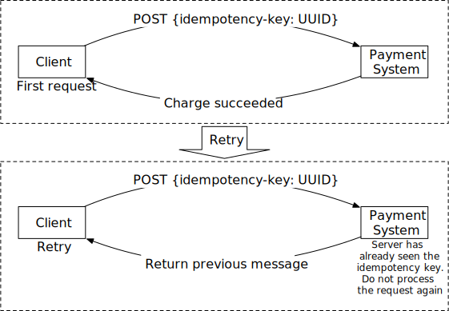

如果检测到多个并发请求具有相同的幂等性键，则只会处理一个请求，其他请求将收到*“429 请求过多”*状态代码。

为了支持幂等性，我们可以使用数据库的唯一键约束。例如，数据库表的主键用作幂等键。它的工作原理如下：

1. 当支付系统收到付款时，它会尝试在数据库表中插入一行。
2. 成功插入意味着我们之前没有见过此付款请求。
3. 如果由于相同的主键已经存在而导致插入失败，则意味着我们之前已经见过此支付请求。第二个请求将不会被处理。

**场景二：支付成功被PSP处理，但由于网络错误，响应未能到达我方支付系统，用户再次点击“支付”。**

如图4（步骤2和步骤3）所示，支付服务向PSP发送一个nonce，PSP返回一个对应的token，nonce唯一代表支付订单，token唯一映射到nonce，因此token也唯一映射到支付订单。

当用户再次点击支付按钮时，支付订单是相同的，因此发送给PSP的Token也是相同的，由于该Token在PSP端作为幂等性密钥，所以能够识别重复支付，并返回上次执行的状态。

### 一致性

在支付执行过程中会调用几个有状态的服务：

1. 支付服务保存与支付相关的数据，例如随机数、令牌、支付订单、执行状态等。
2. 分类账保存所有会计数据。
3. 钱包保存着商家的账户余额。
4. PSP 保留付款执行状态。
5. 数据可能会在不同的数据库副本之间复制以提高可靠性。

在分布式环境中，任何两个服务之间的通信都可能失败，从而导致数据不一致。让我们来看看解决支付系统中数据不一致的一些技术。

为了维护内部服务之间的数据一致性，确保一次性处理非常重要。

为了保持内部服务和外部服务 (PSP) 之间的数据一致性，我们通常依赖幂等性和对帐。如果外部服务支持幂等性，我们应该对付款重试操作使用相同的幂等性密钥。即使外部服务支持幂等 API，仍然需要对帐，因为我们不应该假设外部系统总是正确的。

如果数据被复制，复制滞后可能会导致主数据库和副本之间的数据不一致。通常有两种方法可以解决这个问题：

1. 仅从主数据库提供读取和写入服务。这种方法很容易设置，但明显的缺点是可扩展性。副本用于确保数据可靠性，但它们不提供任何流量，这会浪费资源。
2. 确保所有副本始终同步。我们可以使用 Paxos [21] 和 Raft [22] 等共识算法，或者使用基于共识的分布式数据库，例如 YugabyteDB [23] 或 CockroachDB [24]。

### 付款安全

支付安全非常重要。在本系统设计的最后一部分，我们简要介绍了几种对抗网络攻击和信用卡盗窃的技术。

| **问题**                  | **解决方案**                                         |
| :------------------------ | :--------------------------------------------------- |
| 请求/响应窃听             | 使用 HTTPS                                           |
| 数据篡改                  | 实施加密和完整性监控                                 |
| 中间人攻击                | 使用带证书固定的 SSL                                 |
| 数据丢失                  | 跨多个区域的数据库复制并拍摄数据快照                 |
| 分布式拒绝服务攻击 (DDoS) | 速率限制和防火墙 [25]                                |
| 信用卡盗窃                | 代币化。无需使用真实的卡号，而是存储代币并用于付款   |
| PCI 合规性                | PCI DSS 是针对处理品牌信用卡的组织的信息安全标准     |
| 欺诈罪                    | 地址验证、卡验证值（CVV）、用户行为分析等。[26] [27] |

表 6 支付安全

## 第 4 步 - 总结

在本章中，我们研究了支付流程和付款流程。我们深入探讨了重试、幂等性和一致性。本章最后还介绍了支付错误处理和安全性。

支付系统极其复杂。尽管我们已经讨论了许多主题，但还有更多值得一提的主题。以下是相关主题的代表性列表，但并非详尽无遗。

- 监控。监控关键指标是任何现代应用程序的关键部分。通过广泛的监控，我们可以回答诸如“特定付款方式的平均接受率是多少？”“我们服务器的 CPU 使用率是多少？”等问题。我们可以在仪表板上创建和显示这些指标。
- 警报。当出现异常情况时，重要的是要提醒值班开发人员，以便他们及时做出反应。
- 调试工具。“为什么付款会失败？”是一个常见问题。为了让工程师和客户支持人员更轻松地进行调试，开发允许员工查看付款交易的交易状态、处理服务器历史记录、PSP 记录等的工具非常重要。
- 货币兑换。为国际用户群设计支付系统时，货币兑换是一个重要的考虑因素。
- 地理位置。不同地区可能有完全不同的付款方式。
- 现金支付。现金支付在印度、巴西和其他一些国家非常普遍。Uber [28] 和 Airbnb [29] 撰写了详细的工程博客，介绍他们如何处理现金支付。
- Google/Apple pay 集成。如果感兴趣请阅读[30]。

恭喜你走到这一步！现在给自己一点鼓励吧。干得好！

## 章节总结

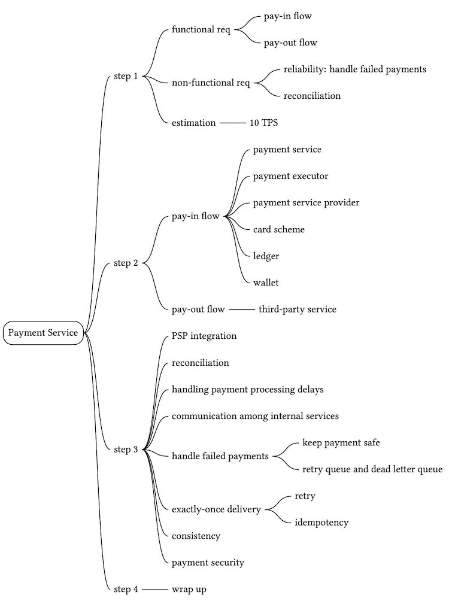

## 参考资料

[1] 支付系统：https://en.wikipedia.org/wiki/Payment_system

[2] 反洗钱/打击资助恐怖主义：https://en.wikipedia.org/wiki/Money_laundering

[3] 卡片方案：https://en.wikipedia.org/wiki/Card_scheme

[4] ISO 4217：https://en.wikipedia.org/wiki/ISO_4217

[5] Stripe API 参考：https://stripe.com/docs/api

[6] 复式簿记：https://en.wikipedia.org/wiki/Double-entry_bookkeeping

[7] Books，一种不可变的复式记账数据库服务：https://developer.squareup.com/blog/books-an-immutable-double-entry-accounting-database-service/

[8] 支付卡行业数据安全标准：https://en.wikipedia.org/wiki/Payment_Card_Industry_Data_Security_Standard

[9] 蒂帕尔蒂：https://tipalti.com/

[10] 随机数：https://en.wikipedia.org/wiki/Cryptographic_nonce

[11] Webhooks：https://stripe.com/docs/webhooks

[12] 自定义你的成功页面：https://stripe.com/docs/payments/checkout/custom-success-page

[13] 3D 安全：https://en.wikipedia.org/wiki/3-D_Secure

[14] Kafka Connect 深度探究 – 错误处理和死信队列：https://www.confluent.io/blog/kafka-connect-deep-dive-error-handling-dead-letter-queues/

[15] 流支付系统中的可靠处理：[(https://www.youtube.com/watch?v=5TD8m7w1xE0&list=PLLEUtp5eGr7Dz3fWGUpiSiG3d_WgJe-KJ](https://www.youtube.com/watch?v=5TD8m7w1xE0&list=PLLEUtp5eGr7Dz3fWGUpiSiG3d_WgJe-KJ)

[16] 具有 Exactly-Once 保证的链服务：https://www.confluent.io/blog/chain-services-exactly-guarantees/

[17] 指数退避：https://en.wikipedia.org/wiki/Exponential_backoff

[18]幂等性：https://en.wikipedia.org/wiki/Idempotence

[19] Stripe 幂等请求：https://stripe.com/docs/api/idempotent_requests

[20]幂等性：https://developer.paypal.com/docs/platforms/develop/idempotency/

[21]Paxos：https://en.wikipedia.org/wiki/Paxos_(computer_science)

[22] Raft：https://raft.github.io/

[23]YogabyteDB：https://www.yugabyte.com/

[24] Cockroachdb：https://www.cockroachlabs.com/

[25] 什么是 DDoS 攻击：https://www.cloudflare.com/learning/ddos/what-is-a-ddos-attack/

[26] 支付网关如何检测和预防网络欺诈：https://www.chargebee.com/blog/optimize-online-billing-stop-online-fraud/

[27] Uber 检测和预防欺诈的先进技术：https://eng.uber.com/advanced-technologies-detecting-preventing-fraud-uber/

[28] Uber Engineering 与印度重新构建现金和数字钱包支付：https://eng.uber.com/india-payments/

[29] 扩展 Airbnb 的支付平台：https://medium.com/airbnb-engineering/scaling-airbnbs-payment-platform-43ebfc99b324

[30] Uber 的支付整合：案例研究：[https://www.youtube.com/watch?v =yooCE5B0SRA](https://www.youtube.com/watch?v=yooCE5B0SRA)