支付平台通常会为客户提供数字钱包服务，这样他们就可以将钱存入钱包，以后再使用。例如，你可以从银行卡向数字钱包充值，当你在线购买产品时，你可以选择使用钱包中的钱付款。图 1 显示了此过程。

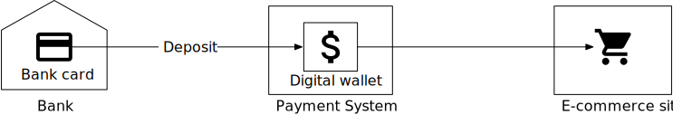

花钱并不是数字钱包提供的唯一功能。对于像 PayPal 这样的支付平台，我们可以在同一个支付平台上直接将钱转到别人的钱包中。与银行之间的转账相比，数字钱包之间的直接转账速度更快，最重要的是，它通常不收取额外费用。图 2 显示了跨钱包余额转移操作。

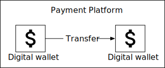

假设我们被要求设计一个支持跨钱包余额转移操作的数字钱包应用程序的后端。在面试开始时，我们会问一些澄清问题来确定需求。

## 步骤 1 - 了解问题并确定设计范围

**候选人：**我们是不是应该只关注两个数字钱包之间的余额转账操作？我们还需要考虑其他功能吗？
**面试官**：我们只关注余额转账操作吧。

**候选人**：系统需要支持每秒多少个交易（TPS）？
**面试官**：假设为 1,000,000 TPS。

**候选人**：数字钱包对正确性有严格的要求。我们能假设交易保证 [1] 就足够了吗？
**面试官**：听起来不错。

**候选人**：我们需要证明正确性吗？
**面试官**：这个问题问得好。正确性通常只能在交易完成后才能验证。验证方法之一是将我们的内部记录与银行对账单进行比较。对账的局限性在于它只显示差异，而不能说明差异是如何产生的。因此，我们希望设计一个具有可重复性的系统，这意味着我们可以通过从头开始重放数据来重建历史余额。

**候选人**：我们可以假设可用性要求是 99.99% 吗？
**面试官**：听起来不错。

**候选人**：我们需要把外汇考虑进去吗？
**面试官**：不，这不在考虑范围内。

综上所述，我们的数字钱包需要支持以下内容：

- 支持两个数字钱包之间的余额转移操作。
- 支持1,000,000 TPS。
- 可靠性至少为99.99%。
- 支持交易。
- 支持可重复性。

### 简单估算

当我们谈论 TPS 时，我们暗示将使用事务型数据库。如今，在典型的数据中心节点上运行的关系型数据库每秒可以支持几千个事务。例如，参考文献 [2] 包含一些流行的事务型数据库服务器的性能基准。假设一个数据库节点可以支持 1,000 TPS。为了达到 100 万 TPS，我们需要 1,000 个数据库节点。

但这个计算稍微有点不准确，每一条转账命令都需要两个操作：从一个账户扣钱，再往另一个账户存钱。要支持每秒100万笔转账，系统其实需要处理高达200万TPS，也就是说我们需要2000个节点。

表 1 显示了“单节点 TPS”（单个节点能够处理的 TPS）变化时所需的节点总数。假设硬件保持不变，单个节点每秒能够处理的交易越多，所需的节点总数就越少，这意味着硬件成本越低。所以我们的设计目标之一就是增加单个节点能够处理的交易数量。

| 每节点 TPS | 节点号 |
| :--------- | :----- |
| 100        | 20,000 |
| 1,000      | 2,000  |
| 10,000     | 200    |

表1 节点前TPS与节点数对应关系

## 第 2 步 - 提出高层设计并获得认可

在本节中，我们将讨论以下内容：

- API 设计
- 三个高级设计
  1. 简单的内存解决方案
  2. 基于数据库的分布式事务解决方案
  3. 具有可重复性的事件源解决方案

### API 设计

我们将使用 RESTful API 约定。对于本次采访，我们只需要支持一个 API：

| **API**                          | **细节**                         |
| :------------------------------- | :------------------------------- |
| POST /v1/wallet/balance_transfer | 将余额从一个钱包转移到另一个钱包 |

### 

请求参数为：

| **场地** | **描述**              | **类型**               |
| :------- | :-------------------- | :--------------------- |
| 来自账户 | 借记帐户              | 细绳                   |
| 到帐户   | 信用帐户              | 细绳                   |
| 数量     | 金额                  | 细绳                   |
| 货币     | 货币类型              | 字符串（ISO 4217 [3]） |
| 交易 ID  | 用于重复数据删除的 ID | 唯一标识               |

### 

响应主体示例：

```json
{
"Status": "success"
"Transaction_id": "01589980-2664-11ec-9621-0242ac130002"
}
```

值得一提的是，“amount”字段的数据类型是“string”，而不是“double”。我们在支付系统章节中解释了原因。

在实践中，许多人仍然选择使用浮点数或双精度数表示数字，因为几乎每种编程语言和数据库都支持它。只要我们了解丢失精度的潜在风险，它就是一个正确的选择。

### 内存分片解决方案

钱包应用程序会为每个用户帐户维护一个帐户余额。表示此 <用户,余额> 关系的良好数据结构是映射，也称为哈希表 (map) 或键值存储。

对于内存存储，一个流行的选择是 Redis。一个 Redis 节点不足以处理 100 万 TPS。我们需要设置一个 Redis 节点集群，并在它们之间均匀分配用户帐户。此过程称为分区或分片。

为了将键值数据分布到*N 个*分区中，我们可以计算键的哈希值并将其除以*N*。余数就是分区的目标。下面的伪代码显示了分片过程：

```c++
String accountID = "A";
Int partitionNumber = 7;
Int myPartition = accountID.hashCode() % partitionNumber;
```

所有 Redis 节点的分区数和地址可以集中存储在一个地方。我们可以使用 Zookeeper [4] 作为高可用的配置存储解决方案。

该解决方案的最后一个组件是处理转账命令的服务。我们称之为钱包服务，它有几个关键职责。

1. 接收转账命令
2. 验证转移命令
3. 如果命令有效，它将更新参与转账的两个用户的账户余额。在集群中，账户余额可能位于不同的 Redis 节点中

钱包服务是无状态的。它很容易水平扩展。图 3 显示了内存解决方案。

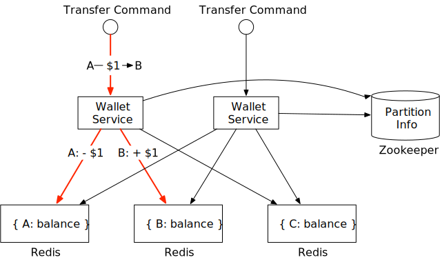

在这个例子中，我们有 3 个 Redis 节点。有三个客户端，A、B 和 C。他们的账户余额均匀分布在这三个 Redis 节点上。在这个例子中，有两个钱包服务节点处理余额转移请求。当其中一个钱包服务节点收到转移命令（即将余额转移）时，1来自客户A到客户B ，它向两个Redis节点发出两个命令。对于包含客户端A帐户的Redis节点，钱包服务产品1 从账户中扣除。对于客户端 B，钱包服务会向账户中添加 1 美元。

**候选人**：在此设计中，账户余额分布在多个 Redis 节点上。Zookeeper 用于维护分片信息。无状态钱包服务使用分片信息为客户端定位 Redis 节点并相应地更新账户余额。

**面试官**：这个设计虽然可行，但不符合我们的正确性要求。钱包服务每次转账都会更新两个 Redis 节点。无法保证两次更新都会成功。例如，如果钱包服务节点在第一次更新完成后但在第二次更新完成之前崩溃，则会导致转账不完整。这两次更新需要放在一个原子事务中。

### 分布式事务

#### 数据库分片

我们如何使对两个不同存储节点的更新具有原子性？第一步是将每个 Redis 节点替换为事务关系数据库节点。图 4 显示了该架构。这一次，客户端 A、B 和 C 被划分到 3 个关系数据库中，而不是 3 个 Redis 节点中。

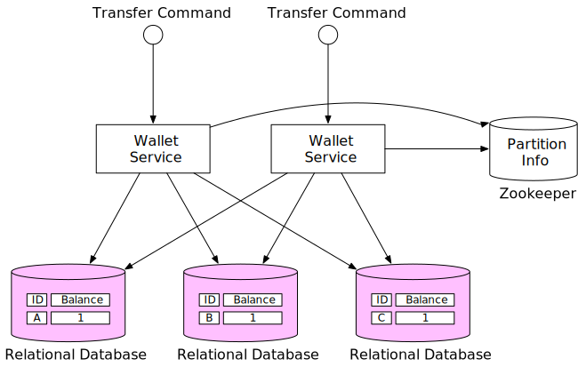

使用事务型数据库只能解决部分问题。如上一节所述，一个转账命令很可能需要更新两个不同数据库中的两个账户。无法保证两个更新操作会同时处理。如果钱包服务在更新第一个账户余额后立即重启，我们如何确保第二个账户也会被更新？

#### 分布式事务：两阶段提交

在分布式系统中，事务可能涉及多个节点上的多个进程。要使事务具有原子性，分布式事务可能是答案。有两种方法可以实现分布式事务：低级解决方案和高级解决方案。我们将分别介绍它们。

低级解决方案依赖于数据库本身。最常用的算法称为两阶段提交 (2PC)。顾名思义，它有两个阶段，如图 5 所示。

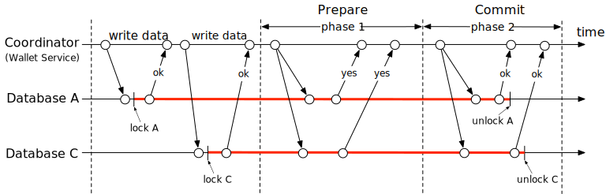

1. 协调器（在我们的例子中是钱包服务）照常对多个数据库执行读写操作。如图 5 所示，数据库 A 和 C 均被锁定。
2. 当应用程序即将提交事务时，协调器会要求所有数据库准备事务。
3. 在第二阶段，协调器收集来自所有数据库的回复并执行以下操作：
   1. 如果所有数据库都回答“是”，则协调器要求所有数据库提交它们收到的事务。
   2. 如果任何数据库回复“否”，协调器将要求所有数据库中止该事务。

这是一种低级解决方案，因为准备步骤需要对数据库事务进行特殊修改。例如，有一个 X/Open XA [6] 标准，用于协调异构数据库以实现 2PC。2PC 的最大问题是性能不佳，因为在等待来自其他节点的消息时，锁可能会被持有很长时间。2PC 的另一个问题是协调器可能成为单点故障，如图 6 所示。

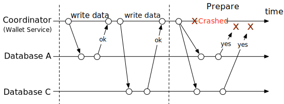

#### 分布式事务：尝试-确认/取消（TC/C）

TC/C 是一种补偿事务 [7]，它包含两个步骤：

1. 在第一阶段，协调器要求所有数据库为事务保留资源。
2. 在第二阶段，协调器收集来自所有数据库的回复：
   1. 如果所有数据库都回复“是”，协调器会要求所有数据库确认该操作，即尝试-确认过程。
   2. 如果任何一个数据库回复“否”，协调器就会要求所有数据库取消该操作，这就是 Try-Cancel 过程。

值得注意的是，2PC 中的两个阶段包含在同一个事务中，但在 TC/C 中每个阶段都是一个单独的事务。

**TC/C 示例**

用一个真实的例子来解释 TC/C 的工作原理会容易得多。假设我们要将 1 美元从账户 A 转移到账户 C。表 2 总结了 TC/C 在每个阶段的执行方式。

| 阶段 | 手术 | A             | C             |
| :--- | :--- | :------------ | :------------ |
| 1    | 尝试 | 余额变化：-$1 | 没做什么      |
| 2    | 确认 | 没做什么      | 余额变化：+$1 |
|      | 取消 | 余额变化：+$1 | 没做什么      |

表 2 TC/C 示例

假设钱包服务是 TC/C 的协调者。在分布式交易开始时，账户 A 有1我𝑛我吨𝑠𝑏𝐴升𝐴𝑛𝐶埃，𝐴𝑛𝑑𝐴𝐶𝐶𝑜你𝑛吨𝐶𝐻𝐴𝑠1*初始**余额*，***********并**有***************0。

**第一阶段：尝试**

在 Try 阶段，作为协调者的钱包服务向两个数据库发送两个交易命令：

1. 对于包含账户 A 的数据库，协调器启动一个本地事务，将 A 的余额减少 1 美元。
2. 对于包含帐户 C 的数据库，协调器会向其发送 NOP（无操作）。为了使示例适用于其他场景，我们假设协调器向此数据库发送 NOP 命令。数据库不会对 NOP 命令执行任何操作，并且始终向协调器回复成功消息。

Try 阶段如图 7 所示。粗线表示事务持有锁。

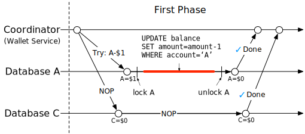

**第二阶段：确认**

如果两个数据库都回复“是”，钱包服务就会开始下一个确认阶段。

账户 A 的余额在第一阶段已经更新。钱包服务不需要更改其余额。但是，账户 C 尚未收到其1来自第一阶段的帐户A。在确认阶段，钱包服务必须添加1 到账户C的余额。

确认流程如图8所示。

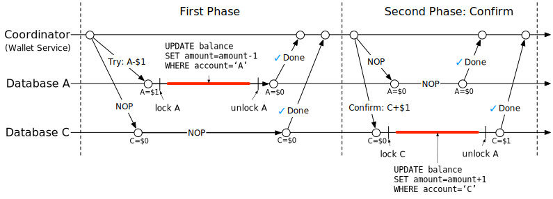

**第二阶段：取消**

如果第一个 Try 阶段失败了怎么办？在上面的例子中，我们假设对账户 C 的 NOP 操作总是成功，尽管在实践中它可能会失败。例如，账户 C 可能是一个非法账户，监管机构规定任何资金都不能流入或流出这个账户。在这种情况下，必须取消分布式事务，我们必须进行清理。

因为账户 A 的余额已经在 Try 阶段的交易中更新了，所以钱包服务不可能取消一个已经完成的交易。它能做的就是启动另一个交易来恢复 Try 阶段交易的效果，也就是将 1 美元重新加到账户 A 中。

由于账户C在Try阶段没有更新，所以钱包服务只需要向账户C的数据库发送一个NOP操作。

取消流程如图9所示。

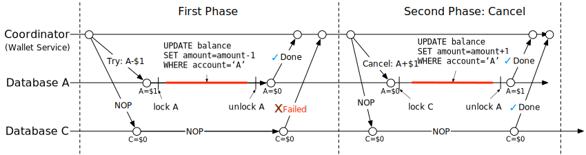

**2PC 与 TC/C 的比较**

表 3 显示 2PC 与 TC/C 之间有很多相似之处，但也有不同之处。在 2PC 中，第二阶段开始时所有本地事务都还未完成（仍处于锁定状态），而在 TC/C 中，第二阶段开始时所有本地事务都已完成（解锁）。换句话说，2PC 的第二阶段是关于完成未完成的事务，例如中止或提交，而在 TC/C 中，第二阶段是关于在发生错误时使用反向操作来抵消先前的事务结果。下表总结了它们的区别。

|      | **第一阶段**                           | **第二阶段：成功**                | **第二阶段：失败**                   |
| ---- | -------------------------------------- | --------------------------------- | ------------------------------------ |
| 2PC  | 本地交易尚未完成                       | 提交所有本地事务 取消所有本地事务 | 取消所有本地交易                     |
| 碳碳 | 所有本地事务均已完成（已提交或已取消） | 如果需要，执行新的本地交易        | 撤销已提交事务的副作用，或称为“撤销” |

表 3 2PC 与 TC/C

TC/C 也被称为补偿式分布式事务。它是一种高级解决方案，因为补偿（也称为“撤销”）是在业务逻辑中实现的。这种方法的优点是它与数据库无关。只要数据库支持事务，TC/C 就可以工作。缺点是我们必须在应用程序层的业务逻辑中管理细节并处理分布式事务的复杂性。

**阶段状态表**

我们还没有回答之前提出的问题；如果钱包服务在 TC/C 中途重新启动怎么办？重新启动时，所有以前的操作历史记录可能会丢失，系统可能不知道如何恢复。

解决方案很简单。我们可以将 TC/C 的进度作为阶段状态存储在事务数据库中。阶段状态至少包括以下信息。

- 分布式事务的ID和内容。
- 每个数据库的 Try 阶段的状态。状态可以是“尚未发送”、“已发送”和“收到响应”。
- 第二阶段的名称。可以是“确认”或“取消”。可以使用 Try 阶段的结果来计算。
- 第二阶段的状态。
- 无序标志（“无序执行”部分很快会解释）。

我们应该把阶段状态表放在哪里？通常，我们将阶段状态存储在包含从中扣除资金的钱包账户的数据库中。更新后的架构图如图 10 所示。

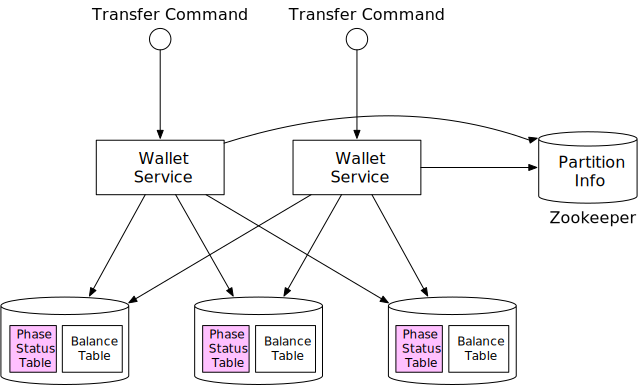

**不平衡状态**

你是否注意到，在 Try 阶段结束时，$1 不见了（图 11）？

假设一切进展顺利，在尝试阶段结束时，1从会计科目A和C中扣除，保持不变。A和C中的科目余额总计将0，小于 TC/C 开头的金额。这违反了会计的基本规则，即交易后金额应保持不变。

好消息是，事务保证仍然由 TC/C 维护。TC/C 由多个独立的本地事务组成。由于 TC/C 由应用程序驱动，因此应用程序本身能够看到这些本地事务之间的中间结果。另一方面，数据库事务或分布式事务的 2PC 版本由对高级应用程序不可见的数据库维护。

分布式事务执行过程中总会存在数据差异。这些差异可能对我们来说是透明的，因为数据库等底层系统已经修复了这些差异。如果没有，我们必须自己处理（例如 TC/C）。

不平衡状态如图11所示。

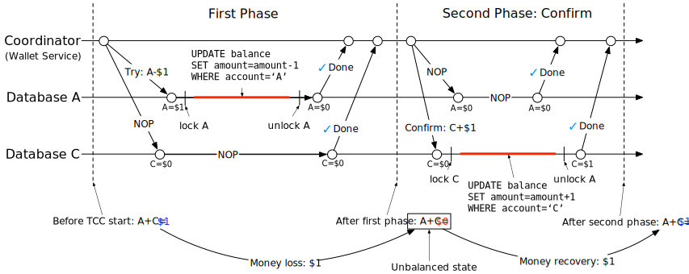

**有效操作指令**

Try 阶段有三种选择：

| 尝试阶段选择 | 帐户 A | 帐户 C |
| :----------- | :----- | :----- |
| 选择 1       | -$1    | 不适用 |
| 选择 2       | 不适用 | +1美元 |
| 选择 3       | -$1    | +1美元 |

表 4 尝试阶段选择

所有这三种选择看起来似乎合理，但有些则不正确。

对于选择 2，如果帐户 C 上的“尝试”阶段成功，但帐户 A 上的“尝试”阶段失败（NOP），则钱包服务需要进入“取消”阶段。有可能其他人会介入并移动1远离mac账户。后来当钱包服务尝试1 从账户C中取出后，发现什么都没有了，这违反了分布式事务的事务保证。

对于选择 3，如果1是从macaccount中扣除并同时添加到accountC中的，引入了很多复杂功能。例如，1添加到C账户，但是无法从A账户中扣除款项，这种情况该怎么办？

因此，选项 2 和选项 3 是有缺陷的选择，只有选项 1 有效。

**无序执行**

TC/C 的一个副作用是无序执行。举个例子会更容易解释。

我们重复使用上面的示例，将 1 美元从帐户 A 转移到帐户 C。如图 12 所示，在尝试阶段，针对帐户 A 的操作失败并向钱包服务返回失败，钱包服务随后进入取消阶段并向帐户 A 和帐户 C 发送取消操作。

假设处理帐户 C 的数据库出现一些网络问题，它在 Try 指令之前收到了 Cancel 指令。在这种情况下，没有什么可取消的。

无序执行如图12所示。

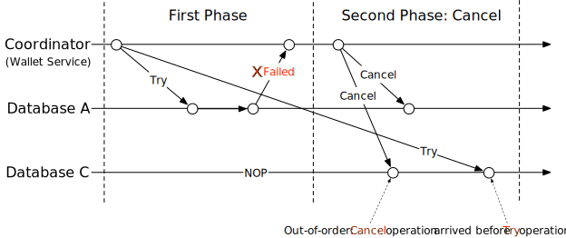

为了处理无序操作，每个节点都可以在未收到 Try 指令的情况下取消 TC/C，方法是通过以下更新增强现有逻辑：

- 无序的 Cancel 操作会在数据库中留下一个标志，表明它已经看到过 Cancel 操作，但是还没有看到 Try 操作。
- Try 操作得到增强，因此它总是检查是否存在无序标志，如果存在则返回失败。

这就是为什么我们在“阶段状态表”部分的阶段状态表中添加了无序标志的原因。

#### 分布式事务：Saga

**线性订单执行**

还有另一种流行的分布式事务解决方案，称为 Saga [8]。Saga 是微服务架构中的事实标准。Saga 的理念很简单：

1. 所有操作均按顺序排列。每个操作都是其自己数据库上的独立事务。
2. 操作按从第一个到最后一个的顺序执行。当一个操作完成后，将触发下一个操作。
3. 当操作失败时，整个过程将使用补偿事务从当前操作开始以相反的顺序回滚到第一个操作。因此，如果分布式事务有*n 个*操作，我们需要准备 2 *n 个*操作：*n 个*用于正常情况，另一个*n 个*用于回滚期间的补偿事务。

举个例子更容易理解。图 13 展示了将 1 美元从账户 A 转移到账户 C 的 Saga 工作流。顶部的水平线显示了正常的执行顺序。两条垂直线显示了系统在出现错误时应该做什么。当遇到错误时，转账操作会回滚，客户端会收到错误消息。正如我们在“有效的操作顺序”部分中提到的，我们必须将减法操作放在加法操作之前。

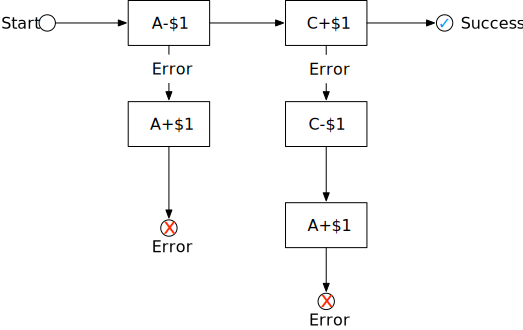

我们如何协调这些行动？有两种方法可以做到：

1. 编排。在微服务架构中，Saga 分布式事务中涉及的所有服务都通过订阅其他服务的事件来完成其工作。因此，它是完全分散的协调。
2. 编排。单个协调器指示所有服务按照正确的顺序完成工作。

选择使用哪种协调模型取决于业务需求和目标。编排解决方案的挑战在于服务以完全异步的方式进行通信，因此每个服务都必须维护一个内部状态机，以便了解当其他服务发出事件时该做什么。当有许多服务时，管理起来会变得困难。编排解决方案可以很好地处理复杂性，因此它通常是数字钱包系统中的首选解决方案。

**TC/C 与 Saga 的比较**

TC/C与Saga都是应用级分布式事务，表5总结了两者的相同点与不同点。

|                          | 碳碳         | 佐贺           |
| :----------------------- | :----------- | :------------- |
| 补偿作用                 | 处于取消阶段 | 处于回滚阶段   |
| 集中协调                 | 是的         | 是（编排模式） |
| 操作执行顺序             | 任何         | 线性           |
| 并行执行的可能性         | 是的         | 否（线性执行） |
| 可以看到部分不一致的状态 | 是的         | 是的           |
| 应用程序或数据库逻辑     | 应用         | 应用           |

表 5 TC/C 与 Saga 对比

在实践中我们应该使用哪一个？答案取决于延迟要求。如表 5 所示，Saga 中的操作必须按线性顺序执行，但可以在 TC/C 中并行执行它们。因此，决定取决于几个因素：

1. 如果没有延迟要求，或者服务很少，比如我们的转账示例，我们可以选择其中之一。如果我们想顺应微服务架构的潮流，那就选择 Saga。
2. 如果系统对延迟敏感且包含许多服务/操作，TC/C 可能是一个更好的选择。

**候选人**：为了使余额转移具有事务性，我们用关系数据库替换Redis，并使用TC / C或Saga实现分布式事务。

**面试官**：干得好！分布式事务解决方案确实有效，但可能存在一些不太好的情况。例如，用户可能在应用程序级别输入了错误的操作。在这种情况下，我们指定的金额可能不正确。我们需要一种方法来追溯问题的根本原因并审计所有帐户操作。我们该怎么做？

### 事件溯源

#### 背景

在现实生活中，数字钱包提供商可能会受到审计。这些外部审计师可能会问一些棘手的问题，例如：

1. 我们是否知道任意时刻的账户余额？
2. 我们如何知道历史和当前账户余额是正确的？
3. 代码改变后，如何证明系统逻辑是正确的？

系统地回答这些问题的一种设计理念是事件源，它是领域驱动设计 (DDD) [9] 中开发的一种技术。

#### 定义

事件源中有四个重要术语。

1. 命令
2. 事件
3. 状态
4. 状态机

**命令**

命令是来自外界的预期动作。例如，如果我们想从客户端 A 向客户端 C 转账 1 美元，这个转账请求就是一个命令。

在事件源中，一切都有顺序非常重要。因此命令通常被放入 FIFO（先进先出）队列中。

**事件**

命令是意图，不是事实，因为有些命令可能无效，无法实现。例如，如果转账后账户余额为负数，则转账操作会失败。

我们必须先验证命令，然后才能对命令执行任何操作。一旦命令通过验证，它就是有效的，必须执行。执行的结果称为事件。

命令和事件之间有两个主要区别。

1. 事件必须执行，因为它们代表了经过验证的事实。在实践中，我们通常使用过去时态来表示事件。如果命令是“转移1从A到C ” ，相应的事件将是“转移错误∗∗ e∗∗1从A到C”。
2. 命令可能包含随机性或 I/O，但事件必须是确定性的。事件代表历史事实。

事件生成过程有两个重要属性。

1. 一个命令可以生成任意数量的事件。它可以生成零个或多个事件。
2. 事件生成可能包含随机性，这意味着不能保证命令总是生成相同的事件。事件生成可能包含外部 I/O 或随机数。我们将在本章末尾更详细地重新讨论此属性。

事件的顺序必须遵循命令的顺序。因此，事件也存储在 FIFO 队列中。

**状态**

状态是当事件发生时会发生改变的内容。在钱包系统中，状态是所有客户账户的余额，可以用映射数据结构表示。键是账户名称或 ID，值是账户余额。键值存储通常用于存储映射数据结构。关系数据库也可以看作是键值存储，其中键是主键，值是表行。

**状态机**

状态机驱动事件源流程。它有两个主要功能。

1. 验证命令并生成事件。
2. 应用事件来更新状态。

事件源要求状态机的行为具有确定性。因此，状态机本身不应包含任何随机性。例如，它不应使用 I/O 从外部读取任何随机内容，也不应使用任何随机数。当它将事件应用于状态时，它应该始终生成相同的结果。

图 14 显示了事件源架构的静态视图。状态机负责将命令转换为事件并应用事件。由于状态机有两个主要功能，我们通常绘制两个状态机，一个用于验证命令，另一个用于应用事件。

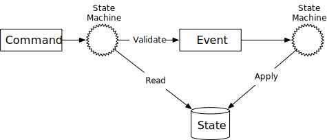

如果加上时间维度，图 15 就展示了事件源的动态视图，系统不断接收命令，并逐一处理。

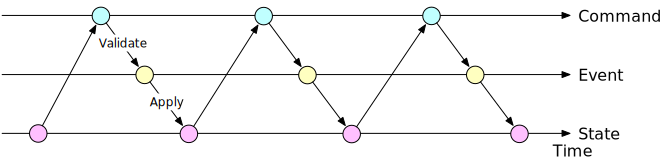

#### 钱包服务示例

对于钱包服务，命令是余额转移请求。这些命令被放入 FIFO 队列中。命令队列的一个流行选择是 Kafka [10]。命令队列如图 16 所示。

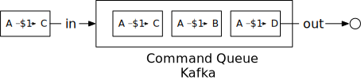

假设状态（账户余额）存储在关系数据库中。状态机按 FIFO 顺序逐一检查每个命令。对于每个命令，它会检查账户是否有足够的余额。如果是，状态机将为每个帐户生成一个事件。例如，如果命令是“A->1−C ” ，状态机生成两个事件：“ A：−1”和“C:+$1”。

图 17 显示了状态机如何分 5 个步骤工作。

1. 从命令队列读取命令。
2. 从数据库读取平衡状态。
3. 验证命令。如果有效，则为每个帐户生成两个事件。
4. 阅读下一个事件。
5. 通过更新数据库中的余额来应用事件。

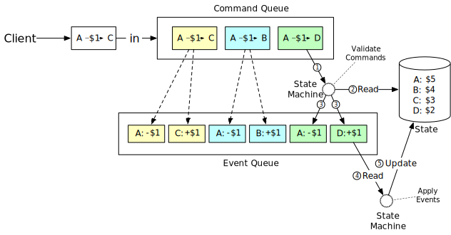

#### 可重复性

事件源相对于其他架构最重要的优势是可重复性。

在前面提到的分布式交易解决方案中，钱包服务将更新后的账户余额（状态）保存到数据库中。很难知道账户余额为何发生变化。同时，在更新操作过程中会丢失历史余额信息。在事件源设计中，所有更改首先保存为不可变的历史记录。数据库仅用作在任何给定时间点余额的更新视图。

我们总是可以通过从头开始重播事件来重建历史平衡状态。由于事件列表是不可变的，并且状态机逻辑是确定性的，因此可以保证每次重播生成的历史状态都是相同的。

图 18 展示了如何通过重播事件来重现钱包服务的状态。

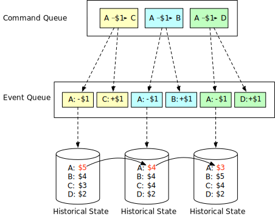

可重复性有助于我们回答审计员在本节开头提出的难题。我们在这里重复这些问题。

1. 我们是否知道任意时刻的账户余额？
2. 我们如何知道历史和当前账户余额是正确的？
3. 代码更改后如何证明系统逻辑是正确的？

对于第一个问题，我们可以通过重播从一开始的事件来回答，直到我们想要知道账户余额的时间点。

对于第二个问题，我们可以通过从事件列表中重新计算来验证账户余额的正确性。

对于第三个问题，我们可以针对事件运行不同版本的代码并验证它们的结果是相同的。

由于其审计能力，事件源通常被选为钱包服务的事实上的解决方案。

#### 命令查询责任分离（CQRS）

到目前为止，我们已经设计了钱包服务，以便高效地将资金从一个账户转移到另一个账户。但是，客户端仍然不知道账户余额是多少。需要有一种方法来发布状态（余额信息），以便事件源框架之外的客户端可以知道状态是什么。

直观地讲，我们可以创建数据库（历史状态）的只读副本并与外界共享。事件源以略有不同的方式回答了这个问题。

事件源不会发布状态（余额信息），而是发布所有事件。外部世界可以自行重建任何定制状态。这种设计理念称为 CQRS [11]。

在 CQRS 中，有一个状态机负责状态的写入部分，但可以有多个只读状态机，它们负责构建状态的视图。这些视图可用于查询。

这些只读状态机可以从事件队列中派生出不同的状态表示。例如，客户可能想知道他们的余额，只读状态机可以将状态保存在数据库中以提供余额查询服务。另一个状态机可以为特定时间段构建状态，以帮助调查可能出现的重复收费等问题。状态信息是一种审计线索，可以帮助核对财务记录。

只读状态机虽然会落后一些，但总会赶上来。架构设计是最终一致的。

图 19 展示了经典的 CQRS 架构。

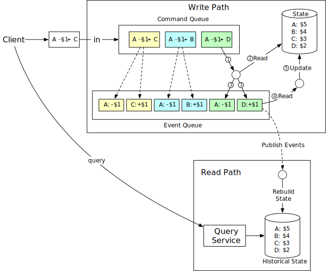

**候选人**：在这个设计中，我们使用事件源架构来使整个系统具有可重现性。所有有效的业务记录都保存在一个不可变的事件队列中，可用于正确性验证。

**面试官**：那太好了。但是你提出的事件溯源架构每次只能处理一个事件，而且需要与多个外部系统进行通信。我们可以让它更快吗？

## 步骤 3 - 深入设计

在本节中，我们将深入探讨实现高性能、可靠性和可扩展性的技术。

### 高性能事件源

在前面的示例中，我们使用 Kafka 作为命令和事件存储，使用数据库作为状态存储。让我们探索一些优化。

#### 基于文件的命令和事件列表

第一个优化是将命令和事件保存到本地磁盘，而不是像 Kafka 这样的远程存储。这避免了跨网络的传输时间。事件列表使用仅追加的数据结构。追加是一种顺序写入操作，通常非常快。它甚至适用于磁性硬盘，因为操作系统针对顺序读写进行了大量优化。根据这篇 ACM Queue 文章 [12]，在某些情况下，顺序磁盘访问可能比随机内存访问更快。

第二个优化是将最近的命令和事件缓存在内存中。正如我们之前所解释的，我们在命令和事件持久化后就立即处理它们。我们可以将它们缓存在内存中，以节省从本地磁盘加载它们的时间。

我们将探讨一些实现细节。一种称为 mmap [13] 的技术非常适合实现前面提到的优化。mmap 可以同时写入本地磁盘并将最新内容缓存在内存中。它将磁盘文件作为数组映射到内存中。操作系统将文件的某些部分缓存在内存中以加速读写操作。对于仅附加文件操作，几乎可以保证所有数据都保存在内存中，这非常快。

图 20 显示了基于文件的命令和事件存储。

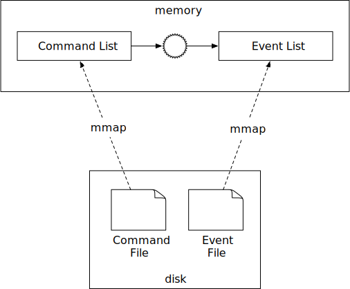

#### 基于文件的状态

在之前的设计中，状态（余额信息）是保存在关系型数据库中的。在生产环境中，数据库通常运行在单机服务器中，只能通过网络访问。和我们对 command 和 event 所做的优化类似，状态信息也可以保存到本地磁盘。

更具体地说，我们可以使用 SQLite [14]，它是一个基于文件的本地关系数据库，或者使用 RocksDB [15]，它是一个基于本地文件的键值存储。

之所以选择 RocksDB，是因为它使用了日志结构合并树 (LSM)，该树针对写入操作进行了优化。为了提高读取性能，最新的数据会被缓存。

图 21 显示了基于文件的命令、事件和状态的解决方案。


#### 快照

一旦一切都基于文件，让我们考虑如何加速可重复性过程。当我们第一次引入可重复性时，状态机每次都必须从头开始处理事件。我们可以优化的是定期停止状态机并将当前状态保存到文件中。这称为快照。

快照是历史状态的不可变视图。一旦保存了快照，状态机就不必再从头开始重新启动。它可以从快照中读取数据，验证中断的位置，然后从那里恢复处理。

对于钱包服务等金融应用，财务团队经常需要在 00:00 拍摄快照，以便他们可以验证当天发生的所有交易。当我们第一次引入事件源的 CQRS 时，解决方案是设置一个只读状态机，从头开始读取，直到满足指定时间。使用快照，只读状态机只需加载一个包含数据的快照。

快照是一个巨大的二进制文件，常见的解决方案是将其保存在对象存储解决方案中，例如 HDFS [16]。

图 22 显示了基于文件的事件源架构。当一切都基于文件时，系统可以充分利用计算机硬件的最大 I/O 吞吐量。


**候选人**：我们可以重构事件源的设计，以便命令列表、事件列表、状态和快照都保存在文件中。事件源架构以线性方式处理事件列表，这非常适合硬盘和操作系统缓存的设计。

**面试官**：基于本地文件的解决方案的性能优于需要从远程 Kafka 和数据库访问数据的系统。但是，还有一个问题：由于数据保存在本地磁盘上，服务器现在是有状态的，并且会成为单点故障。我们如何提高系统的可靠性？

### 可靠的高性能事件源

在解释解决方案之前，让我们先检查一下系统中需要可靠性保证的部分。

#### 可靠性分析

从概念上讲，节点所做的一切都围绕两个概念：数据和计算。只要数据是持久的，就可以通过在另一个节点上运行相同的代码来轻松恢复计算结果。这意味着我们只需要担心数据的可靠性，因为如果数据丢失，它将永远丢失。系统的可靠性主要与数据的可靠性有关。

我们的系统中有四种类型的数据。

1. 基于文件的命令
2. 基于文件的事件
3. 基于文件的状态
4. 状态快照

让我们仔细看看如何确保每种类型的数据的可靠性。

状态和快照总是可以通过重放事件列表来重新生成。为了提高状态和快照的可靠性，我们只需要确保事件列表具有强可靠性即可。

现在让我们来看一下命令。从表面上看，事件是由命令生成的。我们可能认为为命令提供强大的可靠性保证就足够了。乍一看这似乎是正确的，但它忽略了一些重要的东西。事件生成不能保证是确定性的，也可能包含随机因素，例如随机数、外部 I/O 等。因此，命令无法保证事件的可重复性。

现在是时候仔细看看事件了。事件代表引入状态（帐户余额）变化的历史事实。事件是不可变的，可用于重建状态。

从这个分析中，我们得出结论，事件数据是唯一需要高可靠性保证的数据。我们将在下一节中解释如何实现这一点。

#### 共识

为了提供高可靠性，我们需要在多个节点上复制事件列表。在复制过程中，我们必须保证以下属性。

1. 没有数据丢失。
2. 日志文件中数据的相对顺序在各个节点之间保持不变。

为了实现这些保证，基于共识的复制是一个不错的选择。共识算法确保多个节点就事件列表达成共识。让我们以 Raft [17] 共识算法为例。

Raft 算法保证只要有超过半数的节点在线，这些节点上的 append-only 列表的数据就一定一致。比如我们有 5 个节点，使用 Raft 算法同步它们的数据，只要至少有 3 个（超过半数）节点在线（如图 23 所示），整个系统就能正常工作：


在Raft算法中，一个节点可以扮演三种不同的角色。

1. 领导者
2. 候选人
3. 追随者

我们可以在 Raft 论文中找到 Raft 算法的实现。我们在这里只介绍高级概念，而不会详细介绍。在 Raft 中，最多一个节点是集群的领导者，其余节点是追随者。领导者负责接收外部命令并在集群中的节点之间可靠地复制数据。

使用 Raft 算法，只要大多数节点正常运行，系统就是可靠的。例如，如果集群中有 3 个节点，它可以容忍 1 个节点故障，如果有 5 个节点，它可以容忍 2 个节点故障。

#### 可靠的解决方案

有了复制，我们基于文件的事件源架构就不会出现单点故障。让我们来看看实现细节。图 24 显示了具有可靠性保证的事件源架构。

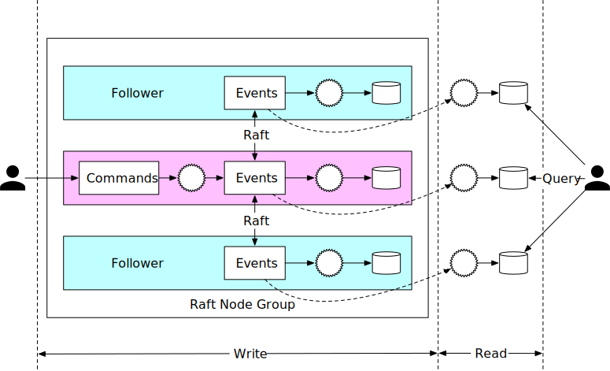

在图 24 中，我们设置了 3 个事件源节点。这些节点使用 Raft 算法可靠地同步事件列表。

Leader 接收来自外部用户的命令请求，将其转换为事件，并将事件追加到本地事件列表中。Raft 算法将新添加的事件复制到 Follower。

所有节点（包括跟随者）都会处理事件列表并更新状态。Raft 算法确保领导者和跟随者具有相同的事件列表，而事件源则保证只要事件列表相同，所有状态都是相同的。

可靠的系统需要妥善处理故障，因此让我们探索如何处理节点崩溃。

如果领导者崩溃，Raft 算法会自动从剩余的健康节点中选出新的领导者。新选出的领导者负责接受来自外部用户的命令。这可以保证当某个节点宕机时，整个集群能够继续提供服务。

当领导者崩溃时，崩溃可能发生在命令列表转换为事件之前。在这种情况下，客户端会通过超时或收到错误响应来注意到该问题。客户端需要向新当选的领导者重新发送相同的命令。

相比之下，跟随者崩溃更容易处理。如果跟随者崩溃，发送给它的请求将失败。Raft 通过无限重试来处理故障，直到崩溃的节点重新启动或新节点替换它。

**Candidate** : 在这个设计中，我们使用 Raft 共识算法在多个节点之间复制事件列表。领导者接收命令并将事件复制到其他节点。

**面试官**：是的，系统更可靠，容错性更强。但是，为了处理 100 万 TPS，一台服务器是不够的。我们如何使系统更具可扩展性？

### 分布式事件源

在上一节中，我们解释了如何实现可靠的高性能事件源架构。它解决了可靠性问题，但有两个局限性。

1. 当数字钱包更新时，我们希望立即收到更新结果。但在 CQRS 设计中，请求/响应流程可能很慢。这是因为客户端不知道数字钱包何时更新，客户端可能需要依赖定期轮询。
2. 单个Raft组的容量是有限的，在一定规模下，我们需要对数据进行分片，实现分布式事务。

让我们看看这两个问题是如何解决的。

#### 拉取与推送

在拉取模型中，外部用户定期从只读状态机轮询执行状态。此模型不是实时的，如果轮询频率设置得太高，可能会导致钱包服务过载。图 25 显示了拉取模型。

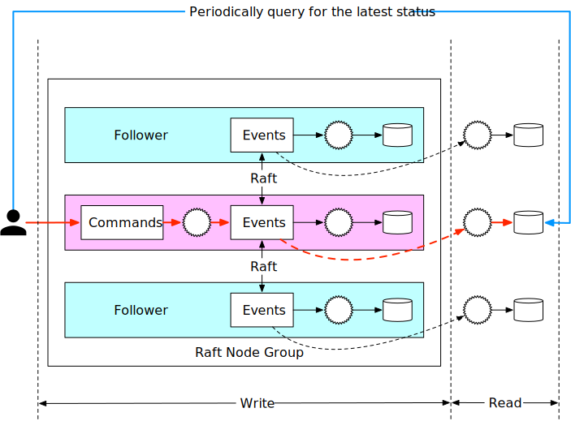

通过在外部用户和事件源节点之间添加反向代理 [18]，可以改进简单的拉取模型。在此设计中，外部用户向反向代理发送命令，反向代理将命令转发给事件源节点并定期轮询执行状态。此设计简化了客户端逻辑，但通信仍然不是实时的。

图 26 显示了添加了反向代理的拉模型。

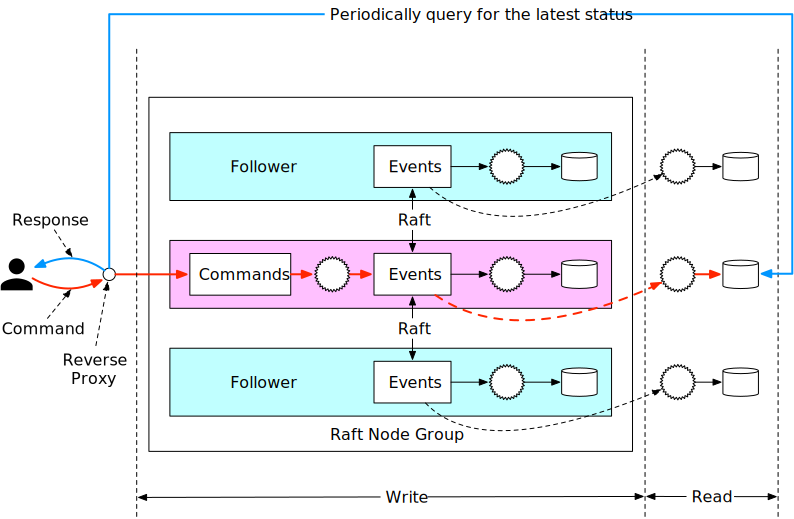

有了反向代理之后，我们可以通过修改只读状态机来加快响应速度。前面我们提到过，只读状态机可以有自己的行为。比如，一个行为可以是只读状态机在收到事件后立即将执行状态推送回反向代理。这样会给用户一种实时响应的感觉。

图 27 显示了基于推送的模型。


#### 分布式事务

一旦每个事件源节点组都采用同步执行，我们就可以重用分布式事务解决方案 TC/C 或 Saga。假设我们通过将键的哈希值除以 2 来对数据进行分区。

图 28 显示了更新后的设计。


让我们看一下最终的分布式事件源架构中的资金转移是如何进行的。为了更容易理解，我们使用 Saga 分布式事务模型，并且只解释快乐路径，没有任何回滚。

转账操作包含两个分布式操作：A-1和C +1. Saga协调器协调执行，如图29所示：

1. 用户 A 向 Saga 协调器发送分布式事务。它包含两个操作：1和C +1.
2. Saga 协调器在阶段状态表中创建一条记录来追踪事务的状态。
3. Saga 协调器检查操作顺序，并确定需要处理 A-1第一.协调器发送A −1 作为对分区 1 的命令，其中包含账户 A 的信息。
4. 分区 1 的 Raft 领导者收到 A-1命令并将其存储在命令列表中。然后验证命令。如果有效，它被转换为一个事件。Raft共识算法用于跨不同节点同步数据。事件（减少1）同步完成后执行。
5. 事件同步完成后，Partition 1的事件源框架会通过CQRS将数据同步到读路径，读路径会重新构建状态和执行状况。
6. 分区 1 的读取路径将状态推回事件源框架的调用者，即 Saga 协调器。
7. Saga 协调器从分区 1 接收成功状态。
8. Saga 协调器在阶段状态表中创建一条记录，表明分区 1 中的操作成功。
9. 由于第一个操作成功，Saga 协调器执行第二个操作，即 C+1.协调器发送C +1 作为命令发送到包含帐户 C 信息的分区 2。
10. 分区 2 的 Raft 领导者收到 C+1命令并将其保存到命令列表中。如果有效，它被转换为一个事件。Raft共识算法用于跨不同节点同步数据。事件（添加1到C账户）在同步完成后执行。
11. 事件同步完成后，Partition 2的事件源框架会通过CQRS将数据同步到读路径，读路径会重新构建状态和执行状况。
12. 分区 2 的读取路径将状态推回事件源框架的调用者，即 Saga 协调器。
13. Saga 协调器从分区 2 接收成功状态。
14. Saga 协调器在阶段状态表中创建一条记录，表明分区 2 中的操作成功。
15. 此时，所有操作均成功，分布式事务完成。Saga 协调器将结果响应给其调用者。

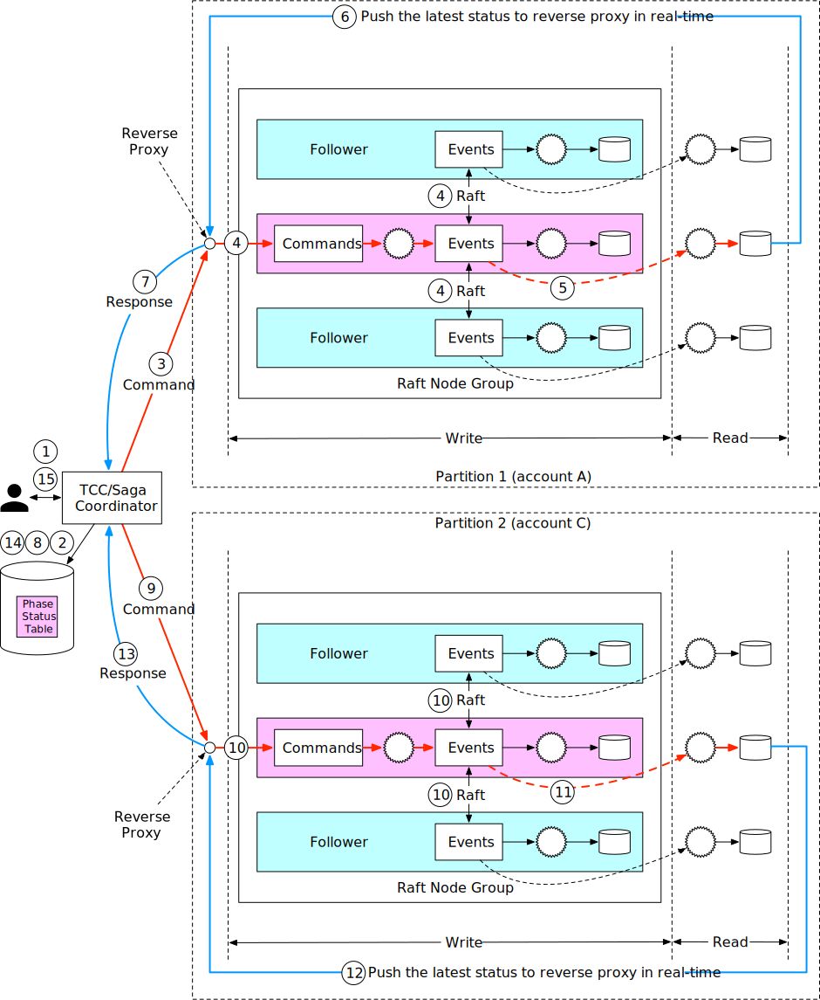

## 第 4 步 - 总结

在本章中，我们设计了一个每秒能够处理超过 100 万条支付命令的钱包服务。经过粗略估计，我们得出结论，需要几千个节点来支撑这样的负载。

在第一个设计中，提出了使用 Redis 等内存键值存储的解决方案。这种设计的问题在于数据不持久。

在第二种设计中，内存缓存被事务数据库取代。为了支持多个节点，提出了不同的事务协议，例如 2PC、TC/C 和 Saga。基于事务的解决方案的主要问题是我们无法轻松进行数据审计。

接下来介绍事件源。我们首先使用外部数据库和队列实现了事件源，但性能不佳。我们通过将命令、事件和状态存储在本地节点中来提高性能。

单节点意味着单点故障。为了提高系统可靠性，我们使用 Raft 共识算法将事件列表复制到多个节点上。

我们所做的最后一个改进是采用事件源的 CQRS 功能。我们添加了一个反向代理，以便将异步事件源框架更改为同步框架，以供外部用户使用。TC/C 或 Saga 协议用于协调跨多个节点组的命令执行。

恭喜你走到这一步！现在给自己一点鼓励吧。干得好！

## 章节总结

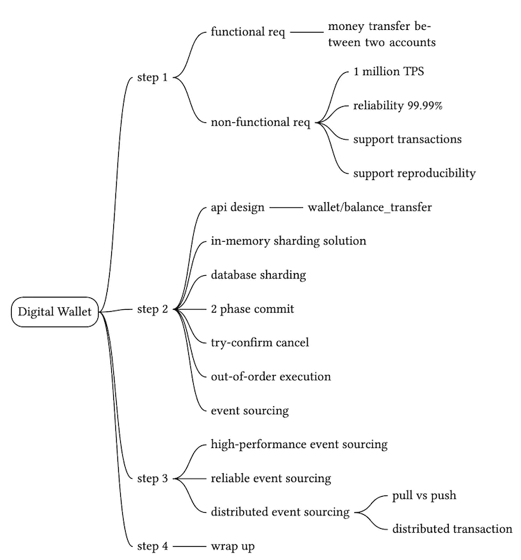

## 参考资料

[1] 事务保证：
https://docs.oracle.com/cd/E17275_01/html/programmer_reference/rep_trans.html

[2] TPC-E 最高性价比结果：
http://tpc.org/tpce/results/tpce_price_perf_results5.asp ?resulttype=all](http://tpc.org/tpce/results/tpce_price_perf_results5.asp?resulttype=all)

[3] ISO 4217 货币代码：https://en.wikipedia.org/wiki/ISO_4217

[4] Apache Zookeeper：https://zookeeper.apache.org/

[5] Martin Kleppmann (2017)。设计数据密集型应用程序。O'Reilly Media。

[6]X/Open XA：https://en.wikipedia.org/wiki/X/Open_XA

[7] 补偿交易：https://en.wikipedia.org/wiki/Compensating_transaction

[8] SAGAS，HectorGarcia-Molina：https://www.cs.cornell.edu/andru/cs711/2002fa/reading/sagas.pdf

[9] Evans, E. (2003)。领域驱动设计：解决软件核心的复杂性。Addison-Wesley Professional。

[10]阿帕奇·卡夫卡。https://kafka.apache.org/

[11]CQRS：https://martinfowler.com/bliki/CQRS.html

[12] 比较磁盘和内存中的随机访问和顺序访问：https://deliveryimages.acm.org/10.1145/1570000/1563874/jacobs3.jpg

[13] mmap：https://man7.org/linux/man-pages/man2/mmap.2.html

[14] SQLite：https://www.sqlite.org/index.html

[15] [RocksDB](https://rocksdb.org/)

[16]Apache Hadoop：https://hadoop.apache.org/

[17] Raft：https://raft.github.io/

[18] 反向代理：https://en.wikipedia.org/wiki/Reverse_proxy