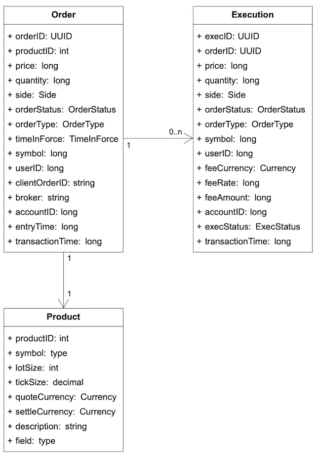

在本章中，我们设计了一个电子股票交易系统。

交易所的基本功能是促进买卖双方高效匹配。这一基本功能从未改变。在计算机兴起之前，人们通过以物易物和相互喊叫来交换有形商品。如今，订单由超级计算机默默处理，人们不仅为了交换产品而进行交易，也为了投机和套利。技术极大地改变了交易格局，并成倍地提高了电子市场交易量。

说到证券交易所，大多数人会想到纽约证券交易所 (NYSE) 或纳斯达克等主要市场参与者，它们已经存在了 50 多年。事实上，还有许多其他类型的交易所。有些专注于金融行业的垂直细分，并特别注重技术 [1]，而另一些则强调公平性 [2]。在深入研究设计之前，重要的是要向面试官了解所涉交易所的规模和重要特征。

让我们来感受一下我们面临的问题：纽约证券交易所每天交易数十亿股股票 [3]，香港交易所每天交易约 2000 亿股股票 [4]。图 1 显示了按市值计算的“万亿美元俱乐部”中的大型交易所。


## 步骤 1 - 了解问题并确定设计范围

现代交易所是一个复杂的系统，对延迟、吞吐量和稳健性有严格的要求。在开始之前，让我们先问面试官几个问题来明确要求。

**候选人**：我们要交易哪种证券？股票、期权还是期货？
**面试官**：为简单起见，只交易股票。

**候选人**：支持哪些类型的订单操作：下新单、撤单、换单？需要支持限价单、市价单、条件单吗？
**面试官**：需要支持：下新单、撤单。订单类型只需要考虑限价单即可。

**候选人**：系统需要支持盘后交易吗？
**面试官**：不需要，只要支持正常交易时间就可以了。

**候选人**：能介绍一下交易所的基本功能吗？交易所的规模，比如有多少用户，有多少交易品种，有多少订单？
**面试官**：客户可以下新的限价单或取消限价单，并实时接收匹配的交易。客户可以查看实时订单簿（买卖订单列表）。交易所需要支持至少数万用户同时交易，至少支持 100 个交易品种。就交易量而言，我们应该支持每天数十亿的订单。此外，交易所是一个受监管的机构，所以我们需要确保它运行风险检查。

**候选人**：能详细说一下风险检查吗？
**面试官**：我们先做一个简单的风险检查，比如一个用户一天最多只能交易100万股苹果股票。

**候选人**：我注意到你没有提到用户钱包管理。这也是我们需要考虑的问题吗？
**面试官**：说得好！我们需要确保用户下单时有足够的资金。如果订单在订单簿中等待执行，则需要扣留订单所需的资金以防止超支。

#### 非功能性需求

在向面试官核实了功能需求后，我们应该确定非功能需求。事实上，像“至少 100 个符号”和“数万名用户”这样的要求告诉我们，面试官希望我们设计一个中小型交易所。除此之外，我们还应该确保设计可以扩展以支持更多符号和用户。许多面试官将可扩展性作为后续问题的重点。

以下是非功能性需求的列表：

- **可用性。**至少 99.99%。可用性对于交易所来说至关重要。停机时间，哪怕是几秒钟，都可能损害声誉。
- **容错。**需要容错和快速恢复机制来限制生产事故的影响。
- **延迟。**往返延迟应为毫秒级，尤其要关注 99 百分位延迟。往返延迟是从市价单进入交易所到市价单作为成交执行返回的时间点测量的。持续的高 99 百分位延迟会给少数用户带来糟糕的用户体验。
- **安全性。**交易所应该有一个账户管理系统。为了遵守法律，交易所在开设新账户之前会进行 KYC（了解你的客户）检查，以验证用户的身份。对于公共资源，例如包含市场数据的网页，我们应该防止分布式拒绝服务 (DDoS) [6] 攻击。

#### 简单估算

让我们做一些简单的粗略计算来了解系统的规模：

- 100 个符号
- 每天 10 亿份订单
- 纽约证券交易所的营业时间为周一至周五，东部时间上午 9:30 至下午 4:00。总共 6.5 小时。
- QPS：10 亿 / 6.5 / 3600 = ~43,000
- 峰值QPS：5*QPS=215000，上午开盘前和下午收盘前交易量明显较大。

## 第 2 步 - 提出高层设计并获得认可

在深入研究高层设计之前，让我们简单讨论一下有助于设计交易所的一些基本概念和术语。

### 商业知识101

**经纪人**

大多数零售客户通过经纪商与交易所进行交易。你可能熟悉的一些经纪商包括 Charles Schwab、Robinhood、Etrade、Fidelity 等。这些经纪商为零售用户提供了友好的用户界面，以便进行交易和查看市场数据。

**机构客户**

机构客户使用专门的交易软件进行大额交易。不同的机构客户有不同的要求。例如，养老基金的目标是获得稳定的收入。它们交易频率不高，但交易量很大。他们需要订单拆分等功能来最大限度地减少大额订单对市场的影响[7]。一些对冲基金专门从事做市，通过佣金回扣赚取收入。他们需要低延迟交易能力，因此显然他们不能像散户客户那样简单地在网页或移动应用程序上查看市场数据。

**限价订单**

限价订单是固定价格的买入或卖出订单。它可能不会立即找到匹配，或者可能只是部分匹配。

**市价订单**

市价单不指定价格。它立即按照现行市场价格执行。市价单牺牲了成本以保证执行。在某些快速变化的市场条件下很有用。

**市场数据水平**

美国股市有三层报价：L1（第一级）、L2、L3。L1市场数据包含最佳买入价、卖出价和数量（图2）。买入价是指买方愿意为股票支付的最高价格。卖出价是指卖方愿意出售股票的最低价格。


L2 包含的价格水平比 L1 多（图 3）。


L3 显示价格水平以及每个价格水平的排队数量（图 4）。


**蜡烛图**

蜡烛图表示一定时期内的股票价格。典型的蜡烛图如下所示（图 5）。蜡烛图显示市场在一定时间间隔内的开盘价、收盘价、最高价和最低价。常见的时间间隔为一分钟、五分钟、一小时、一天、一周和一个月。


**使固定**

FIX 协议 [8] 代表金融信息交换协议，创建于 1991 年。它是一种用于交换证券交易信息的供应商中立通信协议。以下是使用 FIX 编码的证券交易示例。

8=FIX.4.2 | 9=176 | 35=8 | 49=PHLX | 56=PERS | 52=20071123-05：30：00.000 | 11=ATOMNOCCC9990900 | 20=3 | 150=E | 39=E | 55=MSFT | 167=CS | 54=1 | 38=15 | 40=2 | 44=15 | 58=PHLX 股权测试 | 59=0 | 47=C | 32=0 | 31=0 | 151=15 | 14=0 | 6=0 | 10=128 |

示例修复 [8]

### 高层设计

现在我们对关键概念有了一些基本的了解，让我们看一下高级设计，如图 6 所示。


让我们通过图表中的各个组成部分来追踪订单的生命周期，看看各个部分是如何组合在一起的。

**首先，我们按照交易流程**执行订单。这是对延迟有严格要求的关键路径。流程中的一切都必须快速发生：

步骤 1：客户通过经纪商的网站或移动应用程序下订单。

第 2 步：经纪人将订单发送到交易所。

步骤 3：订单通过客户端网关进入交易所。客户端网关执行基本的把关功能，例如输入验证、速率限制、身份验证、规范化等。然后，客户端网关将订单转发给订单管理器。

步骤4-5：订单经理根据风险经理设定的规则进行风险检查。

第 6 步：通过风险检查后，订单管理器验证钱包中是否有足够的资金用于该订单。

第 7 至 9 步：订单被发送到匹配引擎。当找到匹配项时，匹配引擎会发出两次执行（也称为成交），买方和卖方各一次。为了保证匹配结果在重放时具有确定性，订单和执行都在排序器中排序（稍后将详细介绍排序器）。

步骤10 - 14：执行结果返回给客户端。

接下来，我们跟踪**市场数据流**，并通过数据服务追踪从匹配引擎到经纪人的订单执行情况。

步骤 M1：匹配引擎在匹配完成后生成执行流（填充）。该流被发送给市场数据发布者。

步骤 M2：市场数据发布者根据执行和订单流构建蜡烛图和订单簿作为市场数据。然后，它将市场数据发送到数据服务。

步骤 M3：市场数据被保存到专门的存储中，用于实时分析。经纪商连接到数据服务以获取及时的市场数据。经纪商将市场数据转发给客户。

最后，我们来检查一下**记者流程**。

步骤 R1 - R2（报告流程）：报告者从订单和执行中收集所有必要的报告字段（例如 client_id、price、quantity、order_type、filled_quantity、remaining_quantity），并将合并的记录写入数据库。

请注意，交易流程（步骤 1 至 14）位于关键路径上，而市场数据流和报告流则不位于关键路径上。它们具有不同的延迟要求。

现在让我们更详细地检查这三个流程。

#### 交易流程

交易流程是交易所的关键路径。一切都必须快速进行。交易流程的核心是匹配引擎。我们先来了解一下。

**撮合引擎**

撮合引擎又称为跨引擎，撮合引擎的主要职责如下：

1. 维护每个符号的订单簿。订单簿是某个符号的买入和卖出订单的列表。我们将在后面的数据模型部分解释订单簿的构造。
2. 匹配买卖订单。匹配会导致两次执行（成交），买方和卖方各一次。匹配功能必须快速准确。
3. 将执行流作为市场数据分发。

高可用性匹配引擎实现必须能够以确定的顺序生成匹配。也就是说，给定一个已知的订单序列作为输入，匹配引擎在重放该序列时必须生成相同的执行（填充）序列作为输出。这种确定性是高可用性的基础，我们将在深入探讨部分详细讨论。

**序列发生器**

排序器是使匹配引擎具有确定性的关键组件。它在匹配引擎处理每个传入订单之前为其添加序列 ID。它还为匹配引擎完成的每对执行（填充）添加序列 ID。换句话说，排序器有一个入站实例和一个出站实例，每个实例都维护自己的序列。每个排序器生成的序列必须是连续的数字，以便可以轻松检测到任何缺失的数字。有关详细信息，请参见图 7。


由于以下原因，传入订单和传出执行都带有序列 ID：

1. 及时性和公平性
2. 快速恢复/重放
3. 恰好一次保证

序列器不仅生成序列 ID。它还充当消息队列。一个序列器用于将消息（传入订单）发送到匹配引擎，另一个序列器用于将消息（执行）发送回订单管理器。它也是订单和执行的事件存储。这类似于将两个 Kafka 事件流连接到匹配引擎，一个用于传入订单，另一个用于传出执行。事实上，如果 Kafka 的延迟更低且更可预测，我们可以使用它。我们将在深入探讨部分讨论如何在低延迟交换环境中实现序列器。

**订单经理**

订单管理器一端接收订单，另一端接收执行。它管理订单的状态。让我们仔细看看。

订单管理器从客户端网关接收入站订单并执行以下操作：

- 它发送订单进行风险检查。我们对风险检查的要求很简单。例如，我们验证用户的交易量是否低于每天 100 万美元。
- 它根据用户的钱包检查订单，并验证是否有足够的资金来完成交易。钱包在“数字钱包”一章中进行了详细讨论。请参阅该章以了解可在交易所中使用的实现方法。
- 它将订单发送到排序器，排序器会为订单打上序列号。排序后的订单随后由匹配引擎进行处理。新订单的属性很多，但无需将所有属性都发送给匹配引擎。为了减少数据传输中的消息大小，订单管理器只发送必要的属性。

另一端，订单管理器通过排序器接收来自匹配引擎的订单执行情况。订单管理器通过客户端网关将已完成订单的执行情况返回给经纪商。

订单管理器应该快速、高效、准确。它维护订单的当前状态。事实上，管理各种状态转换的挑战是订单管理器复杂性的主要来源。实际交易系统中可能涉及数以万计的案例。事件源 [9] 非常适合订单管理器的设计。我们将在深入探讨部分讨论事件源设计。

**客户端网关**

客户端网关是交易所的守门人。它接收客户端下达的订单并将其路由到订单管理器。网关提供以下功能，如图 8 所示。


客户端网关位于关键路径上，对延迟敏感。它应该保持轻量级。它会尽快将订单传递到正确的目的地。上述功能虽然至关重要，但必须尽快完成。决定将哪些功能放入客户端网关以及将哪些功能省略是一种设计权衡。作为一般准则，我们应该将复杂的功能留给匹配引擎和风险检查。

针对零售客户和机构客户，客户端网关的类型有所不同。主要考虑因素包括延迟、交易量和安全要求。例如，做市商等机构为交易所提供了很大一部分流动性。它们要求延迟非常低。图 9 显示了与交易所的不同客户端网关连接。一个极端的例子是主机托管 (colo) 引擎。它是交易引擎软件，运行在交易所数据中心由经纪商租用的某些服务器上。延迟实际上是光从主机托管服务器传输到交易所服务器所需的时间 [10]。


#### 市场数据流

市场数据发布者 (MDP) 从匹配引擎接收执行（填充），并从执行流中构建订单簿和蜡烛图。订单簿和蜡烛图（我们将在后面的数据模型部分讨论）统称为市场数据。市场数据被发送到数据服务，然后提供给订阅者。图 10 显示了 MDP 的实现以及它如何与市场数据流中的其他组件配合。


#### 报告流程

交易所的一个重要部分是报告。报告员不在交易的关键路径上，但它是系统的关键部分。它提供交易历史、税务报告、合规报告、结算等。效率和延迟对于交易流程至关重要，但报告员对延迟不太敏感。准确性和合规性是报告员的关键因素。

将传入订单和传出执行的属性拼凑在一起是一种常见的做法。传入的新订单仅包含订单详细信息，而传出执行通常仅包含订单 ID、价格、数量和执行状态。报告器将来自两个来源的属性合并在一起以生成报告。图 11 显示了报告流程中的组件如何组合在一起。


敏锐的读者可能会注意到，“第 2 步 - 提出高级设计并获得认可”的章节顺序与其他章节略有不同。在本章中，API 设计和数据模型部分位于高级设计之后。这些章节以这种方式排列，是因为这些其他章节需要一些在高级设计中引入的概念。

### API 设计

现在我们了解了高层设计，让我们来看看 API 设计。

客户端通过经纪商与证券交易所互动，下订单、查看执行情况、查看市场数据、下载历史数据进行分析等。我们使用以下 API 的 RESTful 约定来指定经纪商和客户端网关之间的接口。请参阅“数据模型”部分以获取下面提到的资源。

请注意，REST API 可能无法满足对冲基金等机构客户的延迟要求。为这些机构构建的专用软件可能使用不同的协议，但无论它是什么，都需要支持下面提到的基本功能。

**命令**

```
POST /v1/order
```

此端点下订单。它需要身份验证。

参数

```
symbol: the stock symbol. String
side: buy or sell. String
price: the price of the limit order. Long
orderType: limit or market (note we only support limit orders in our design). String
quantity: the quantity of the order. Long
```

回复 body：

```
id: the ID of the order. Long
creationTime: the system creation time of the order. Long
filledQuantity: the quantity that has been successfully executed. Long
remainingQuantity: the quantity still to be executed. Long
status: new/canceled/filled. String
rest of the attributes are the same as the input parameters
```

代码：

```
200: successful
40x: parameter error/access denied/unauthorized
500: server error
```

**执行**

```
GET /execution?symbol={:symbol}&orderId={:orderId}&startTime={:startTime}&endTime={:endTime}
```

此端点查询执行信息。它需要身份验证。

参数

```
symbol: the stock symbol. String
orderId: the ID of the order. Optional. String
startTime: query start time in epoch \[11\]. Long
endTime: query end time in epoch. Long
```

回复 body：

```
executions: array with each execution in scope (see attributes below). Array
id: the ID of the execution. Long
orderId: the ID of the order. Long
symbol: the stock symbol. String
side: buy or sell. String
price: the price of the execution. Long
orderType: limit or market. String
quantity: the filled quantity. Long
```

代码：

```
200: successful
40x: parameter error/not found/access denied/unauthorized
500: server error
```

**订单簿**

```
GET /marketdata/orderBook/L2?symbol={:symbol}&depth={:depth}
```

此端点查询指定深度的符号的 L2 订单簿信息。

参数

```
symbol: the stock symbol. String
depth: order book depth per side. Int
```

回复 body：

```
bids: array with price and size. Array
asks: array with price and size. Array
```

代码：

```
200: successful
40x: parameter error/not found/access denied/unauthorized
500: server error
```

**历史价格（蜡烛图）**

```
GET /marketdata/candles?symbol={:symbol}&resolution={:resolution}&startTime={:startTime}&endTime={:endTime}
```

此端点查询给定时间范围和分辨率的符号的烛台图数据（参见数据模型部分中的烛台图）。

参数

```
symbol: the stock symbol. String
resolution: window length of the candlestick chart in seconds. Long
startTime: start time of the window in epoch. Long
endTime: end time of the window in epoch. Long
```

回复 body：

```
candles: array with each candlestick data (attributes listed below). Array
open: open price of each candlestick. Double
close: close price of each candlestick. Double
high: high price of each candlestick. Double
low: low price of each candlestick. Double
```

代码：

```
200: successful
40x: parameter error/not found/access denied/unauthorized
500: server error
```

### 数据模型

股票交易所主要有三种类型的数据。让我们一一探讨一下。

- 产品、订单和执行
- 订单簿
- 蜡烛图

#### 产品、订单、执行

产品描述了交易符号的属性，如产品类型、交易符号、UI 显示符号、结算货币、手数、报价单位等。这些数据不会频繁更改。它主要用于 UI 显示。数据可以存储在任何数据库中，并且具有高度可缓存性。

订单代表买入或卖出订单的入站指令，执行代表出站撮合结果，执行又叫成交，不是每个订单都有执行，撮合引擎的输出包含两个执行，分别代表撮合订单的买方和卖方。

参见图 12 中的逻辑模型图，其中显示了三个实体之间的关系。请注意，它不是数据库模式。



订单和执行是交易所中最重要的数据。我们在高级设计中提到的三个流程中都会遇到它们，只是形式略有不同。

- 在关键交易路径中，订单和执行不存储在数据库中。为了实现高性能，此路径在内存中执行交易，并利用硬盘或共享内存来持久保存和共享订单和执行。具体来说，订单和执行存储在序列器中以便快速恢复，并在市场收盘后存档数据。我们将在深入研究部分讨论序列器的有效实现。
- 记者将订单和执行情况写入数据库，用于报告对账和税务报告等用例。
- 执行被转发到市场数据处理器以重建订单簿和蜡烛图数据。我们接下来讨论这些数据类型。

#### 订单簿

订单簿是按价格水平排列的特定证券或金融工具的买卖订单列表 [12] [13]。它是匹配引擎中用于快速订单匹配的关键数据结构。订单簿的高效数据结构必须满足以下要求：

- 恒定的查找时间。操作包括：获取某一价格水平或价格水平之间的交易量。
- 快速添加/取消/执行操作，时间复杂度最好为 O(1)。操作包括：下新订单、取消订单和撮合订单。
- 快速更新。操作：替换订单。
- 查询最佳买入/卖出价。
- 迭代各个价格水平。

让我们看一下针对订单簿的订单执行示例，如图 13 所示。


上例中，有一笔大额市价买盘，买入 2700 股苹果股票。该买盘与最佳卖盘队列中的所有卖盘以及 100.11 价格队列中的第一个卖盘相匹配。该大额买盘成交后，买卖价差扩大，价格上涨一级（目前最佳卖盘为 100.11）。

以下代码片段展示了订单簿的实现。

```java
class PriceLevel{
    private Price limitPrice;
    private long totalVolume;
    private List<Order> orders;
}
class Book<Side> {
    private Side side;
    private Map<Price, PriceLevel> limitMap;
}
class OrderBook {
    private Book<Buy> buyBook;
    private Book<Sell> sellBook;
    private PriceLevel bestBid;
    private PriceLevel bestOffer;
    private Map<OrderID, Order> orderMap;
}
```

代码是否满足上述所有设计要求？例如，添加/取消限价订单时，时间复杂度是否为 O(1)？答案是否定的，因为我们在这里使用的是普通列表（private List<Order> order）。为了获得更高效的订单簿，将“订单”的数据结构更改为双向链接列表，以便删除操作（取消和匹配）也是 O(1)。让我们回顾一下如何实现这些操作的 O(1) 时间复杂度：

1. 下新订单意味着将新订单添加到PriceLevel的尾部。对于双向链表，这是 O(1) 时间复杂度。
2. 匹配订单意味着从 PriceLevel 的头部删除订单。对于双向链表来说，这是 O(1) 时间复杂度。
3. 取消订单意味着从 OrderBook 中删除订单。我们利用OrderBook中的辅助数据结构Map<OrderID, Order> orderMap在 O(1) 时间内找到要取消的订单。找到订单后，如果“订单”列表是单链表，则代码必须遍历整个列表以找到上一个指针才能删除订单。这将花费 O(n) 时间。由于列表现在是双向链接的，订单本身有一个指向上一个订单的指针，这允许代码删除订单而无需遍历整个订单列表。

图 14 解释了这三个操作的工作原理。


更多详细信息请参阅参考资料[14]。

值得注意的是，订单簿数据结构在市场数据处理器中也被大量使用，用于从匹配引擎生成的执行流中重建 L1、L2 和 L3 数据。

#### 蜡烛图

蜡烛图是市场数据处理器中生成市场数据的另一个关键数据结构（与订单簿并列）。

我们用 Candlestick 类和 CandlestickChart 类对此进行建模。当蜡烛图的间隔过去后，将为下一个间隔实例化一个新的 Candlestick 类，并将其添加到 CandleStickChart 实例中的链接列表中。

```java
class Candlestick {
    private long openPrice;
    private long closePrice;
    private long highPrice;
    private long lowPrice;
    private long volume;
    private long timestamp;
    private int interval;
}
class CandlestickChart {
    private LinkedList<Candlestick> sticks;
}
```

在蜡烛图中跟踪多个符号在多个时间间隔内的价格历史会消耗大量内存。我们如何优化它？以下是两种方法：

1. 使用预分配的环形缓冲区来保存条形码，以减少新对象分配的数量。
2. 限制内存中的条数并将其余部分保存到磁盘。

我们将深入研究“市场数据发布者”部分中的优化。

市场数据通常保存在内存列式数据库（例如 KDB [15]）中，以便进行实时分析。市场收盘后，数据将保存在历史数据库中。

## 步骤 3 - 深入设计

现在我们了解了交易所的运作方式，让我们来研究一下现代交易所是如何演变成今天的样子的。现代交易所是什么样子的？答案可能会让很多读者感到惊讶。一些大型交易所几乎在一台巨型服务器上运行所有东西。虽然这听起来很极端，但我们可以从中学到很多好东西。

让我们开始吧。

### 表现

正如非功能性需求中所述，延迟对于交易所来说非常重要。不仅平均延迟需要较低，而且总体延迟也必须稳定。衡量稳定性水平的一个很好的指标是第 99 百分位延迟。

延迟可以分解为以下公式所示的几个组成部分：

```
Latency = ∑executionTimeAlongCriticalPath
```

有两种方法可以减少延迟：

1. 减少关键路径上的任务数量。
2. 缩短每项任务所花的时间：
   1. 通过减少或消除网络和磁盘使用
   2. 通过减少每个任务的执行时间

让我们回顾一下第一点。如高层设计所示，关键交易路径包括以下内容：

```
gateway -> order manager -> sequencer -> matching engine
```

关键路径仅包含必要的组件，甚至从关键路径中删除日志记录以实现低延迟。

现在让我们看看第二点。在高级设计中，关键路径上的组件在通过网络连接的单个服务器上运行。往返网络延迟约为 500 微秒。当关键路径上有多个组件都通过网络进行通信时，总网络延迟加起来只有几毫秒。此外，序列器是一个事件存储，可将事件持久保存到磁盘。即使假设一个利用顺序写入性能优势的高效设计，磁盘访问的延迟仍然以几十毫秒为单位。要了解有关网络和磁盘访问延迟的更多信息，请参阅“每个程序员都应该知道的延迟数字”[16]。

考虑到网络和磁盘访问延迟，端到端总延迟总计达数十毫秒。虽然这个数字在交易所成立初期相当可观，但随着交易所竞相追求超低延迟，这个数字已不再足够。

为了保持竞争优势，交易所随着时间的推移不断改进其设计，以将关键路径上的端到端延迟降低到几十微秒，主要通过探索减少或消除网络和磁盘访问延迟的选项。经过时间考验的设计通过将所有内容放在同一台服务器上来消除网络跳跃。当所有组件都在同一台服务器上时，它们可以通过 mmap [17] 作为事件存储进行通信（稍后会详细介绍）。

图 15 展示了所有组件位于一台服务器上的低延迟设计：


有一些有趣的设计决策值得仔细研究。

让我们首先关注上图中的应用程序循环。应用程序循环是一个有趣的概念。它在while循环中不断轮询要执行的任务，是主要的任务执行机制。为了满足严格的延迟预算，应用程序循环只应处理最关键的任务。其目标是减少每个组件的执行时间，并保证高度可预测的执行时间（即低99百分位延迟）。图中的每个框代表一个组件。组件是服务器上的一个进程。为了最大限度地提高CPU效率，每个应用程序循环（将其视为主处理循环）都是单线程的，并且线程固定在固定的CPU核心上。以订单管理器为例，它看起来像下图（图16）。


在此图中，订单管理器的应用程序循环固定到 CPU 1。将应用程序循环固定到 CPU 的好处非常多：

1. 无上下文切换[18]。CPU 1 完全分配给订单管理器的应用程序循环。
2. 没有锁，因此也没有锁争用，因为只有一个线程更新状态。

这两者都有助于降低第 99 个百分点的延迟。

CPU 固定的缺点是它使编码变得更加复杂。工程师需要仔细分析每个任务所花费的时间，以防止其占用应用程序循环线程太长时间，因为它可能会阻止后续任务。

接下来，让我们把注意力集中在图 15 中心标有“mmap”的长矩形上。“mmap”是指符合 POSIX 的 UNIX 系统调用“mmap(2)”，它将文件映射到进程的内存中。

`mmap(2)` 提供了一种在进程间高性能共享内存的机制。当备份文件位于 `/dev/shm` 中时，性能优势会进一步增强。`/dev/shm` 是一个内存备份文件系统。当对 `/dev/shm` 中的文件执行 `mmap(2)` 时，对共享内存的访问根本不会导致任何磁盘访问。

现代交易所利用这一点，尽可能地消除关键路径上的磁盘访问。服务器中使用“mmap(2)”来实现关键路径上的组件进行通信的消息总线。通信路径没有网络或磁盘访问，并且在此 mmap 消息总线上发送消息需要亚微秒的时间。通过利用 mmap 构建事件存储，再加上我们接下来将讨论的事件源设计范例，现代交易所可以在服务器内部构建低延迟微服务。

### 事件溯源

我们在“数字钱包”一章中讨论了事件源。请参阅该章以深入了解事件源。

事件溯源的概念并不难理解。在传统应用程序中，状态会持久保存在数据库中。当出现问题时，很难追踪问题的根源。数据库仅保留当前状态，没有导致当前状态的事件记录。

在事件溯源中，它不会存储当前状态，而是保存所有状态变化事件的不可变日志。这些事件是真相的黄金来源。参见图 17 进行比较。


左侧是经典的数据库架构。它跟踪订单的订单状态，但不包含有关订单如何达到当前状态的任何信息。右侧是事件溯源对应方。它跟踪所有改变订单状态的事件，并且可以通过按顺序重放所有事件来恢复订单状态。

图 18 显示了使用 mmap 事件存储作为消息总线的事件源设计。这看起来非常像 Kafka 中的 Pub-Sub 模型。事实上，如果没有严格的延迟要求，可以使用 Kafka。


在图中，外部域使用我们在商业知识 101 部分介绍的 FIX 与交易域进行通信。

- 网关将 FIX 转换为“简单二进制编码上的 FIX”（SBE），以实现快速、紧凑的编码，并通过事件存储客户端以预定义格式将每个订单作为 NewOrderEvent 发送（参见图中的事件存储条目）。
- 订单管理器（嵌入在匹配引擎中）从事件存储中接收 NewOrderEvent，对其进行验证，并将其添加到其内部订单状态。然后，订单被发送到匹配核心。
- 如果订单匹配，则会生成 OrderFilledEvent 并将其发送到事件存储。
- 其他组件（如市场数据处理器和报告器）订阅事件存储并相应地处理这些事件。

该设计紧密遵循高层设计，但进行了一些调整以使其在事件源范式中更有效地工作。

第一个区别是订单管理器。订单管理器变成了一个可重用的库，嵌入到不同的组件中。这种设计很有意义，因为订单的状态对多个组件都很重要。如果其他组件使用集中式订单管理器来更新或查询订单状态，则会影响延迟，尤其是当这些组件不在关键交易路径上时，如图中的报告器的情况一样。虽然每个组件都自行维护订单状态，但通过事件源，可以保证状态相同且可重放。

另一个关键区别是，测序仪不见了。它怎么了？

使用事件源设计，我们为所有消息设置了一个事件存储。请注意，事件存储条目包含一个“sequence”字段。该字段由序列器注入。

每个事件存储只有一个排序器。拥有多个排序器是一种不好的做法，因为它们会争夺写入事件存储的权利。在像交易所这样的繁忙系统中，锁争用会浪费大量时间。因此，排序器是一个单一的写入器，它会在将事件发送到事件存储之前对其进行排序。与高级设计中的排序器（它还充当消息存储）不同，这里的排序器只做一件简单的事情，而且速度超快。图 19 展示了内存映射 (MMap) 环境中排序器的设计。

排序器从每个组件本地的环形缓冲区中提取事件。对于每个事件，它会在事件上标记一个序列 ID，并将其发送到事件存储。我们可以拥有备用排序器，以便在主排序器发生故障时实现高可用性。


### 高可用性

为了实现高可用性，我们的设计目标是 4 个 9（99.99%）。这意味着交易所每天只能有 8.64 秒的停机时间。如果服务中断，它几乎需要立即恢复。

为了实现高可用性，请考虑以下事项：

- 首先，确定交易所架构中的单点故障。例如，匹配引擎的故障可能会对交易所造成灾难。因此，我们在主实例旁边设置了冗余实例。
- 其次，故障检测和故障转移到备份实例的决定应该快速。

对于客户端网关等无状态服务，可以通过添加更多服务器轻松实现水平扩展。对于订单管理器和匹配引擎等有状态组件，我们需要能够跨副本复制状态数据。

图 20 显示了如何复制数据的示例。热匹配引擎作为主实例工作，而温引擎接收并处理完全相同的事件，但不会将任何事件发送到事件存储中。当主实例发生故障时，温实例可以立即接管主实例并发送事件。当温辅助实例发生故障时，在重新启动时，它始终可以从事件存储中恢复所有状态。事件源非常适合交换架构。固有的确定性使状态恢复变得简单而准确。


我们需要设计一种机制来检测主节点中的潜在问题。除了正常的硬件和进程监控外，我们还可以从匹配引擎发送心跳。如果没有及时收到心跳，则匹配引擎可能出现问题。

这种热温设计的问题在于它只能在单个服务器的边界内工作。为了实现高可用性，我们必须将这一概念扩展到多台机器甚至跨数据中心。在这种情况下，整个服务器要么是热的，要么是温的，整个事件存储会从热服务器复制到所有温副本。跨机器复制整个事件存储需要时间。我们可以使用可靠的 UDP [19] 高效地将事件消息广播到所有温服务器。请参阅 Aeron [20] 的设计作为示例。

在下一节中，我们将讨论对热温设计的改进，以实现高可用性。

### 容错

上面的热温设计相对简单。它工作得相当好，但如果热实例也发生故障，会发生什么？这是一个概率很小但灾难性的事件，所以我们应该做好准备。

这是大型科技公司面临的问题。他们通过将核心数据复制到多个城市的数据中心来解决这个问题。这可以降低地震或大规模停电等自然灾害的风险。为了使系统具有容错能力，我们必须回答许多问题：

1. 如果主实例出现故障，我们如何以及何时决定故障转移到备份实例？
2. 我们如何在备份实例中选择领导者？
3. 需要的恢复时间（RTO——恢复时间目标）是多少？
4. 哪些功能需要恢复（RPO - 恢复点目标）？我们的系统可以在恶劣条件下运行吗？

让我们一一回答这些问题。

首先，我们必须了解“下跌”的真正含义。这并不像看上去那么简单。考虑一下这些情况。

1. 系统可能会发出错误警报，从而导致不必要的故障转移。
2. 代码中的错误可能会导致主实例宕机。故障转移后，同一个错误可能会导致备份实例宕机。当所有备份实例都因该错误而宕机时，系统将不再可用。

这些都是很难解决的问题。以下是一些建议。当我们首次发布新系统时，我们可能需要手动执行故障转移。只有当我们收集到足够的信号和操作经验并对系统更有信心时，我们才会自动化故障检测过程。混沌工程 [21] 是一种很好的实践，可以更快地发现边缘情况并获得操作经验。

一旦正确做出了故障转移决定，我们如何决定由哪个服务器接管？幸运的是，这是一个很好理解的问题。有许多久经考验的领导者选举算法。我们使用 Raft [22] 作为示例。

图 21 显示了具有五台服务器的 Raft 集群，这些服务器都有自己的事件存储。当前领导者将数据发送给所有其他实例（跟随者）。在 Raft 中执行操作所需的最小投票数为 (N/2 + 1)，其中 N 是集群中的成员数。在此示例中，最小值为 3。

下图（图 21）显示了跟随者通过 RPC 从领导者接收新事件。这些事件保存到跟随者自己的 mmap 事件存储中。


我们先简单看一下 Leader 选举过程。Leader 向 Follower 发送心跳消息（如图 21 所示，AppendEnties 没有任何内容）。如果 Follower 在一段时间内没有收到心跳消息，就会触发选举超时，从而发起新的选举。第一个达到选举超时的 Follower 成为候选者，并向其余 Follower 请求投票（RequestVote）。如果第一个 Follower 获得多数票，就会成为新的 Leader。如果第一个 Follower 的 term 值低于新节点，就不能成为 Leader。如果多个 Follower 同时成为候选者，这被称为“分裂投票”。这种情况下，选举超时，就会发起新的选举。关于“term”的解释见图 22。Raft 中将时间划分为任意区间，以表示正常运行和选举。


接下来，我们来看看恢复时间。恢复时间目标 (RTO) 是指应用程序在不造成业务重大损害的情况下可以停机的时间。对于证券交易所，我们需要实现秒级 RTO，这肯定需要服务的自动故障转移。为此，我们根据优先级对服务进行分类，并定义降级策略以维持最低服务水平。

最后，我们需要确定对数据丢失的容忍度。恢复点目标 (RPO) 是指在对业务造成重大损害之前可以丢失的数据量，即损失容忍度。在实践中，这意味着经常备份数据。对于证券交易所来说，数据丢失是不可接受的，因此 RPO 接近于零。使用 Raft，我们拥有许多数据副本。它保证在集群节点之间达成状态共识。如果当前领导者崩溃，新领导者应该能够立即发挥作用。

### 匹配算法

让我们稍微绕个弯，深入研究一下匹配算法。下面的伪代码从高层次解释了匹配的工作原理。

```java
Context handleOrder(OrderBook orderBook, OrderEvent orderEvent) {
    if (orderEvent.getSequenceId() != nextSequence) {
        return Error(OUT_OF_ORDER, nextSequence);
    }

    if (!validateOrder(symbol, price, quantity)) {
        return ERROR(INVALID_ORDER, orderEvent);
    }

    Order order = createOrderFromEvent(orderEvent);
    switch (msgType):
        case NEW:
            return handleNew(orderBook, order);
        case CANCEL:
            return handleCancel(orderBook, order);
        default:
            return ERROR(INVALID_MSG_TYPE, msgType);

}

Context handleNew(OrderBook orderBook, Order order) {
    if (BUY.equals(order.side)) {
        return match(orderBook.sellBook, order);
    } else {
        return match(orderBook.buyBook, order);
    }
}

Context handleCancel(OrderBook orderBook, Order order) {
    if (!orderBook.orderMap.contains(order.orderId)) {
        return ERROR(CANNOT_CANCEL_ALREADY_MATCHED, order);
    }
    removeOrder(order);
    setOrderStatus(order, CANCELED);
    return SUCCESS(CANCEL_SUCCESS, order);
}

Context match(OrderBook book, Order order) {
    Quantity leavesQuantity = order.quantity - order.matchedQuantity;
    Iterator<Order> limitIter = book.limitMap.get(order.price).orders;
    while (limitIter.hasNext() && leavesQuantity > 0) {
        Quantity matched = min(limitIter.next.quantity, order.quantity);
        order.matchedQuantity += matched;
        leavesQuantity = order.quantity - order.matchedQuantity;
        remove(limitIter.next);
        generateMatchedFill();
    }
    return SUCCESS(MATCH_SUCCESS, order);
}
```

伪代码采用FIFO（先进先出）匹配算法。在特定价格水平上最先到达的订单将首先匹配，最后一个到达的订单将最后匹配。

匹配算法有很多种。这些算法在期货交易中很常用。例如，FIFO 和 LMM（领先做市商）算法根据 FIFO 队列前面的预定义比率将一定数量分配给 LMM，LMM 公司与交易所协商获得特权。请参阅 CME 网站上的更多匹配算法 [24]。匹配算法还用于许多其他场景。典型的例子是暗池 [25]。

### 决定论

既有功能确定性，也有延迟确定性。我们在前面的章节中介绍了功能确定性。我们做出的设计选择（例如序列器和事件源）保证了如果事件以相同的顺序重播，结果将是相同的。

有了功能确定性，事件发生的实际时间大多数时候并不重要。重要的是事件的顺序。在图 23 中，时间维度上从离散不均匀点的事件时间戳被转换为连续点，并且可以大大减少重放/恢复所花费的时间。


延迟确定性意味着每笔交易的整个系统的延迟几乎相同。这是业务的关键。有一种数学方法可以衡量这一点：第 99 百分位延迟，或者更严格地说，第 99.99 百分位延迟。我们可以利用 HdrHistogram [26] 来计算延迟。如果第 99 百分位延迟较低，则交易所在几乎所有交易中都提供稳定的性能。

调查较大的延迟波动很重要。例如，在 Java 中，安全点通常是原因。HotSpot JVM [27] Stop-the-World 垃圾收集就是一个众所周知的例子。

至此，我们对关键交易路径的深入研究就结束了。在本章的其余部分，我们将仔细研究交易所其他部分的一些更有趣的方面。

### 市场数据发布者优化

从撮合算法中我们可以看出，L3 订单簿数据让我们更直观地了解市场。我们可以从 Google Finance 免费获得一天的 K 线图数据，但获取更详细的 L2/L3 订单簿数据则需要花费大量金钱。许多对冲基金通过交易所实时 API 自行记录数据，以构建自己的 K 线图和其他图表进行技术分析。

市场数据发布者（MDP）从撮合引擎接收撮合结果，并据此重建订单簿和 K 线图，然后将数据发布给订阅者。

订单簿重建类似于上面匹配算法部分中提到的伪代码。MDP 是一种具有多个级别的服务。例如，零售客户默认只能查看 5 个级别的 L2 数据，需要额外付费才能获得 10 个级别。MDP 的内存无法永远扩展，因此我们需要对烛台设置上限。有关烛台图的回顾，请参阅数据模型部分。MDP 的设计如图 24 所示。


此设计利用了环形缓冲区。环形缓冲区也称为循环缓冲区，是一个固定大小的队列，其头部与尾部相连。生产者不断生成数据，一个或多个消费者从中获取数据。环形缓冲区中的空间是预先分配的。无需创建或释放对象。数据结构也是无锁的。还有其他技术可以使数据结构更加高效。例如，填充可确保环形缓冲区的序列号永远不会与其他任何内容位于缓存行中。有关更多详细信息，请参阅 [28]。

### 市场数据分配公平性

在股票交易中，拥有比其他人更低的延迟就像拥有一个可以看到未来的神谕。对于受监管的交易所来说，保证所有市场数据接收者同时获得数据非常重要。为什么这很重要？例如，MDP 保存着一个数据订阅者列表，订阅者的顺序由他们连接到发布者的顺序决定，第一个订阅者总是最先收到数据。猜猜会发生什么？当市场开盘时，聪明的客户端会争先恐后地成为列表中的第一个。

有一些方法可以缓解这种情况。使用可靠的 UDP 进行多播是一种很好的解决方案，可以同时向许多参与者广播更新。当订阅者连接到 MDP 时，MDP 还可以分配随机顺序。我们将更详细地介绍多播。

### 多播

数据可以通过三种不同类型的协议在互联网上传输。让我们快速了解一下。

1. 单播：从一个源到一个目的地。
2. 广播：从一个源到整个子网。
3. 多播：从一个源到一组可以位于不同子网的主机。

多播是交换设计中常用的协议。通过在同一个多播组中配置多个接收者，理论上它们将同时接收数据。但是，UDP 是一种不可靠的协议，数据报可能无法到达所有接收者。有解决方案可以处理重传 [29]。

### 主机托管

说到公平，事实上很多交易所都提供主机托管服务，即将对冲基金或经纪商的服务器与交易所放在同一个数据中心。下订单到匹配引擎的延迟基本上与电缆长度成正比。主机托管不会破坏公平的概念。它可以被视为付费 VIP 服务。

### 网络安全

交易所通常会提供一些公共接口，DDoS 攻击是一个真正的挑战。以下是一些对抗 DDoS 的技术：

1. 将公共服务和数据与私有服务隔离，这样 DDoS 攻击就不会影响最重要的客户。如果提供相同的数据，我们可以拥有多个只读副本来隔离问题。
2. 使用缓存层来存储不经常更新的数据。有了良好的缓存，大多数查询就不会影响数据库。
3. 强化 URL 以抵御 DDoS 攻击。例如，对于 这样的 URL `https://my.website.com/data?from=123&to=456`，攻击者可以通过更改查询字符串轻松生成许多不同的请求。相反，像这样的 URL 效果更好：`https://my.website.com/data/recent`。它还可以缓存在 CDN 层。
4. 需要有效的安全列表/阻止列表机制。许多网络网关产品都提供此类功能。
5. 速率限制经常用于防御 DDoS 攻击。

## 包起来

读完本章后，你可能会得出这样的结论：大型交易所的理想部署模型是将所有内容放在一台巨型服务器上，甚至放在一个进程中。事实上，一些交易所的设计正是如此！

随着加密货币行业的发展，许多加密货币交易所使用云基础设施来部署其服务 [30]。一些去中心化金融项目基于 AMM（自动做市）的概念，甚至不需要订单簿。

云生态带来的便利改变了一些设计，降低了进入行业的门槛，必将为金融界注入创新活力。

恭喜你走到这一步！现在给自己一点鼓励吧。干得好！

## 章节总结


## 参考资料

[1] LMAX 交易所以其开源 Disruptor 而闻名：https://www.lmax.com/exchange

[2] IEX以“公平竞争”吸引投资者，也是“快闪小子交易所”：https://en.wikipedia.org/wiki/IEX

[3] 纽约证券交易所匹配交易量：https://www.nyse.com/markets/us-equity-volumes

[4] 香港交易所每日交易量：[https://www.hkex.com.hk/Market-Data/Statistics/Consolidated-Reports/Securities-Statistics-Archive/Trading_Value_Volume_And_Number_Of_Deals ?sc_lang=en#select1=0](https://www.hkex.com.hk/Market-Data/Statistics/Consolidated-Reports/Securities-Statistics-Archive/Trading_Value_Volume_And_Number_Of_Deals?sc_lang=en#select1=0)

[5] 全球各证券交易所规模：http://money.visualcapitalist.com/all-of-the-worlds-stock-exchanges-by-size/

[6] 拒绝服务攻击：https://en.wikipedia.org/wiki/Denial-of-service_attack

[7] 市场影响：https://en.wikipedia.org/wiki/Market_impact

[8] 修复交易：https://www.fixtrading.org/

[9] 事件采购：https://martinfowler.com/eaaDev/EventSourcing.html

[10] CME 主机托管和数据中心服务：https://www.cmegroup.com/trading/colocation/co-location-services.html

[11] 大纪元：https://www.epoch101.com/

[12] 订单簿：https://www.investopedia.com/terms/o/order-book.asp

[13] 订单簿：https://en.wikipedia.org/wiki/Order_book

[14] 如何建立快速限价订单簿：https://bit.ly/3ngMtEO

[15] 使用 kdb+ 和 q 语言进行开发：https://code.kx.com/q/

[16] 每个程序员都应该知道的延迟数字：https://gist.github.com/jboner/2841832

[17] mmap：[https://en.wikipedia.org/wiki/Memory_map](https://en.wikipedia.org/wiki/Mmap)

[18] 上下文切换：https://bit.ly/3pva7A6

[19]可靠用户数据报协议：https://en.wikipedia.org/wiki/Reliable_User_Datagram_Protocol

[20] Aeron：https://github.com/real-logic/aeron/wiki/Design-Overview

[21]混沌工程：https://en.wikipedia.org/wiki/Chaos_engineering

[22] Raft：https://raft.github.io/

[23] 易于理解的设计：Raft 共识算法：https://raft.github.io/slides/uiuc2016.pdf

[24] 支持的匹配算法：https://bit.ly/3aYoCEo

[25] 暗池：https://www.investopedia.com/terms/d/dark-pool.asp

[26] HdrHistogram：高动态范围直方图：http://hdrhistogram.org/

[27]HotSpot（虚拟机）：https://en.wikipedia.org/wiki/HotSpot_(virtual_machine)

[28] 缓存行填充：https://bit.ly/3lZTFWz

[29] 面向 NACK 的可靠多播：https://en.wikipedia.org/wiki/NACK-Oriented_Reliable_Multicast

[30] AWS Coinbase 案例研究：https://aws.amazon.com/solutions/case-studies/coinbase/